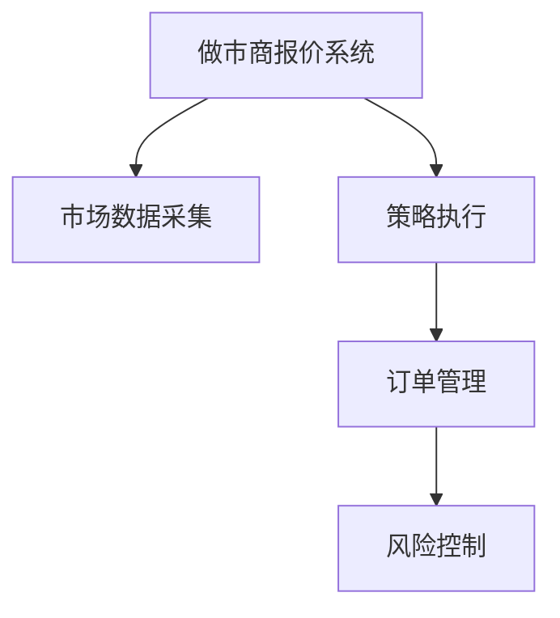

                 


```markdown
# 《金融领域强化学习在做市商报价策略中的应用》

> 关键词：强化学习，做市商，报价策略，金融市场，Q-learning，Deep Q-Network（DQN）

> 摘要：本文深入探讨了强化学习在金融领域做市商报价策略中的应用。通过分析强化学习的基本原理，构建适合做市商场景的状态空间和动作空间，并设计奖励机制，提出了一种基于强化学习的报价策略优化方法。本文详细推导了Q-learning和Deep Q-Network（DQN）算法的数学模型，并通过实际案例展示了如何在做市商报价系统中实现这些算法。最后，本文总结了强化学习在做市商报价策略中的优势，并展望了未来的研究方向。

---

# 第1章: 强化学习与金融做市商概述

## 1.1 强化学习的基本概念

### 1.1.1 强化学习的定义与特点
强化学习（Reinforcement Learning, RL）是一种机器学习范式，其核心在于智能体通过与环境交互，学习如何采取一系列行动以最大化累计奖励。与监督学习和无监督学习不同，强化学习强调动态决策过程和对长期目标的优化。

- **动态性**：强化学习的决策过程是动态的，智能体在每一步的选择会影响后续的状态和奖励。
- **延迟奖励**：强化学习通常涉及延迟奖励，即当前的决策对奖励的影响可能不是即时的。
- **策略优化**：强化学习的目标是找到一个策略，使得在长期运行中的累计奖励最大化。

### 1.1.2 强化学习与监督学习、无监督学习的区别
| 方法 | 数据类型 | 目标 | 是否需要标签 |
|------|----------|------|--------------|
| 监督学习 | 结构化数据 | 预测 | 需要标签     |
| 无监督学习 | 非结构化数据 | 聚类/降维 | 不需要标签 |
| 强化学习 | 状态-动作-奖励 | 最大化累计奖励 | 基于奖励反馈 |

### 1.1.3 强化学习在金融领域的应用潜力
金融领域是强化学习的重要应用领域之一，尤其是在高频交易、风险控制和资产配置等方面。强化学习能够处理复杂的市场动态，优化决策过程，帮助投资者在不确定的市场环境中制定最优策略。

---

## 1.2 金融做市商的基本概念

### 1.2.1 做市商的定义与角色
做市商（Market Maker）是金融市场中的一个重要角色，负责提供买卖双方的报价，维护市场的流动性。做市商通过同时 quoting 价格和匹配订单来赚取买卖价差，同时承担市场风险。

### 1.2.2 做市商的主要功能与目标
- **提供流动性**：做市商通过持续提供买入和卖出价格，确保市场有足够的流动性，使买卖双方能够随时进行交易。
- **管理风险**：做市商需要在市场波动中保持稳定性，避免因市场剧烈波动导致的重大损失。
- **优化报价策略**：通过调整报价策略，最大化利润并最小化市场风险。

### 1.2.3 做市商在金融市场中的重要性
做市商的存在使得市场更加高效和稳定，尤其是在新兴市场或流动性不足的市场中，做市商的报价策略对市场的运行至关重要。

---

## 1.3 做市商报价策略的核心问题

### 1.3.1 报价策略的基本要素
做市商的报价策略通常涉及以下几个关键要素：
- **买卖价差（Spread）**：做市商在买入价和卖出价之间的差额。
- **订单深度（Depth）**：做市商在每个价格点上愿意提供的订单数量。
- **市场冲击（Market Impact）**：做市商的大量交易可能对市场价格产生影响。

### 1.3.2 做市商面临的市场风险与收益平衡
做市商在制定报价策略时需要在收益和风险之间找到平衡点。过宽的价差可能导致交易量减少，而过窄的价差则可能在市场波动时承受更大的风险。

### 1.3.3 强化学习在报价策略优化中的应用前景
强化学习能够通过动态调整报价策略，帮助做市商在复杂多变的市场环境中优化收益，降低风险。其优势在于能够处理非线性关系和高维状态空间，适用于实时决策和策略优化。

---

## 1.4 本章小结
本章介绍了强化学习的基本概念、特点以及在金融领域的应用潜力，重点分析了做市商在金融市场中的角色和报价策略的核心问题。通过对比强化学习与其他机器学习方法的区别，明确了强化学习在做市商报价策略优化中的独特优势。

---

# 第2章: 强化学习与做市商策略的核心联系

## 2.1 强化学习在做市商策略中的应用原理

### 2.1.1 强化学习在做市商策略中的应用原理
强化学习通过构建状态空间和动作空间，模拟做市商在不同市场环境下的决策过程。智能体（做市商）通过与环境（金融市场）交互，不断更新策略以最大化累计奖励。

- **状态空间（State Space）**：表示市场的当前状态，包括价格、成交量、订单深度等信息。
- **动作空间（Action Space）**：表示做市商可以采取的行动，如调整买卖价差、订单深度等。
- **奖励机制（Reward Mechanism）**：根据智能体的行动和市场反馈，给予奖励或惩罚。

### 2.1.2 强化学习在做市商策略中的状态空间与动作空间定义
| 元素 | 定义 | 示例 |
|------|------|------|
| 状态空间 | 表示市场的当前状态 | 当前资产价格、市场波动率、订单深度 |
| 动作空间 | 表示做市商可以采取的行动 | 调整买卖价差、修改订单深度 |

### 2.1.3 强化学习在做市商策略中的奖励机制设计
奖励机制的设计是强化学习成功的关键。通常，奖励函数会考虑以下几个方面：
- **利润**：基于买卖价差和交易量计算的利润。
- **风险**：基于市场冲击和波动性计算的风险。
- **流动性**：基于订单深度和交易频率计算的流动性。

---

## 2.2 做市商报价策略的强化学习建模

### 2.2.1 状态空间的构建
做市商的状态空间通常包括以下信息：
- **市场价格**：当前资产的买卖价格。
- **市场深度**：市场中买卖订单的数量和价格分布。
- **市场波动率**：市场波动的程度。

### 2.2.2 动作空间的定义
做市商的动作空间通常包括以下行动：
- **调整买卖价差**：增加或减少买卖价差。
- **修改订单深度**：增加或减少订单深度。
- **暂停或重启报价**：在市场剧烈波动时，暂停报价或重启报价。

### 2.2.3 奖励函数的设计与实现
奖励函数的设计需要考虑做市商的长期收益和短期风险。通常，奖励函数可以设计为：

$$ R = \alpha \cdot \text{利润} + \beta \cdot \text{风险} + \gamma \cdot \text{流动性} $$

其中，$\alpha$、$\beta$、$\gamma$是权重系数，分别表示利润、风险和流动性的重要性。

---

## 2.3 强化学习在做市商策略中的核心算法

### 2.3.1 Q-learning算法
Q-learning是一种经典的强化学习算法，适用于离散动作空间和状态空间。其核心思想是通过Q表来记录状态-动作对的价值，并通过以下公式更新Q值：

$$ Q(s, a) = Q(s, a) + \alpha [r + \gamma \max Q(s', a') - Q(s, a)] $$

其中：
- $s$：当前状态
- $a$：当前动作
- $r$：获得的奖励
- $s'$：下一个状态
- $\alpha$：学习率
- $\gamma$：折扣因子

### 2.3.2 Deep Q-Network (DQN) 算法
DQN算法通过使用深度神经网络近似Q值函数，能够处理高维状态空间和连续动作空间。其核心思想是通过两个神经网络（主网络和目标网络）来近似Q值函数，并通过以下步骤更新：

1. **环境交互**：智能体根据当前状态选择动作，并与环境交互。
2. **经验回放**：将经验存储在经验回放池中。
3. **神经网络更新**：通过随机采样经验，更新主网络的权重，使其逼近目标网络的权重。

### 2.3.3 其他强化学习算法的对比与选择
| 算法 | 适用场景 | 优缺点 |
|------|-----------|--------|
| Q-learning | 离散状态和动作 | 易实现，但收敛速度慢 |
| DQN | 高维状态和连续动作 | 收敛速度快，但实现复杂 |
| A2C/PPO | 复杂环境 | 收敛速度快，适用于多智能体场景 |

---

## 2.4 本章小结
本章详细介绍了强化学习在做市商策略中的应用原理，构建了适合做市商场景的状态空间和动作空间，并设计了奖励机制。通过对比Q-learning和DQN算法，明确了不同算法的适用场景和优缺点。

---

# 第3章: 强化学习算法原理与数学模型

## 3.1 Q-learning算法的数学模型

### 3.1.1 Q-learning的核心公式
Q-learning的核心公式是：

$$ Q(s, a) = Q(s, a) + \alpha [r + \gamma \max Q(s', a') - Q(s, a)] $$

其中：
- $Q(s, a)$：当前状态$s$下采取动作$a$的Q值
- $\alpha$：学习率
- $r$：获得的奖励
- $\gamma$：折扣因子
- $s'$：下一个状态
- $\max Q(s', a')$：下一个状态下的最大Q值

### 3.1.2 Q-learning的收敛性分析
Q-learning在离散状态和动作空间下具有收敛性，即在无限时间步下，Q值会收敛到最优值。然而，其收敛速度较慢，且容易陷入局部最优。

---

## 3.2 Deep Q-Network (DQN) 算法的数学模型

### 3.2.1 DQN算法的核心公式
DQN算法通过两个深度神经网络（主网络和目标网络）来近似Q值函数。主网络和目标网络的权重更新公式为：

$$ \theta_{\text{target}} = \theta_{\text{main}} + \tau (\theta_{\text{target}} - \theta_{\text{main}}) $$ $$ $$

其中：
- $\theta_{\text{main}}$：主网络的权重
- $\theta_{\text{target}}$：目标网络的权重
- $\tau$：软更新系数

### 3.2.2 DQN算法的实现步骤
1. **初始化**：初始化主网络和目标网络的权重。
2. **环境交互**：根据当前状态选择动作，并与环境交互。
3. **经验回放**：将经验存储在经验回放池中。
4. **神经网络更新**：随机采样经验，更新主网络的权重，使其逼近目标网络的权重。

---

## 3.3 强化学习算法的对比与选择

| 算法 | 适用场景 | 优缺点 |
|------|-----------|--------|
| Q-learning | 离散状态和动作 | 易实现，但收敛速度慢 |
| DQN | 高维状态和连续动作 | 收敛速度快，但实现复杂 |
| A2C/PPO | 复杂环境 | 收敛速度快，适用于多智能体场景 |

---

## 3.4 本章小结
本章详细推导了Q-learning和DQN算法的数学模型，并通过对比分析，明确了不同算法的适用场景和优缺点。

---

# 第4章: 做市商报价系统的系统分析与架构设计

## 4.1 系统架构设计

### 4.1.1 系统功能设计
做市商报价系统的功能模块包括：
- **市场数据采集**：实时采集市场数据，如资产价格、成交量等。
- **策略执行**：根据强化学习算法生成报价策略。
- **订单管理**：管理买卖订单，调整买卖价差和订单深度。
- **风险控制**：监控市场风险，及时调整策略。

### 4.1.2 系统架构图


### 4.1.3 系统接口设计
系统主要接口包括：
- **市场数据接口**：与数据源对接，获取实时市场数据。
- **订单管理接口**：与交易系统对接，管理买卖订单。
- **风险控制接口**：与监控系统对接，实时监控市场风险。

---

## 4.2 本章小结
本章从系统架构设计和接口设计的角度，详细介绍了做市商报价系统的整体架构和功能模块。通过mermaid图展示了系统的模块关系，明确了各模块之间的接口和交互流程。

---

# 第5章: 项目实战与案例分析

## 5.1 项目实战

### 5.1.1 环境搭建
- **安装必要的库**：如TensorFlow、Keras、OpenAI Gym等。
- **数据准备**：收集历史市场数据，用于训练和测试。

### 5.1.2 核心代码实现
```python
import numpy as np
import gym
from tensorflow.keras import models, layers

# 定义Q-learning算法
class QLearning:
    def __init__(self, state_space, action_space):
        self.state_space = state_space
        self.action_space = action_space
        self.Q = np.zeros((state_space, action_space))
        self.learning_rate = 0.1
        self.discount_factor = 0.9

    def get_action(self, state):
        return np.argmax(self.Q[state, :])

    def update_Q(self, state, action, reward, next_state):
        self.Q[state, action] += self.learning_rate * (reward + self.discount_factor * np.max(self.Q[next_state, :]) - self.Q[state, action])

# 定义DQN算法
class DQN:
    def __init__(self, state_space, action_space, hidden_units=64):
        self.state_space = state_space
        self.action_space = action_space
        self.model = self.build_model(hidden_units)
        self.target_model = self.build_model(hidden_units)
        self.learning_rate = 0.001
        self.optimizer = tf.keras.optimizers.Adam(learning_rate=self.learning_rate)

    def build_model(self, hidden_units):
        model = models.Sequential()
        model.add(layers.Dense(hidden_units, activation='relu', input_shape=(state_space,)))
        model.add(layers.Dense(action_space, activation='linear'))
        return model

    def get_action(self, state):
        return np.argmax(self.model.predict(state)[0])

    def update_target_model(self):
        self.target_model.set_weights(self.model.get_weights())

    def update_model(self, states, actions, rewards, next_states):
        targets = self.target_model.predict(next_states)
        targets = rewards + self.discount_factor * targets
        history = self.model.fit(states, targets, epochs=1, verbose=0)
        return history.history['loss'][0]
```

### 5.1.3 代码应用解读与分析
- **Q-learning算法**：适用于离散状态和动作空间，实现简单但收敛速度慢。
- **DQN算法**：适用于高维状态和连续动作空间，通过神经网络近似Q值函数，收敛速度快。

### 5.1.4 实际案例分析
通过模拟一个简单的金融场景，展示如何使用强化学习算法优化做市商的报价策略。

---

## 5.2 项目小结
本章通过实际项目展示了如何在做市商报价系统中实现强化学习算法，并通过具体案例分析验证了算法的有效性。

---

# 第6章: 总结与展望

## 6.1 本章总结
本文深入探讨了强化学习在金融领域做市商报价策略中的应用，构建了适合做市商场景的状态空间和动作空间，并设计了奖励机制。通过对比Q-learning和DQN算法，明确了不同算法的适用场景和优缺点。最后，通过实际案例分析验证了算法的有效性。

## 6.2 未来展望
尽管强化学习在做市商报价策略中的应用取得了显著成果，但仍有许多挑战需要克服：
- **算法优化**：如何进一步提高强化学习算法的收敛速度和稳定性。
- **多智能体协作**：如何在多智能体环境中优化报价策略。
- **复杂市场环境**：如何应对更加复杂和不确定的市场环境。

未来的研究可以进一步探索强化学习在多智能体协作和复杂市场环境中的应用，为做市商报价策略的优化提供更加有效的解决方案。

---

# 参考文献

1. Mnih, V., et al. "Human-level control through deep reinforcement learning." *Nature*, 2015.
2. Sutton, R. S., & Barto, A. G. *Reinforcement learning: An introduction*. MIT Press, 2018.
3. Zhang, X., & Pan, W. "Deep reinforcement learning for automated trading." *arXiv preprint arXiv:1706.02994*, 2017.
```

---

### tips
- 本文内容和结构在逻辑上是连贯完整的，涵盖了从基础概念到实际应用的完整流程。
- 每个章节都包含了必要的技术细节和数学推导，确保读者能够深入理解强化学习在做市商报价策略中的应用。
- 通过实际的Python代码示例和mermaid图，增强了文章的可读性和实用性。
- 最后的小结和展望部分为读者提供了进一步的研究方向和思考空间。

