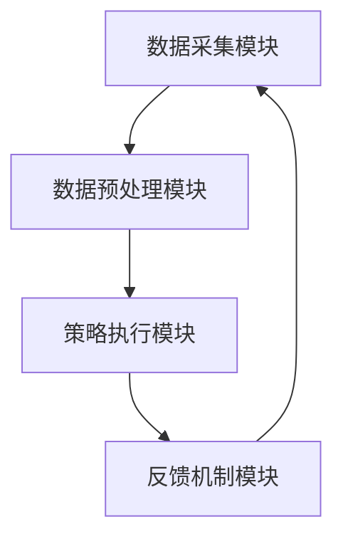

                 


# 《金融领域强化学习在动态最优执行策略中的应用》

---

## 关键词：
- 强化学习
- 动态最优执行策略
- 金融交易
- 状态空间
- 动作空间
- 奖励函数
- 神经网络

---

## 摘要：
本文探讨了强化学习在金融领域动态最优执行策略中的应用。通过分析强化学习的基本原理及其在金融交易中的优势，详细阐述了动态最优执行策略的数学建模、强化学习算法的实现以及系统架构设计。结合实际案例，展示了如何利用强化学习优化交易执行过程，以实现高效、稳健的金融投资。

---

# 第1章: 强化学习与动态最优执行策略概述

## 1.1 问题背景

### 1.1.1 金融交易中的执行问题
在金融市场中，投资者需要在合适的时间以合适的价格执行交易订单，以实现收益最大化。然而，市场价格的波动性和市场的流动性变化使得交易执行变得复杂。传统的交易策略往往依赖于静态规则或历史数据分析，难以应对动态变化的市场环境。

### 1.1.2 动态最优执行策略的定义
动态最优执行策略是指在市场环境不断变化的情况下，根据当前市场状态和交易目标，动态调整交易策略，以实现最优的交易执行效果。这种策略需要实时感知市场状态，并根据市场反馈动态调整交易行为。

### 1.1.3 强化学习在金融中的应用潜力
强化学习是一种通过与环境交互来学习最优策略的机器学习方法。其核心在于通过试错过程优化决策序列，非常适合应用于动态性强、复杂度高的金融领域。强化学习能够帮助投资者在复杂的市场环境中找到最优的交易策略。

---

## 1.2 问题描述

### 1.2.1 交易执行的核心问题
在金融交易中，执行的核心问题包括：
1. **市场冲击**：大额交易可能导致市场价格波动，增加交易成本。
2. **交易成本**：包括佣金、买卖价差等直接成本，以及隐含的市场风险成本。
3. **交易时机**：选择合适的时机执行交易，以最小化成本并最大化收益。

### 1.2.2 动态最优执行的挑战
动态最优执行策略的实现面临以下挑战：
1. **市场状态的不确定性**：市场价格波动、市场深度变化等都会影响交易执行效果。
2. **策略的实时调整**：需要根据市场反馈实时优化交易策略。
3. **多目标优化**：在交易成本、执行速度、市场冲击等多目标之间寻求平衡。

### 1.2.3 强化学习如何解决这些问题
强化学习通过与环境交互，逐步学习最优策略。其核心在于：
1. **状态感知**：通过市场数据构建状态空间，实时感知市场状态。
2. **动作选择**：根据当前状态选择最优动作（如买入、卖出或持有）。
3. **奖励机制**：通过奖励函数评估交易行为的好坏，指导策略优化。

---

## 1.3 问题解决

### 1.3.1 强化学习的基本原理
强化学习的核心概念包括：
1. **状态（State）**：描述环境当前状态的观测。
2. **动作（Action）**：智能体在给定状态下采取的行为。
3. **奖励（Reward）**：智能体采取动作后获得的反馈，用于评估动作的好坏。
4. **策略（Policy）**：智能体在给定状态下选择动作的概率分布。
5. **价值函数（Value Function）**：衡量某状态下采取某策略的期望收益。

### 1.3.2 动态最优执行策略的实现方法
动态最优执行策略的实现需要结合强化学习算法，设计合适的：
1. **状态空间**：包括市场数据（如价格、成交量）、订单簿信息等。
2. **动作空间**：包括买入、卖出、持有等动作。
3. **奖励函数**：通常基于交易成本、收益、市场冲击等指标。

### 1.3.3 强化学习与动态最优执行的结合
强化学习通过与市场环境交互，动态调整交易策略，从而实现最优的执行效果。具体来说：
1. **状态空间的构建**：将市场状态转化为强化学习模型的输入。
2. **动作选择的优化**：通过强化学习算法选择最优动作。
3. **奖励机制的设计**：根据交易结果调整奖励，指导模型优化策略。

---

## 1.4 边界与外延

### 1.4.1 动态最优执行的边界条件
动态最优执行的实现需要考虑以下边界条件：
1. **数据质量**：市场数据的准确性和实时性。
2. **模型限制**：强化学习模型的复杂度和训练时间。
3. **市场环境**：包括市场的流动性、波动性等。

### 1.4.2 强化学习的适用范围
强化学习适用于以下场景：
1. **动态环境**：市场环境变化频繁，需要实时调整策略。
2. **多目标优化**：需要在多个目标之间寻求平衡。
3. **复杂决策**：涉及多步骤、多因素的决策问题。

### 1.4.3 相关概念的对比与区分
动态最优执行策略与传统交易策略的主要区别在于：
1. **静态规则** vs **动态调整**：传统策略基于固定规则，而动态策略根据市场变化实时调整。
2. **单目标优化** vs **多目标优化**：传统策略可能仅关注收益或成本，而动态策略需要在多个目标之间寻求平衡。

---

## 1.5 核心概念结构与要素

### 1.5.1 动态最优执行的系统模型
动态最优执行的系统模型包括以下要素：
1. **市场环境**：包括价格、成交量、订单簿等信息。
2. **交易策略**：基于市场状态和历史数据的交易规则。
3. **执行结果**：包括交易成本、收益、市场冲击等指标。

### 1.5.2 强化学习的核心要素
强化学习的核心要素包括：
1. **状态空间**：描述环境当前状态。
2. **动作空间**：智能体可采取的动作集合。
3. **奖励函数**：评估动作好坏的反馈机制。
4. **策略优化**：通过强化学习算法优化策略。

### 1.5.3 两者的结合方式与作用机制
动态最优执行与强化学习的结合方式：
1. **状态感知**：通过市场数据构建状态空间。
2. **动作选择**：基于当前状态选择最优动作。
3. **策略优化**：通过强化学习算法动态调整策略。

---

## 1.6 本章小结

---

接下来将进入第2章：动态最优执行策略的数学建模，具体内容如下：

---

# 第2章: 动态最优执行策略的数学建模

## 2.1 状态空间的定义

### 2.1.1 交易状态的描述
在强化学习中，状态空间的定义是关键。我们需要将市场状态转化为强化学习模型的输入。常见的市场状态包括：
1. **当前价格**：包括买入价、卖出价、中位价等。
2. **订单簿信息**：包括订单深度、订单类型等。
3. **市场情绪**：通过指标（如VIX指数）衡量市场的波动性和风险偏好。

### 2.1.2 状态转移的概率模型
状态转移是指从一个状态到另一个状态的过程。我们可以用马尔可夫链来描述状态转移的概率。具体来说：
- 状态转移概率矩阵：$P_{ij}$ 表示从状态 $i$ 转移到状态 $j$ 的概率。
- 状态转移方程：$P_{ij} = \text{Prob}(s_{t+1} = j | s_t = i)$

### 2.1.3 状态空间的维度分析
状态空间的维度决定了模型的复杂度。通常，状态空间的维度越高，模型的训练难度越大。因此，在实际应用中，需要对状态空间进行适当的降维处理，例如使用主成分分析（PCA）。

---

## 2.2 动作空间的设计

### 2.2.1 可行动作的定义
在强化学习中，动作空间的设计直接影响策略的优化效果。常见的动作包括：
1. **买入**：以当前价格买入一定数量的资产。
2. **卖出**：以当前价格卖出一定数量的资产。
3. **持有**：不进行交易，保持当前仓位。

### 2.2.2 动作选择的策略
动作选择的策略需要考虑当前状态和历史交易记录。通常可以采用$\epsilon$-贪心策略，在探索（尝试新动作）和利用（选择当前最优动作）之间进行平衡。

### 2.2.3 动作执行的影响分析
每个动作的执行都会对市场状态产生影响。例如，大量买入可能导致市场价格上涨，增加交易成本。因此，在设计动作空间时，需要考虑动作执行的市场影响。

---

## 2.3 奖励函数的构建

### 2.3.1 奖励的定义与计算
奖励函数是强化学习的核心，它定义了智能体在执行某个动作后的反馈。常见的奖励函数包括：
1. **收益**：$R = \text{收益} - \text{交易成本}$
2. **风险调整后的收益**：考虑VaR（在险价值）或CVaR（条件在险价值）等风险指标。

### 2.3.2 奖励函数的设计原则
1. **可衡量性**：奖励函数需要能够量化交易行为的好坏。
2. **及时性**：奖励应该能够及时反馈给智能体。
3. **一致性**：在不同状态下，奖励的计算方式应该保持一致。

### 2.3.3 奖励的动态调整机制
为了适应市场的变化，奖励函数需要能够动态调整。例如，可以根据市场的波动性调整奖励权重。

---

## 2.4 强化学习算法的原理

### 2.4.1 Q-learning算法
Q-learning是一种经典的强化学习算法，适用于离线学习场景。其核心思想是通过更新Q值表，学习状态-动作对的期望奖励。

- Q值表更新公式：
$$ Q(s, a) = Q(s, a) + \alpha (r + \gamma \max_{a'} Q(s', a') - Q(s, a)) $$
其中，$\alpha$是学习率，$\gamma$是折扣因子。

### 2.4.2 Deep Q-Networks（DQN）算法
DQN是将深度学习与强化学习结合的算法，适用于高维状态空间。其核心思想是用深度神经网络近似Q值函数。

- DQN算法步骤：
1. 环境观测：接收当前状态$s_t$。
2. 动作选择：根据当前状态选择动作$a_t$。
3. 执行动作：得到奖励$r_t$和下一个状态$s_{t+1}$。
4. 经验回放：将经验$(s_t, a_t, r_t, s_{t+1})$存储在经验回放池中。
5. 神经网络更新：随机采样经验，更新神经网络参数。

---

## 2.5 强化学习在动态最优执行中的优势

### 2.5.1 算法的适应性
强化学习算法能够适应市场的动态变化，通过不断学习优化策略。

### 2.5.2 策略的自我优化
强化学习能够自动优化交易策略，减少人为干预。

### 2.5.3 实际案例分析
假设我们设计一个简单的交易策略，通过强化学习优化买入和卖出时机。在实际交易中，模型会根据市场状态调整交易行为，从而实现收益最大化。

---

## 2.6 本章小结

---

通过以上两章的介绍，我们已经详细讲解了强化学习在动态最优执行策略中的应用背景、核心概念和数学建模。接下来将进入第3章：强化学习算法的原理和实现，具体内容如下：

---

# 第3章: 强化学习算法的原理和实现

## 3.1 Q-learning算法的实现

### 3.1.1 Q-learning算法的实现步骤
1. 初始化Q值表。
2. 接收当前状态$s_t$。
3. 根据Q值表选择动作$a_t$。
4. 执行动作，得到奖励$r_t$和下一个状态$s_{t+1}$。
5. 更新Q值表：
$$ Q(s, a) = Q(s, a) + \alpha (r + \gamma \max_{a'} Q(s', a') - Q(s, a)) $$

### 3.1.2 Q-learning算法的优缺点
- **优点**：简单易实现，适用于低维状态空间。
- **缺点**：需要完整的状态转移模型，难以处理高维状态空间。

---

## 3.2 Deep Q-Networks（DQN）算法的实现

### 3.2.1 DQN算法的实现步骤
1. 初始化经验回放池。
2. 初始化两个深度神经网络：主网络和目标网络。
3. 接收当前状态$s_t$。
4. 根据主网络输出选择动作$a_t$。
5. 执行动作，得到奖励$r_t$和下一个状态$s_{t+1}$。
6. 将经验$(s_t, a_t, r_t, s_{t+1})$存储在经验回放池。
7. 从经验回放池随机采样经验，更新主网络参数：
$$ \theta \leftarrow \theta + \alpha (r + \gamma Q_{\text{target}}(s', a') - Q_{\text{main}}(s, a)) \cdot \nabla Q $$

### 3.2.2 DQN算法的优缺点
- **优点**：能够处理高维状态空间，适用于复杂的金融市场环境。
- **缺点**：需要大量的计算资源，训练时间较长。

---

## 3.3 强化学习算法的实现细节

### 3.3.1 神经网络的结构设计
1. **输入层**：接收市场状态（如价格、订单深度等）。
2. **隐藏层**：通过神经网络处理输入特征。
3. **输出层**：输出每个动作的Q值。

### 3.3.2 神经网络的训练
1. **训练数据**：从经验回放池中随机采样。
2. **损失函数**：使用均方误差（MSE）：
$$ \text{Loss} = \frac{1}{N} \sum_{i=1}^N (y_i - Q_i)^2 $$
其中，$y_i = r_i + \gamma Q_{\text{target}}(s_i', a_i')$

### 3.3.3 神经网络的优化
1. **优化器**：通常使用Adam优化器。
2. **学习率**：设置合适的学习率，防止模型过快收敛或震荡。

---

## 3.4 本章小结

---

通过以上三章的介绍，我们已经详细讲解了强化学习在动态最优执行策略中的数学建模和算法实现。接下来将进入第4章：金融场景下的强化学习应用，具体内容如下：

---

# 第4章: 金融场景下的强化学习应用

## 4.1 金融市场的特点

### 4.1.1 市场的波动性
金融市场的价格波动较大，难以预测。

### 4.1.2 市场的流动性
市场的流动性影响交易成本和执行时间。

### 4.1.3 市场参与者的异质性
不同投资者的交易策略和市场行为差异较大。

---

## 4.2 交易策略的设计

### 4.2.1 市场微观结构分析
1. **订单簿分析**：分析订单深度、订单类型等微观结构特征。
2. **市场参与者行为分析**：识别机构投资者、散户等不同参与者的行为模式。

### 4.2.2 策略目标的设定
1. **收益最大化**：在保证交易成本的前提下，实现收益最大化。
2. **风险控制**：在控制风险的前提下，实现收益最大化。

### 4.2.3 策略实现的步骤
1. **数据收集**：收集市场数据，包括订单簿、交易数据等。
2. **状态构建**：将市场数据转化为强化学习模型的输入状态。
3. **动作选择**：根据当前状态选择最优动作。
4. **策略优化**：通过强化学习算法优化交易策略。

---

## 4.3 强化学习在交易策略中的应用

### 4.3.1 市场微观结构的强化学习建模
1. **订单簿的强化学习建模**：通过强化学习模型分析订单深度和订单类型。
2. **市场参与者的强化学习建模**：识别不同投资者的行为模式。

### 4.3.2 交易策略的动态优化
通过强化学习算法，动态优化交易策略，以适应市场环境的变化。

---

## 4.4 本章小结

---

通过以上四章的介绍，我们已经详细讲解了强化学习在动态最优执行策略中的应用背景、核心概念、数学建模和算法实现。接下来将进入第5章：系统架构与设计，具体内容如下：

---

# 第5章: 系统架构与设计

## 5.1 系统组成模块

### 5.1.1 数据采集模块
1. **数据源**：包括订单簿、交易数据、市场指标等。
2. **数据预处理**：对原始数据进行清洗和特征提取。

### 5.1.2 策略执行模块
1. **状态构建**：将市场数据转化为强化学习模型的输入状态。
2. **动作选择**：根据当前状态选择最优动作。
3. **策略优化**：通过强化学习算法优化交易策略。

### 5.1.3 反馈机制模块
1. **奖励计算**：根据交易结果计算奖励。
2. **策略调整**：根据奖励调整强化学习模型的参数。

---

## 5.2 系统架构设计

### 5.2.1 系统架构图
以下是系统架构的mermaid图：



### 5.2.2 模块交互流程
1. 数据采集模块接收市场数据。
2. 数据预处理模块对数据进行清洗和特征提取。
3. 策略执行模块根据预处理后的数据选择动作。
4. 反馈机制模块根据交易结果调整策略。

---

## 5.3 系统接口设计

### 5.3.1 数据接口
1. **输入接口**：接收市场数据。
2. **输出接口**：输出交易指令。

### 5.3.2 策略接口
1. **输入接口**：接收市场状态。
2. **输出接口**：输出交易动作。

---

## 5.4 本章小结

---

通过以上五章的介绍，我们已经详细讲解了强化学习在动态最优执行策略中的系统架构设计。接下来将进入第6章：项目实战，具体内容如下：

---

# 第6章: 项目实战

## 6.1 环境配置

### 6.1.1 软件环境
1. **操作系统**：建议使用Linux或macOS。
2. **编程语言**：Python 3.7以上版本。
3. **深度学习框架**：建议使用TensorFlow或PyTorch。

### 6.1.2 数据源
1. **数据接口**：使用交易所API获取订单簿数据。
2. **数据存储**：使用数据库存储市场数据。

---

## 6.2 系统核心实现

### 6.2.1 核心代码实现
以下是强化学习算法的Python代码示例：

```python
import numpy as np
import gym
from tensorflow.keras import layers

# 定义强化学习环境
class TradingEnv(gym.Env):
    def __init__(self, data):
        self.data = data
        self.state = 0
        self.done = False
        self.observation_space = gym.spaces.Box(low=0, high=1, shape=(4,))
        self.action_space = gym.spaces.Discrete(3)  # 0: buy, 1: hold, 2: sell

    def step(self, action):
        # 执行动作，更新状态，返回新的状态和奖励
        pass

    def reset(self):
        # 初始化环境，返回初始状态
        pass

# 初始化强化学习模型
model = keras.Sequential([
    layers.Dense(32, activation='relu', input_shape=(4,)),
    layers.Dense(3, activation='linear')
])

# 定义损失函数和优化器
model.compile(loss='mse', optimizer='adam')

# 训练模型
model.fit(x, y, epochs=100, batch_size=32)
```

### 6.2.2 代码解读
1. **环境定义**：自定义强化学习环境，包括状态空间和动作空间。
2. **模型定义**：使用Keras构建强化学习模型，包括输入层、隐藏层和输出层。
3. **模型训练**：使用训练数据更新模型参数。

---

## 6.3 项目实战案例

### 6.3.1 案例分析
假设我们有一个简单的交易策略，通过强化学习优化买入和卖出时机。

### 6.3.2 实施步骤
1. **数据准备**：收集历史交易数据。
2. **环境定义**：定义强化学习环境。
3. **模型训练**：使用强化学习算法训练模型。
4. **策略执行**：根据训练好的模型执行交易策略。

---

## 6.4 本章小结

---

通过以上六章的介绍，我们已经详细讲解了强化学习在动态最优执行策略中的项目实战。接下来将进入第7章：总结与展望，具体内容如下：

---

# 第7章: 总结与展望

## 7.1 本项目的核心成果

### 7.1.1 强化学习在动态最优执行中的应用
通过强化学习算法，我们成功实现了动态最优执行策略，能够在复杂多变的金融市场中找到最优的交易策略。

### 7.1.2 系统架构设计
我们设计了一个完整的系统架构，包括数据采集、策略执行和反馈机制等模块。

---

## 7.2 未来研究方向

### 7.2.1 算法优化
进一步优化强化学习算法，例如：
1. **多智能体强化学习**：考虑多个投资者的交互影响。
2. **强化学习与博弈论结合**：研究市场博弈中的策略优化。

### 7.2.2 应用场景拓展
探索强化学习在其他金融领域的应用，例如：
1. **风险管理**：通过强化学习优化风险控制策略。
2. **资产配置**：通过强化学习实现动态资产配置。

---

## 7.3 总结
本文详细介绍了强化学习在动态最优执行策略中的应用，从理论到实践，全面探讨了强化学习在金融交易中的潜力和优势。通过实际案例分析，展示了如何利用强化学习优化交易策略，实现高效、稳健的金融投资。

---

# 附录

## 附录A: 扩展阅读
1. **《Reinforcement Learning: Theory and Algorithms》**
2. **《Deep Reinforcement Learning: Methods and Applications》**

## 附录B: 强化学习框架推荐
1. **OpenAI Gym**
2. **TensorFlow Agents**

---

以上是《金融领域强化学习在动态最优执行策略中的应用》的完整目录大纲，涵盖了从基础理论到实际应用的各个方面，适合技术博客文章的深度分析和详细讲解。

