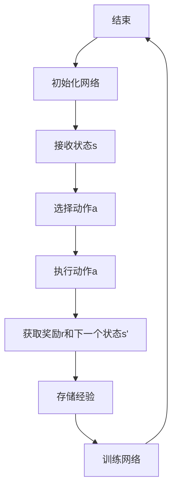

                 


# 《金融领域强化学习在多层次流动性管理中的应用》

> 关键词：强化学习，流动性管理，金融，算法，系统架构，项目实战

> 摘要：本文深入探讨了强化学习在金融领域多层次流动性管理中的应用，结合实际案例分析了强化学习算法的原理及其在流动性管理中的优势。通过系统化的架构设计和详细的项目实战，展示了如何利用强化学习技术优化金融市场的流动性管理。

---

# 第一部分: 金融领域强化学习背景与概述

## 第1章: 金融领域流动性管理概述

### 1.1 流动性管理的定义与重要性
- 1.1.1 流动性管理的基本概念  
  流动性管理是指在金融市场中，确保资金能够在不同市场参与者之间顺畅流动的过程。它包括资产配置、交易策略和风险控制等多个方面。

- 1.1.2 流动性管理在金融系统中的作用  
  流动性管理是金融系统稳定运行的基础，它直接影响金融市场的深度、广度和效率。

- 1.1.3 流动性管理的多层次架构  
  流动性管理可以分为微观、中观和宏观三个层次，分别对应资产配置、机构间协调和系统性风险防范。

## 第2章: 强化学习的基本概念与特点

### 2.1 强化学习的定义与核心要素
- 2.1.1 强化学习的定义  
  强化学习是一种通过智能体与环境交互来学习最优策略的机器学习方法。

- 2.1.2 强化学习的核心要素  
  - 状态（State）：智能体所处的环境状况。  
  - 动作（Action）：智能体采取的行为。  
  - 奖励（Reward）：智能体行为的评价指标。

- 2.1.3 强化学习与监督学习的区别  
  - 监督学习：基于已知的输入-输出关系学习。  
  - 强化学习：通过与环境交互，逐步优化策略。

## 第3章: 强化学习在金融领域的应用前景

### 3.1 金融领域的复杂性与不确定性
- 3.1.1 金融市场的动态特性  
  金融市场受到多种因素影响，包括经济指标、政策变化和市场情绪等。

- 3.1.2 金融决策的多目标优化问题  
  金融决策需要在风险和收益之间找到平衡，这通常是一个多目标优化问题。

- 3.1.3 强化学习在金融决策中的优势  
  强化学习能够处理复杂环境下的决策问题，适合应用于金融市场的动态优化。

## 第4章: 多层次流动性管理中的强化学习应用

### 4.1 多层次流动性管理的定义
- 4.1.1 微观层面：资产配置与交易策略  
  在微观层面，强化学习可以用于优化资产配置和交易策略，以最大化收益并最小化风险。

- 4.1.2 中观层面：机构间流动性协调  
  在中观层面，强化学习可以用于机构间的流动性协调，确保资金在不同机构之间顺畅流动。

- 4.1.3 宏观层面：系统性风险防范  
  在宏观层面，强化学习可以用于系统性风险的预测和防范，维护金融市场的稳定。

---

# 第二部分: 强化学习算法原理与数学模型

## 第5章: 强化学习的核心算法

### 5.1 Q-learning算法

#### 5.1.1 Q-learning的基本原理
Q-learning是一种基于值函数的强化学习算法，通过不断更新Q值函数来逼近最优策略。

#### 5.1.2 Q-learning的数学模型
$$Q(s, a) = Q(s, a) + \alpha (r + \gamma \max Q(s', a') - Q(s, a))$$

其中：
- $s$：当前状态  
- $a$：当前动作  
- $r$：奖励  
- $s'$：下一个状态  
- $\alpha$：学习率  
- $\gamma$：折扣因子

#### 5.1.3 Q-learning的收敛性分析
Q-learning在离散状态空间中具有收敛性，最终收敛于最优Q值函数。

### 5.2 Deep Q-Network (DQN)算法

#### 5.2.1 DQN算法的基本原理
DQN算法通过神经网络近似Q值函数，并引入经验回放机制来提高学习效率。

#### 5.2.2 经验回放机制
$$Replay\ Buffer = \{ (s_i, a_i, r_i, s_{i+1}) \}$$

#### 5.2.3 DQN算法的流程图（使用Mermaid）


---

# 第三部分: 系统分析与架构设计

## 第6章: 流动性管理系统的架构设计

### 6.1 问题场景介绍
- 流动性管理系统需要在复杂金融环境中实时优化流动性配置。

### 6.2 系统功能设计（领域模型Mermaid类图）
```mermaid
classDiagram
class 流动性管理器 {
    +状态：当前状态
    +动作：当前动作
    +奖励：奖励值
    +Q值函数：Q(s, a)
}
class 环境 {
    +市场数据：市场状态
    +交易规则：交易规则
    +风险指标：风险值
}
流动性管理器 --> 环境：获取状态
流动性管理器 --> 环境：执行动作
环境 --> 流动性管理器：返回奖励和新状态
```

### 6.3 系统架构设计（Mermaid架构图）


### 6.4 系统交互设计（Mermaid序列图）
```mermaid
sequenceDiagram
参与者：流动性管理器
系统：环境
参与者 -> 系统：获取当前状态
系统 -> 参与者：返回市场数据
参与者 -> 系统：选择动作
系统 -> 参与者：返回奖励和新状态
参与者 -> 系统：存储经验
```

---

# 第四部分: 项目实战

## 第7章: 强化学习在流动性管理中的实战应用

### 7.1 环境安装
```bash
pip install gym
pip install numpy
pip install matplotlib
```

### 7.2 系统核心实现源代码
```python
import gym
import numpy as np

class Agent:
    def __init__(self, env):
        self.env = env
        self.Q = np.zeros((env.observation_space.n, env.action_space.n))

    def choose_action(self, state):
        if np.random.random() < 0.9:
            return np.argmax(self.Q[state])
        else:
            return self.env.action_space.sample()

    def update_Q(self, state, action, reward, next_state):
        self.Q[state][action] += 0.1 * (reward + 0.95 * np.max(self.Q[next_state]) - self.Q[state][action])

def main():
    env = gym.make('FinancialMarket-v0')
    agent = Agent(env)
    for episode in range(1000):
        state = env.reset()
        total_reward = 0
        while True:
            action = agent.choose_action(state)
            next_state, reward, done, _ = env.step(action)
            agent.update_Q(state, action, reward, next_state)
            total_reward += reward
            state = next_state
            if done:
                break
        print(f"Episode {episode}, Total Reward: {total_reward}")

if __name__ == "__main__":
    main()
```

### 7.3 案例分析与结果解读
- 通过上述代码实现一个简单的流动性管理模型，展示强化学习在优化资产配置中的应用。

### 7.4 项目小结
强化学习在流动性管理中的应用具有显著的优势，能够帮助机构在复杂金融市场中做出更优的决策。

---

# 第五部分: 总结与展望

## 第8章: 总结与展望

### 8.1 总结
本文详细介绍了强化学习在金融领域多层次流动性管理中的应用，通过理论分析和项目实战，展示了其在优化流动性配置中的巨大潜力。

### 8.2 未来展望
- 探索多智能体协作在流动性管理中的应用  
- 研究强化学习在系统性风险防范中的进一步优化  
- 开发更高效的强化学习算法，提升金融决策的实时性和准确性

---

通过本文的系统分析和实践案例，读者可以全面了解强化学习在金融领域流动性管理中的应用，并为进一步研究和实践提供参考。

