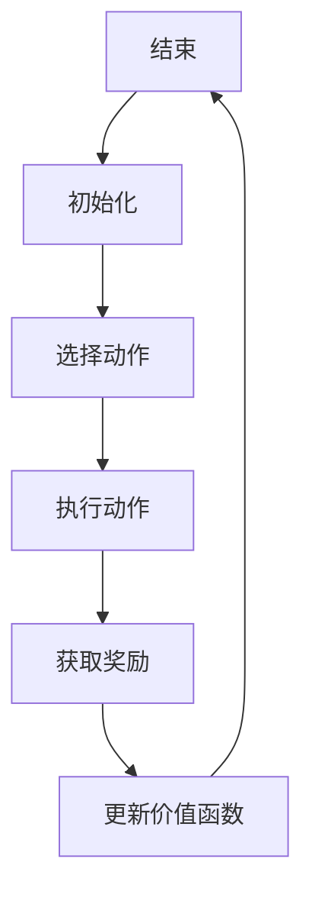

                 


# 《金融领域强化学习在多资产类别定价中的应用》

> **关键词**：强化学习, 多资产定价, 金融应用, 算法原理, 系统设计, 项目实战

> **摘要**：本文探讨了强化学习在金融领域多资产类别定价中的应用，从强化学习的基本概念和算法原理出发，结合多资产定价的理论与方法，详细讲解了如何利用强化学习提升多资产定价的准确性和效率。通过实际案例分析和系统设计，展示了强化学习在金融定价中的潜力和优势。最后，本文还探讨了强化学习在金融定价中的优化方向和未来研究展望。

---

## 第1章: 强化学习的基本概念与背景

### 1.1 强化学习的定义与核心概念

#### 1.1.1 强化学习的定义
强化学习（Reinforcement Learning, RL）是一种机器学习范式，通过智能体与环境的交互，学习如何采取一系列行动以最大化累积奖励。与监督学习和无监督学习不同，强化学习强调通过试错和经验积累来优化决策过程。

#### 1.1.2 强化学习的核心要素
- **状态（State）**：环境在某一时刻的观测，表示智能体所处的环境状况。
- **动作（Action）**：智能体在给定状态下选择的操作。
- **奖励（Reward）**：智能体执行动作后，环境对其行为的反馈，通常以数值形式表示。
- **策略（Policy）**：智能体选择动作的概率分布，决定如何从当前状态中选择动作。
- **价值函数（Value Function）**：衡量某状态下采取某种策略的期望奖励。

#### 1.1.3 强化学习与其它机器学习方法的区别
| 对比项 | 监督学习 | 无监督学习 | 强化学习 |
|-------|----------|------------|----------|
| 数据类型 | 标签数据 | 无标签数据 | 环境反馈 |
| 学习目标 | 预测目标值 | 寻找数据结构 | 最大化累积奖励 |
| 交互方式 | 非交互式 | 非交互式 | 交互式 |

---

### 1.2 强化学习在金融领域的应用背景

#### 1.2.1 金融领域的复杂性与不确定性
金融市场的特点是高度复杂和不确定性，价格波动、风险评估和投资决策都受到多种因素的影响。传统的定价模型在面对多资产类别时往往难以捕捉复杂的变化。

#### 1.2.2 强化学习在金融中的潜在优势
- **非线性关系建模**：强化学习能够处理复杂的非线性关系，适用于多资产定价中变量之间的复杂依赖。
- **动态决策优化**：强化学习通过与环境的交互，能够动态调整定价策略，适应市场变化。
- **高维数据处理**：强化学习在处理高维数据方面具有优势，适用于多资产类别中的多维度特征分析。

#### 1.2.3 多资产定价的挑战与机遇
- **挑战**：多资产定价需要同时考虑多种资产的相互影响，传统的定价模型难以处理这种复杂性。
- **机遇**：强化学习通过模拟市场环境和策略优化，为多资产定价提供了新的解决方案。

---

## 第2章: 强化学习的核心概念与算法原理

### 2.1 强化学习的基本原理

#### 2.1.1 状态、动作、奖励的定义
- **状态（State）**：市场当前的状态，例如价格、波动率、市场情绪等。
- **动作（Action）**：智能体在给定状态下选择的操作，例如买入、卖出或持有某种资产。
- **奖励（Reward）**：智能体选择动作后获得的反馈，通常表示收益或损失。

#### 2.1.2 策略与价值函数的定义
- **策略（Policy）**：智能体选择动作的概率分布，可以用函数 $ \pi(a|s) $ 表示。
- **价值函数（Value Function）**：衡量某状态下采取某种策略的期望奖励，可以用 $ V(s) $ 或 $ Q(s,a) $ 表示。

#### 2.1.3 探索与利用的平衡
强化学习的核心在于探索与利用的平衡。探索是指尝试新的动作以发现更好的策略，利用是指在已知好的策略下获取最大收益。这种平衡可以通过 $\epsilon$-贪心策略等方法实现。

### 2.2 强化学习的数学模型与公式

#### 2.2.1 状态值函数的数学表达
$$ V(s) = \max_a Q(s,a) $$

#### 2.2.2 动作值函数的数学表达
$$ Q(s,a) = r + \gamma \max_{a'} Q(s',a') $$

#### 2.2.3 策略函数的数学表达
$$ \pi(a|s) = \arg\max_a Q(s,a) $$

#### 2.2.4 算法流程


### 2.3 强化学习的Python实现示例

#### 2.3.1 简单强化学习算法的代码实现
```python
import gym

class Agent:
    def __init__(self, env, policy):
        self.env = env
        self.policy = policy

    def train(self, num_episodes=1000):
        for episode in range(num_episodes):
            state = self.env.reset()
            while True:
                action = self.policy.choose_action(state)
                next_state, reward, done, _ = self.env.step(action)
                self.policy.update(state, action, reward, next_state)
                state = next_state
                if done:
                    break

class EpsilonGreedyPolicy:
    def __init__(self, actions, epsilon=0.1):
        self.actions = actions
        self.epsilon = epsilon
        self.Q = {}

    def choose_action(self, state):
        if random.random() < self.epsilon:
            return random.choice(self.actions)
        else:
            return max_action(self.Q.get(state, 0))

    def update(self, state, action, reward, next_state):
        key = state
        self.Q[key] = self.Q.get(key, 0) + reward
```

---

## 第3章: 多资产类别定价的强化学习方法

### 3.1 多资产定价的基本理论

#### 3.1.1 资产定价的基本概念
- **资产**：具有价值的金融工具，如股票、债券、基金等。
- **定价**：确定资产在市场上的价值，通常基于资产的未来现金流折现。

#### 3.1.2 不同资产类别的特点与定价方法
| 资产类别 | 定价特点 | 定价方法 |
|--------|----------|----------|
| 股票 | 高波动性，依赖公司基本面 | 市盈率法、现金流折现法 |
| 债券 | 低波动性，依赖信用评级 | 净现值法、收益率法 |
| 基金 | 综合性，依赖投资组合表现 | 风险调整后收益法 |

#### 3.1.3 多资产定价的复杂性与难点
- **多变量依赖**：不同资产的价格相互影响，难以单独定价。
- **市场动态变化**：市场环境不断变化，传统模型难以捕捉。

---

### 3.2 基于强化学习的多资产定价方法

#### 3.2.1 算法选择与优化
- **选择强化学习算法**：根据问题特点选择合适的算法，如Q-Learning、Deep Q-Network（DQN）等。
- **算法优化**：通过调整学习率、探索率等参数优化算法性能。

#### 3.2.2 系统设计与实现
```mermaid
classDiagram
    class Agent {
        env: Environment
        policy: Policy
        Q: map state -> value
    }
    class Environment {
        state: State
        actions: list of actions
        reward: float
    }
    class Policy {
        actions: list of actions
        epsilon: float
        choose_action(): action
        update(): void
    }
    Agent o- Environment
    Agent o- Policy
    Agent o- Q
```

---

## 总结

本文详细探讨了强化学习在金融领域多资产类别定价中的应用，从强化学习的基本概念到具体算法实现，再到系统设计与实战案例，全面分析了强化学习在多资产定价中的优势与挑战。通过本文的讲解，读者可以深入了解如何利用强化学习提升多资产定价的准确性和效率，为未来的金融创新提供新的思路。

---

### **下一步阅读**
1. 如果您对强化学习的数学原理感兴趣，可以阅读《强化学习：算法与应用》。
2. 如果您想深入了解强化学习在金融中的具体应用，可以参考《金融工程中的机器学习》。

