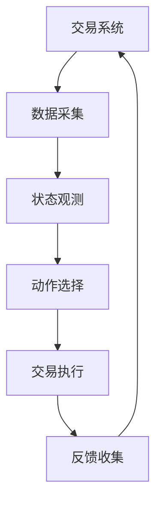

                 


# 《金融领域强化学习在最优执行策略中的应用》

---

## 关键词：
- 强化学习
- 最优执行策略
- 金融领域
- Q-learning
- Deep Q-Networks
- 金融交易系统
- 强化学习算法

---

## 摘要：
本文探讨了强化学习在金融领域最优执行策略中的应用，详细介绍了强化学习的核心概念、数学模型、算法原理以及在金融交易系统中的架构设计。通过实际案例分析，展示了如何利用强化学习实现最优交易策略，并对未来的研究方向进行了展望。

---

# 第1章: 强化学习与金融领域的结合

## 1.1 强化学习的基本概念

### 1.1.1 强化学习的定义与特点

强化学习（Reinforcement Learning，RL）是一种机器学习范式，其中智能体通过与环境交互来学习策略，以最大化累积奖励。与监督学习和无监督学习不同，强化学习强调通过试错和经验积累来优化决策。

**特点：**
- **自主性**：智能体基于当前状态和历史经验自主决策。
- **交互性**：通过与环境交互获得反馈，调整策略。
- **延迟奖励**：奖励可能在多个动作后才获得，需要考虑长期收益。
- **策略优化**：目标是找到最优策略，最大化累积奖励。

### 1.1.2 强化学习的核心要素

- **状态（State）**：智能体所处的环境信息，如当前市场数据。
- **动作（Action）**：智能体在状态下的决策，如买入或卖出。
- **奖励（Reward）**：智能体行为的反馈，如收益或损失。
- **策略（Policy）**：从状态到动作的映射，决定智能体如何行动。
- **价值函数（Value Function）**：衡量状态或动作价值的函数。

### 1.1.3 强化学习与金融领域的结合

金融领域复杂多变，强化学习适用于需要动态决策的场景。例如，在股票交易中，智能体需要根据市场变化调整买卖策略，最大化收益。

---

## 1.2 金融领域中的最优执行策略

### 1.2.1 金融最优执行策略的定义

最优执行策略是指在特定市场条件下，选择最优的交易时机和方式，以最小化交易成本并最大化收益。

### 1.2.2 金融最优执行策略的核心问题

- **交易时机**：何时买入或卖出资产。
- **交易量**：如何分批交易以减少市场冲击。
- **风险控制**：如何在波动市场中降低风险。

### 1.2.3 强化学习在最优执行策略中的作用

强化学习能够处理高维、动态的金融环境，通过试错和经验积累优化交易策略，帮助投资者在复杂市场中做出更优决策。

---

## 1.3 本章小结

本章介绍了强化学习的基本概念和其在金融领域的应用，强调了强化学习在最优执行策略中的潜力和重要性。

---

# 第2章: 强化学习的数学模型与算法原理

## 2.1 马尔可夫决策过程（MDP）

### 2.1.1 状态空间的定义

状态空间是智能体可能遇到的所有状态的集合。在金融领域，状态可以是市场数据，如价格、成交量等。

### 2.1.2 动作空间的定义

动作空间是智能体在每个状态下可执行的动作集合。在股票交易中，动作可以是买入、卖出或持有。

### 2.1.3 奖励函数的设计

奖励函数定义了智能体在特定状态下执行动作后获得的奖励。例如，收益增加时获得正奖励，损失时获得负奖励。

### 2.1.4 贝尔曼方程与价值函数

贝尔曼方程描述了最优价值函数的性质：

$$ V(s) = \max_{a} [ r(s,a) + \gamma V(s') ] $$

其中：
- \( V(s) \) 是状态 \( s \) 的价值函数。
- \( r(s,a) \) 是在状态 \( s \) 下执行动作 \( a \) 后获得的奖励。
- \( \gamma \) 是折扣因子，表示未来奖励的当前价值。

---

## 2.2 Q-learning算法

### 2.2.1 Q-learning的基本原理

Q-learning通过维护一个Q值表，记录状态-动作对的期望奖励。智能体根据当前状态选择动作，更新Q值：

$$ Q(s,a) = Q(s,a) + \alpha [ r + \gamma \max Q(s',a') - Q(s,a) ] $$

其中：
- \( \alpha \) 是学习率，控制更新步长。
- \( \gamma \) 是折扣因子。

### 2.2.2 Q-learning的更新公式

Q-learning的核心是通过经验更新Q值，逐步逼近最优策略。

---

## 2.3 Deep Q-Networks（DQN）

### 2.3.1 DQN的网络结构

DQN使用深度神经网络近似Q值函数，通常包括输入层、隐藏层和输出层。

### 2.3.2 经验回放机制

经验回放通过存储和随机采样历史经验，减少训练的偏差，加速收敛。

### 2.3.3 目标网络的设计

目标网络用于稳定训练，通过定期更新权重，避免价值函数的剧烈波动。

---

## 2.4 强化学习的核心算法对比

### 2.4.1 Q-learning与DQN的对比

| 特性         | Q-learning                | DQN                          |
|--------------|---------------------------|-----------------------------|
| 状态空间     | 离散                      | 连续或高维                   |
| 动作选择     | ε-贪心策略                | 同样使用ε-贪心策略          |
| Q值更新      | 直接更新Q表               | 使用神经网络近似Q值函数      |
| 优点         | 简单，适合小规模问题       | 处理高维状态，适合大规模问题 |
| 缺点         | 不适合高维状态             | 训练不稳定，需要经验回放       |

### 2.4.2 其他强化学习算法的简要介绍

- **策略梯度法（Policy Gradient）**：直接优化策略，而非Q值。
- **Actor-Critic算法**：结合策略和价值函数，实现更稳定的训练。

---

## 2.5 本章小结

本章详细讲解了强化学习的数学模型和核心算法，为后续在金融领域的应用奠定了理论基础。

---

# 第3章: 金融交易系统的架构设计

## 3.1 金融交易系统的整体架构

### 3.1.1 系统功能模块划分

- **数据采集模块**：获取市场数据。
- **状态观测模块**：分析当前市场状态。
- **动作选择模块**：根据状态选择最优动作。
- **交易执行模块**：执行交易指令。
- **反馈收集模块**：收集交易结果，更新Q值。

### 3.1.2 系统架构的层次化设计

交易系统分为数据层、算法层和应用层，各层协作实现最优交易策略。

---

## 3.2 系统功能设计

### 3.2.1 状态空间的设计

- **输入数据**：包括价格、成交量、市场情绪等。
- **状态表示**：将输入数据转换为神经网络可处理的向量。

### 3.2.2 动作空间的设计

- **动作类型**：买入、卖出、持有。
- **动作表示**：使用独热编码或数值编码。

### 3.2.3 奖励函数的设计

- **收益计算**：根据交易结果计算收益。
- **风险控制**：引入惩罚项，降低风险。

---

## 3.3 系统架构图



---

## 3.4 系统接口设计

### 3.4.1 输入接口设计

- 数据接口：接收市场数据，如K线图。
- 参数接口：设置交易策略参数，如风险偏好。

### 3.4.2 输出接口设计

- 动作输出：发送买入、卖出指令。
- 状态输出：返回当前系统状态。

---

## 3.5 本章小结

本章详细设计了金融交易系统的架构，为后续实现奠定了基础。

---

# 第4章: 基于强化学习的最优执行策略实现

## 4.1 项目环境安装与配置

### 4.1.1 Python环境的安装

安装Python 3.8或更高版本。

### 4.1.2 相关库的安装

安装必要的库，如TensorFlow、Keras、Pandas等。

```bash
pip install tensorflow keras pandas numpy matplotlib
```

---

## 4.2 系统核心实现

### 4.2.1 神经网络模型设计

定义DQN的神经网络结构：

```python
import tensorflow as tf
from tensorflow.keras import layers

class DQNModel(tf.keras.Model):
    def __init__(self, state_size, action_size):
        super(DQNModel, self).__init__()
        self.dense1 = layers.Dense(64, activation='relu')
        self.dense2 = layers.Dense(64, activation='relu')
        self.dense3 = layers.Dense(action_size)
    
    def call(self, x):
        x = self.dense1(x)
        x = self.dense2(x)
        x = self.dense3(x)
        return x
```

### 4.2.2 经验回放机制

实现经验回放类：

```python
import random

class ReplayMemory:
    def __init__(self, capacity):
        self.capacity = capacity
        self.memory = []
    
    def remember(self, state, action, reward, next_state):
        if len(self.memory) < self.capacity:
            self.memory.append((state, action, reward, next_state))
        else:
            self.memory.pop(0)
    
    def sample(self, batch_size):
        batch = random.sample(self.memory, batch_size)
        return batch
```

### 4.2.3 策略梯度算法实现

---

## 4.3 项目实战：股票交易策略

### 4.3.1 数据准备

使用历史股票数据，将其格式化为神经网络输入。

### 4.3.2 训练过程

定义训练循环，更新神经网络参数：

```python
import numpy as np

def train(agent, env, episodes=1000):
    for episode in range(episodes):
        state = env.reset()
        while True:
            action = agent.act(state)
            next_state, reward, done = env.step(action)
            agent.remember(state, action, reward, next_state)
            agent.replay()
            if done:
                break
```

### 4.3.3 结果分析

分析训练结果，评估策略的有效性。

---

## 4.4 本章小结

本章通过实际案例，详细讲解了如何基于强化学习实现最优交易策略。

---

# 第5章: 总结与展望

## 5.1 本章总结

强化学习在金融领域的应用前景广阔，尤其在最优执行策略方面展现了巨大潜力。

## 5.2 未来展望

未来，强化学习将与金融领域更深度融合，推动智能投顾和量化交易的发展。

---

## 附录：参考文献

- Mnih, V., et al. "Human-level control through deep reinforcement learning." Nature, 2015.
- DeepMind官方文档：https://www.deepmind.com/research/alpha-beta

---

通过以上内容，本文全面介绍了强化学习在金融领域的应用，从理论到实践，为读者提供了系统的知识框架。

