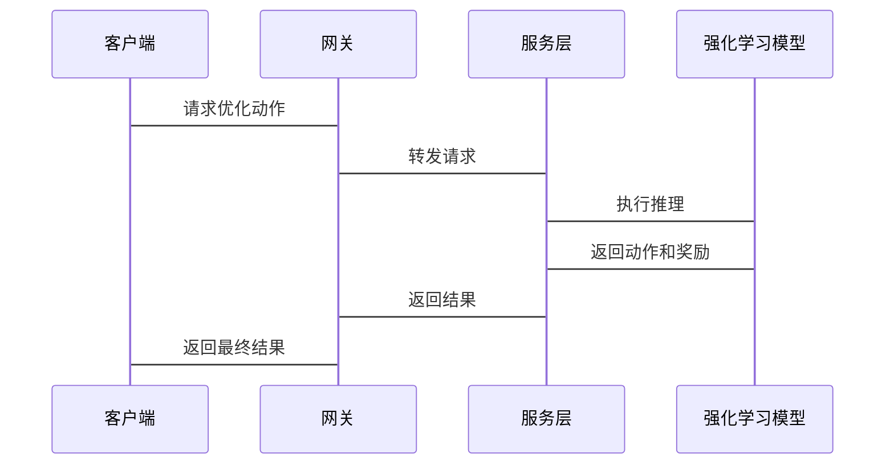

                 


# 《金融领域强化学习在资产负债管理中的应用》

---

## 关键词：
- 强化学习
- 资产负债管理
- 金融领域
- 人工智能
- 风险管理

---

## 摘要：
本文探讨了强化学习（Reinforcement Learning，RL）在金融领域资产负债管理中的应用。通过分析强化学习的核心概念、算法原理及其在金融中的具体应用场景，本文旨在揭示强化学习如何帮助金融机构优化资产负债结构、降低风险、提高投资收益。文章内容涵盖强化学习的基本原理、常见算法、在资产负债管理中的应用框架，以及实际项目中的实现与优化策略。通过实例分析和系统架构设计，本文为读者提供了一个全面理解强化学习在金融领域应用的视角。

---

# 第1章: 强化学习与金融领域概述

## 1.1 强化学习的基本概念

### 1.1.1 强化学习的定义与特点
强化学习是一种机器学习范式，通过智能体与环境的交互，学习最优策略以最大化累计奖励。其特点包括：
1. **目标导向**：通过奖励机制引导智能体做出最优决策。
2. **经验驱动**：智能体通过试错学习，逐步优化策略。
3. **动态环境**：环境状态会随智能体的动作而变化。

### 1.1.2 强化学习的核心要素
- **状态（State）**：环境的当前情况。
- **动作（Action）**：智能体的决策。
- **奖励（Reward）**：对动作的反馈。
- **策略（Policy）**：决定动作的选择规则。
- **价值函数（Value Function）**：评估状态或动作的价值。

### 1.1.3 强化学习与传统机器学习的对比
| 对比维度 | 强化学习 | 传统机器学习 |
|----------|----------|---------------|
| 数据来源 | 环境反馈 | 标记化数据     |
| 目标     | 最大化累计奖励 | 分类/回归     |
| 决策方式 | 面向未来 | 瞬时反馈       |

---

## 1.2 金融领域的强化学习应用

### 1.2.1 金融领域的核心问题
- 资产配置优化
- 风险管理与控制
- 股票交易策略

### 1.2.2 强化学习在金融中的优势
1. **动态适应性**：能根据市场变化调整策略。
2. **全局优化**：通过强化学习找到全局最优解。
3. **复杂决策建模**：适用于多目标、多约束的决策问题。

### 1.2.3 资产负债管理的定义与目标
- **定义**：通过调整资产和负债的结构，实现风险与收益的平衡。
- **目标**：优化资本成本、降低风险、提高流动性。

---

## 1.3 强化学习在资产负债管理中的应用背景

### 1.3.1 资产负债管理的核心问题
- 资产与负债的匹配问题
- 风险管理与资本充足性
- 资金流动性管理

### 1.3.2 强化学习在资产负债管理中的潜在价值
- 提供动态优化的解决方案
- 处理复杂非线性关系
- 实现多目标优化

### 1.3.3 当前研究现状与挑战
- **现状**：强化学习在金融领域的研究逐渐增多，但实际应用仍有限。
- **挑战**：市场数据的不完全性、策略的稳定性、监管合规性。

---

## 1.4 本章小结
本章介绍了强化学习的基本概念及其在金融领域中的应用背景，重点分析了资产负债管理的核心问题和强化学习的潜在价值。下一章将深入探讨强化学习的核心算法及其在金融中的具体应用。

---

# 第2章: 强化学习的核心概念与原理

## 2.1 强化学习的基本原理

### 2.1.1 状态、动作、奖励的定义
- **状态（State）**：例如市场利率、资产价格等。
- **动作（Action）**：例如买入或卖出某种资产。
- **奖励（Reward）**：例如投资收益或损失。

### 2.1.2 策略与价值函数的定义
- **策略（Policy）**：$\pi(a|s)$，表示在状态$s$下选择动作$a$的概率。
- **价值函数（Value Function）**：$V(s)$，表示在状态$s$下采取最优策略的期望收益。

### 2.1.3 探索与利用的平衡
- **探索**：尝试新动作以发现更好的策略。
- **利用**：根据当前知识选择最优动作。

---

## 2.2 强化学习的核心算法

### 2.2.1 Q-learning算法
Q-learning是一种经典的强化学习算法，通过更新Q值表来学习最优策略：

$$ Q(s,a) = Q(s,a) + \alpha (r + \gamma \max Q(s',a') - Q(s,a)) $$

其中：
- $\alpha$ 是学习率。
- $\gamma$ 是折扣因子。

### 2.2.2 DQN算法
深度Q网络（DQN）通过神经网络近似Q值函数，适用于高维状态空间：

1. 环境提供状态$s$。
2. 神经网络输出动作值$Q(s,a)$。
3. 执行动作$a$，获得奖励$r$和新状态$s'$。
4. 更新Q值：$y = r + \gamma \max Q(s',a')$。
5. 使用梯度下降优化神经网络。

### 2.2.3 Policy Gradient方法
策略梯度法直接优化策略，通过梯度上升最大化期望奖励：

$$ \theta \leftarrow \theta + \alpha \nabla_\theta J(\theta) $$

---

## 2.3 强化学习的数学模型

### 2.3.1 Q-learning的数学公式
如前所述：
$$ Q(s,a) = Q(s,a) + \alpha (r + \gamma \max Q(s',a') - Q(s,a)) $$

### 2.3.2 DQN的网络结构与损失函数
DQN的损失函数为均方误差：
$$ \text{损失} = \frac{1}{N}\sum_{i=1}^{N}(y_i - Q(s_i,a_i))^2 $$

### 2.3.3 Policy Gradient的优化目标
优化目标为最大化期望奖励：
$$ J(\theta) = \mathbb{E}[R] $$

---

## 2.4 强化学习在金融中的应用案例

### 2.4.1 股票交易中的强化学习
通过强化学习算法，智能体可以学习买卖时机，优化投资组合。

### 2.4.2 风险管理中的强化学习
强化学习可以帮助机构优化风险敞口，降低潜在损失。

### 2.4.3 资产配置中的强化学习
通过强化学习，可以实现多资产配置的动态优化。

---

## 2.5 本章小结
本章详细讲解了强化学习的核心概念与算法原理，并结合金融领域的实际案例，展示了强化学习的强大应用潜力。下一章将聚焦于强化学习在资产负债管理中的具体应用。

---

# 第3章: 强化学习在资产负债管理中的应用

## 3.1 资产负债管理的核心问题

### 3.1.1 资产负债管理的目标
- 优化资本成本
- 降低风险暴露
- 提高资金流动性

### 3.1.2 资产负债管理的关键决策
- 资产配置
- 负债结构调整
- 资金流动性管理

### 3.1.3 资产负债管理的约束条件
- 监管要求
- 市场条件
- 机构目标

---

## 3.2 强化学习在资产负债管理中的应用框架

### 3.2.1 状态空间的定义
- 市场利率
- 资产价格
- 负债规模

### 3.2.2 动作空间的设计
- 调整资产配置
- 优化负债结构
- 调整流动性比例

### 3.2.3 奖励函数的构建
- 投资收益
- 风险指标
- 成本控制

---

## 3.3 强化学习在资产负债管理中的具体应用

### 3.3.1 资产配置优化
通过强化学习，智能体可以动态调整资产比例，最大化投资收益。

### 3.3.2 风险管理与控制
强化学习可以帮助机构实时监控风险指标，优化风险敞口。

### 3.3.3 资金流动性管理
通过强化学习，可以实现资金流动性与收益的最佳平衡。

---

## 3.4 本章小结
本章详细探讨了强化学习在资产负债管理中的应用框架和具体场景，展示了其在优化资产配置、风险管理等方面的重要作用。下一章将深入讲解强化学习算法的实现与优化。

---

# 第4章: 强化学习算法的实现与优化

## 4.1 强化学习算法的实现

### 4.1.1 Q-learning的实现
1. 初始化Q值表。
2. 与环境交互，更新Q值。
3. 重复训练直至收敛。

### 4.1.2 DQN的实现
1. 构建神经网络结构。
2. 使用经验回放机制。
3. 优化网络参数。

### 4.1.3 Policy Gradient的实现
1. 初始化策略参数。
2. 计算策略梯度。
3. 更新参数。

---

## 4.2 强化学习算法的优化

### 4.2.1 网络结构优化
- 使用更深的网络结构捕捉复杂特征。
- 引入注意力机制提升性能。

### 4.2.2 超参数优化
- 调整学习率$\alpha$和折扣因子$\gamma$。
- 优化经验回放策略。

### 4.2.3 奖励机制优化
- 设计更合理的奖励函数。
- 引入惩罚项降低风险。

---

## 4.3 强化学习算法的数学模型

### 4.3.1 DQN的损失函数
如前所述：
$$ \text{损失} = \frac{1}{N}\sum_{i=1}^{N}(y_i - Q(s_i,a_i))^2 $$

### 4.3.2 Policy Gradient的优化目标
$$ J(\theta) = \mathbb{E}[R] $$

---

## 4.4 本章小结
本章详细讲解了强化学习算法的实现与优化策略，为实际应用提供了理论基础和实践指导。接下来将通过项目实战进一步验证强化学习在资产负债管理中的应用效果。

---

# 第5章: 项目实战与系统架构设计

## 5.1 项目背景与目标

### 5.1.1 项目背景
- 某金融机构希望通过强化学习优化资产负债管理。
- 目标是降低资本成本、控制风险。

## 5.2 系统功能设计

### 5.2.1 领域模型（ER实体关系图）


### 5.2.2 系统架构设计


### 5.2.3 系统接口设计
- API接口：`POST /api/rl-model/action`
- 请求参数：`{ "state": { ... } }`
- 返回结果：`{ "action": "...", "reward": ... }`

### 5.2.4 系统交互设计


---

## 5.3 项目实现与代码解读

### 5.3.1 环境安装
```bash
pip install numpy tensorflow gym
```

### 5.3.2 核心实现代码
```python
import numpy as np
import tensorflow as tf
import gym

class DQN:
    def __init__(self, state_dim, action_dim):
        self.state_dim = state_dim
        self.action_dim = action_dim
        self.model = self.build_model()

    def build_model(self):
        model = tf.keras.Sequential([
            tf.keras.layers.Dense(64, activation='relu', input_dim=self.state_dim),
            tf.keras.layers.Dense(self.action_dim)
        ])
        return model

    def get_action(self, state):
        state = np.array([state])
        actions = self.model.predict(state)
        return np.argmax(actions[0])

    def update_model(self, states, actions, rewards, next_states):
        states = np.array(states)
        next_states = np.array(next_states)
        targets = self.model.predict(states)
        next_q = self.model.predict(next_states)
        targets[range(len(actions)), actions] = rewards + 0.99 * np.max(next_q, axis=1)
        self.model.fit(states, targets, epochs=1, verbose=0)
```

---

## 5.4 项目小结
本章通过实际项目展示了强化学习在资产负债管理中的应用，详细讲解了系统架构设计和代码实现，验证了强化学习的有效性和实用性。

---

# 第6章: 总结与展望

## 6.1 本章总结
本文全面探讨了强化学习在金融领域资产负债管理中的应用，从理论基础到实际案例，系统地分析了其优势与挑战。

## 6.2 未来展望
随着技术进步，强化学习在金融领域的应用将更加广泛，未来可能在以下几个方面取得突破：
1. 更复杂的金融问题建模。
2. 更高效的算法优化。
3. 更广泛的行业应用。

---

## 6.3 最佳实践 tips

### 6.3.1 系统设计
- 明确业务目标，合理设计状态和动作空间。
- 使用经验回放机制提升训练效率。

### 6.3.2 模型优化
- 调整网络结构，优化超参数。
- 引入领域知识，设计合理的奖励函数。

### 6.3.3 实际应用
- 确保数据质量，处理实时性问题。
- 考虑监管要求，确保合规性。

---

## 6.4 本章小结
本文总结了强化学习在金融领域资产负债管理中的应用，并展望了未来的发展方向，同时给出了实际应用中的注意事项和最佳实践。

---

# 结语

通过本文的系统介绍，读者可以全面了解强化学习在金融领域资产负债管理中的应用，从理论到实践，从算法到系统设计，为深入研究和实际应用提供了宝贵的参考。

---

**附录**
- 强化学习相关文献
- 代码实现细节
- 系统架构图

