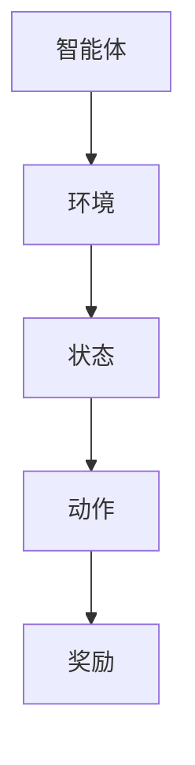
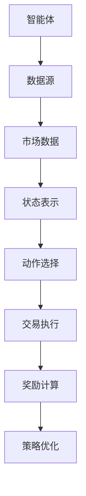
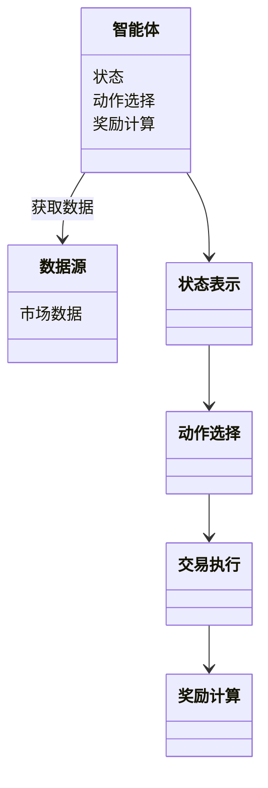
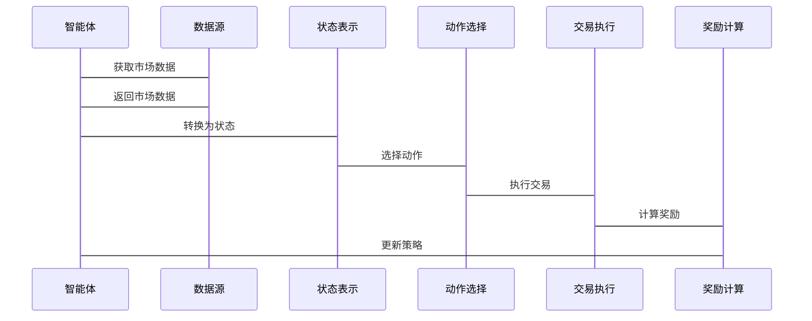

                 


# 金融领域强化学习的探索与实践

## 关键词

- 强化学习
- 金融领域
- 算法原理
- 系统架构
- 项目实战

## 摘要

本文系统地探讨了强化学习在金融领域的应用，从基本概念到算法原理，再到系统设计和项目实战，深入分析了强化学习如何解决金融问题。文章详细介绍了Q-learning和DQN算法，通过案例分析展示了强化学习在股票交易中的应用，并总结了实际应用中的注意事项和最佳实践。

---

## 第1章: 强化学习概述

### 1.1 强化学习的基本概念

#### 1.1.1 什么是强化学习

强化学习（Reinforcement Learning, RL）是一种机器学习范式，通过智能体与环境的交互，学习最优策略以最大化累积奖励。与监督学习不同，RL不需要标记数据，而是通过试错和奖励机制进行学习。

#### 1.1.2 强化学习的核心要素

- **环境（Environment）**：智能体所处的环境，提供状态和奖励。
- **智能体（Agent）**：执行动作以与环境交互的主体。
- **状态（State）**：环境在某一时刻的表示。
- **动作（Action）**：智能体在给定状态下采取的行为。
- **奖励（Reward）**：环境对智能体动作的反馈，指导其行为。
- **策略（Policy）**：智能体选择动作的规则，通常为最大化期望奖励。
- **Q值（Q-value）**：状态-动作对的预期奖励。
- **价值函数（Value Function）**：状态的预期奖励。

#### 1.1.3 强化学习与监督学习的区别

| 特性 | 监督学习 | 强化学习 |
|------|----------|----------|
| 数据 | 标签化数据 | 无标签，通过奖励反馈 |
| 目标 | 预测或分类 | 最大化累积奖励 |
| 交互 | 无交互 | 有交互，试错学习 |

### 1.2 强化学习在金融领域的应用背景

#### 1.2.1 金融领域的复杂性

金融领域涉及大量不确定性，市场波动、经济指标和政策变化等复杂因素，使得传统方法难以应对。

#### 1.2.2 强化学习在金融中的优势

- **非线性关系建模**：强化学习擅长处理复杂非线性问题。
- **动态策略优化**：实时调整策略以应对市场变化。
- **高效决策**：通过试错快速找到最优策略。

#### 1.2.3 当前金融领域的挑战

- **数据稀疏性**：金融数据有限，难以训练深度模型。
- **模型泛化能力**：模型在不同市场环境下的表现不稳定。
- **监管合规性**：强化学习策略需符合金融监管要求。

---

## 第2章: 强化学习的核心概念与联系

### 2.1 强化学习的基本原理

#### 2.1.1 环境与智能体

环境与智能体的交互是强化学习的核心。环境提供状态，智能体采取动作，环境返回奖励。

#### 2.1.2 状态、动作、奖励

状态表示当前情况，动作是智能体的选择，奖励是对动作的反馈。

#### 2.1.3 策略与价值函数

策略决定动作选择，价值函数评估状态的价值。

### 2.2 强化学习的核心概念对比

#### 2.2.1 比较表格与图示

| 概念 | 描述 |
|------|------|
| 状态 | 当前情况 |
| 动作 | 行为选择 |
| 奖励 | 反馈机制 |

#### 2.2.2 ER实体关系图



---

## 第3章: 强化学习的算法原理

### 3.1 Q-learning算法

#### 3.1.1 Q-learning的基本原理

Q-learning通过更新Q值表，记录状态-动作对的预期奖励，找到最优策略。

#### 3.1.2 Q-learning的数学模型

更新公式：
$$ Q(s, a) = Q(s, a) + \alpha (r + \gamma \max Q(s', a')) $$

其中：
- $$ \alpha $$：学习率
- $$ \gamma $$：折扣因子
- $$ r $$：即时奖励

#### 3.1.3 Q-learning的实现代码

```python
import numpy as np

class QLearning:
    def __init__(self, state_space, action_space, alpha=0.1, gamma=0.9):
        self.state_space = state_space
        self.action_space = action_space
        self.Q = np.zeros((state_space, action_space))
        self.alpha = alpha
        self.gamma = gamma

    def choose_action(self, state):
        return np.argmax(self.Q[state, :])

    def update_Q(self, state, action, reward, next_state):
        self.Q[state, action] = self.Q[state, action] + self.alpha * (reward + self.gamma * np.max(self.Q[next_state, :]))
```

### 3.2 深度强化学习算法

#### 3.2.1 DQN算法的原理

DQN通过深度神经网络近似Q值函数，避免了Q值表的维度灾难问题。

#### 3.2.2 DQN算法的数学模型

目标函数：
$$ Q(s, a) \approx Q_\theta(s, a) $$

更新规则：
$$ Q_\theta(s, a) = r + \gamma \max Q_\theta(s', a') $$

#### 3.2.3 DQN算法的实现代码

```python
import numpy as np
import tensorflow as tf

class DQN:
    def __init__(self, state_space, action_space, hidden_units=64, alpha=0.01, gamma=0.9):
        self.state_space = state_space
        self.action_space = action_space
        self.model = self.build_model(hidden_units)
        self.target_model = self.build_model(hidden_units)
        self.alpha = alpha
        self.gamma = gamma

    def build_model(self, hidden_units):
        model = tf.keras.Sequential([
            tf.keras.layers.Dense(hidden_units, activation='relu', input_shape=(self.state_space,)),
            tf.keras.layers.Dense(self.action_space)
        ])
        model.compile(optimizer=tf.keras.optimizers.Adam(learning_rate=self.alpha), loss='mse')
        return model

    def choose_action(self, state, epsilon=0.1):
        if np.random.random() < epsilon:
            return np.random.randint(self.action_space)
        state = np.array([state])
        q_values = self.model.predict(state)
        return np.argmax(q_values[0])

    def update_model(self, states, actions, rewards, next_states):
        targets = rewards + self.gamma * np.max(self.target_model.predict(next_states), axis=1)
        q_values = self.model.predict(states)
        q_values[:, actions] = targets
        self.model.fit(states, q_values, epochs=1, verbose=0)
```

---

## 第4章: 强化学习的系统分析与架构设计

### 4.1 问题场景介绍

#### 4.1.1 金融交易中的强化学习应用

在股票交易中，智能体根据市场状态（价格、成交量）选择买入、卖出或持有。

#### 4.1.2 系统功能设计

- **数据收集**：获取实时市场数据。
- **状态表示**：将市场数据转化为状态。
- **动作选择**：基于当前状态选择交易动作。
- **奖励计算**：根据交易结果计算奖励。

#### 4.1.3 系统架构设计



### 4.2 系统架构图



### 4.3 系统接口设计

- **输入接口**：接收市场数据和状态。
- **输出接口**：输出交易动作和奖励反馈。

### 4.4 系统交互流程



---

## 第5章: 强化学习的项目实战

### 5.1 环境安装与配置

#### 5.1.1 安装Python与相关库

```bash
python --version
pip install numpy
pip install tensorflow
pip install gym
```

#### 5.1.2 安装TensorFlow与Keras

```bash
pip install tensorflow
pip install keras
```

#### 5.1.3 安装OpenAI Gym

```bash
pip install gym
```

### 5.2 系统核心实现

#### 5.2.1 强化学习算法实现

```python
class Agent:
    def __init__(self, state_space, action_space, epsilon=0.1, gamma=0.9):
        self.state_space = state_space
        self.action_space = action_space
        self.Q = np.zeros((state_space, action_space))
        self.epsilon = epsilon
        self.gamma = gamma

    def choose_action(self, state):
        if np.random.random() < self.epsilon:
            return np.random.randint(self.action_space)
        return np.argmax(self.Q[state, :])

    def update_Q(self, state, action, reward, next_state):
        self.Q[state, action] += self.epsilon * (reward + self.gamma * np.max(self.Q[next_state, :]) - self.Q[state, action])
```

#### 5.2.2 系统功能模块实现

- **数据处理模块**：将市场数据转换为状态。
- **动作选择模块**：根据状态选择动作。
- **奖励计算模块**：计算交易结果奖励。

#### 5.2.3 系统接口实现

- **接口1**：智能体接收市场数据。
- **接口2**：智能体发送交易指令。

### 5.3 案例分析与详细讲解

#### 5.3.1 股票交易策略实现

```python
import numpy as np
import pandas as pd

# 加载数据
data = pd.read_csv('stock_prices.csv')
states = data['price'].values

# 定义状态和动作
state_space = len(states)
action_space = 3  # 买入、卖出、持有

# 初始化智能体
agent = Agent(state_space, action_space)

# 训练过程
for i in range(len(states)):
    state = i
    action = agent.choose_action(state)
    next_state = i + 1
    reward = self.calculate_reward(action, states[i], states[next_state])
    agent.update_Q(state, action, reward, next_state)
```

#### 5.3.2 风险控制策略实现

- **风险评估**：评估市场波动性。
- **调整策略**：根据风险调整交易频率。

#### 5.3.3 算法效果分析

- **回测结果**：展示交易策略的收益和风险。
- **性能优化**：分析算法的收敛速度和稳定性。

---

## 第6章: 强化学习的最佳实践与注意事项

### 6.1 最佳实践

- **数据处理**：确保数据质量，处理缺失值和异常值。
- **模型调参**：合理选择学习率和折扣因子。
- **风险管理**：设计风险控制机制，避免过度交易。

### 6.2 小结

本文系统地探讨了强化学习在金融领域的应用，从理论到实践，详细介绍了Q-learning和DQN算法，并通过案例分析展示了强化学习在股票交易中的应用。

### 6.3 注意事项

- **数据稀疏性**：金融数据有限，需设计合理的数据增强方法。
- **模型泛化能力**：确保模型在不同市场环境下的表现稳定。
- **监管合规性**：强化学习策略需符合金融监管要求。

### 6.4 拓展阅读

- [《Deep Reinforcement Learning in Finance》](https://example.com)
- [《Reinforcement Learning: Theory and Algorithms》](https://example.com)

---

以上是《金融领域强化学习的探索与实践》的完整目录和详细内容，涵盖了从基础概念到实际应用的各个方面。希望这篇文章能为读者提供有价值的见解和指导。

