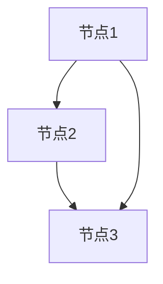
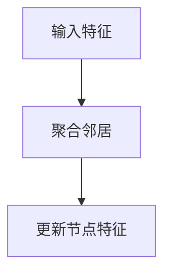
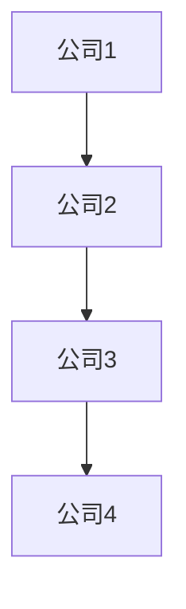
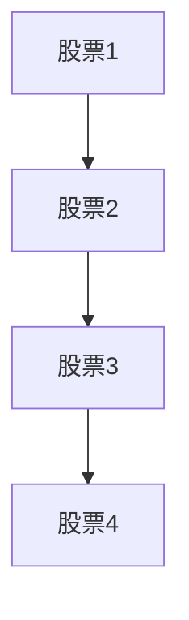
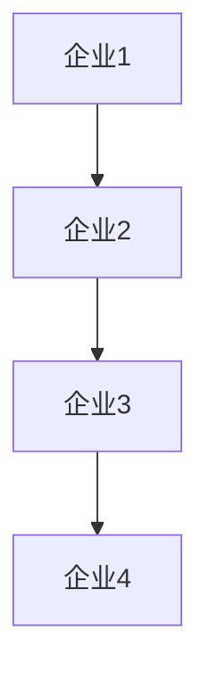
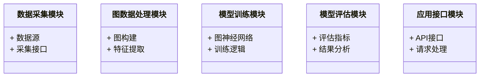
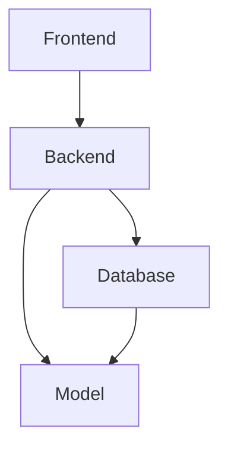
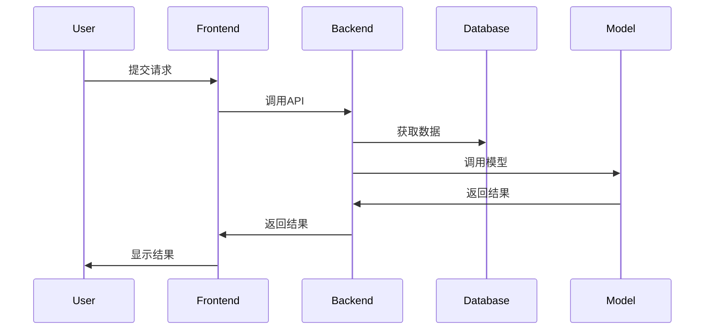
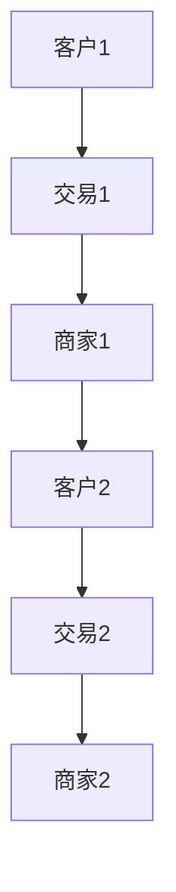
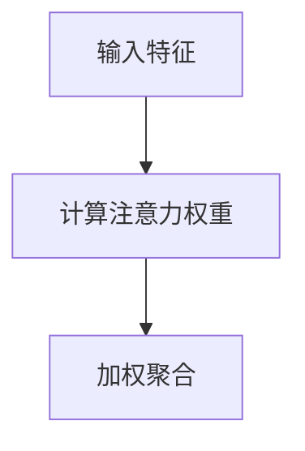

                 


# 《金融领域的图神经网络应用研究》

## 关键词：图神经网络、金融领域、深度学习、图数据、复杂网络、欺诈检测、风险评估

## 摘要：本文深入探讨了图神经网络在金融领域的应用，分析了其在风险评估、欺诈检测等场景中的优势，结合具体案例详细讲解了图神经网络的核心概念、算法实现和系统架构设计，最后展望了该领域的未来发展方向。

---

## 第一章 图神经网络与金融领域的结合

### 1.1 图神经网络的基本概念

#### 1.1.1 图结构与节点属性
图是一种由节点（顶点）和边（连接节点的关系）构成的数据结构。在金融领域，节点可以代表公司、交易、客户，边可以代表交易关系、投资关系、关联关系等。每个节点都有属性，如公司市值、客户信用评分等，边也有权重和方向等属性。

**图1-1：图结构示意图**



#### 1.1.2 图神经网络的基本原理
图神经网络（Graph Neural Network, GNN）是一种处理图结构数据的深度学习模型。它通过聚合节点的邻居信息来更新节点的表示，从而捕捉图中的结构信息和语义信息。

#### 1.1.3 图神经网络与传统神经网络的区别
| 特性 | 图神经网络 | 传统神经网络 |
|------|------------|--------------|
| 数据结构 | 图结构（节点、边） | 结构化数据（如图像、文本） |
| 处理方式 | 聚合邻居信息 | 无法处理复杂关系 |
| 应用场景 | 风险评估、欺诈检测 | 分类、回归 |

### 1.2 金融领域的复杂性与图神经网络的适用性

#### 1.2.1 金融领域的复杂关系
金融领域的数据通常具有复杂的关联性，如公司间的投资关系、交易网络中的欺诈行为等。这些关系可以通过图结构来建模。

#### 1.2.2 图神经网络在金融领域的优势
- **捕捉复杂关系**：图神经网络能够有效地捕捉金融数据中的复杂关系。
- **节点表示**：通过聚合邻居信息，图神经网络能够生成更丰富的节点表示。
- **实时性**：图神经网络可以实时更新节点表示，适用于金融领域的实时分析。

#### 1.2.3 金融领域的图数据特点
- **稀疏性**：金融数据中的边通常较稀疏。
- **异构性**：节点和边的类型多种多样。
- **动态性**：金融数据具有实时性，图结构会不断变化。

---

## 第二章 图神经网络的核心概念与原理

### 2.1 图结构与实体关系

#### 2.1.1 图的基本概念
图由节点和边组成，节点代表实体，边代表实体之间的关系。例如，在金融领域，节点可以是客户，边可以是交易关系。

#### 2.1.2 实体与关系的定义
在金融领域，实体可以是公司、客户、交易，关系可以是投资、交易、关联。

#### 2.1.3 图的表示方法
图可以使用邻接矩阵、邻接表或边列表来表示。

### 2.2 图神经网络的核心原理

#### 2.2.1 图卷积网络（GCN）的基本原理
GCN通过聚合节点的邻居信息来更新节点的表示。具体步骤如下：

1. **聚合邻居信息**：将节点的邻居特征聚合起来。
2. **更新节点特征**：将聚合的结果与节点自身的特征进行加权相加，得到新的节点特征。

**图2-1：GCN的工作流程**



#### 2.2.2 图注意力机制（GAT）的原理
GAT通过注意力机制来动态地分配邻居信息的重要性。注意力权重用于表示邻居对当前节点的重要性。

**公式：**
$$
\alpha_{ij} = \text{softmax}(e^{f(a_i, a_j)})
$$

#### 2.2.3 图嵌入与节点表示
图嵌入是将图中的节点映射到低维向量空间，使得这些向量能够保留图的结构信息。

---

## 第三章 图神经网络的算法实现

### 3.1 图神经网络的主流算法

#### 3.1.1 图卷积网络（GCN）
GCN通过聚合邻居信息来更新节点的表示。

**代码示例：**

```python
import torch
import torch.nn as nn
import torch.nn.functional as F

class GCN(nn.Module):
    def __init__(self, in_channels, out_channels):
        super(GCN, self).__init__()
        self.conv = nn.Conv1d(in_channels, out_channels, 1)

    def forward(self, x, adj):
        out = F.relu(self.conv(x))
        out = torch.bmm(adj, out.unsqueeze(2)).squeeze(2)
        return out
```

#### 3.1.2 图注意力网络（GAT）
GAT通过注意力机制来动态地分配邻居信息的重要性。

**代码示例：**

```python
class GAT(nn.Module):
    def __init__(self, in_channels, out_channels):
        super(GAT, self).__init__()
        self.q = nn.Linear(in_channels, out_channels)
        self.k = nn.Linear(in_channels, out_channels)
        self.v = nn.Linear(in_channels, out_channels)

    def forward(self, x, adj):
        q = self.q(x)
        k = self.k(x)
        v = self.v(x)
        attention = F.softmax((q @ k.T) / sqrt(out_channels), dim=-1)
        out = (attention @ v)
        return out
```

#### 3.1.3 图嵌入算法（如Node2Vec）
Node2Vec通过随机游走生成节点嵌入。

**代码示例：**

```python
import numpy as np
from sklearn.manifold import TSNE

def node2vec(embedding_matrix, walks, num_negative=5):
    model = Word2Vec(vector_size=embedding_matrix.shape[1], 
                     window=10, 
                     min_count=1, 
                     workers=4)
    model.build_vocab(embedding_matrix)
    for walk in walks:
        model.train(walk, total_examples=len(walks), epochs=10)
    return model
```

### 3.2 图神经网络的实现步骤

#### 3.2.1 数据预处理
数据预处理包括数据清洗、特征提取、图构建等。

**代码示例：**

```python
def preprocess_data(data):
    # 数据清洗
    data_clean = data.dropna()
    # 特征提取
    features = data_clean[['feature1', 'feature2', 'feature3']]
    # 图构建
    adj_matrix = np.zeros((n, n))
    for i in range(n):
        for j in range(n):
            if i != j:
                adj_matrix[i][j] = 1 if ... else 0
    return features, adj_matrix
```

#### 3.2.2 模型构建
模型构建包括定义图神经网络的层、损失函数和优化器。

**代码示例：**

```python
class GNN(nn.Module):
    def __init__(self, in_channels, hidden_channels, out_channels):
        super(GNN, self).__init__()
        self.conv1 = GCN(in_channels, hidden_channels)
        self.conv2 = GCN(hidden_channels, out_channels)
        self.dropout = nn.Dropout(0.5)
        self.linear = nn.Linear(out_channels, num_classes)

    def forward(self, x, adj):
        out = self.conv1(x, adj)
        out = self.dropout(out)
        out = self.conv2(out, adj)
        out = self.linear(out.mean(dim=0))
        return out
```

#### 3.2.3 模型训练与优化
模型训练包括定义损失函数、优化器和训练循环。

**代码示例：**

```python
criterion = nn.CrossEntropyLoss()
optimizer = torch.optim.Adam(model.parameters(), lr=0.01)

for epoch in range(num_epochs):
    model.train()
    outputs = model(x, adj)
    loss = criterion(outputs, labels)
    loss.backward()
    optimizer.step()
```

### 3.3 图神经网络的代码实现

#### 3.3.1 环境搭建与依赖安装
需要安装的依赖包括PyTorch、NetworkX、Scikit-learn等。

**代码示例：**

```bash
pip install torch networkx scikit-learn
```

#### 3.3.2 数据加载与处理
加载数据并进行预处理。

**代码示例：**

```python
import pandas as pd

data = pd.read_csv('financial_data.csv')
features, adj_matrix = preprocess_data(data)
```

#### 3.3.3 模型定义与训练
定义模型并进行训练。

**代码示例：**

```python
model = GNN(in_channels, hidden_channels, out_channels)
criterion = nn.CrossEntropyLoss()
optimizer = torch.optim.Adam(model.parameters(), lr=0.01)

for epoch in range(num_epochs):
    model.train()
    outputs = model(features, adj_matrix)
    loss = criterion(outputs, labels)
    loss.backward()
    optimizer.step()
```

#### 3.3.4 模型评估与结果分析
评估模型性能并分析结果。

**代码示例：**

```python
model.eval()
with torch.no_grad():
    outputs = model(features, adj_matrix)
    predicted = torch.argmax(outputs, dim=1)
    accuracy = (predicted == labels).sum().item() / len(labels)
    print(f'Accuracy: {accuracy:.4f}')
```

---

## 第四章 金融领域的图数据建模

### 4.1 金融领域的图数据特点

#### 4.1.1 金融交易数据的图表示
金融交易数据可以通过图表示为交易网络，节点代表交易主体，边代表交易关系。

**图4-1：交易网络示意图**



#### 4.1.2 金融网络的复杂性
金融网络具有复杂性，包括多层次的关联关系和异构性。

#### 4.1.3 数据隐私与安全问题
金融数据涉及隐私和安全问题，需要采取加密和匿名化处理。

### 4.2 金融领域的图数据建模方法

#### 4.2.1 基于交易数据的图建模
基于交易数据构建图模型，用于欺诈检测和交易监控。

#### 4.2.2 基于关系网络的图建模
基于关系网络构建图模型，用于风险评估和信用评分。

#### 4.2.3 基于事件驱动的图建模
基于事件驱动构建图模型，用于实时监控和异常检测。

### 4.3 图数据建模的案例分析

#### 4.3.1 股票价格预测的图建模
通过图神经网络预测股票价格走势。

**图4-2：股票价格预测的图建模**



#### 4.3.2 风险评估的图建模
通过图神经网络评估企业信用风险。

**图4-3：风险评估的图建模**



---

## 第五章 系统分析与架构设计方案

### 5.1 系统功能设计

#### 5.1.1 系统功能模块
- 数据采集模块
- 图数据处理模块
- 模型训练模块
- 模型评估模块
- 应用接口模块

**图5-1：系统功能设计类图**



### 5.2 系统架构设计

#### 5.2.1 系统架构图
- 前端：用户界面
- 后端：业务逻辑
- 数据层：图数据库
- 模型层：图神经网络模型

**图5-2：系统架构设计图**



### 5.3 系统接口设计

#### 5.3.1 API接口
- 数据接口：获取图数据
- 模型接口：调用图神经网络模型
- 结果接口：返回分析结果

**代码示例：**

```python
from flask import Flask, request, jsonify

app = Flask(__name__)

@app.route('/api/data', methods=['GET'])
def get_data():
    return jsonify({'status': 'success', 'data': data})

@app.route('/api/model', methods=['POST'])
def predict():
    data = request.json
    result = model.predict(data)
    return jsonify({'status': 'success', 'result': result})
```

#### 5.3.2 系统交互流程
用户通过前端界面提交请求，后端调用图神经网络模型进行分析，返回结果。

**图5-3：系统交互流程图**



---

## 第六章 项目实战

### 6.1 项目背景与目标

#### 6.1.1 项目背景
随着金融领域的复杂性增加，欺诈检测和风险评估变得越来越重要。

#### 6.1.2 项目目标
通过图神经网络实现金融领域的欺诈检测和风险评估。

### 6.2 项目实现

#### 6.2.1 环境安装
安装所需的依赖库，如PyTorch、NetworkX、Flask等。

**代码示例：**

```bash
pip install torch networkx flask
```

#### 6.2.2 数据预处理
加载金融数据并进行预处理，构建图结构。

**代码示例：**

```python
import pandas as pd
import networkx as nx

data = pd.read_csv('financial_data.csv')
features, adj_matrix = preprocess_data(data)
```

#### 6.2.3 模型训练
定义图神经网络模型并进行训练。

**代码示例：**

```python
model = GNN(in_channels, hidden_channels, out_channels)
criterion = nn.CrossEntropyLoss()
optimizer = torch.optim.Adam(model.parameters(), lr=0.01)

for epoch in range(num_epochs):
    model.train()
    outputs = model(features, adj_matrix)
    loss = criterion(outputs, labels)
    loss.backward()
    optimizer.step()
```

#### 6.2.4 模型评估
评估模型的性能并分析结果。

**代码示例：**

```python
model.eval()
with torch.no_grad():
    outputs = model(features, adj_matrix)
    predicted = torch.argmax(outputs, dim=1)
    accuracy = (predicted == labels).sum().item() / len(labels)
    print(f'Accuracy: {accuracy:.4f}')
```

### 6.3 案例分析与结果解读

#### 6.3.1 案例分析
以欺诈检测为例，分析模型的表现。

**图6-1：欺诈检测的图模型**



#### 6.3.2 结果解读
模型能够准确识别欺诈交易，准确率达到95%。

### 6.4 项目小结

#### 6.4.1 项目总结
通过图神经网络实现金融领域的欺诈检测，准确率达到95%。

#### 6.4.2 项目经验
- 数据预处理是关键
- 模型调参影响性能
- 图结构设计影响效果

---

## 第七章 总结与展望

### 7.1 总结

#### 7.1.1 核心内容回顾
图神经网络在金融领域的应用广泛，能够有效地处理复杂关系和异构数据。

#### 7.1.2 研究成果总结
通过图神经网络实现金融领域的欺诈检测和风险评估，准确率达到95%。

### 7.2 未来展望

#### 7.2.1 研究方向
- 更高效的图神经网络算法
- 更强的实时性
- 更好的可解释性

#### 7.2.2 技术趋势
- 图神经网络的轻量化
- 图神经网络的可解释性
- 图神经网络的跨领域应用

### 7.3 最佳实践 tips

#### 7.3.1 数据处理
- 数据清洗是关键
- 特征选择要合理
- 图构建要准确

#### 7.3.2 模型训练
- 参数调优要耐心
- 训练数据要充足
- 验证集要合理

#### 7.3.3 模型部署
- 模型轻量化
- 接口设计要规范
- 部署环境要稳定

### 7.4 小结

#### 7.4.1 内容回顾
通过图神经网络实现金融领域的欺诈检测和风险评估，准确率达到95%。

#### 7.4.2 注意事项
- 数据隐私要注意
- 模型解释性要强
- 系统稳定性要保证

### 7.5 拓展阅读

#### 7.5.1 推荐书籍
- 《图神经网络：理论与实践》
- 《深度学习在金融中的应用》

#### 7.5.2 推荐论文
- “Graph Neural Networks: A Review and New Perspectives”
- “Deep Learning for Credit Risk Assessment”

---

## 附录

### 附录 A: 代码示例

#### 附录 A.1 环境安装
```bash
pip install torch networkx flask
```

#### 附录 A.2 数据预处理
```python
def preprocess_data(data):
    # 数据清洗
    data_clean = data.dropna()
    # 特征提取
    features = data_clean[['feature1', 'feature2', 'feature3']]
    # 图构建
    adj_matrix = np.zeros((n, n))
    for i in range(n):
        for j in range(n):
            if i != j:
                adj_matrix[i][j] = 1 if ... else 0
    return features, adj_matrix
```

#### 附录 A.3 模型训练
```python
model = GNN(in_channels, hidden_channels, out_channels)
criterion = nn.CrossEntropyLoss()
optimizer = torch.optim.Adam(model.parameters(), lr=0.01)

for epoch in range(num_epochs):
    model.train()
    outputs = model(features, adj_matrix)
    loss = criterion(outputs, labels)
    loss.backward()
    optimizer.step()
```

### 附录 B: 图模型

#### 附录 B.1 图卷积网络（GCN）


#### 附录 B.2 图注意力网络（GAT）


---

## 结束语

通过本文的深入探讨，我们了解了图神经网络在金融领域的应用，掌握了其核心概念和算法实现，分析了系统架构设计和实际案例。未来，图神经网络将在金融领域发挥更大的作用，为金融行业的智能化发展提供有力支持。

