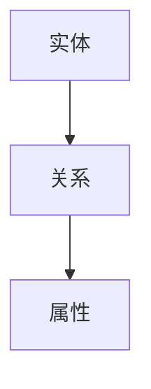

                 


# 《金融领域知识图谱的构建与应用》

> 关键词：知识图谱、金融领域、自然语言处理、深度学习、图数据库

> 摘要：本文详细探讨了在金融领域构建知识图谱的核心概念、构建方法、系统架构以及实际应用场景。通过分析知识图谱在金融领域的独特价值，结合具体案例，展示了如何利用先进的自然语言处理和深度学习技术，构建高效的知识图谱，并为金融领域的智能化应用提供有力支持。

---

## 第1章：知识图谱概述

### 1.1 知识图谱的基本概念

知识图谱是一种以图结构形式表示知识的语义网络，由实体（Entity）、关系（Relation）和属性（Attribute）组成，用于描述真实世界中的概念及其关系。

#### 1.1.1 知识图谱的定义与特点

知识图谱通过结构化的形式将分散在不同数据源中的信息整合起来，形成一个统一的知识网络。其特点包括：

- **结构化**：实体、关系和属性都具有明确的语义定义。
- **语义丰富**：通过关系和属性描述实体之间的复杂联系。
- **可扩展性**：支持动态更新和扩展，适应数据的实时变化。
- **语义网络**：基于图结构，能够表示复杂的语义关系。

#### 1.1.2 金融领域的特殊性

金融领域的知识图谱构建具有以下特殊性：

- **数据多样性**：涵盖股票、债券、基金等多种金融产品。
- **实体复杂性**：包括公司、机构、个人等多种实体类型。
- **关系多样性**：涉及投资关系、控股关系、交易关系等复杂关系。

#### 1.1.3 构建知识图谱的必要性

在金融领域，构建知识图谱可以帮助金融机构实现知识的系统化管理，提高数据的利用效率，支持智能投顾、风险控制等应用场景。

---

### 1.2 金融领域的知识图谱构建背景

#### 1.2.1 金融领域的复杂性与知识需求

金融领域的复杂性主要体现在以下几个方面：

- **产品多样性**：金融产品种类繁多，包括股票、债券、基金、保险等。
- **市场参与者多样性**：包括公司、机构、个人等不同类型的参与者。
- **关系复杂性**：涉及投资、控股、交易等多种关系。

#### 1.2.2 知识图谱在金融领域的应用价值

知识图谱在金融领域的应用价值主要体现在以下几个方面：

- **智能投顾**：基于知识图谱提供个性化的投资建议。
- **风险控制**：通过分析实体之间的关系，识别潜在的金融风险。
- **市场分析**：利用知识图谱进行市场趋势分析和预测。

#### 1.2.3 当前金融领域的知识管理挑战

当前金融领域的知识管理面临以下挑战：

- **数据孤岛**：不同部门或机构之间的数据无法有效整合。
- **数据异构性**：数据来源多样，格式和语义不统一。
- **知识更新滞后**：知识图谱的构建和更新速度难以满足业务需求。

---

## 第2章：知识图谱的核心概念与构建方法

### 2.1 知识图谱的核心概念

#### 2.1.1 实体与实体类型

**实体**是知识图谱的基本组成单位，可以是具体的金融产品、机构、个人等。**实体类型**是对实体的分类，例如公司、基金、股票等。

#### 2.1.2 实体之间的关系

**关系**描述了实体之间的关联，例如“某公司控股某基金”。关系可以是二元关系或多元关系。

#### 2.1.3 实体的属性与值

**属性**是对实体的描述，例如“基金的风险等级”，**值**是属性的具体取值，例如“低风险”。

#### 2.1.4 实体、关系和属性的关系图

使用mermaid绘制实体、关系和属性的关系图：



### 2.2 知识图谱的构建方法

#### 2.2.1 数据采集与预处理

**数据采集**：从多种数据源（如新闻、财报、公告等）获取金融领域的文本数据。

**数据预处理**：包括分词、去停用词、实体识别等步骤。

#### 2.2.2 实体识别与链接

**实体识别**：使用命名实体识别（NER）技术，从文本中提取实体。

**实体链接**：将识别出的实体映射到知识图谱中的唯一标识。

#### 2.2.3 关系抽取与属性提取

**关系抽取**：基于自然语言处理技术，从文本中抽取实体之间的关系。

**属性提取**：提取实体的属性值。

---

## 第3章：知识图谱构建的算法与技术

### 3.1 命名实体识别（NER）

#### 3.1.1 基于规则的NER方法

基于规则的NER方法通过预定义的规则和模式匹配文本中的实体。

**示例代码**：

```python
import re

text = "中国平安是一家大型金融公司。"
pattern = r'\b[A-Z][a-z]+'
matches = re.findall(pattern, text)
print(matches)  # 输出：['平安']
```

#### 3.1.2 统计模型与深度学习模型

常用的统计模型包括CRF（条件随机场），深度学习模型包括LSTM和BERT。

**使用BERT进行NER的示例代码**：

```python
from transformers import BertTokenizer, BertModel

tokenizer = BertTokenizer.from_pretrained('bert-base-uncased')
model = BertModel.from_pretrained('bert-base-uncased')

text = "中国平安是中国最大的保险公司之一。"
inputs = tokenizer.encode_plus(text, return_tensors='pt', padding=True, truncation=True)
outputs = model(**inputs)
```

#### 3.1.3 金融领域NER的特殊性与优化

金融领域的NER需要处理专有名词和复杂句式。优化方法包括领域定制化预训练模型和规则优化。

---

## 第4章：知识图谱在金融领域的应用

### 4.1 金融知识图谱的构建场景

#### 4.1.1 金融机构的知识管理

通过知识图谱实现金融机构的知识共享和管理。

#### 4.1.2 金融产品与服务的知识建模

构建金融产品的知识图谱，支持产品的推荐和管理。

#### 4.1.3 金融市场与经济指标的关系建模

分析金融市场中各实体之间的关系，支持市场趋势分析。

---

## 第5章：知识图谱构建的系统架构与实现

### 5.1 系统功能设计

#### 5.1.1 数据采集模块

从多种数据源采集金融领域的文本数据。

#### 5.1.2 数据处理模块

对采集的数据进行分词、实体识别等预处理。

#### 5.1.3 知识抽取与构建模块

从处理后的数据中抽取实体、关系和属性，构建知识图谱。

#### 5.1.4 知识图谱存储与管理模块

将构建的知识图谱存储在图数据库中，支持高效的查询和更新。

#### 5.1.5 知识图谱的应用接口

提供API接口，支持其他系统调用知识图谱进行应用开发。

---

## 第6章：项目实战

### 6.1 环境安装

安装必要的Python库：

```bash
pip install numpy pandas spacy transformers networkx
```

### 6.2 系统核心实现源代码

#### 6.2.1 数据预处理代码

```python
import spacy

nlp = spacy.load('zh_core_web_sm')
text = "中国平安是中国最大的保险公司之一。"
doc = nlp(text)
entities = [(ent.text, ent.label_) for ent in doc.ents]
print(entities)  # 输出：[('中国平安', 'ORG')]
```

#### 6.2.2 知识图谱构建代码

```python
from networkx import Graph

graph = Graph()
graph.add_nodes_from(['中国平安', '保险公司', '中国'])
graph.add_edges_from([('中国平安', '保险公司'), ('中国', '保险公司')])
```

---

## 第7章：最佳实践与总结

### 7.1 小结

知识图谱在金融领域的应用前景广阔，能够为金融机构提供强有力的知识支持。

### 7.2 注意事项

- 数据质量直接影响知识图谱的准确性。
- 知识图谱的构建需要结合具体业务需求。
- 知识图谱的更新和维护需要持续投入。

### 7.3 拓展阅读

建议阅读相关书籍和论文，深入了解知识图谱的前沿技术和发展趋势。

---

通过以上章节的详细讲解，我们系统地探讨了金融领域知识图谱的构建与应用，为实际应用提供了理论和实践指导。

