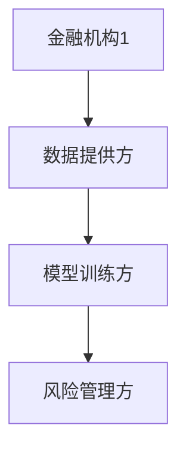
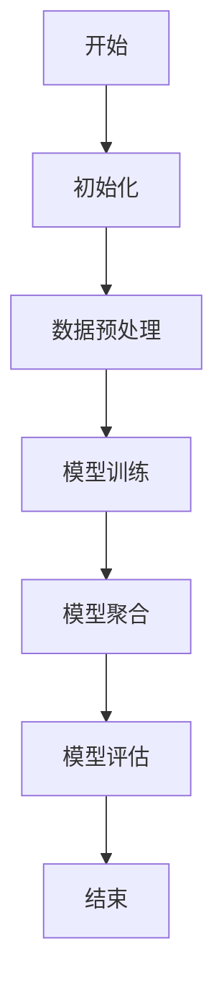
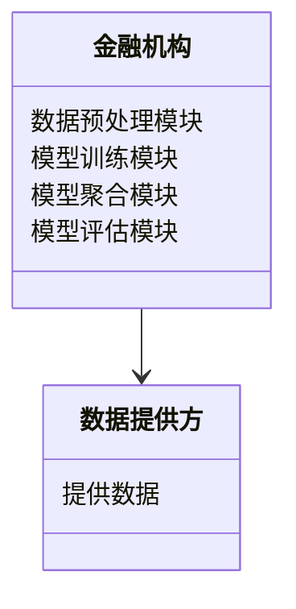
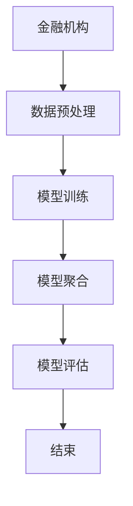

                 


# 《金融领域联邦学习在跨机构信用评分与风险管理中的应用》

## 关键词：
- 联邦学习
- 信用评分
- 风险管理
- 数据隐私
- 跨机构合作
- 机器学习

## 摘要：
本文深入探讨了联邦学习在金融领域的应用，特别是信用评分和风险管理中的跨机构合作。通过分析联邦学习的核心原理、算法实现、系统架构以及实际案例，本文展示了如何在保护数据隐私的前提下，提升模型的准确性和泛化能力。文章内容包括背景介绍、核心概念、算法原理、系统设计、项目实战和最佳实践，为读者提供全面的指导。

---

## 第一部分: 背景介绍

### 第1章: 联邦学习与金融领域的结合

#### 1.1 联邦学习的背景与概念
##### 1.1.1 数据隐私保护的重要性
在金融领域，数据隐私是核心问题。金融机构处理大量敏感信息，如交易记录和客户资料，这些数据的泄露可能导致严重的经济损失和声誉损害。传统的数据共享方法面临合规性和隐私保护的挑战，而联邦学习通过在不共享数据的情况下训练模型，解决了这一难题。

##### 1.1.2 联邦学习的定义与特点
联邦学习（Federated Learning）是一种分布式机器学习技术，允许多个参与方在不共享原始数据的情况下联合训练模型。其特点包括数据本地性、通信效率和隐私保护。联邦学习的核心是通过交换模型参数而非数据，实现全局模型的优化。

##### 1.1.3 联邦学习在金融领域的应用前景
金融领域的信用评分和风险管理高度依赖数据，但单个机构的数据量有限，模型泛化能力不足。通过联邦学习，多个金融机构可以合作训练更准确的模型，同时保护各自的客户数据。这种模式在提升风险控制能力的同时，也促进了行业协作。

#### 1.2 信用评分与风险管理的挑战
##### 1.2.1 传统信用评分的局限性
传统信用评分主要依赖单个机构的数据，模型的泛化能力有限。此外，数据孤岛问题导致金融机构难以充分利用行业数据，影响评分的准确性。

##### 1.2.2 跨机构数据共享的难点
数据隐私和合规性问题是跨机构合作的主要障碍。金融机构通常不愿共享客户数据，担心违反隐私保护法规或引发客户信任问题。

##### 1.2.3 联邦学习如何解决这些问题
联邦学习通过在模型层面进行协作，避免了直接共享数据。金融机构可以在保护客户隐私的前提下，共同训练更准确的信用评分模型，提升风险管理能力。

---

## 第二部分: 核心概念与联系

### 第2章: 联邦学习的核心概念与联系

#### 2.1 联邦学习的核心原理
##### 2.1.1 数据隐私保护机制
联邦学习通过加密技术和差分隐私，确保数据在传输和处理过程中的安全性。每个参与方仅分享模型更新参数，而不是原始数据，有效防止数据泄露。

##### 2.1.2 模型训练过程
联邦学习包括本地训练和全局聚合两个阶段。在本地训练阶段，每个参与方使用自己的数据训练模型；在全局聚合阶段，各方将模型参数上传到中心服务器，进行模型更新。

##### 2.1.3 联邦学习与其他分布式学习方法的对比
与其他方法相比，联邦学习的优势在于数据隐私保护和分布式计算能力。其独特性在于模型参数的共享方式，避免了数据的直接传输。

#### 2.2 联邦学习的实体关系图
通过Mermaid图展示联邦学习中的实体关系：

该图展示了金融机构、数据提供方、模型训练方和风险管理方之间的协作关系。

#### 2.3 联邦学习的算法流程图
展示联邦学习的算法流程：

该图详细描述了联邦学习的每个步骤，从数据预处理到模型评估。

---

## 第三部分: 算法原理讲解

### 第3章: 联邦学习的算法原理

#### 3.1 联邦平均算法
##### 3.1.1 算法流程
联邦平均算法通过迭代更新模型参数，实现全局模型的优化。每个参与方在本地训练模型后，将参数上传到中心服务器，服务器对参数进行平均，生成新的全局模型。

##### 3.1.2 参数更新公式
模型参数的更新公式为：
$$\theta_{t+1} = \frac{1}{n}\sum_{i=1}^{n}\theta_{t}^{(i)}$$
其中，n是参与机构的数量，θ_t^{(i)}是第i个机构的模型参数，θ_{t+1}是更新后的全局模型参数。

#### 3.2 横向联邦与纵向联邦的对比
##### 3.2.1 横向联邦的实现
横向联邦适用于特征相同的场景，各方共享相同的特征空间，通过水平分割数据进行训练。例如，多个银行共享客户交易记录，但不共享客户身份信息。

##### 3.2.2 纵向联邦的实现
纵向联邦适用于特征不同的场景，各方通过垂直分割数据进行训练。例如，不同金融机构共享部分客户特征，如收入、信用历史等。

##### 3.2.3 两种方法的优缺点
横向联邦和纵向联邦各有优缺点，横向联邦适合数据分布均匀的场景，纵向联邦适合数据分布不均匀的场景。

#### 3.3 防止数据泄露的机制
##### 3.3.1 差分隐私技术
通过在模型参数中添加噪声，确保单个样本对全局模型的影响可忽略，从而保护数据隐私。

##### 3.3.2 同态加密技术
允许对加密数据进行计算，确保数据在传输和处理过程中的安全性。

##### 3.3.3 两者对比与应用
差分隐私适用于模型参数共享，而同态加密适用于数据加密计算。两者各有优劣，需根据具体场景选择。

---

## 第四部分: 系统分析与架构设计

### 第4章: 系统架构设计方案

#### 4.1 系统功能设计
##### 4.1.1 数据预处理模块
负责对各参与方的数据进行清洗、归一化等预处理，确保数据格式一致。

##### 4.1.2 模型训练模块
在本地训练模型，生成模型参数更新请求。

##### 4.1.3 模型聚合模块
将各参与方的模型参数进行聚合，生成全局模型。

##### 4.1.4 模型评估模块
评估全局模型的性能，确保模型准确性和稳定性。

#### 4.2 系统架构图
展示系统架构的类图：

该图展示了金融机构与数据提供方之间的协作关系。

#### 4.3 系统交互流程图
展示系统交互的流程：

该图详细描述了系统从数据预处理到模型评估的交互流程。

---

## 第五部分: 项目实战

### 第5章: 项目实战

#### 5.1 环境安装
需要安装的工具包括Python、TensorFlow Federated和Keras。代码示例如下：
```bash
pip install tensorflow-federated
pip install keras
```

#### 5.2 核心算法实现
以下是联邦平均算法的Python代码示例：
```python
import tensorflow as tf
import tensorflow_federated as tff

# 定义模型
model = tf.keras.Sequential([
    tf.keras.layers.Dense(128, activation='relu'),
    tf.keras.layers.Dense(10, activation='softmax')
])
model.compile(optimizer='adam', loss='sparse_categorical_crossentropy', metrics=['accuracy'])

# 初始化联邦学习过程
fed_avg = tff.federated_averaging_strategy()

# 迭代训练
num_rounds = 10
for _ in range(num_rounds):
    # 进行一次联邦平均
    model = fed_avg(model, clients)
```

#### 5.3 代码解读与分析
代码通过TensorFlow Federated库实现了联邦平均算法。首先定义本地模型，然后初始化联邦学习策略，最后进行多轮迭代训练，生成全局模型。

#### 5.4 实际案例分析
通过一个案例，展示联邦学习如何应用于信用评分。例如，五个银行合作训练信用评分模型，提升模型的准确性和泛化能力。

#### 5.5 项目小结
总结项目实现的关键点，包括环境搭建、算法实现、案例分析等。

---

## 第六部分: 最佳实践

### 第6章: 最佳实践

#### 6.1 项目总结
回顾文章内容，强调联邦学习在金融领域的应用价值。

#### 6.2 实践中的注意事项
- 数据预处理的重要性
- 模型评估的必要性
- 数据隐私保护的技术选择

#### 6.3 未来研究方向
- 更高效的联邦学习算法
- 更强的隐私保护技术
- 联邦学习在更多金融场景中的应用

---

## 参考文献
[1] TensorFlow Federated Documentation  
[2] 联邦学习：隐私保护下的分布式机器学习  
[3] 信用评分与风险管理的相关文献  

---

通过以上结构和内容，读者可以系统地了解联邦学习在金融领域的应用，从理论到实践，全面掌握其在信用评分和风险管理中的价值和实现方法。

