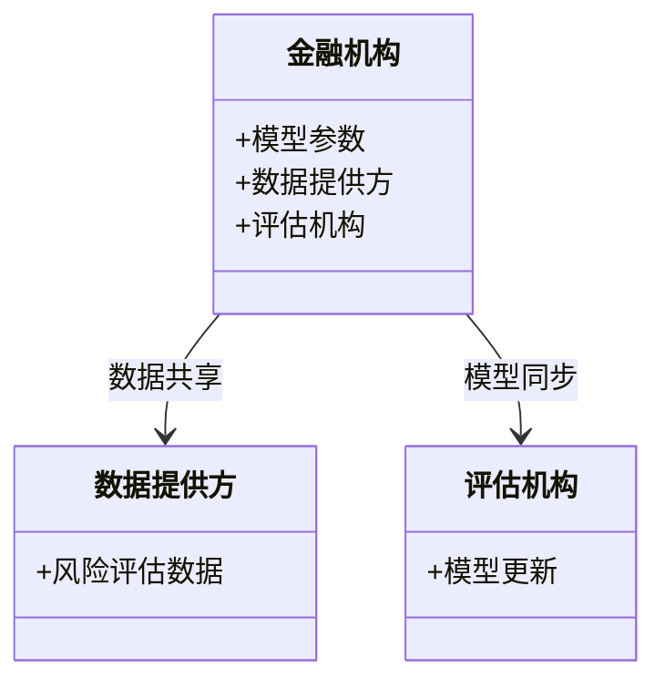
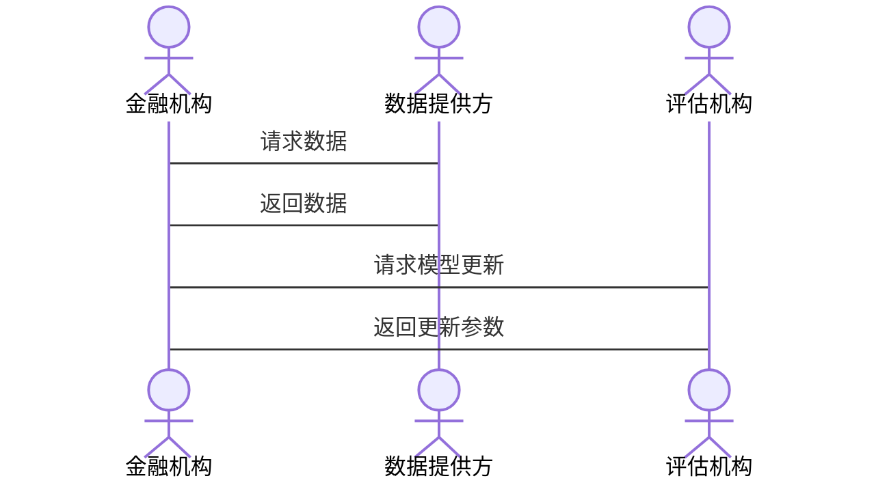

                 


好的，我将按照您的要求，以《金融领域联邦学习在跨机构风险评估中的应用》为标题，撰写一篇结构清晰、内容详实的技术博客文章。以下是文章的完整内容：

---

# 金融领域联邦学习在跨机构风险评估中的应用

> **关键词**：联邦学习、跨机构、风险评估、数据隐私、人工智能  
> **摘要**：本文详细探讨了联邦学习在金融领域跨机构风险评估中的应用，分析了联邦学习的核心概念、算法原理、系统架构设计以及实际项目实现。通过理论与实践相结合的方式，本文为金融机构在数据隐私保护的前提下，实现高效协同的风险评估提供了可行的解决方案。

---

## 第一部分: 背景介绍

### 第1章: 联邦学习与跨机构风险评估概述

#### 1.1 联邦学习的基本概念
- **联邦学习的定义**：联邦学习（Federated Learning）是一种分布式机器学习技术，允许多个机构在不共享原始数据的前提下，共同训练一个共享的模型。
- **联邦学习的核心特点**：
  - 数据隐私性：数据不出域，仅传输模型更新参数。
  - 跨机构协作：多个机构协同训练模型，实现共同目标。
  - 去中心化：避免单点机构的中心化控制。
- **联邦学习与传统数据共享的区别**：
  | 特性 | 联邦学习 | 传统数据共享 |
  |------|----------|--------------|
  | 数据传输 | 仅传输模型参数 | 传输原始数据 |
  | 数据隐私 | 高 | 低 |
  | 协作性 | 高 | 中 |

#### 1.2 跨机构风险评估的背景与挑战
- **金融机构间的协同需求**：金融机构需要通过跨机构数据协作，提升风险评估的准确性和全面性。
- **数据孤岛问题**：由于数据隐私和安全的限制，金融机构之间的数据难以有效共享。
- **跨机构风险评估的难点**：
  - 数据分布不均匀：不同机构的数据分布可能存在偏差。
  - 模型收敛性：跨机构模型训练的收敛性和稳定性需要优化。
  - 安全与隐私：确保数据在传输和计算过程中的安全性。

#### 1.3 金融领域中的联邦学习应用
- **信用评估**：通过联邦学习，多个金融机构可以共同训练信用评估模型，提升模型的泛化能力。
- **欺诈检测**：跨机构共享欺诈特征，提升欺诈检测的准确性和实时性。
- **市场风险评估**：通过联邦学习，整合多个机构的市场数据，构建更全面的市场风险评估模型。

### 1.2 联邦学习的核心概念与联系

#### 1.2.1 联邦学习的原理
- **联邦学习的通信机制**：通过安全通道传输模型更新参数，确保数据隐私。
- **联邦学习的同步与异步模式**：
  - 同步模式：所有参与机构同时更新模型，同步最新的模型参数。
  - 异步模式：机构在不同时间更新模型，减少通信开销。
- **联邦学习的安全与隐私保护**：
  - 数据加密：采用加密技术保护传输数据。
  - 差分隐私：在模型更新中加入噪声，防止数据泄露。

#### 1.2.2 联邦学习的核心要素
- **数据分布**：不同机构的数据分布可能不同，需要设计分布式训练策略。
- **模型同步**：通过参数更新实现模型同步，确保所有机构模型的一致性。
- **权重更新**：采用加权平均的方式，根据机构的数据量或重要性调整权重。

#### 1.2.3 联邦学习的ER实体关系图
```mermaid
er
    actor(金融机构)
    actor(数据提供方)
    actor(评估机构)
    database(风险评估数据)
    database(模型参数)
    relationship(数据共享)
    relationship(模型同步)
```

---

## 第二部分: 算法原理讲解

### 第3章: 联邦学习的算法原理

#### 3.1 联邦学习的数学模型
- **联邦平均（FedAvg）**：将各机构的模型参数按权重平均，得到全局模型。
  $$ w_{t+1} = \frac{1}{n}\sum_{i=1}^{n}w_i^{(t)} $$
- **联邦梯度下降（FedGD）**：采用梯度下降的方式更新模型参数。
  $$ w_{t+1} = w_t - \eta \cdot g_t $$
- **联邦直推（FedProx）**：在参数更新中加入正则化项，防止参数漂移。

#### 3.2 联邦学习的优化算法
- **联邦Adam优化器**：结合Adam优化算法，适用于非IID数据分布。
- **联邦SGD优化器**：适用于数据分布均匀的场景。
- **联邦Nesterov加速器**：通过动量加速模型收敛。

#### 3.3 联邦学习的收敛性分析
- **收敛条件**：模型收敛需要满足数据分布一致性和参数更新步长合理。
- **收敛速度**：非IID数据分布可能导致收敛速度变慢。
- **稳定性分析**：模型更新过程中需要防止参数漂移，确保模型稳定。

#### 3.4 联邦学习的数学公式
- 联邦平均（FedAvg）的数学表达式：
  $$ w_{t+1} = \frac{1}{n}\sum_{i=1}^{n}w_i^{(t)} $$

---

## 第三部分: 系统分析与架构设计

### 第4章: 系统分析与架构设计方案

#### 4.1 问题场景介绍
- **场景描述**：金融机构需要在不共享原始数据的前提下，共同训练风险评估模型。
- **项目介绍**：设计一个基于联邦学习的跨机构风险评估系统。

#### 4.2 系统功能设计
- **领域模型（类图）**：


- **系统架构设计（架构图）**：


- **系统接口设计**：
  - 数据提供方接口：接收数据输入，返回数据更新。
  - 模型同步接口：接收模型参数，返回更新后的参数。
  - 评估机构接口：接收模型更新请求，返回评估结果。

- **系统交互（序列图）**：


---

## 第四部分: 项目实战

### 第5章: 项目实战

#### 5.1 环境安装
- **安装依赖**：安装TensorFlow、Keras、Flask等库。
- **环境配置**：配置虚拟环境，安装必要的开发工具。

#### 5.2 系统核心实现源代码
- **模型训练代码**：
```python
import tensorflow as tf
from tensorflow.keras import layers

class FedModel(tf.keras.Model):
    def __init__(self):
        super(FedModel, self).__init__()
        self.dense1 = layers.Dense(64, activation='relu')
        self.dense2 = layers.Dense(32, activation='relu')
        self.dense3 = layers.Dense(1, activation='sigmoid')

    def call(self, inputs):
        x = self.dense1(inputs)
        x = self.dense2(x)
        x = self.dense3(x)
        return x

# 初始化模型
model = FedModel()
model.compile(optimizer='adam', loss='binary_crossentropy', metrics=['accuracy'])
```

- **模型更新代码**：
```python
def model_update(model, data, epochs=1, batch_size=32):
    model.fit(data, epochs=epochs, batch_size=batch_size, verbose=0)
    return model.get_weights()
```

- **参数同步代码**：
```python
def model_sync(model, weights):
    model.set_weights(weights)
```

#### 5.3 代码应用解读与分析
- **模型训练**：使用TensorFlow构建联邦学习模型，训练模型参数。
- **模型更新**：在本地数据上更新模型参数，确保数据隐私。
- **参数同步**：将更新后的模型参数同步到其他机构，实现模型协作。

#### 5.4 实际案例分析
- **案例背景**：假设三个金融机构合作训练信用评估模型。
- **训练过程**：
  1. 每个机构在本地数据上训练模型，更新模型参数。
  2. 各机构将模型参数同步到中心服务器。
  3. 中心服务器计算全局模型参数，下发到各机构。
  4. 重复训练过程，直到模型收敛。

#### 5.5 项目小结
- **项目总结**：通过联邦学习实现跨机构风险评估，确保数据隐私和模型协作。
- **项目意义**：为金融机构提供一种高效、安全的协同训练方式。

---

## 第五部分: 扩展与挑战

### 第6章: 扩展与挑战

#### 6.1 联邦学习的扩展方向
- **异构数据处理**：解决不同机构数据格式和分布差异的问题。
- **动态参与机构**：支持机构的动态加入和退出。
- **模型解释性**：提升联邦学习模型的可解释性。

#### 6.2 联邦学习的挑战
- **通信开销**：大规模机构参与可能导致通信成本过高。
- **数据分布**：非IID数据分布可能影响模型性能。
- **安全威胁**：数据传输过程中可能面临的安全攻击。

---

## 第六部分: 最佳实践与小结

### 第7章: 最佳实践与小结

#### 7.1 最佳实践 tips
- **数据预处理**：确保各机构数据格式一致，便于模型训练。
- **模型优化**：根据数据分布选择合适的优化算法。
- **安全防护**：采用加密和差分隐私技术，确保数据安全。

#### 7.2 小结
- **总结**：联邦学习为跨机构风险评估提供了一种高效、安全的解决方案。
- **未来展望**：随着技术进步，联邦学习将在金融领域发挥更大的作用。

#### 7.3 注意事项
- **数据隐私**：确保数据在传输和计算过程中不被泄露。
- **模型收敛**：合理设置模型参数，确保模型快速收敛。
- **通信效率**：优化通信机制，降低通信开销。

#### 7.4 拓展阅读
- 推荐阅读《Federated Learning: Challenges, Methods, and Applications》。

---

通过以上详细的内容，您可以看到，联邦学习在金融领域跨机构风险评估中的应用具有广阔前景。通过理论与实践相结合的方式，联邦学习为金融机构提供了高效、安全的协同训练方式，解决了数据隐私和数据孤岛问题，同时提升了风险评估的准确性和全面性。

