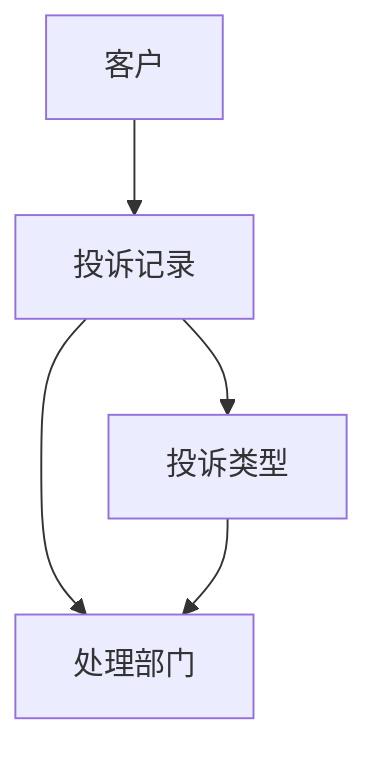
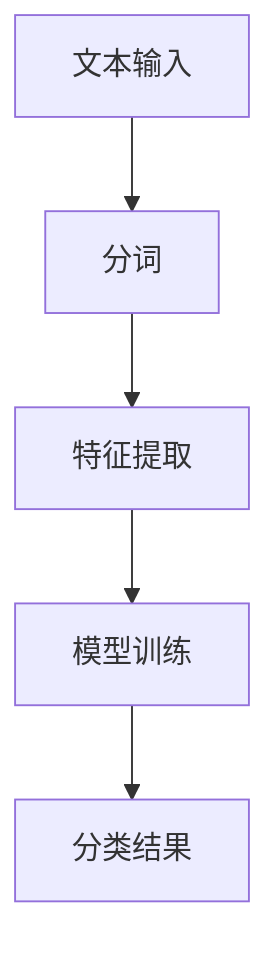

                 


# 《金融领域自然语言处理在客户投诉分类中的应用》

> 关键词：自然语言处理、客户投诉分类、金融文本挖掘、深度学习、文本分类

> 摘要：本文详细探讨了自然语言处理技术在金融客户投诉分类中的应用，从问题背景、核心概念到算法原理、系统设计，再到项目实战和最佳实践，系统性地分析了如何利用NLP技术提升金融客户投诉处理的效率和准确性。文章通过丰富的案例分析和详细的代码实现，为读者提供了一个完整的解决方案。

---

## 第一部分: 背景介绍

### 第1章: 金融领域客户投诉分类的背景与问题

#### 1.1 问题背景
金融行业作为信息密集型行业，每天都会收到大量客户的投诉和反馈。这些投诉内容通常涉及产品、服务、交易等多个方面，如何高效准确地分类这些投诉，对于提升客户满意度、优化业务流程具有重要意义。传统的分类方法依赖人工处理，效率低下且容易出错，因此亟需引入自动化技术。

#### 1.2 问题描述
客户投诉分类的目标是将不同类型的投诉文本自动归类到预定义的类别中。投诉文本的特点包括：文本长度不一、专业术语较多、情感色彩丰富、可能存在模糊表达等。这些特点使得传统的规则-based方法难以应对复杂的分类需求。

#### 1.3 问题解决
自然语言处理技术，尤其是文本分类算法，能够有效处理这些问题。通过提取文本中的关键词、句式结构等特征，结合机器学习或深度学习模型，可以实现自动分类。这种数据驱动的方法不仅提高了分类效率，还能发现潜在的模式和规律。

#### 1.4 边界与外延
投诉分类的边界包括仅处理明确的投诉内容，不涉及其他类型的信息。与类似问题（如情感分析、实体识别）的区分在于分类目标的不同。技术的可扩展性体现在可以根据新数据不断优化模型，但其局限性在于依赖高质量的数据和模型的泛化能力。

---

### 第2章: 核心概念与联系

#### 2.1 核心概念原理
自然语言处理（NLP）通过计算机理解、处理和生成人类语言，其核心任务包括文本分类、信息提取等。文本分类的目标是将文本划分到预定义的类别中，金融领域的投诉分类属于典型的文本分类问题。

#### 2.2 概念属性特征对比
| 概念 | 特征 |
|------|------|
| NLP算法 | 基于统计或深度学习 |
| 文本分类 | 监督学习任务 |
| 投诉文本 | 高度专业化的领域文本 |

#### 2.3 ER实体关系图


---

## 第二部分: 算法原理讲解

### 第3章: 算法原理讲解

#### 3.1 常见文本分类算法
1. **TF-IDF特征提取**：通过计算词频-逆文档频率，提取文本中最重要的关键词。
2. **支持向量机(SVM)**：适用于小规模数据，分类效果稳定。
3. **随机森林**：基于树模型的集成方法，适合处理高维数据。
4. **深度学习模型（如BERT）**：利用预训练语言模型，捕捉文本的语义信息。

#### 3.2 算法流程图


#### 3.3 Python实现示例
```python
from sklearn.feature_extraction.text import TfidfVectorizer
from sklearn.svm import SVC
from sklearn.pipeline import Pipeline
import pandas as pd

# 示例数据
data = pd.DataFrame({
    'text': ['交易延迟', '服务态度差', '账户问题'],
    'label': [0, 1, 2]
})

# 创建管道
pipeline = Pipeline([
    ('tfidf', TfidfVectorizer()),
    ('svc', SVC())
])

# 训练模型
pipeline.fit(data['text'], data['label'])

# 预测
print(pipeline.predict(['交易延迟']))
```

#### 3.4 数学模型与公式
- **TF-IDF计算公式**：
  $$ tfidf(t, d) = tf(t, d) \times idf(t) $$
  其中，$$ tf(t, d) $$ 表示词 $$ t $$ 在文档 $$ d $$ 中的频率，$$ idf(t) $$ 是逆文档频率。

---

## 第三部分: 系统分析与架构设计

### 第4章: 系统分析与架构设计方案

#### 4.1 问题场景介绍
系统需要处理来自银行、证券等金融机构的客户投诉文本，将这些文本分类到预定义的类别中，如“交易问题”、“账户问题”等。

#### 4.2 系统功能设计
- 数据预处理：分词、去停用词。
- 特征提取：TF-IDF、Word2Vec。
- 模型训练：SVM、随机森林、深度学习模型。
- 分类结果：输出类别标签。

#### 4.3 系统架构图


---

## 第四部分: 项目实战

### 第5章: 项目实战

#### 5.1 环境安装
安装必要的库：
```bash
pip install numpy scikit-learn nltk pandas
```

#### 5.2 系统核心实现
```python
import nltk
from sklearn.model_selection import train_test_split
from sklearn.metrics import accuracy_score

# 示例数据
data = pd.DataFrame({
    'text': ['交易延迟', '服务态度差', '账户问题'],
    'label': [0, 1, 2]
})

# 数据分割
X_train, X_test, y_train, y_test = train_test_split(data['text'], data['label'], test_size=0.2)

# 模型训练
model = SVC()
model.fit(X_train, y_train)

# 预测与评估
y_pred = model.predict(X_test)
print(accuracy_score(y_test, y_pred))
```

#### 5.3 实际案例分析
以实际银行投诉数据为例，展示如何通过代码实现分类，并分析结果。

---

## 第五部分: 最佳实践

### 第6章: 最佳实践

#### 6.1 小结
本文详细介绍了自然语言处理在金融客户投诉分类中的应用，从背景、算法到系统设计和实战，提供了完整的解决方案。

#### 6.2 注意事项
- 数据质量：确保数据标注准确，避免噪声。
- 模型选择：根据数据规模选择合适的算法。
- 性能优化：通过特征选择和超参数调优提升效果。

#### 6.3 拓展阅读
推荐阅读相关书籍和论文，深入理解NLP和机器学习技术。

---

通过以上结构，本文系统性地探讨了自然语言处理在金融客户投诉分类中的应用，为实际应用提供了理论和实践指导。

