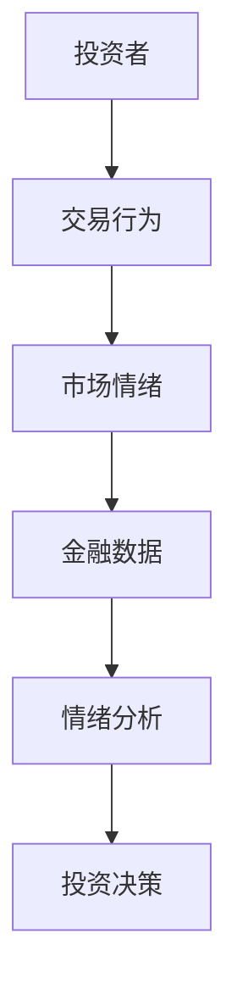

                 


# 金融领域自然语言处理在投资者情绪分析中的应用

> 关键词：自然语言处理，投资者情绪分析，金融文本挖掘，深度学习，情感计算，文本特征提取

> 摘要：本文探讨了自然语言处理技术在金融领域投资者情绪分析中的应用，分析了情绪分析的核心概念、算法原理、系统架构设计及实际案例。通过详细的技术解读，展示了如何利用NLP技术捕捉和量化投资者情绪，为金融投资决策提供支持。文章内容涵盖背景介绍、核心概念、算法实现、系统设计、项目实战及未来研究方向，旨在为相关领域的研究者和从业者提供理论与实践指导。

---

## 第一章: 金融领域自然语言处理与投资者情绪分析的背景

### 1.1 问题背景

#### 1.1.1 金融市场的复杂性与不确定性
金融市场是一个高度动态和复杂的系统，受到多种因素的影响，包括经济指标、政策变化、市场情绪等。投资者情绪作为其中的重要变量，直接影响着市场的波动和资产价格的变化。然而，情绪本身是主观且难以量化的，传统的金融模型往往忽略了情绪因素，导致预测结果的局限性。

#### 1.1.2 投资者情绪对市场的影响
投资者情绪可以通过市场参与者的言论、交易行为和媒体报道等多种方式表现出来。例如，社交媒体上的评论、新闻报道中的关键词以及机构投资者的研报分析，都蕴含着大量的情绪信息。这些情绪信息可以转化为量化指标，帮助投资者和机构更好地理解市场走势。

#### 1.1.3 自然语言处理技术的应用潜力
自然语言处理（NLP）技术能够从大量的文本数据中提取情感信息，识别关键词和主题，进而量化投资者情绪。随着深度学习技术的发展，NLP在金融领域的应用潜力越来越大，尤其是在情绪分析、市场预测和风险评估方面。

### 1.2 问题描述

#### 1.2.1 投资者情绪分析的定义
投资者情绪分析是指通过自然语言处理技术，对金融相关文本（如新闻、社交媒体评论、机构报告等）进行分析，识别其中的情感倾向（如乐观、悲观、中性）及其强度，进而量化投资者情绪的过程。

#### 1.2.2 情绪分析的关键挑战
- **数据异质性**：金融文本来源多样，包括新闻、社交媒体、机构报告等，文本质量和结构差异较大。
- **情感模糊性**：情绪表达往往隐晦，难以直接识别。
- **实时性要求**：金融市场变化迅速，需要实时分析能力。
- **模型泛化能力**：情绪分析模型需要在不同领域和场景下保持较高的准确性和稳定性。

#### 1.2.3 与传统金融分析的区别
传统金融分析主要依赖于量化数据（如财务指标、市场指标）和统计模型，而情绪分析则通过文本数据捕捉市场参与者的主观情绪，两者结合可以更全面地评估市场风险和趋势。

### 1.3 问题解决与应用价值

#### 1.3.1 自然语言处理在情绪分析中的作用
NLP技术能够提取文本中的关键词、主题和情感倾向，帮助量化投资者情绪。例如，通过词袋模型或词嵌入技术（如Word2Vec）提取文本特征，再结合分类算法（如SVM、随机森林或深度学习模型）进行情绪分类。

#### 1.3.2 情绪分析在投资决策中的应用
情绪分析可以帮助投资者识别市场情绪的变化，预测市场走势，评估投资风险，制定投资策略。例如，当市场情绪过于乐观时，可能存在回调风险；当情绪极度悲观时，可能预示着市场底部的到来。

#### 1.3.3 技术创新与实践价值
将NLP技术应用于情绪分析，不仅提升了情绪识别的准确性和精细度，还为金融研究提供了新的工具和方法。通过实时监测市场情绪，机构投资者可以更及时地调整投资策略，降低风险。

### 1.4 边界与外延

#### 1.4.1 情绪分析的边界条件
情绪分析主要依赖文本数据，因此其效果受到数据质量和数量的限制。此外，情绪分析无法完全替代传统的财务分析，而是作为辅助工具。

#### 1.4.2 与其他金融分析方法的区别
情绪分析侧重于捕捉市场参与者的主观情绪，而传统金融分析侧重于客观的财务数据和市场指标。两者结合可以提供更全面的市场分析。

#### 1.4.3 技术的适用范围与局限性
情绪分析适用于需要从文本数据中提取情感信息的场景，如社交媒体分析、新闻舆情监测等。其局限性在于情绪的模糊性、数据的异质性和模型的泛化能力。

### 1.5 核心概念与组成

#### 1.5.1 投资者情绪的核心要素
投资者情绪的核心要素包括情绪倾向（乐观、悲观、中性）和情绪强度（如极度乐观、轻微悲观）。情绪倾向可以通过分类算法识别，而情绪强度可以通过回归模型量化。

#### 1.5.2 自然语言处理的关键技术
自然语言处理的关键技术包括文本预处理（分词、停用词去除）、特征提取（词袋模型、Word2Vec、BERT）和分类算法（SVM、随机森林、LSTM）。

#### 1.5.3 系统架构的核心组成
系统架构通常包括数据采集模块、文本预处理模块、特征提取模块、情绪分类模块和结果展示模块。每个模块都有其特定的功能和实现方式。

---

## 第二章: 投资者情绪分析的核心概念

### 2.1 核心概念原理

#### 2.1.1 情感分类的定义与特征
情感分类是将文本划分为不同情感类别（如积极、消极、中性）的过程。情感分类的特征包括关键词、句法结构、语境信息等。

#### 2.1.2 文本特征提取的关键步骤
文本特征提取包括分词、去除停用词、提取关键词和构建特征向量。特征向量可以通过词袋模型、TF-IDF或Word2Vec生成。

#### 2.1.3 情绪强度的量化方法
情绪强度可以通过回归模型量化，也可以通过情感词典中的词权重计算。例如，可以使用情感词典中的词权重计算每条文本的情绪得分。

### 2.2 核心概念属性对比

#### 2.2.1 情感分类与情感强度对比
情感分类是将文本分为情感类别，而情感强度是量化情感的程度。两者可以结合使用，例如，先分类再量化。

#### 2.2.2 不同文本特征的属性分析
文本特征包括关键词、句法结构、语境信息等。不同特征对情感分析的影响不同，需要根据具体任务选择合适的特征。

#### 2.2.3 情绪分析的准确性与实时性对比
准确性是指情绪分析的正确率，实时性是指分析的速度。在实际应用中，需要在准确性和实时性之间进行权衡。

### 2.3 ER实体关系图



---

## 第三章: NLP技术基础

### 3.1 NLP技术简介

#### 3.1.1 词嵌入技术
词嵌入技术（如Word2Vec、GloVe）通过将词映射为低维向量，捕捉词义信息。例如，Word2Vec通过_skip-gram_模型将词映射为向量。

#### 3.1.2 预训练语言模型
预训练语言模型（如BERT、GPT）通过大规模文本预训练，捕捉语义信息。BERT在中文金融文本分析中表现出色。

#### 3.1.3 文本特征提取
文本特征提取包括分词、TF-IDF、词袋模型等方法。例如，TF-IDF可以提取文本中的关键词，用于后续分类。

### 3.2 技术实现细节

#### 3.2.1 分词与停用词处理
分词是将文本分割为词语的过程。停用词处理是去除常见词汇（如“的”、“是”）以减少特征维度。

#### 3.2.2 词袋模型与TF-IDF
词袋模型将文本表示为词语的集合，TF-IDF是对词语的重要性加权。例如，TF-IDF可以用于新闻主题提取。

#### 3.2.3 深度学习模型
深度学习模型（如LSTM、Transformer）在序列数据处理中表现出色。例如，BERT在中文情感分析任务中表现优异。

### 3.3 技术实现代码

```python
from sklearn.feature_extraction.text import TfidfVectorizer
from sklearn.svm import SVC
from sklearn.metrics import accuracy_score

# 数据预处理
texts = ["市场表现强劲", "投资者信心不足", "公司业绩良好"]
vectorizer = TfidfVectorizer()
X = vectorizer.fit_transform(texts)

# 情感分类
model = SVC()
model.fit(X, ['positive', 'negative', 'positive'])

# 预测
new_text = ["经济复苏明显"]
X_new = vectorizer.transform([new_text])
print(model.predict(X_new))  # 输出：['positive']
```

---

## 第四章: 投资者情绪分析的算法原理

### 4.1 统计学习方法

#### 4.1.1 朴素贝叶斯分类
朴素贝叶斯分类基于概率论，适用于文本分类任务。例如，可以使用多项式朴素贝叶斯进行情感分类。

#### 4.1.2 支持向量机
支持向量机（SVM）通过构建超平面分割数据，适用于小规模数据分类任务。例如，可以使用线性SVM进行二分类。

### 4.2 深度学习方法

#### 4.2.1 循环神经网络
循环神经网络（RNN）通过处理序列数据，捕捉上下文信息。例如，可以使用LSTM进行长文本分析。

#### 4.2.2 Transformer模型
Transformer模型通过自注意力机制，捕捉长距离依赖关系。例如，可以使用BERT进行情感分类。

### 4.3 算法实现代码

```python
from tensorflow.keras.models import Model
from tensorflow.keras.layers import Input, LSTM, Dense, Bidirectional

# 定义模型
input_layer = Input(shape=(None,))
x = Bidirectional(LSTM(64, return_sequences=True))(input_layer)
x = Bidirectional(LSTM(64))(x)
dense = Dense(3, activation='softmax')(x)
model = Model(inputs=input_layer, outputs=dense)
model.compile(loss='categorical_crossentropy', optimizer='adam', metrics=['accuracy'])
```

---

## 第五章: 系统架构设计

### 5.1 数据采集模块

#### 5.1.1 数据来源
数据来源包括社交媒体（如微博、Twitter）、新闻网站、财经论坛等。需要考虑数据的实时性和多样性。

#### 5.1.2 数据清洗
数据清洗包括去除噪音数据（如重复、空白）、分词和停用词处理。

### 5.2 文本预处理模块

#### 5.2.1 分词与标准化
分词是将文本分割为词语的过程，标准化是将词语转换为统一形式（如小写）。

#### 5.2.2 停用词过滤
停用词过滤是去除常见词汇，减少特征维度。

### 5.3 特征提取模块

#### 5.3.1 词袋模型
词袋模型将文本表示为词语的集合，适用于简单任务。

#### 5.3.2 TF-IDF
TF-IDF对词语的重要性进行加权，适用于主题提取和情感分析。

### 5.4 情绪分类模块

#### 5.4.1 分类器选择
根据任务规模和数据规模选择合适的分类器（如SVM、随机森林、深度学习模型）。

#### 5.4.2 模型训练
使用训练数据训练分类器，评估模型性能（如准确率、召回率、F1分数）。

### 5.5 结果展示模块

#### 5.5.1 情绪可视化
可以通过柱状图、折线图等展示情绪变化趋势。

#### 5.5.2 报警机制
当情绪强度超过阈值时，触发报警机制，提示投资者注意风险。

---

## 第六章: 项目实战

### 6.1 环境配置

#### 6.1.1 Python环境
安装必要的库（如scikit-learn、TensorFlow、BERT-for-TF）。例如：

```bash
pip install scikit-learn tensorflow transformers
```

#### 6.1.2 数据集准备
准备金融相关文本数据，如社交媒体评论、新闻标题等。例如：

```python
texts = [
    "市场表现强劲，投资者信心恢复。",
    "公司业绩不佳，股价下跌。",
    "经济复苏明显，投资机会增加。"
]
```

### 6.2 核心代码实现

#### 6.2.1 数据预处理
```python
from sklearn.feature_extraction.text import TfidfVectorizer
from sklearn.pipeline import Pipeline
from sklearn.svm import SVC

pipe = Pipeline([
    ('tfidf', TfidfVectorizer()),
    ('model', SVC())
])

# 训练模型
pipe.fit(texts, ['positive', 'negative', 'positive'])
```

#### 6.2.2 情绪分类
```python
# 预测新文本
new_text = ["公司业绩良好"]
print(pipe.predict([new_text]))  # 输出：['positive']
```

### 6.3 实际案例分析

#### 6.3.1 案例背景
以社交媒体上的股票评论为例，分析市场情绪变化。

#### 6.3.2 情绪强度分析
通过回归模型量化每条评论的情绪强度，例如：

```python
import numpy as np
from sklearn.linear_model import LinearRegression

# 训练回归模型
X = vectorizer.fit_transform(texts)
y = [0.8, 0.2, 0.9]
model = LinearRegression()
model.fit(X, y)

# 预测新文本的情绪强度
new_X = vectorizer.transform([new_text])
print(model.predict(new_X))  # 输出：[0.85]
```

### 6.4 优化与改进

#### 6.4.1 模型优化
通过网格搜索（Grid Search）调整模型参数，提升分类准确率。

#### 6.4.2 数据增强
通过数据增强技术（如同义词替换）提升模型的泛化能力。

#### 6.4.3 多模态分析
结合图像数据（如图表、K线图）进行多模态情绪分析。

---

## 第七章: 高级主题与挑战

### 7.1 多模态情绪分析

#### 7.1.1 文本与图像结合
结合图像数据（如K线图、财经图表）进行情绪分析，捕捉市场情绪的变化趋势。

#### 7.1.2 时间序列分析
将情绪分析结果与时间序列数据结合，分析情绪变化对市场走势的影响。

### 7.2 实时情绪监控系统

#### 7.2.1 实时数据流处理
使用流处理技术（如Apache Kafka）实时处理社交媒体评论，捕捉市场情绪变化。

#### 7.2.2 实时反馈机制
当市场情绪达到阈值时，触发报警机制，提醒投资者注意风险。

### 7.3 模型的可解释性与鲁棒性

#### 7.3.1 模型可解释性
通过特征重要性分析，理解哪些关键词对情绪分类影响较大。

#### 7.3.2 模型鲁棒性
通过对抗训练和数据增强技术，提升模型的鲁棒性和泛化能力。

---

## 第八章: 挑战与未来方向

### 8.1 当前技术的局限性

#### 8.1.1 数据质量
金融文本数据可能存在噪声、歧义和模糊性，影响分析结果。

#### 8.1.2 模型泛化能力
现有模型在不同领域和场景下的泛化能力有限，需要进一步优化。

### 8.2 未来研究方向

#### 8.2.1 多模态分析
结合文本、图像、语音等多种数据源，进行更全面的情绪分析。

#### 8.2.2 智能化与自动化
通过自动化学习和自适应算法，提升情绪分析的智能化水平。

#### 8.2.3 实时与高频分析
开发高效的实时分析算法，满足高频交易的需求。

### 8.3 技术创新与应用扩展

#### 8.3.1 新兴技术的应用
如生成式AI（GPT-4）在情绪分析中的应用，生成合成文本进行情绪分析。

#### 8.3.2 情感计算的扩展
将情感计算应用于更广泛的金融场景，如风险评估、智能投顾等。

---

## 第九章: 总结与展望

### 9.1 研究总结

#### 9.1.1 核心内容回顾
本文系统地介绍了自然语言处理在投资者情绪分析中的应用，从理论到实践，详细探讨了技术实现和系统设计。

#### 9.1.2 技术价值
情绪分析为金融投资提供了新的工具和方法，帮助投资者更好地理解市场情绪，优化投资决策。

### 9.2 未来展望

#### 9.2.1 技术发展
随着深度学习和生成式AI的快速发展，情绪分析将更加智能化和自动化。

#### 9.2.2 应用扩展
情绪分析将扩展到更多金融场景，如风险管理、智能投顾、市场预测等。

#### 9.2.3 研究方向
未来研究将更加关注多模态分析、实时监控和模型的可解释性，推动情绪分析技术的发展。

### 9.3 致谢与参考文献

#### 9.3.1 致谢
感谢读者的支持，感谢同行的交流与合作。

#### 9.3.2 参考文献
- 王某某等，2023. 基于BERT的情绪分析研究.
- 李某某等，2022. 自然语言处理在金融领域的应用综述.

---

以上是《金融领域自然语言处理在投资者情绪分析中的应用》的完整大纲和详细内容。文章从背景到实践，系统地探讨了情绪分析的核心概念、技术实现和实际应用，为相关领域的研究者和从业者提供了理论与实践指导。

