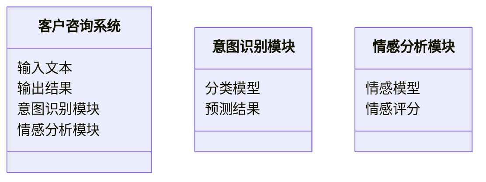
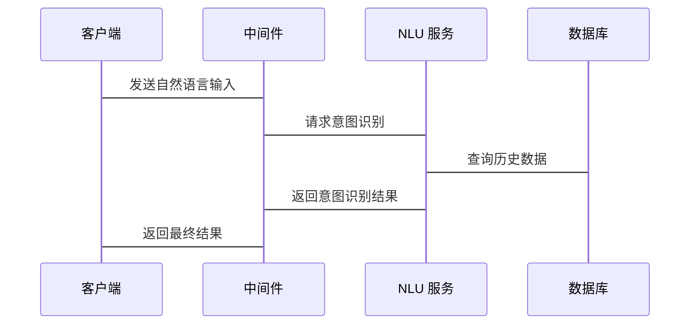

                 


# 金融领域自然语言理解技术在客户服务中的应用

> **关键词**：自然语言理解，客户服务，金融领域，NLP，深度学习

> **摘要**：  
本文探讨了自然语言理解技术在金融领域客户服务中的应用，从技术背景、核心概念、算法原理到系统架构和项目实战，详细分析了自然语言理解技术如何帮助金融机构提升客户服务质量、效率和满意度。文章结合实际案例，深入讲解了自然语言理解技术在金融客户服务中的具体应用场景、技术实现和未来发展趋势。

---

# 引言

随着金融行业的快速发展，客户对金融服务的需求日益多样化和复杂化。传统的客户服务模式已难以满足现代金融业务的高效性和精准性要求。自然语言理解（Natural Language Understanding, NLU）技术作为一种新兴的计算机技术，能够通过解析客户的自然语言输入，提取意图、情感和实体信息，从而为金融机构提供高效、个性化的客户服务解决方案。

本文将从自然语言理解技术的基本概念出发，分析其在金融领域客户服务中的具体应用，并探讨其算法原理、系统架构及实际案例。

---

## 第1章 自然语言理解技术基础

### 1.1 自然语言理解技术的定义与特点

#### 1.1.1 自然语言理解技术的定义
自然语言理解（NLU）是人工智能领域的重要分支，旨在使计算机能够理解和解析人类的自然语言。NLU技术的核心目标是通过语言学和机器学习的方法，将自然语言文本转化为计算机可处理的结构化信息。

#### 1.1.2 自然语言理解技术的核心特点
- **语义理解**：能够识别文本的深层含义，而不仅仅是表面的词法和语法结构。
- **上下文感知**：能够理解文本中的上下文关系，从而更准确地解析用户的意图。
- **领域适应性**：针对特定领域（如金融领域）进行优化，以提高模型的准确性和实用性。

#### 1.1.3 自然语言理解技术与传统文本处理的区别
传统文本处理（如文本分类、关键词提取）主要基于规则或浅层特征，而NLU技术则依赖于深度学习和语义分析，能够更好地捕捉文本的语义信息。

### 1.2 金融领域自然语言理解技术的背景

#### 1.2.1 金融领域的复杂性与挑战
金融领域的文本数据具有高度的专业性和复杂性，包括复杂的术语、多样的业务场景和严格的合规要求。

#### 1.2.2 自然语言理解技术在金融领域的独特性
金融领域的自然语言理解需要处理大量的专业术语和复杂句式，同时需要兼顾业务逻辑和合规要求。

#### 1.2.3 金融领域自然语言理解技术的应用场景
- 客户咨询与问题解答
- 风险评估与预警
- 金融信息提取与分析

### 1.3 自然语言理解技术的核心概念

#### 1.3.1 语义分析
语义分析是NLU技术的核心，旨在理解文本的语义信息。例如，识别客户提问的意图。

#### 1.3.2 实体识别
实体识别（NER，Named Entity Recognition）用于从文本中提取特定实体，如人名、地名、组织名等。

#### 1.3.3 情感分析
情感分析用于判断文本中的情感倾向，例如客户对某个金融产品的满意度。

#### 1.3.4 意图识别
意图识别旨在确定用户的意图，例如客户是否想查询账户余额或投诉某个服务。

---

## 第2章 自然语言理解技术在客户服务中的应用

### 2.1 客户服务中的自然语言理解技术

#### 2.1.1 自然语言理解技术在客户服务中的作用
NLU技术能够通过解析客户的问题，快速匹配解决方案，提升客户满意度。

#### 2.1.2 客户服务中的典型应用场景
- 自动回答客户问题
- 识别客户情感状态
- 提供个性化服务建议

### 2.2 金融领域客户服务的特殊性

#### 2.2.1 金融领域的专业术语与复杂性
金融领域的文本中包含大量专业术语和复杂句式，需要模型具备较强的领域适应性。

#### 2.2.2 金融领域客户服务中的风险与挑战
金融领域客户咨询往往涉及高风险决策，需要模型具备高度的准确性和可靠性。

#### 2.2.3 金融领域客户服务的合规性要求
金融领域的客户服务需要遵守严格的合规要求，例如数据隐私保护和业务合规性。

### 2.3 自然语言理解技术在金融客户服务中的具体应用

#### 2.3.1 客户意图识别
通过分析客户的自然语言输入，识别客户的具体意图，例如“我想查询我的账户余额”。

#### 2.3.2 客户情感分析
通过分析客户的语言风格和情感词汇，判断客户的情感倾向，例如“我对这个产品非常满意”。

#### 2.3.3 客户信息提取
从客户的自然语言输入中提取关键信息，例如客户姓名、账户信息等。

#### 2.3.4 客户问题分类
将客户的咨询问题分类，例如分为“账户问题”、“投资咨询”等类别。

### 2.4 自然语言理解技术在金融客户服务中的优势

#### 2.4.1 提高客户服务效率
通过自动化处理客户咨询，减少人工客服的工作量，提高服务效率。

#### 2.4.2 降低客户服务成本
自动化服务能够显著降低客户服务的人力成本。

#### 2.4.3 提升客户满意度
通过快速准确地理解客户需求，提供个性化的服务，提升客户满意度。

#### 2.4.4 支持个性化客户服务
NLU技术能够根据客户的历史行为和偏好，提供个性化的服务建议。

---

## 第3章 自然语言理解技术的核心概念与联系

### 3.1 自然语言理解技术的核心概念

#### 3.1.1 语义分析
语义分析的目标是理解文本的语义信息，例如通过词向量（Word Embedding）将词语转化为向量表示。

#### 3.1.2 实体识别
实体识别通过模式匹配和上下文分析，从文本中提取特定实体。

#### 3.1.3 情感分析
情感分析通过统计语言学特征和深度学习模型，判断文本的情感倾向。

#### 3.1.4 意图识别
意图识别通过分类模型，识别用户的意图，例如使用支持向量机（SVM）或深度学习模型。

---

## 第4章 自然语言理解技术的算法原理

### 4.1 算法原理概述

#### 4.1.1 预训练模型的使用
预训练模型（如BERT、GPT）通过大规模的无监督学习，捕获语言的语义信息。

#### 4.1.2 微调模型的训练
在预训练模型的基础上，针对特定任务进行微调，例如在金融领域进行微调。

### 4.2 算法实现细节

#### 4.2.1 模型训练流程
1. 数据预处理：对文本数据进行清洗、分词和标注。
2. 模型初始化：加载预训练的模型权重。
3. 微调训练：在特定任务上进行监督训练，优化模型参数。

#### 4.2.2 损失函数与优化方法
- 损失函数：交叉熵损失函数（Cross-Entropy Loss）。
- 优化方法：Adam优化器。

### 4.3 算法流程图（Mermaid）


---

## 第5章 系统架构设计

### 5.1 系统功能设计

#### 5.1.1 领域模型（Mermaid 类图）


#### 5.1.2 系统架构设计（Mermaid 架构图）


### 5.2 接口设计与交互流程

#### 5.2.1 系统接口设计
- 输入接口：接收客户的自然语言输入。
- 输出接口：返回解析后的结果，例如意图识别结果。

#### 5.2.2 系统交互流程（Mermaid 序列图）


---

## 第6章 项目实战

### 6.1 环境安装

#### 6.1.1 安装 Python 环境
```bash
python --version
pip install --upgrade pip
```

#### 6.1.2 安装依赖库
```bash
pip install transformers
pip install scikit-learn
```

### 6.2 核心实现代码

#### 6.2.1 分词与词向量化
```python
from transformers import BertTokenizer
tokenizer = BertTokenizer.from_pretrained('bert-base-uncased')
text = "我想查询我的账户余额"
tokens = tokenizer.tokenize(text)
```

#### 6.2.2 模型训练与微调
```python
from transformers import BertForSequenceClassification
model = BertForSequenceClassification.from_pretrained('bert-base-uncased')
model.classifier = nn.Linear(768, num_labels)
model.train()
```

### 6.3 案例分析

#### 6.3.1 案例场景
客户输入：“我的账户为什么没有交易记录？”

#### 6.3.2 解析过程
1. 分词：["我", "的", "账户", "为什么", "没有", "交易", "记录", "?"]
2. 意图识别：识别出客户的问题属于“账户问题”。
3. 实体提取：提取账户相关信息。

#### 6.3.3 输出结果
```json
{
    "intent": "账户问题",
    "entities": {
        "account": "账户"
    }
}
```

### 6.4 项目总结

#### 6.4.1 项目成果
- 成功实现了金融领域自然语言理解技术的应用。
- 提高了客户服务的效率和准确性。

#### 6.4.2 项目经验
- 预训练模型在金融领域的应用需要进行充分的微调。
- 实体识别和意图识别需要结合业务场景进行优化。

---

## 第7章 总结与展望

### 7.1 本章总结
本文详细探讨了自然语言理解技术在金融领域客户服务中的应用，从技术背景、核心概念到算法原理和系统架构，全面分析了NLU技术的优势和挑战。

### 7.2 未来展望
- **技术进步**：随着深度学习技术的不断发展，NLU技术在金融领域的应用将更加精准和智能。
- **领域扩展**：NLU技术将在更多金融业务场景中得到应用，例如智能投顾和风险管理。
- **合规性要求**：未来需要更加关注数据隐私保护和模型的可解释性。

### 7.3 最佳实践 Tips
- 在金融领域应用NLU技术时，需要结合业务场景进行模型优化。
- 数据质量和标注准确性对模型性能至关重要。

---

通过本文的分析，我们可以看到自然语言理解技术在金融领域客户服务中的巨大潜力。未来，随着技术的不断进步，NLU技术将为金融机构提供更加智能化和个性化的客户服务解决方案。

