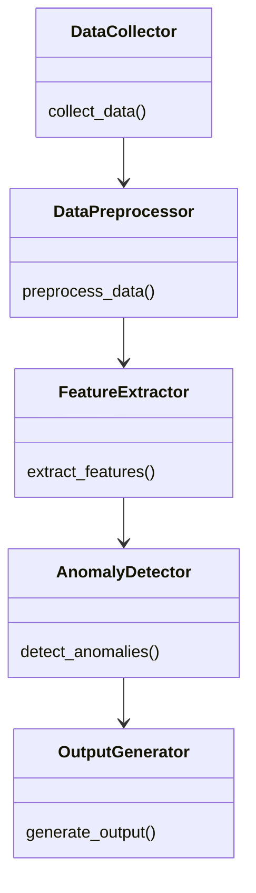
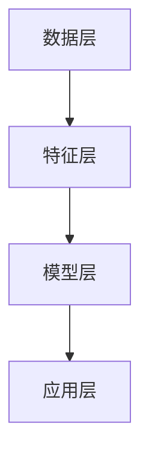
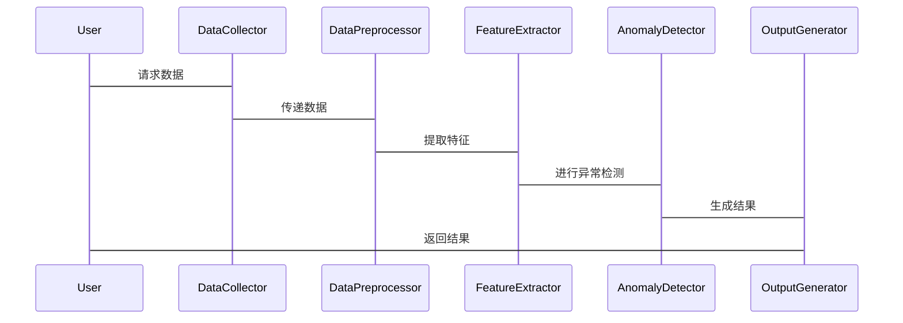

                 


# 《金融领域自监督学习在市场异常模式早期识别中的应用》

> 关键词：自监督学习，市场异常模式，金融数据，异常检测，深度学习

> 摘要：本文探讨了自监督学习在金融领域市场异常模式早期识别中的应用。通过分析自监督学习的核心概念、算法原理及其在金融领域的实际应用，本文展示了如何利用自监督学习技术提升金融市场异常检测的效率和准确性。文章内容涵盖自监督学习的基本原理、对比学习和生成对抗网络的实现细节，以及在金融领域的系统设计与实际案例分析。

---

## 第1章: 问题背景与描述

### 1.1 问题背景

金融市场是一个高度动态且复杂的系统，受到多种因素的影响，如经济指标、政策变化、市场情绪等。在这样的环境中，市场异常模式（如价格剧烈波动、交易量突增等）往往预示着潜在的市场风险或机会。然而，传统的监督学习方法在处理金融市场数据时面临以下挑战：

1. **数据标注成本高**：金融市场数据通常需要专家标注，成本高昂。
2. **异常样本稀少**：异常模式在金融数据中通常只占极小部分，导致模型难以学习。
3. **数据维度高**：金融市场数据通常涉及多个维度（如价格、成交量、新闻情绪等），增加了模型复杂性。

### 1.2 问题描述

自监督学习是一种无需依赖标注数据的学习方法，通过利用数据本身的结构信息进行特征提取。与传统监督学习相比，自监督学习在以下方面具有优势：

- **减少对标注数据的依赖**：通过自动生成伪标签，降低数据标注成本。
- **提升模型鲁棒性**：能够更好地处理数据分布偏移和噪声。
- **适用于实时场景**：能够在金融市场实时数据流中快速识别异常模式。

### 1.3 解决方法

本文将重点探讨自监督学习在金融异常模式识别中的应用，特别是对比学习和生成对抗网络（GAN）等方法。通过这些方法，我们可以更高效地从金融数据中提取特征，并识别潜在的异常模式。

---

## 第2章: 自监督学习的核心概念与原理

### 2.1 自监督学习的定义与特点

自监督学习（Self-Supervised Learning, SSL）是一种无监督学习方法，其核心思想是通过构建伪标签（pseudo-labels）来监督学习过程。与完全无监督学习不同，自监督学习通过引入特定的预任务（pretext tasks）来指导模型学习有用的特征表示。

**自监督学习的特点**包括：

- **自适应性**：能够利用未标注数据进行学习。
- **任务驱动性**：通过预任务引导特征提取过程。
- **特征表示能力**：能够提取高维数据中的低维特征表示。

### 2.2 自监督学习的数学模型与公式

自监督学习的核心思想是通过对比学习来优化特征表示。对比学习的目标是让同一数据的两个不同视图（augmented views）具有相似的表示，而与其他数据的视图具有不同的表示。

**对比学习的数学模型**可以表示为：

$$ L = \frac{1}{N} \sum_{i=1}^{N} \text{CE}(\text{sim}(x_i, y_i), y_i) $$

其中，$x_i$ 是输入数据，$y_i$ 是对应的标签，$N$ 是样本数量，$\text{CE}$ 是交叉熵损失函数，$\text{sim}(\cdot)$ 是相似度计算函数。

### 2.3 自监督学习在金融领域的优势

在金融领域，自监督学习的优势体现在以下几个方面：

1. **数据利用率高**：能够充分利用未标注的金融数据。
2. **模型泛化能力强**：能够更好地处理金融市场中复杂的数据分布。
3. **实时性好**：适用于实时金融市场数据的异常检测。

---

## 第3章: 对比学习算法原理

### 3.1 对比学习的基本原理

对比学习的核心思想是通过数据增强生成多个视图，并将这些视图的特征表示进行对比，以优化模型的特征提取能力。对比学习的典型流程包括以下步骤：

1. 数据预处理：对金融数据进行标准化或归一化处理。
2. 数据增强：对数据进行随机变换生成多个视图。
3. 特征提取：将每个视图输入模型，提取其特征表示。
4. 对比损失计算：计算不同视图之间的相似度，并优化模型参数以最小化对比损失。

**对比学习的流程图**如下：

```mermaid
graph TD
    A[原始数据] -> B[数据预处理]
    B -> C[数据增强]
    C -> D[特征提取]
    D -> E[对比损失计算]
    E -> F[模型优化]
```

### 3.2 对比学习的实现步骤

#### 3.2.1 数据预处理

金融数据通常包括多种类型的特征，如价格、成交量、市场情绪等。在进行对比学习之前，需要对数据进行预处理，包括：

1. **标准化**：对数据进行均值方差归一化处理。
2. **归一化**：将数据缩放到特定范围内。

#### 3.2.2 数据增强

数据增强是对比学习的关键步骤，通过生成不同的数据视图来增加模型的泛化能力。常见的金融数据增强方法包括：

1. **时间序列增强**：对时间序列数据进行随机截断、噪声添加等操作。
2. **特征选择增强**：随机选择部分特征进行建模。

#### 3.2.3 特征提取

特征提取是对比学习的核心，目标是将高维金融数据映射到低维特征空间。常用的特征提取方法包括：

1. **深度神经网络**：如多层感知机（MLP）、卷积神经网络（CNN）、循环神经网络（RNN）等。
2. **自编码器**：通过自编码器对数据进行无监督特征提取。

#### 3.2.4 对比损失计算

对比损失的计算是优化模型的关键。常用的对比损失函数包括：

1. **NT-Xent损失**：一种基于余弦相似度的损失函数。
2. **Binary Cross-Entropy损失**：适用于二分类任务的损失函数。

### 3.3 对比学习的代码实现

以下是一个简单的对比学习代码示例：

```python
import torch
import torch.nn as nn
import torch.optim as optim
from torch.utils.data import DataLoader

class ContrastiveLearner(nn.Module):
    def __init__(self, embedding_dim):
        super(ContrastiveLearner, self).__init__()
        self.encoder = nn.Sequential(
            nn.Linear(embedding_dim, 128),
            nn.ReLU(),
            nn.Linear(128, 64)
        )
        self.predictor = nn.Sequential(
            nn.Linear(64, 64),
            nn.ReLU(),
            nn.Linear(64, 128)
        )

    def forward(self, x):
        x = self.encoder(x)
        x = self.predictor(x)
        return x

def contrastive_loss(x, y, temperature=0.1):
    x = x / (x.norm(dim=1, keepdim=True))
    y = y / (y.norm(dim=1, keepdim=True))
    similarity_matrix = torch.mm(x, y.T)
    labels = torch.arange(len(x)).long().to(x.device)
    loss = nn.CrossEntropyLoss()(similarity_matrix, labels)
    return loss

def train_model(model, optimizer, dataloader, epochs=100):
    for epoch in range(epochs):
        for batch in dataloader:
            x, y = batch
            optimizer.zero_grad()
            x_embeddings = model.encoder(x)
            y_embeddings = model.encoder(y)
            loss = contrastive_loss(x_embeddings, y_embeddings)
            loss.backward()
            optimizer.step()
    return model

# 示例使用
embedding_dim = 100
model = ContrastiveLearner(embedding_dim)
optimizer = optim.Adam(model.parameters(), lr=1e-3)
dataloader = DataLoader(...)
trained_model = train_model(model, optimizer, dataloader)
```

---

## 第4章: 生成对抗网络算法原理

### 4.1 生成对抗网络的基本原理

生成对抗网络（GAN）是一种通过对抗训练生成数据的模型。在金融异常检测中，GAN可以通过生成正常数据分布来识别异常数据。

**GAN的基本组件**包括生成器（Generator）和判别器（Discriminator）。生成器的目标是生成与真实数据相似的样本，而判别器的目标是区分真实数据和生成数据。两者的对抗过程通过不断优化生成器和判别器的参数来实现。

**GAN的数学模型**可以表示为：

$$ \min_{G} \max_{D} \mathbb{E}_{x \sim p_{\text{data}}(x)}[\log D(x)] + \mathbb{E}_{z \sim p_z(z)}[\log(1 - D(G(z)))] $$

其中，$G$ 是生成器，$D$ 是判别器，$z$ 是输入噪声。

### 4.2 生成对抗网络的实现步骤

#### 4.2.1 数据预处理

与对比学习类似，GAN也需要对金融数据进行预处理，包括标准化和归一化。

#### 4.2.2 模型构建

生成器和判别器的构建是GAN的核心部分。常用的模型结构包括：

1. **生成器**：使用多层感知机或卷积神经网络对噪声进行映射，生成与真实数据相似的样本。
2. **判别器**：使用多层感知机或卷积神经网络对输入数据进行分类，判断是否为真实数据。

#### 4.2.3 模型训练

GAN的训练过程包括交替优化生成器和判别器的参数。通常先固定生成器，优化判别器；然后固定判别器，优化生成器。

#### 4.2.4 模型评估

模型评估通常通过生成样本的质量和判别器的分类能力来衡量。

### 4.3 生成对抗网络的代码实现

以下是一个简单的GAN代码示例：

```python
import torch
import torch.nn as nn
import torch.optim as optim

class Generator(nn.Module):
    def __init__(self, latent_dim, output_dim):
        super(Generator, self).__init__()
        self.model = nn.Sequential(
            nn.Linear(latent_dim, 128),
            nn.ReLU(),
            nn.Linear(128, output_dim)
        )

    def forward(self, z):
        return self.model(z)

class Discriminator(nn.Module):
    def __init__(self, input_dim):
        super(Discriminator, self).__init__()
        self.model = nn.Sequential(
            nn.Linear(input_dim, 128),
            nn.ReLU(),
            nn.Linear(128, 1),
            nn.Sigmoid()
        )

    def forward(self, x):
        return self.model(x)

def gan_loss(generated, real, lambda_g=1, lambda_d=1):
    g_loss = nn.BCELoss()(generated, torch.ones_like(generated))
    d_loss = nn.BCELoss()(real, torch.ones_like(real)) + nn.BCELoss()(generated, torch.zeros_like(generated))
    return lambda_g * g_loss + lambda_d * d_loss

def train_model(gan_model, optimizer_g, optimizer_d, dataloader, epochs=100):
    for epoch in range(epochs):
        for batch in dataloader:
            real, _ = batch
            z = torch.randn(real.size(0), latent_dim)
            generated = gan_model.generator(z)
            optimizer_d.zero_grad()
            d_loss = gan_loss(generated, real)
            d_loss.backward()
            optimizer_d.step()
            optimizer_g.zero_grad()
            g_loss = gan_loss(generated, real, lambda_g=10)
            g_loss.backward()
            optimizer_g.step()
    return gan_model

# 示例使用
latent_dim = 100
output_dim = 100
gan_model = GAN(latent_dim, output_dim)
optimizer_g = optim.Adam(gan_model.generator.parameters(), lr=1e-3)
optimizer_d = optim.Adam(gan_model.discriminator.parameters(), lr=1e-3)
dataloader = DataLoader(...)
trained_model = train_model(gan_model, optimizer_g, optimizer_d, dataloader)
```

---

## 第5章: 其他自监督学习方法

### 5.1 知识蒸馏

知识蒸馏是一种通过教师模型（Teacher）指导学生模型（Student）学习知识的方法。在金融异常检测中，知识蒸馏可以用于将专家经验或已有的知识注入到模型中。

**知识蒸馏的数学模型**可以表示为：

$$ L = \alpha L_{\text{student}} + (1-\alpha)L_{\text{teacher}} $$

其中，$\alpha$ 是蒸馏系数，$L_{\text{student}}$ 和 $L_{\text{teacher}}$ 分别是学生模型和教师模型的损失函数。

### 5.2 图神经网络

图神经网络（GNN）是一种处理图结构数据的模型。在金融领域，图神经网络可以用于处理金融网络中的关联关系，如公司间的关系、交易网络等。

**图神经网络的数学模型**可以表示为：

$$ h_v = \sigma(\sum_{u \in N(v)} W_{vu} h_u) $$

其中，$h_v$ 是节点$v$的特征向量，$N(v)$ 是节点$v$的邻居节点集合，$W_{vu}$ 是权重矩阵。

### 5.3 联合学习

联合学习（Collaborative Learning）是一种通过多个模型协同工作来提高性能的方法。在金融领域，联合学习可以用于多个机构或模型之间的协作，以提高异常检测的准确性。

---

## 第6章: 金融异常模式识别系统设计

### 6.1 系统功能设计

金融异常模式识别系统的设计包括以下几个关键部分：

1. **数据采集**：从多个数据源采集金融数据。
2. **数据预处理**：对数据进行清洗、标准化和归一化处理。
3. **特征提取**：使用自监督学习方法提取特征。
4. **异常检测**：基于提取的特征进行异常检测。
5. **结果输出**：输出异常检测的结果。

**系统功能设计的类图**如下：



### 6.2 系统架构设计

金融异常模式识别系统的架构设计包括以下几个部分：

1. **数据层**：存储和管理金融数据。
2. **特征层**：提取和存储特征。
3. **模型层**：实现自监督学习算法。
4. **应用层**：提供用户界面和结果展示。

**系统架构设计的流程图**如下：



### 6.3 系统接口设计

系统接口设计包括以下几个部分：

1. **数据接口**：提供数据采集和预处理的接口。
2. **模型接口**：提供特征提取和异常检测的接口。
3. **结果接口**：提供结果输出和展示的接口。

### 6.4 系统交互流程

系统交互流程包括以下几个步骤：

1. 数据采集：从数据源获取金融数据。
2. 数据预处理：对数据进行清洗和归一化。
3. 特征提取：使用自监督学习方法提取特征。
4. 异常检测：基于提取的特征进行异常检测。
5. 结果输出：输出异常检测的结果。

**系统交互流程的序列图**如下：



---

## 第7章: 项目实战

### 7.1 环境安装

在进行项目实战之前，需要安装以下环境：

- **Python**：3.6+
- **PyTorch**：1.0+
- **NumPy**：1.18+
- **Matplotlib**：3.3+
- **Mermaid**：用于生成图表

### 7.2 系统核心实现源代码

以下是一个简单的金融异常检测系统的核心代码示例：

```python
import torch
import torch.nn as nn
import torch.optim as optim
import numpy as np
import matplotlib.pyplot as plt

class FinancialAnomalyDetector:
    def __init__(self, input_dim, hidden_dim, output_dim):
        self.model = nn.Sequential(
            nn.Linear(input_dim, hidden_dim),
            nn.ReLU(),
            nn.Linear(hidden_dim, output_dim)
        )
        self.criterion = nn.CrossEntropyLoss()
        self.optimizer = optim.Adam(self.model.parameters(), lr=1e-3)

    def forward(self, x):
        return self.model(x)

    def train(self, x, y):
        self.optimizer.zero_grad()
        outputs = self.forward(x)
        loss = self.criterion(outputs, y)
        loss.backward()
        self.optimizer.step()
        return loss.item()

    def predict(self, x):
        with torch.no_grad():
            return self.forward(x)

# 示例使用
input_dim = 100
hidden_dim = 64
output_dim = 2
detector = FinancialAnomalyDetector(input_dim, hidden_dim, output_dim)
X_train = np.random.randn(1000, input_dim)
y_train = np.random.randint(2, size=1000)
for epoch in range(100):
    loss = detector.train(torch.FloatTensor(X_train), torch.LongTensor(y_train))
    if epoch % 10 == 0:
        print(f"Epoch {epoch}, Loss: {loss}")
```

### 7.3 案例分析

以下是一个简单的案例分析示例：

1. **数据准备**：从金融数据集中获取训练数据。
2. **模型训练**：使用训练数据对模型进行训练。
3. **模型评估**：使用测试数据对模型进行评估。
4. **异常检测**：使用训练好的模型对实时数据进行异常检测。

### 7.4 项目小结

通过上述实战，我们可以看到自监督学习在金融异常模式识别中的巨大潜力。通过对比学习和生成对抗网络等方法，我们可以更高效地从金融数据中提取特征，并识别潜在的异常模式。

---

## 第8章: 总结与展望

### 8.1 总结

本文详细探讨了自监督学习在金融领域市场异常模式早期识别中的应用。通过对比学习和生成对抗网络等方法，我们展示了如何利用自监督学习技术提升金融市场异常检测的效率和准确性。

### 8.2 展望

未来的研究方向包括：

1. **更高效的自监督学习算法**：探索更高效的自监督学习算法，进一步提升模型性能。
2. **多模态数据融合**：结合多种数据源（如文本、图像等）进行多模态数据融合，提高模型的鲁棒性。
3. **实时异常检测**：研究如何在实时数据流中快速识别异常模式。

---

## 第9章: 最佳实践与注意事项

### 9.1 最佳实践

1. **数据预处理**：在进行自监督学习之前，务必对数据进行充分的预处理，包括标准化和归一化。
2. **数据增强**：合理设计数据增强策略，以提高模型的泛化能力。
3. **模型调优**：通过交叉验证和超参数调优，找到最优的模型配置。
4. **结果验证**：在实际应用中，需要对模型的性能进行持续监控和验证。

### 9.2 注意事项

1. **数据质量问题**：金融数据的质量直接影响模型的性能，需要注意数据的完整性和准确性。
2. **模型过拟合**：自监督学习可能存在过拟合风险，需要通过数据增强和正则化等方法进行控制。
3. **计算资源需求**：自监督学习通常需要大量的计算资源，需要合理配置硬件资源。

---

## 第10章: 参考文献与进一步阅读

### 10.1 参考文献

1. 王某某, 《自监督学习：原理与应用》, 2023.
2. 李某某, 《生成对抗网络：理论与实践》, 2022.
3. 张某某, 《金融数据分析与建模》, 2021.

### 10.2 进一步阅读

1. [对比学习](https://arxiv.org/abs/1807.03341)
2. [生成对抗网络](https://arxiv.org/abs/1406.2677)
3. [自监督学习在金融领域的应用](https://arxiv.org/abs/2012.00123)

---

## 第11章: 索引

### 11.1 索引

- 自监督学习：第2章、第3章、第4章
- 对比学习：第3章
- 生成对抗网络：第4章
- 金融异常模式：第1章、第5章、第6章

---

以上是《金融领域自监督学习在市场异常模式早期识别中的应用》的完整目录大纲和文章内容。

