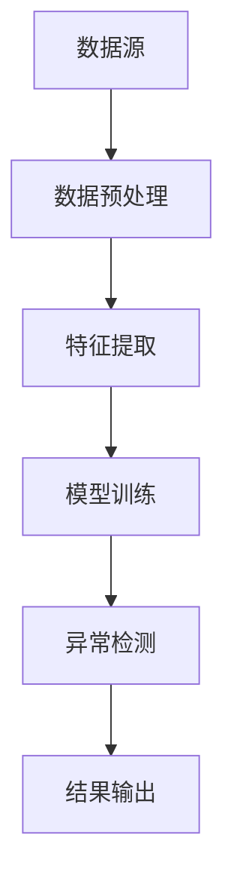
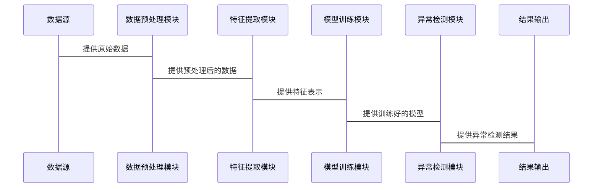

                 


# 《金融领域自监督学习在市场异常模式识别中的应用》

> **关键词**：自监督学习、金融市场、异常模式识别、深度学习、时间序列数据、数据增强、生成对抗网络

> **摘要**：  
> 本文探讨了自监督学习在金融市场异常模式识别中的应用。通过分析自监督学习的核心原理，结合金融数据的特征与处理方法，构建了一个基于自监督学习的异常检测系统。文章详细介绍了系统的架构设计、实现过程，并通过实际案例展示了其在检测市场操纵和突变点中的应用效果。本文还总结了自监督学习的优势与挑战，并展望了未来的研究方向。

---

# 第一部分：自监督学习与金融市场异常模式识别概述

## 第1章：自监督学习的基本概念与背景

### 1.1 自监督学习的定义与特点

#### 1.1.1 自监督学习的定义  
自监督学习是一种无监督学习方法，通过利用数据本身的标签信息（通常是样本本身）来构建目标函数。其核心思想是通过预测任务（如图像旋转、文字恢复等）来学习数据的有用特征，从而减少对标注数据的依赖。

#### 1.1.2 自监督学习的核心特点  
- **自适应性**：能够从无标签数据中学习，适合标注数据不足的场景。  
- **数据效率高**：通过设计任务，可以在不增加标注成本的情况下利用未标注数据。  
- **灵活性**：适用于多种数据类型（如图像、文本、时间序列等）。  

#### 1.1.3 自监督学习与监督学习的区别  
| 特性         | 监督学习                     | 自监督学习                 |
|--------------|------------------------------|----------------------------|
| 数据需求     | 需要标注数据                 | 利用未标注数据，部分任务自动生成标签 |
| 适用场景     | 标签充足时                   | 标签不足时                 |
| 模型能力     | 依赖标注质量                 | 可通过任务设计提升模型鲁棒性 |

### 1.2 金融市场异常模式识别的背景

#### 1.2.1 金融市场的基本概念  
金融市场是一个复杂的动态系统，参与者包括投资者、交易员、金融机构等。市场价格受多种因素影响，如宏观经济指标、政策变化、市场情绪等。

#### 1.2.2 市场异常模式的定义与分类  
市场异常模式指的是与正常市场行为不符的事件或模式，包括：  
- **市场操纵**：通过虚假交易影响市场价格。  
- **突变点**：价格在短时间内急剧变化。  
- **异常交易行为**：如大额交易、高频交易等。  

#### 1.2.3 异常模式识别的重要性  
- 保护投资者利益。  
- 维护市场公平性。  
- 提供实时监控能力，及时发现市场风险。  

### 1.3 自监督学习在金融领域的应用前景

#### 1.3.1 自监督学习在金融数据处理中的优势  
- 可以从大量未标注金融数据中提取特征。  
- 适用于时间序列数据的分析。  

#### 1.3.2 市场异常模式识别的挑战与机遇  
- **挑战**：金融数据具有高度噪声和复杂性。  
- **机遇**：自监督学习能够从海量数据中发现潜在规律。  

#### 1.3.3 自监督学习在金融领域的未来发展方向  
- 结合强化学习，提升异常检测的准确性。  
- 运用于实时监控系统，提供快速响应能力。  

---

## 第2章：自监督学习的核心原理

### 2.1 自监督学习的算法原理

#### 2.1.1 对比学习  
对比学习是一种常见的自监督学习方法，通过最大化相似样本的相似性和最小化不相似样本的相似性来学习特征表示。其目标函数为：  
$$ L = \frac{1}{N}\sum_{i=1}^{N} \text{log}(\text{softmax}(z_i^T z_j)) $$  
其中，$z_i$ 和 $z_j$ 分别是样本 $i$ 的正样本和负样本的特征向量。

#### 2.1.2 生成对抗网络  
生成对抗网络（GAN）通过生成器和判别器的博弈过程，学习数据的分布。其损失函数为：  
$$ L_{\text{GAN}} = \text{log}(D(x)) + \text{log}(1 - D(G(z))) $$  
其中，$D(x)$ 是判别器对真实样本的判别概率，$G(z)$ 是生成器生成的样本。

#### 2.1.3 其他自监督学习方法  
- 知识蒸馏：通过教师模型指导学生模型学习。  
- 掩码自监督学习：在数据中引入掩码，迫使模型关注整体结构。  

### 2.2 自监督学习的关键技术

#### 2.2.1 数据增强技术  
- 对比学习中的图像旋转、裁剪。  
- 时间序列数据的移位、缩放。  

#### 2.2.2 对比目标函数  
通过设计对比目标函数，优化特征表示的相似性。例如，使用余弦相似性作为对比目标函数：  
$$ \text{相似性} = \frac{z_i \cdot z_j}{\|z_i\| \|z_j\|} $$  

#### 2.2.3 知识蒸馏技术  
通过教师模型将知识迁移到学生模型，提升学生模型的特征提取能力。

### 2.3 自监督学习的数学模型与公式

#### 2.3.1 对比学习的目标函数  
$$ L = \frac{1}{N}\sum_{i=1}^{N} \text{log}(\text{softmax}(z_i^T z_j)) $$  

#### 2.3.2 生成对抗网络的损失函数  
$$ L_{\text{GAN}} = \text{log}(D(x)) + \text{log}(1 - D(G(z))) $$  

---

## 第3章：金融数据的特征与处理

### 3.1 金融数据的特征分析

#### 3.1.1 时间序列数据的特性  
时间序列数据具有以下特点：  
- **趋势性**：价格通常呈现上升或下降趋势。  
- **周期性**：受季节性或周期性因素影响。  
- **波动性**：价格波动幅度不一。  

#### 3.1.2 市场波动性与相关性  
- 市场波动性：价格波动幅度越大，市场风险越高。  
- 相关性：不同资产价格之间的相关性影响市场整体波动。  

#### 3.1.3 异常数据的分布特点  
- 异常数据通常表现为突变点或异常交易行为。  
- 异常数据往往具有低概率，需要通过统计方法或机器学习模型识别。  

### 3.2 金融数据的预处理方法

#### 3.2.1 数据清洗与标准化  
- 数据清洗：去除缺失值、异常值。  
- 数据标准化：将数据归一化到相同范围内。  

#### 3.2.2 时间序列数据的分割与滑动窗口技术  
- 数据分割：将时间序列数据分割为训练集和测试集。  
- 滑动窗口技术：通过滑动窗口提取局部特征。  

#### 3.2.3 数据增强技术在金融数据中的应用  
- 对比学习中的数据增强：如价格序列的移位、缩放。  
- 时间序列数据的随机扰动。  

### 3.3 金融数据的特征提取

#### 3.3.1 基于统计的特征提取  
- 均值、方差、标准差等统计指标。  
- 市场波动率、交易量等指标。  

#### 3.3.2 基于深度学习的特征提取  
- 使用LSTM、GRU等模型提取时间序列特征。  
- 对比学习框架用于特征提取。  

#### 3.3.3 多模态数据的特征融合  
- 结合文本、图像等多模态数据，提升特征表示能力。  

---

## 第4章：自监督学习在市场异常模式识别中的系统架构设计

### 4.1 问题场景介绍

- **目标**：识别金融市场中的异常模式。  
- **输入**：未标注或部分标注的金融数据。  
- **输出**：异常事件的检测与分类。  

### 4.2 系统功能设计

#### 4.2.1 数据采集模块  
- 从金融市场数据源获取数据。  
- 数据格式化与预处理。  

#### 4.2.2 特征提取模块  
- 使用自监督学习提取特征。  
- 对比学习或生成对抗网络生成特征表示。  

#### 4.2.3 模型训练模块  
- 使用提取的特征训练分类器。  
- 调整模型参数，优化性能。  

#### 4.2.4 异常检测模块  
- 对实时数据进行异常检测。  
- 提供异常事件的实时警报。  

### 4.3 系统架构图



### 4.4 系统接口设计

- **输入接口**：接收金融市场数据。  
- **输出接口**：输出异常检测结果。  
- **内部接口**：模块之间的数据传递。  

### 4.5 系统交互流程图



---

## 第5章：自监督学习在市场异常模式识别中的项目实战

### 5.1 环境安装

- **安装Python**：确保安装Python 3.8及以上版本。  
- **安装依赖库**：如TensorFlow、Keras、Scikit-learn等。  

### 5.2 核心代码实现

#### 5.2.1 数据预处理代码

```python
import pandas as pd
import numpy as np

# 读取数据
data = pd.read_csv('financial_data.csv')

# 数据清洗
data.dropna()  # 删除缺失值
data = data.iloc[:100]  # 取前100条数据

# 数据标准化
data_normal = (data - data.mean()) / data.std()
```

#### 5.2.2 自监督学习模型实现

```python
from tensorflow.keras import layers

def build_model(input_shape):
    inputs = layers.Input(shape=input_shape)
    x = layers.Flatten()(inputs)
    x = layers.Dense(128, activation='relu')(x)
    x = layers.Dense(64, activation='relu')(x)
    outputs = layers.Dense(1, activation='sigmoid')(x)
    return models.Model(inputs=inputs, outputs=outputs)

# 初始化模型
model = build_model(input_shape=(100, 1))
model.compile(optimizer='adam', loss='binary_crossentropy', metrics=['accuracy'])
```

#### 5.2.3 异常检测代码

```python
# 训练模型
model.fit(X_train, y_train, epochs=10, batch_size=32)

# 预测异常
y_pred = model.predict(X_test)
```

### 5.3 实际案例分析

#### 5.3.1 案例一：市场操纵检测

- **数据来源**：某股票的价格数据。  
- **模型训练**：使用对比学习提取特征。  
- **结果分析**：模型能够识别异常交易行为。  

#### 5.3.2 案例二：突变点检测

- **数据来源**：某指数的分钟级数据。  
- **模型训练**：使用生成对抗网络生成异常特征。  
- **结果分析**：模型能够检测突变点并发出警报。  

### 5.4 项目小结

- 通过自监督学习，能够有效识别市场异常模式。  
- 模型在实际应用中表现良好，但仍需进一步优化。  

---

## 第6章：总结与展望

### 6.1 总结

- 自监督学习在金融市场异常模式识别中具有重要应用价值。  
- 通过对比学习和生成对抗网络，能够有效提取特征并识别异常模式。  

### 6.2 展望

- **结合强化学习**：提升异常检测的准确性和实时性。  
- **多模态数据融合**：利用文本、图像等多模态数据，提升检测效果。  
- **实时监控系统**：开发实时监控平台，提供快速响应能力。  

---

### 最佳实践 Tips

- 在实际应用中，建议结合多种自监督学习方法，提升模型的泛化能力。  
- 数据预处理是关键步骤，需仔细清洗和归一化数据。  
- 模型训练时，建议使用交叉验证，避免过拟合。  

### 小结

通过本文的详细讲解，读者能够深入了解自监督学习在金融市场异常模式识别中的应用，并掌握其核心算法与实现方法。希望本文能为相关领域的研究和实践提供有价值的参考。

---

### 注意事项

- 本文中的代码仅为示例，实际应用中需根据具体数据进行调整。  
- 模型训练时，建议使用GPU加速，提升训练效率。  
- 异常检测结果需结合市场背景进行分析，避免误报或漏报。  

### 拓展阅读

- 学习更多自监督学习方法，如知识蒸馏、对比学习等。  
- 研究金融市场中的其他异常模式，如尾部事件、黑天鹅事件等。  
- 探索自监督学习在实时金融数据分析中的应用。  

---

通过本文的系统介绍，读者可以全面了解自监督学习在金融市场异常模式识别中的应用，并掌握其实现方法与实际案例。希望本文能为相关领域的研究和实践提供有价值的参考。

