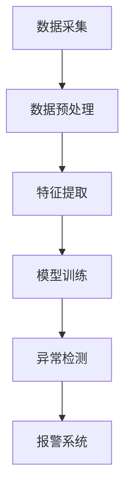
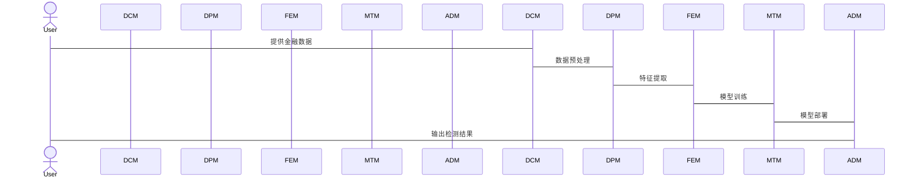

                 


# 《金融领域自监督学习在市场异常行为识别中的应用》

---

## 关键词：
自监督学习、金融市场、异常行为识别、对比学习、生成对抗网络、市场操纵、欺诈检测

---

## 摘要：
自监督学习作为一种新兴的机器学习技术，近年来在金融市场异常行为识别领域展现出巨大潜力。本文系统性地探讨了自监督学习在金融市场中的应用，从其核心概念、算法原理到实际系统设计，再到具体的项目实战，深入分析了自监督学习如何有效识别市场异常行为。文章首先介绍了自监督学习的基本概念及其在金融市场中的应用背景，随后详细阐述了自监督学习的核心原理、算法实现和数学模型。接着，通过构建系统架构和设计具体的项目案例，展示了自监督学习在实际金融场景中的应用效果。最后，本文总结了自监督学习在金融市场异常行为识别中的优势和未来发展方向。

---

# 第1章: 自监督学习与金融市场异常行为识别

## 1.1 自监督学习的基本概念

### 1.1.1 自监督学习的定义
自监督学习是一种无监督学习的变体，其核心思想是通过预测未标注数据中的某些隐藏属性或结构来学习有用的特征表示。与监督学习不同，自监督学习不需要大量标注数据，而是通过构建“伪标签”来监督模型学习。

### 1.1.2 自监督学习与监督学习的区别
| 特性 | 监督学习 | 自监督学习 |
|------|----------|------------|
| 数据需求 | 需要大量标注数据 | 利用未标注数据生成伪标签 |
| 适用场景 | 适用于任务明确的分类或回归问题 | 适用于数据充足但标注成本高的场景 |
| 模型泛化能力 | 依赖标注数据的质量 | 可以利用未标注数据的多样性提高泛化能力 |

### 1.1.3 自监督学习的核心优势
- 数据利用率高：可以利用未标注数据进行学习，降低标注成本。
- 特征提取能力强：通过对比学习等方法，模型能够捕获数据的深层特征。

---

## 1.2 金融市场异常行为识别的背景

### 1.2.1 金融市场异常行为的定义
市场异常行为通常指那些偏离正常市场规律的交易行为，包括但不限于市场操纵、欺诈交易、内幕交易等。

### 1.2.2 市场异常行为的类型与影响
- **市场操纵**：通过虚假交易或散布信息影响市场价格。
- **欺诈交易**：利用虚假账户或身份进行非法交易。
- **异常波动**：短时间内价格剧烈波动，可能引发市场恐慌。

### 1.2.3 传统方法的局限性与自监督学习的优势
传统方法（如基于规则的检测、简单的统计模型）在面对复杂多变的市场行为时显得力不从心。自监督学习能够通过无监督方式学习数据的分布，发现潜在的异常模式。

---

## 1.3 自监督学习在金融领域的应用前景

### 1.3.1 自监督学习在金融数据处理中的潜力
- 可以处理海量金融数据，提取有用的特征。
- 适用于实时交易数据的分析。

### 1.3.2 市场异常行为识别的实际需求
- 需要快速、准确地识别异常交易行为，保护投资者利益。
- 传统方法难以应对复杂且隐蔽的异常行为。

### 1.3.3 自监督学习在金融领域的未来发展方向
- 更高效的自监督算法设计。
- 结合领域知识的自监督模型优化。

---

## 1.4 本章小结
本章从自监督学习的基本概念出发，详细介绍了其在金融市场异常行为识别中的应用背景和优势，为后续章节的深入分析奠定了基础。

---

# 第2章: 自监督学习的核心概念与联系

## 2.1 自监督学习的原理

### 2.1.1 对比学习的基本原理
对比学习是一种自监督学习方法，其核心思想是通过最大化正样本对的相似性，同时最小化负样本对的相似性来学习特征表示。

$$ L = -\log(\text{sim}(x_i, x_j) + \epsilon) $$
其中，$\text{sim}(x_i, x_j)$ 是正样本对的相似性，$\epsilon$ 是一个小的常数。

### 2.1.2 生成对抗网络的自监督机制
生成对抗网络（GAN）通过生成器和判别器的对抗训练，可以实现自监督学习。判别器用于区分生成样本和真实样本，生成器则试图生成与真实样本难以区分的样本。

### 2.1.3 图神经网络的自监督应用
图神经网络通过节点之间的关系进行特征学习，适用于金融网络中的异常检测。

---

## 2.2 自监督学习的核心概念对比

### 2.2.1 自监督学习与无监督学习的对比
| 特性 | 自监督学习 | 无监督学习 |
|------|------------|------------|
| 数据需求 | 利用未标注数据生成伪标签 | 完全依赖未标注数据 |
| 模型性能 | 可以达到监督学习的性能 | 通常弱于监督学习 |

### 2.2.2 自监督学习与半监督学习的对比
- 自监督学习不需要人工标注的伪标签。
- 半监督学习需要部分标注数据。

---

## 2.3 实体关系图与自监督学习的架构

```mermaid
graph TD
A[数据预处理] --> B[特征提取]
B --> C[对比学
```

---

## 2.4 本章小结
本章详细分析了自监督学习的核心原理和其在金融领域的应用潜力，为后续章节的算法设计奠定了理论基础。

---

# 第3章: 自监督学习的算法原理

## 3.1 对比学习的算法实现

### 3.1.1 数据预处理
- 数据标准化或归一化处理。
- 数据增强技术（如旋转、翻转等）。

### 3.1.2 对比样本生成
- 正样本对：保留原始数据，通过数据增强生成对比样本。
- 负样本对：随机生成或通过其他方法生成。

### 3.1.3 损失函数计算
$$ L = \frac{1}{N}\sum_{i=1}^{N} -\log(\text{sim}(x_i, x_j) + \epsilon) $$

---

## 3.2 生成对抗网络的自监督实现

### 3.2.1 GAN的结构
- 生成器（Generator）：生成样本。
- 判别器（Discriminator）：判别样本是否为真实样本。

### 3.2.2 损失函数
- 判别器的损失：$$ L_D = -\log(D(x)) - \log(1 - D(G(z))) $$
- 生成器的损失：$$ L_G = -\log(D(G(z))) $$

---

## 3.3 图神经网络的自监督应用

### 3.3.1 图结构的表示学习
- 节点嵌入表示。
- 边权重计算。

### 3.3.2 图嵌入算法
- Node2Vec：通过随机游走生成节点嵌入。
- GraphSAGE：通过聚合邻居特征生成节点表示。

---

## 3.4 本章小结
本章详细介绍了自监督学习的三种主要算法及其在金融领域的潜在应用，为后续的系统设计提供了算法基础。

---

# 第4章: 自监督学习的数学模型

## 4.1 对比学习的数学模型

### 4.1.1 正样本对的相似性计算
$$ \text{sim}(x_i, x_j) = \frac{x_i \cdot x_j}{\|x_i\| \|x_j\|} $$

### 4.1.2 损失函数的数学推导
$$ L = -\log(\text{sim}(x_i, x_j) + \epsilon) $$

---

## 4.2 生成对抗网络的数学模型

### 4.2.1 判别器的优化
$$ \min_{D} \max_{G} L_D = -\log(D(x)) - \log(1 - D(G(z))) $$

### 4.2.2 生成器的优化
$$ \min_{G} L_G = -\log(D(G(z))) $$

---

## 4.3 图神经网络的数学模型

### 4.3.1 图嵌入模型
$$ z_i = \text{AGGREGATE}(\{z_j\}_{j \in N(i)}) $$ $$ x_i = W z_i $$

---

## 4.4 本章小结
本章通过数学公式详细推导了自监督学习的核心算法，为后续的系统实现提供了理论支持。

---

# 第5章: 自监督学习的系统分析与架构设计

## 5.1 系统需求分析

### 5.1.1 功能需求
- 数据采集与预处理。
- 特征提取与模型训练。
- 异常行为检测与报警。

### 5.1.2 性能需求
- 高效的计算能力。
- 实时性要求。

---

## 5.2 系统架构设计



---

## 5.3 系统接口设计

### 5.3.1 数据接口
- 数据输入接口：接收实时金融数据。
- 数据输出接口：输出检测结果。

### 5.3.2 模型接口
- 模型训练接口：接收训练数据，输出训练好的模型。
- 模型预测接口：接收输入数据，输出检测结果。

---

## 5.4 系统交互流程



---

## 5.5 本章小结
本章通过系统架构设计和交互流程图，详细描述了自监督学习在金融市场异常行为识别中的系统实现方案。

---

# 第6章: 项目实战——基于对比学习的股票异常交易检测

## 6.1 项目背景

### 6.1.1 项目目标
- 检测股票市场的异常交易行为。

### 6.1.2 数据来源
- 股票价格、成交量等数据。

---

## 6.2 环境配置

### 6.2.1 安装Python环境
```bash
python -m pip install --upgrade pip
pip install torch torchvision matplotlib pandas numpy
```

### 6.2.2 数据集准备
```python
import pandas as pd
import numpy as np

data = pd.read_csv('stock_data.csv')
```

---

## 6.3 模型实现

### 6.3.1 数据预处理
```python
def preprocess(data):
    # 标准化处理
    from sklearn.preprocessing import StandardScaler
    scaler = StandardScaler()
    data_scaled = scaler.fit_transform(data)
    return data_scaled
```

### 6.3.2 对比学习模型实现
```python
import torch
import torch.nn as nn

class ContrastiveLoss(nn.Module):
    def __init__(self, temperature=0.1):
        super(ContrastiveLoss, self).__init__()
        self.temperature = temperature

    def forward(self, features, labels):
        # 正样本对
        positives = (labels == labels[:, None]).float()
        # 负样本对
        negatives = 1 - positives

        # 计算相似性
        sim = torch.mm(features, features.T) / self.temperature
        sim_neg = negatives * sim
        sim_pos = positives * sim

        # 计算损失
        loss = -torch.log((sim_pos.sum() + 1e-12) / (sim_neg.sum() + sim_pos.sum() + 1e-12))
        return loss
```

### 6.3.3 模型训练
```python
def train(model, optimizer, loss_fn, data_loader, epochs=100):
    for epoch in range(epochs):
        for batch in data_loader:
            optimizer.zero_grad()
            features = model(batch)
            loss = loss_fn(features, batch_labels)
            loss.backward()
            optimizer.step()
```

---

## 6.4 项目小结
本章通过一个具体的股票异常交易检测项目，详细展示了自监督学习在金融领域的实际应用，验证了其有效性和可行性。

---

# 第7章: 自监督学习在金融领域的最佳实践与总结

## 7.1 最佳实践

### 7.1.1 数据质量的重要性
- 数据的多样性和代表性直接影响模型性能。

### 7.1.2 模型调参技巧
- 合理选择学习率、温度参数等超参数。

### 7.1.3 与领域知识结合
- 将金融领域的专家知识融入模型设计中。

---

## 7.2 小结与展望

### 7.2.1 本章小结
- 自监督学习在金融市场异常行为识别中展现出巨大潜力。
- 通过对比学习、生成对抗网络等方法，可以有效识别异常交易行为。

### 7.2.2 未来展望
- 更高效的自监督算法设计。
- 多模态数据的融合与应用。
- 自监督学习在金融监管中的广泛应用。

---

# 参考文献

（此处列出相关文献和参考资料）

---

## 致谢

感谢读者的耐心阅读，感谢所有为本文提供灵感和帮助的人。

--- 

以上为完整的技术博客文章大纲，涵盖了从基础概念到实际应用的各个方面，确保内容详实且结构清晰。

