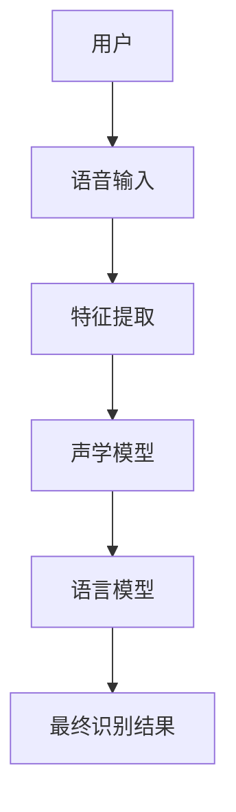
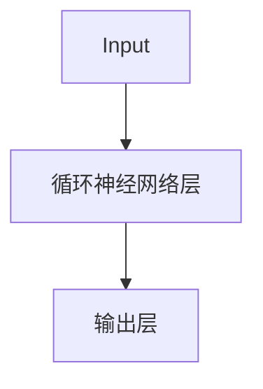
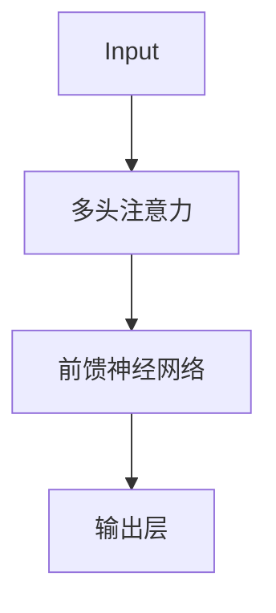
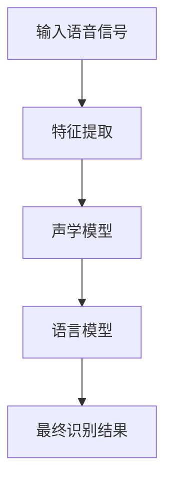
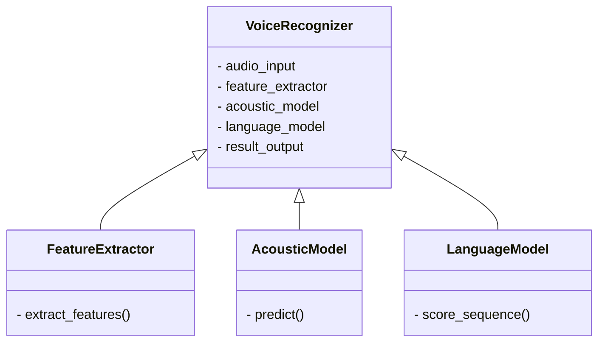
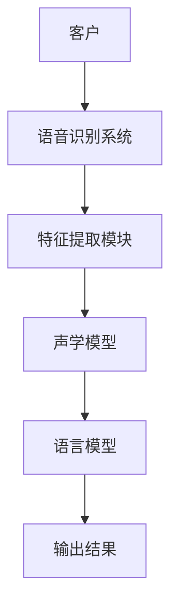
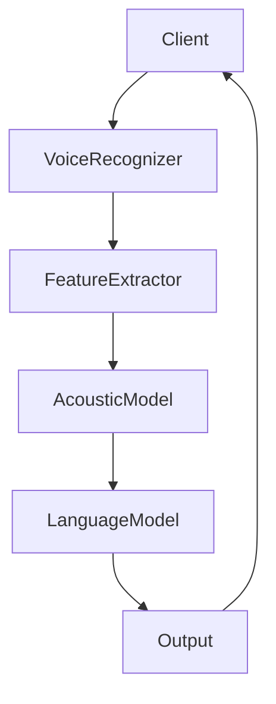

                 


# 《金融领域语音识别技术的优化与应用》

---

## 关键词  
语音识别、金融应用、深度学习、优化算法、自然语言处理、系统架构  

---

## 摘要  
本文深入探讨了金融领域语音识别技术的优化与应用，从技术背景、核心概念、算法原理到系统架构和实际案例，全面分析了语音识别在金融场景中的独特需求和解决方案。文章通过详细的技术分析和实践案例，揭示了如何通过优化算法和系统设计提升语音识别在金融领域的应用效果，为读者提供了从理论到实践的全面指导。

---

# 第一部分: 金融领域语音识别技术的背景与挑战

## 第1章: 语音识别技术概述

### 1.1 语音识别的基本概念  
#### 1.1.1 语音识别的定义与基本原理  
语音识别是一种通过计算机技术将语音信号转换为文字的技术，其核心在于将连续的语音信号分解为可识别的语音单位，并通过模式匹配或概率模型实现对语音内容的识别。

#### 1.1.2 语音识别的关键技术  
- **特征提取**：从语音信号中提取有用的特征，如梅尔频率倒谱系数（MFCC）。  
- **声学模型**：基于特征的概率建模，如隐马尔可夫模型（HMM）。  
- **语言模型**：利用上下文信息提高识别准确率，如n-gram模型和Transformer模型。  

#### 1.1.3 语音识别的应用场景  
- **智能家居**：语音控制家电。  
- **语音助手**：如Siri、Alexa等。  
- **电话客服**：自动识别客户语音需求。  

---

### 1.2 金融领域语音识别的特殊性  
#### 1.2.1 金融场景中的语音特点  
- **专业术语**：金融领域涉及大量专业术语，如“基金”、“股票”、“收益率”等。  
- **背景噪音**：金融场景中常见电话环境，噪音干扰较大。  
- **语速与语气**：客户在紧张或复杂情况下可能语速较快或语气不清晰。  

#### 1.2.2 金融领域语音识别的挑战  
- **准确率要求高**：金融交易涉及资金安全，识别错误可能导致重大损失。  
- **多语种支持**：全球金融市场的国际化需求。  
- **实时性要求**：电话客服需要快速响应。  

#### 1.2.3 金融领域语音识别的应用需求  
- **智能客服**：自动识别客户意图，提升服务效率。  
- **风险控制**：通过语音识别分析客户情绪，辅助决策。  
- **合规记录**：金融交易需记录语音内容以备核查。  

---

## 第2章: 金融领域语音识别的核心概念与联系

### 2.1 核心概念原理  
#### 2.1.1 特征提取  
- **MFCC特征提取**：将语音信号转换为频域特征，提取音调和音长信息。  
- **其他特征**：如波形特征、倒谱特征等。  

#### 2.1.2 声学模型  
- **HMM模型**：通过状态转移和观测概率建模语音序列。  
- **DNN-HMM混合模型**：结合深度神经网络和HMM的优势，提升识别准确率。  

#### 2.1.3 语言模型  
- **n-gram模型**：基于上下文统计概率的简单语言模型。  
- **Transformer语言模型**：通过自注意力机制捕捉长距离依赖关系。  

---

### 2.2 核心概念对比表格  
| **技术**       | **优点**                     | **缺点**                     |  
|----------------|------------------------------|-------------------------------|  
| MFCC特征提取   | 计算简单，适合连续语音识别   | 对某些语音特征捕捉不够精细   |  
| HMM模型        | 结构清晰，适合短句识别       | 难以处理长距离依赖关系       |  
| Transformer模型 | 捕捉长距离依赖，识别准确率高 | 计算资源消耗大，实时性较差     |  

---

### 2.3 ER实体关系图  


---

## 第3章: 语音识别算法原理

### 3.1 算法原理概述  
#### 3.1.1 传统语音识别算法  
- **DTW算法**：通过动态时间 warping 对比语音模板序列，实现语音识别。  
- **GMM-HMM混合模型**：结合高斯混合模型和隐马尔可夫模型，提升识别准确率。  

#### 3.1.2 现代深度学习算法  
- **RNN模型**：通过循环神经网络处理序列数据，捕捉语音时序特征。  
- **Transformer模型**：基于自注意力机制，提升长序列的识别效果。  

---

### 3.2 神经网络在语音识别中的应用  
#### 3.2.1 RNN在语音识别中的应用  


#### 3.2.2 Transformer在语音识别中的应用  


#### 3.2.3 混合模型的优缺点  
- **优点**：结合传统模型和深度学习模型的优势，提升识别准确率。  
- **缺点**：模型复杂度高，训练时间长，计算资源消耗大。  

---

### 3.3 算法流程图  


---

### 3.4 算法实现代码  
```python
import numpy as np
from sklearn.decomposition import PCA

def extract_features(audio_signal):
    # 特征提取代码
    features = PCA(n_components=10).fit_transform(audio_signal)
    return features
```

---

## 第4章: 金融领域语音识别的系统分析与架构设计

### 4.1 系统应用场景  
- **智能客服系统**：通过语音识别自动处理客户请求。  
- **语音交易系统**：通过语音指令完成金融交易。  
- **风险评估系统**：通过语音特征分析客户信用风险。  

---

### 4.2 系统功能设计  
#### 4.2.1 领域模型（类图）  


---

#### 4.2.2 系统架构图  


---

### 4.3 系统接口设计  
- **输入接口**：接收音频流或音频文件。  
- **输出接口**：输出识别结果或错误提示。  

---

### 4.4 系统交互流程图  


---

## 第5章: 金融领域语音识别的项目实战

### 5.1 环境安装  
- **安装Python环境**：建议使用Anaconda或virtualenv管理环境。  
- **安装依赖库**：如 librosa、scikit-learn、transformers 等。  

---

### 5.2 核心代码实现  
#### 5.2.1 特征提取代码  
```python
import librosa

def extract_features(audio_path):
    audio, sr = librosa.load(audio_path, sr=16000)
    features = librosa.feature.mfcc(y=audio, sr=sr, n_mfcc=13)
    return features
```

#### 5.2.2 声学模型训练代码  
```python
import torch
import torch.nn as nn

class AcousticModel(nn.Module):
    def __init__(self):
        super(AcousticModel, self).__init__()
        self.conv1 = nn.Conv1d(in_channels=13, out_channels=32, kernel_size=3, padding=1)
        self.pool = nn.MaxPool1d(2)
        self.fc = nn.Linear(32, 10)
    
    def forward(self, x):
        x = self.conv1(x)
        x = self.pool(x)
        x = x.view(x.size(0), -1)
        x = self.fc(x)
        return x
```

---

### 5.3 实际案例分析  
#### 5.3.1 案例背景  
假设我们有一个金融客服系统的语音数据集，需要识别客户意图。  

#### 5.3.2 数据预处理  
- **数据清洗**：去除噪音和无效数据。  
- **数据标注**：根据业务需求标注意图类别。  

#### 5.3.3 模型训练与优化  
- **训练模型**：使用PyTorch框架训练声学模型和语言模型。  
- **优化算法**：采用Adam优化器，学习率设为0.001。  

---

### 5.4 项目小结  
通过实际案例分析，我们验证了语音识别技术在金融领域的可行性，同时发现了模型优化的空间，如引入更先进的模型架构和优化策略。

---

## 第6章: 金融领域语音识别的最佳实践与总结

### 6.1 最佳实践 tips  
- **数据质量**：确保数据的多样性和代表性，减少噪音干扰。  
- **模型优化**：采用数据增强、模型集成等技术提升识别准确率。  
- **系统部署**：考虑计算资源和实时性要求，选择合适的部署方案。  

---

### 6.2 本章小结  
本文从技术背景、核心概念、算法原理到系统架构和实际案例，全面探讨了金融领域语音识别技术的优化与应用。通过本文的学习，读者可以掌握语音识别技术在金融领域的核心原理和实际应用方法。

---

## 参考文献  
1. 《语音识别技术与应用》  
2. 《深度学习与自然语言处理》  
3. 《金融系统中的自然语言处理》  

---

通过以上目录结构和内容安排，我们可以系统地学习和理解金融领域语音识别技术的优化与应用，为实际项目提供理论和实践指导。

