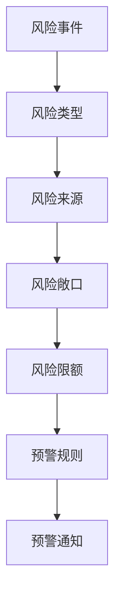
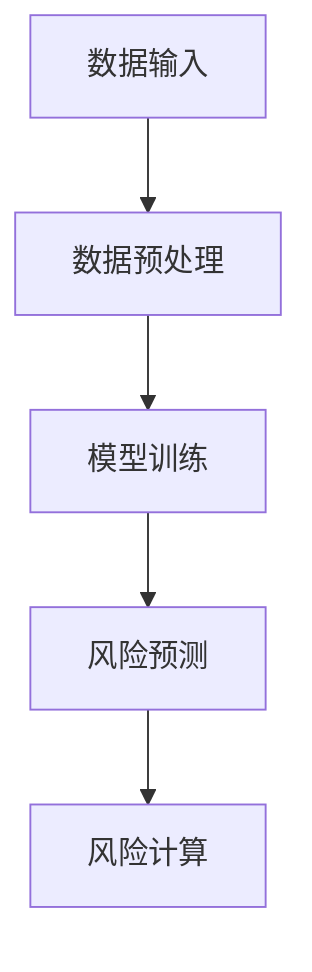

                 


```markdown
# 金融风险限额突破预警系统

> 关键词：金融风险管理，风险限额，预警系统，时间序列分析，机器学习，系统架构

> 摘要：本文深入探讨了金融风险限额突破预警系统的构建与实现。通过分析金融风险管理的重要性，详细讲解了系统的核心概念、算法原理、系统架构设计以及实际项目案例，帮助读者全面理解如何利用技术手段实现金融风险的实时监测与预警。

---

## 第一章：问题背景与核心概念

### 1.1 问题背景

#### 1.1.1 金融风险管理的重要性
金融市场的波动性和不确定性使得风险管理成为机构稳健运营的关键。通过实时监控和预警，机构能够及时应对潜在风险，避免重大损失。

#### 1.1.2 风险限额突破的潜在危害
当风险敞口超过设定的限额时，机构可能面临巨大损失，甚至引发系统性风险。因此，建立有效的预警系统至关重要。

#### 1.1.3 系统预警的必要性
通过技术手段实现风险的自动化监测，能够在风险突破前发出预警，为决策者提供及时的应对策略。

### 1.2 核心概念与定义

#### 1.2.1 风险限额的定义与计算方法
风险限额是基于机构的风险承受能力和战略目标设定的 thresholds，用于衡量允许的风险暴露程度。

#### 1.2.2 风险突破预警的定义
当实际风险敞口超过设定的限额时，系统触发预警机制，通知相关部门采取措施。

#### 1.2.3 系统预警机制的核心要素
- 数据采集与处理：实时获取市场数据和交易信息。
- 风险计算：基于模型计算当前风险敞口。
- 预警触发：当风险超过限额时，触发预警。
- 通知与响应：通过邮件、短信等方式通知相关人员，并启动应对措施。

---

## 第二章：核心概念与联系

### 2.1 核心概念原理

#### 2.1.1 风险计算模型
- **VaR（Value at Risk）**：计算在特定置信水平下的潜在损失。
- **CVaR（Conditional VaR）**：考虑尾部风险的VaR扩展。

#### 2.1.2 预警触发条件
- **单变量触发**：单一风险指标超过阈值。
- **多变量触发**：多个指标同时超出阈值。

#### 2.1.3 系统响应机制
- **优先级响应**：根据预警级别启动不同级别的应对措施。
- **自动化响应**：系统自动执行预设的交易策略。

### 2.2 概念属性特征对比

| 概念       | 属性                 | 特征对比       |
|------------|----------------------|----------------|
| 风险类型     | 市场风险、信用风险、操作风险 | 不同风险类型有不同的计算方法 |
| 风险来源     | 市场波动、交易错误、模型缺陷 | 来源不同，预警机制不同       |
| 预警级别     | 一级、二级、三级、四级     | 级别越高，风险越大         |

### 2.3 ER实体关系图



---

## 第三章：算法原理讲解

### 3.1 风险计算算法

#### 3.1.1 时间序列分析



#### 3.1.2 代码实现

```python
import pandas as pd
from sklearn.model_selection import train_test_split
from sklearn.metrics import mean_squared_error

# 示例数据加载
data = pd.read_csv('risk_data.csv')
X = data.drop('risk_value', axis=1)
y = data['risk_value']

# 数据分割
X_train, X_test, y_train, y_test = train_test_split(X, y, test_size=0.2)

# 模型训练
model = YourModel()
model.fit(X_train, y_train)

# 预测
y_pred = model.predict(X_test)

# 评估
mse = mean_squared_error(y_test, y_pred)
print(f'均方误差: {mse}')
```

#### 3.1.3 数学模型与公式

$$
\text{VaR} = \mu + z \cdot \sigma
$$

其中：
- $\mu$ 是平均值
- $z$ 是标准正态分布的分位数
- $\sigma$ 是标准差

---

## 第四章：系统分析与架构设计

### 4.1 系统架构设计


### 4.2 接口设计与交互流程


---

## 第五章：项目实战

### 5.1 实战环境安装

```bash
pip install numpy pandas scikit-learn
```

### 5.2 核心代码实现

```python
def calculate_risk():
    data = pd.read_csv('risk_data.csv')
    # 数据处理
    processed_data = preprocess(data)
    # 风险计算
    risk_value = model.predict(processed_data)
    return risk_value
```

### 5.3 实际案例分析

案例：某银行交易系统中，某只股票的风险敞口突然激增，系统及时触发预警，帮助机构在损失扩大前采取平仓措施。

---

## 第六章：最佳实践

### 6.1 小结
本文详细介绍了金融风险限额突破预警系统的构建与实现，从理论到实践，为金融机构提供了技术参考。

### 6.2 注意事项
- 数据的实时性和准确性是系统运行的关键。
- 系统的可扩展性和灵活性需要充分考虑。
- 预警规则的制定应结合机构的实际情况。

### 6.3 扩展阅读
- 《金融风险管理》
- 《时间序列分析与预测》
- 《机器学习在金融中的应用》

---

## 结语
金融风险限额突破预警系统的建立是金融机构风险管理的重要工具。通过技术手段实现风险的实时监测和预警，能够有效降低风险敞口，保障机构的稳健运营。
```

