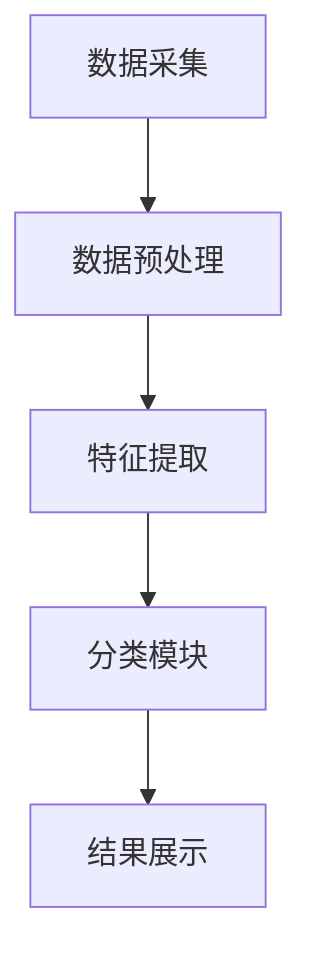
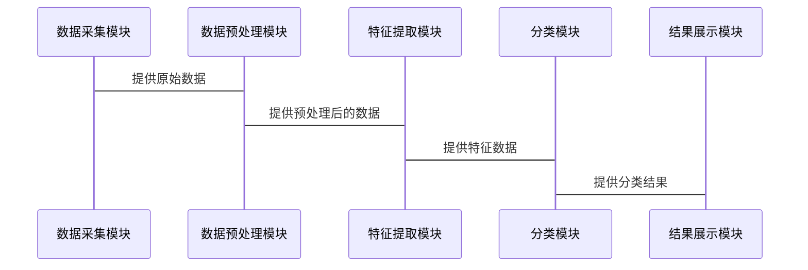

                 


# 《金融高频交易信号检测与分类》

## 关键词：高频交易、信号检测、分类算法、时间序列、金融数据分析

## 摘要：

本文深入探讨了金融高频交易中的信号检测与分类问题。首先介绍了高频交易的基本概念和信号检测的重要性，然后详细分析了信号检测的核心概念与分类方法。接着，从数学模型和算法原理的角度，讲解了时间序列分析和常见分类算法的实现。随后，通过系统架构设计展示了高频交易信号检测的实际应用，并通过项目实战部分给出了具体的代码实现和案例分析。最后，总结了高频交易信号检测的关键点和未来研究方向。

---

## 第1章: 高频交易与信号检测概述

### 1.1 高频交易的基本概念

高频交易（High-Frequency Trading, HFT）是指通过使用复杂的算法和高频数据，以极快的速度进行买卖交易的一种交易方式。高频交易的特点是交易速度快、交易次数多、依赖技术优势。高频交易在金融市场中扮演着重要角色，能够捕捉市场中的微小价格波动，从而获取利润。

#### 1.1.1 高频交易的定义与特点

- **定义**：高频交易是一种利用计算机算法在极短时间内进行大量交易的策略。
- **特点**：
  - 交易速度快：高频交易通常在 milliseconds 级别完成。
  - 交易次数多：高频交易策略可能在一天内进行成千上万次交易。
  - 技术依赖性强：依赖高性能计算机、低延迟网络和高效的算法。

#### 1.1.2 高频交易的演变

- 从手动交易到自动交易的演变。
- 技术进步推动高频交易的发展，如高速网络、算法优化和大数据处理技术的进步。

### 1.2 信号检测与分类的背景与意义

在高频交易中，信号检测与分类是关键的一步。信号检测指的是从高频数据中识别出有用的交易信号，而信号分类则是将这些信号进行分类，以便更好地理解和利用这些信号进行交易决策。

#### 1.2.1 金融市场的信号类型

- **价格信号**：价格的波动、趋势变化。
- **成交量信号**：成交量的变化反映了市场的活跃程度。
- **情绪信号**：市场参与者的情绪变化影响价格走势。

#### 1.2.2 信号检测与分类的意义

- **提高交易效率**：通过快速检测和分类信号，交易者可以更快地做出决策。
- **优化交易策略**：通过对信号的分类，交易者可以更好地理解市场行为，优化交易策略。
- **降低交易风险**：及时检测和分类异常信号，有助于避免重大损失。

### 1.3 信号检测与分类的基本流程

信号检测与分类的基本流程包括以下几个步骤：

1. **数据采集**：从金融市场中获取高频数据，如股票价格、指数、成交量等。
2. **数据预处理**：对数据进行清洗、标准化和特征提取。
3. **特征工程**：构建有助于分类的特征，如统计特征、技术指标等。
4. **模型训练**：使用机器学习或深度学习算法训练分类模型。
5. **结果评估**：对模型进行性能评估，优化模型参数。

---

## 第2章: 核心概念与原理

### 2.1 信号特征分析

信号特征分析是信号检测与分类的基础。通过分析信号的特征，可以更好地理解信号的内在规律，从而提高分类的准确性。

#### 2.1.1 时间序列特征

时间序列特征是高频交易信号分析的重要组成部分。常见的时间序列特征包括：

- **均值**：价格的平均值。
- **标准差**：价格波动的幅度。
- **自相关性**：序列中当前值与过去值的相关性。
- **周期性**：序列中是否存在周期性波动。

#### 2.1.2 统计特征与技术指标

统计特征和常用的技术指标可以帮助我们更好地理解市场行为。

- **统计特征**：如均值、标准差、偏度、峰度等。
- **技术指标**：如移动平均线（MA）、相对强弱指数（RSI）、MACD等。

#### 2.1.3 高频交易中的特征工程

特征工程是信号分类的关键步骤。通过构建合适的特征，可以提高分类模型的性能。

- **统计特征**：如价格变化率、成交量变化率等。
- **技术指标**：如RSI、MACD等。
- **市场情绪特征**：如市场参与者的情绪指数。

### 2.2 分类方法与模型选择

分类方法与模型选择是信号分类的核心问题。选择合适的分类方法可以显著提高分类的准确性。

#### 2.2.1 监督学习与无监督学习

- **监督学习**：需要标注的数据进行训练，如决策树、随机森林、SVM等。
- **无监督学习**：不需要标注的数据进行训练，如聚类分析。

#### 2.2.2 常见分类算法对比

- **SVM**：适合小样本数据，分类性能好。
- **随机森林**：适合大数据，具有高鲁棒性。
- **神经网络**：适合复杂的非线性分类问题。

#### 2.2.3 分类模型的性能评估

- **准确率**：分类正确的比例。
- **召回率**：实际为正类的样本中被正确分类的比例。
- **F1分数**：准确率和召回率的调和平均数。

---

## 第3章: 数学模型与算法实现

### 3.1 时间序列模型

时间序列模型是高频交易信号检测的重要工具。常用的时间序列模型包括ARIMA、LSTM和GARCH等。

#### 3.1.1 ARIMA模型

ARIMA（Auto-Regressive Integrated Moving Average）模型是一种广泛应用于时间序列预测的模型。

- **ARIMA模型的数学公式**：
  $$ ARIMA(p, d, q) $$
  其中，p为自回归阶数，d为差分阶数，q为移动平均阶数。

- **ARIMA模型的实现步骤**：
  1. 数据预处理：对数据进行差分，使其平稳。
  2. 参数估计：通过最大似然估计法估计模型参数。
  3. 模型验证：检验残差的白噪声性质。

#### 3.1.2 LSTM网络

LSTM（Long Short Term Memory）网络是一种特殊的RNN（循环神经网络），适合处理长序列数据。

- **LSTM网络的结构**：
  - **输入门（Input Gate）**：控制信息的输入。
  - **遗忘门（Forget Gate）**：控制信息的遗忘。
  - **输出门（Output Gate）**：控制信息的输出。

- **LSTM网络的数学公式**：
  $$ f_t = \sigma(W_f \cdot [h_{t-1}, x_t] + b_f) $$
  $$ i_t = \sigma(W_i \cdot [h_{t-1}, x_t] + b_i) $$
  $$ o_t = \sigma(W_o \cdot [h_{t-1}, x_t] + b_o) $$
  $$ c_t = f_t \cdot c_{t-1} + i_t \cdot tanh(W_c \cdot [h_{t-1}, x_t] + b_c) $$
  $$ h_t = o_t \cdot tanh(c_t) $$

#### 3.1.3 GARCH模型

GARCH（Generalized Autoregressive Conditional Heteroscedasticity）模型用于估计和预测金融资产的波动性。

- **GARCH模型的数学公式**：
  $$ y_t = \mu + \sigma_t z_t $$
  $$ \sigma_t^2 = \alpha_0 + \sum_{i=1}^q \alpha_i y_{t-i}^2 $$
  其中，$z_t$是标准正态分布的随机变量。

### 3.2 分类算法原理

分类算法是信号分类的核心工具。常用的分类算法包括支持向量机（SVM）、随机森林和神经网络。

#### 3.2.1 SVM

- **SVM的数学公式**：
  $$ \text{目标函数}：\min_{w,b,\xi} \frac{1}{2}||w||^2 + C \sum_{i=1}^n \xi_i $$
  $$ \text{约束条件}：y_i (w \cdot x_i + b) \geq 1 - \xi_i $$
  $$ \xi_i \geq 0 $$

- **SVM的实现步骤**：
  1. 数据预处理：对数据进行标准化。
  2. 核函数选择：选择合适的核函数（如RBF、线性核）。
  3. 模型训练：使用SVM算法训练分类模型。
  4. 模型评估：计算准确率、召回率等指标。

#### 3.2.2 随机森林

- **随机森林的原理**：
  随机森林是一种基于决策树的集成学习方法。通过构建多棵决策树，并将它们的预测结果进行投票或平均，可以提高分类的准确性和鲁棒性。

- **随机森林的实现步骤**：
  1. 数据预处理：对数据进行标准化或归一化。
  2. 特征选择：随机选择部分特征进行训练。
  3. 模型训练：构建多棵决策树。
  4. 模型预测：对测试数据进行预测，并计算准确率等指标。

---

## 第4章: 系统架构设计

### 4.1 问题场景介绍

高频交易信号检测与分类系统需要处理大量的高频数据，并实时进行信号检测与分类。系统需要具备高效的数据处理能力、快速的计算能力和稳定的运行能力。

### 4.2 系统功能设计

#### 4.2.1 数据采集模块

- **功能**：从金融市场中采集高频数据，如股票价格、指数、成交量等。
- **实现**：使用API接口（如WebSocket）实时获取数据。

#### 4.2.2 数据预处理模块

- **功能**：对采集到的数据进行清洗、标准化和特征提取。
- **实现**：使用Python的Pandas库进行数据处理。

#### 4.2.3 特征提取模块

- **功能**：构建有助于分类的特征，如统计特征、技术指标等。
- **实现**：使用Python的Scikit-learn库进行特征工程。

#### 4.2.4 分类模块

- **功能**：对提取的特征进行分类，识别出交易信号。
- **实现**：使用机器学习算法（如SVM、随机森林）或深度学习算法（如LSTM）进行分类。

#### 4.2.5 结果展示模块

- **功能**：展示分类结果，提供直观的可视化界面。
- **实现**：使用Python的Matplotlib或Seaborn库进行可视化。

### 4.3 系统架构设计

#### 4.3.1 系统架构图



#### 4.3.2 系统交互流程



---

## 第5章: 项目实战

### 5.1 环境配置

- **Python版本**：3.8以上
- **依赖库**：numpy、pandas、scikit-learn、tensorflow、matplotlib

### 5.2 数据集介绍

- 数据来源：股票价格数据（如股票代码：AAPL）
- 数据格式：CSV文件，包含日期、开盘价、收盘价、最高价、最低价、成交量等。

### 5.3 核心代码实现

#### 5.3.1 数据采集

```python
import pandas as pd
import requests

url = "https://api.example.com/stock_data"
params = {"symbol": "AAPL", "start_date": "2021-01-01", "end_date": "2021-12-31"}
response = requests.get(url, params=params)
data = response.json()
df = pd.DataFrame(data)
```

#### 5.3.2 数据预处理

```python
from sklearn.preprocessing import StandardScaler

# 标准化处理
scaler = StandardScaler()
scaled_data = scaler.fit_transform(df[['open', 'high', 'low', 'close', 'volume']])
```

#### 5.3.3 特征提取

```python
from sklearn.feature_selection import SelectKBest, f_regression

selector = SelectKBest(score_func=f_regression, k=5)
selected_features = selector.fit_transform(scaled_data, target)
```

#### 5.3.4 模型训练

```python
from sklearn.ensemble import RandomForestClassifier

model = RandomForestClassifier(n_estimators=100, max_depth=10, random_state=42)
model.fit(selected_features, target)
```

#### 5.3.5 模型预测

```python
from sklearn.metrics import accuracy_score, recall_score, f1_score

y_pred = model.predict(selected_features_test)
print(f"准确率：{accuracy_score(y_true, y_pred)}")
print(f"召回率：{recall_score(y_true, y_pred)}")
print(f"F1分数：{f1_score(y_true, y_pred)}")
```

---

## 第6章: 总结与展望

### 6.1 总结

本文详细探讨了金融高频交易信号检测与分类的实现过程。通过分析高频交易的基本概念、信号检测的核心概念与分类方法，以及数学模型与算法原理，展示了如何通过系统架构设计和项目实战实现高频交易信号的检测与分类。

### 6.2 未来展望

高频交易信号检测与分类是一个复杂的任务，未来的研究方向包括：

- **算法优化**：研究更高效的算法，如深度学习中的Transformer结构。
- **特征工程**：探索更多有助于分类的特征，如市场情绪特征、新闻事件特征等。
- **系统优化**：优化系统的实时性、稳定性和可扩展性。

---

## 参考文献

- 文献1：高频交易相关研究
- 文献2：时间序列分析相关研究
- 文献3：机器学习在金融中的应用相关研究

---

通过本文的学习，读者可以掌握金融高频交易信号检测与分类的核心技术，并能够将其应用于实际的金融交易中。

