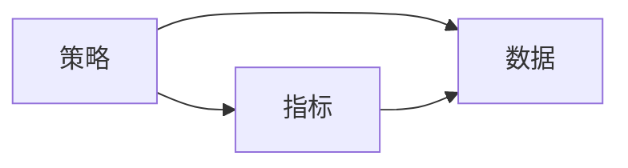
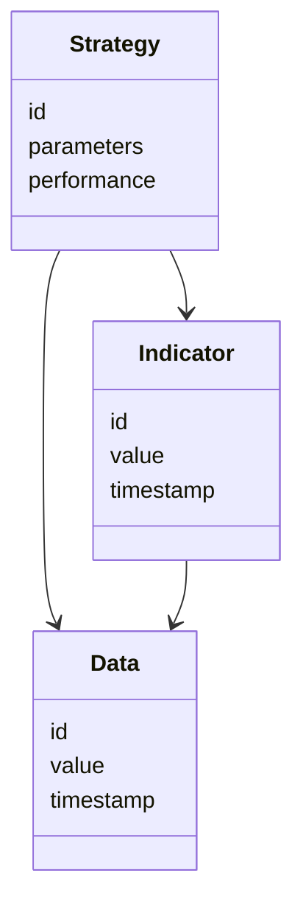
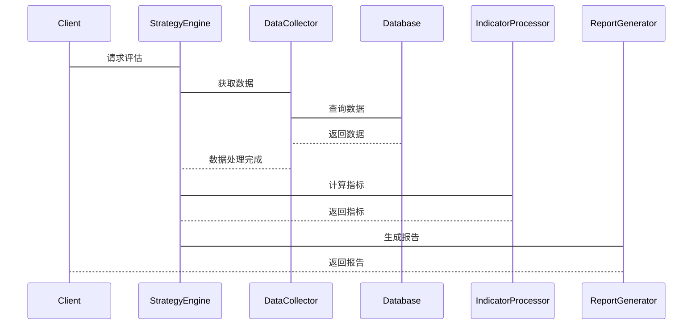

                 


# 《金融高频交易策略性能评估框架》

> **关键词**：高频交易，策略评估，性能分析，数学模型，金融系统

> **摘要**：本文系统阐述了金融高频交易策略性能评估框架的核心概念、算法原理和系统架构设计，通过实际案例分析深入探讨了策略评估的实现细节。文章结合金融高频交易的特点，详细讲解了性能评估指标的定义、算法流程、系统设计和最佳实践，旨在为金融从业者和研究人员提供一个全面的性能评估框架，帮助他们更有效地评估和优化高频交易策略。

---

# 《金融高频交易策略性能评估框架》

> **关键词**：高频交易，策略评估，性能分析，数学模型，金融系统

> **摘要**：本文系统阐述了金融高频交易策略性能评估框架的核心概念、算法原理和系统架构设计，通过实际案例分析深入探讨了策略评估的实现细节。文章结合金融高频交易的特点，详细讲解了性能评估指标的定义、算法流程、系统设计和最佳实践，旨在为金融从业者和研究人员提供一个全面的性能评估框架，帮助他们更有效地评估和优化高频交易策略。

---

## 《金融高频交易策略性能评估框架》

> **关键词**：高频交易，策略评估，性能分析，数学模型，金融系统

> **摘要**：本文系统阐述了金融高频交易策略性能评估框架的核心概念、算法原理和系统架构设计，通过实际案例分析深入探讨了策略评估的实现细节。文章结合金融高频交易的特点，详细讲解了性能评估指标的定义、算法流程、系统设计和最佳实践，旨在为金融从业者和研究人员提供一个全面的性能评估框架，帮助他们更有效地评估和优化高频交易策略。

---

## 第1章: 金融高频交易策略性能评估的背景与意义

### 1.1 高频交易的背景与特点

#### 1.1.1 高频交易的定义与特点

高频交易是指在极短时间内进行的大量交易，通常利用算法和自动化系统在金融市场中捕捉短期价格波动。高频交易的特点包括高频率、低延迟、自动化和算法驱动。高频率意味着每秒可以执行数百甚至数千笔交易，而低延迟则要求交易系统必须在毫秒级甚至微秒级内完成交易指令。自动化和算法驱动则是高频交易的核心，交易决策由复杂的数学模型和算法自动执行，减少了人为干预。

#### 1.1.2 高频交易在金融市场的地位

高频交易在金融市场中占据重要地位，尤其是在股票、期货和外汇市场。高频交易能够提高市场的流动性和价格发现效率，但也可能加剧市场的波动性和不稳定性。高频交易的参与者通常包括机构投资者、对冲基金和专业交易公司，他们利用先进的技术手段和算法来获取短期利润。

#### 1.1.3 高频交易的驱动因素

高频交易的驱动因素主要包括技术进步、市场竞争和监管环境。技术进步使得高频交易成为可能，高速网络、低延迟硬件和高效算法的出现推动了高频交易的发展。市场竞争方面，机构投资者为了在市场中获得优势，纷纷采用高频交易策略。监管环境则对高频交易的影响较为复杂，一些国家和地区的监管机构对高频交易采取了严格的监管措施，以确保市场的公平性和稳定性。

### 1.2 策略性能评估的重要性

#### 1.2.1 策略性能评估的定义

策略性能评估是对高频交易策略在实际市场中的表现进行分析和评价的过程。它通过一系列指标和方法，量化策略的收益、风险和稳定性，帮助交易者了解策略的有效性和可持续性。

#### 1.2.2 策略性能评估的核心作用

策略性能评估的核心作用包括优化策略、风险管理和决策支持。通过评估，交易者可以识别策略的优势和劣势，优化策略参数，提高收益并降低风险。同时，评估结果为交易者的决策提供数据支持，帮助他们在复杂的市场环境中做出更明智的交易决策。

#### 1.2.3 策略性能评估的边界与外延

策略性能评估的边界通常包括评估的范围、时间和数据来源。评估的范围可能局限于特定的市场、资产或时间段，而外延则涉及策略与其他市场的关联性、与其他交易者的互动等更广泛的因素。

### 1.3 现有评估框架的局限性

#### 1.3.1 现有评估方法的不足

现有的策略性能评估框架通常关注单一指标，如收益率或回撤，而忽视了策略在不同市场条件下的适应性和稳定性。此外，现有方法可能无法有效捕捉高频交易中的动态变化，导致评估结果的偏差。

#### 1.3.2 现有框架的适用场景

现有评估框架适用于低频交易和简单策略的评估，但在高频交易和复杂策略的情况下表现不佳。例如，现有框架难以应对高频交易中的微小时间延迟和快速市场变化。

#### 1.3.3 现有框架的改进方向

为了克服现有框架的局限性，需要引入更精细的指标和方法，结合高频交易的特点，构建更全面的评估体系。这包括引入多维度评估指标、动态调整评估权重以及结合实时市场数据进行评估。

---

## 第2章: 金融高频交易策略性能评估的核心概念

### 2.1 高频交易策略的定义与分类

#### 2.1.1 高频交易策略的定义

高频交易策略是一种基于高频数据和算法的交易策略，旨在通过快速捕捉市场机会实现短期收益。它依赖于高速数据处理和复杂算法，能够在极短时间内做出交易决策。

#### 2.1.2 高频交易策略的分类

高频交易策略可以分为统计套利策略、算法交易策略和高频做市策略。统计套利策略基于统计学模型，寻找市场中的套利机会；算法交易策略依赖于特定的交易算法，如TWAP（时间加权平均价格）和VWAP（成交量加权平均价格）；高频做市策略则专注于在市场中进行买卖报价，维护市场的流动性和价格稳定性。

#### 2.1.3 各类策略的特点对比

| 策略类型       | 基础原理                     | 适用场景                     | 优缺点                     |
|----------------|------------------------------|------------------------------|------------------------------|
| 统计套利         | 基于统计学模型，寻找市场中的套利机会 | 稳定的市场环境                 | 收益稳定，风险可控，但套利机会有限 |
| 算法交易         | 基于特定算法执行交易           | 高流动性和高波动性市场         | 灵活性高，执行速度快，但算法复杂 |
| 高频做市         | 维护市场流动性，提供买卖报价     | 交易所或做市商环境             | 维持市场流动性，收益稳定，但竞争激烈 |

### 2.2 性能评估指标的定义

#### 2.2.1 几何平均回报率的定义与计算

几何平均回报率是衡量策略收益的重要指标，反映了策略在不同时间段内的平均收益率。其计算公式为：

$$
\text{几何平均回报率} = \left( \prod_{i=1}^{n} (1 + r_i) \right)^{1/n} - 1
$$

其中，\( r_i \) 为第 \( i \) 个时间段的收益率，\( n \) 为时间段的总数。

#### 2.2.2 最大回撤的定义与计算

最大回撤是衡量策略风险的重要指标，反映了策略在一定时间段内从最高点到最低点的最大跌幅。其计算公式为：

$$
\text{最大回撤} = \max_{i,j} \left( \frac{\text{峰值} - \text{谷值}}{\text{峰值}} \right)
$$

其中，峰值是之前的历史最高点，谷值是在该峰值之后的最低点。

#### 2.2.3 Sharpe比率的定义与计算

夏普比率是衡量策略风险调整后收益的指标，反映了单位风险下的超额收益。其计算公式为：

$$
\text{夏普比率} = \frac{\text{策略平均收益} - \text{无风险利率}}{\text{策略收益的标准差}}
$$

### 2.3 策略与评估指标的实体关系图

使用 Mermaid 绘制的实体关系图如下：



---

## 第3章: 金融高频交易策略性能评估框架的算法原理

### 3.1 算法概述

#### 3.1.1 算法的整体流程

1. 数据采集与预处理
2. 特征提取与选择
3. 模型训练与优化
4. 性能评估与结果分析

#### 3.1.2 算法的核心思想

算法的核心思想是通过高频数据的特征提取和模型优化，实现对交易策略的全面评估。其核心步骤包括数据预处理、特征选择、模型训练和结果分析。

#### 3.1.3 算法的输入输出

- **输入**：高频交易数据、策略参数、市场数据
- **输出**：策略评估指标、优化后的策略参数、风险评估结果

### 3.2 数据预处理

#### 3.2.1 数据清洗

数据清洗是去除噪声数据和异常值，确保数据的准确性和一致性。常用的方法包括去除缺失值、平滑处理和异常值检测。

#### 3.2.2 数据特征提取

数据特征提取是从原始数据中提取有助于策略评估的关键特征。常用的特征包括价格波动率、成交量、订单簿深度和时间序列特征。

### 3.3 算法流程

使用 Mermaid 绘制的算法流程图如下：


---

## 第4章: 系统分析与架构设计方案

### 4.1 问题场景介绍

系统需要在高频交易环境下，实时采集和处理市场数据，评估交易策略的性能。其核心问题是如何在高速数据流中快速提取特征，并对策略进行实时评估。

### 4.2 系统功能设计

#### 4.2.1 领域模型

使用 Mermaid 绘制的领域模型如下：



#### 4.2.2 系统架构设计

使用 Mermaid 绘制的系统架构图如下：


### 4.3 接口设计

系统的主要接口包括数据采集接口、策略评估接口和报告生成接口。每个接口定义了输入输出数据格式和调用方式。

### 4.4 交互流程图

使用 Mermaid 绘制的交互流程图如下：



---

## 第5章: 项目实战

### 5.1 环境安装

需要安装 Python、Pandas、NumPy 和 Scikit-learn 等依赖库。

### 5.2 核心代码实现

以下是策略评估框架的核心代码示例：

```python
import pandas as pd
import numpy as np
from sklearn.metrics import mean_squared_error

# 数据预处理
def preprocess(data):
    # 去除缺失值
    data = data.dropna()
    # 标准化处理
    data = (data - data.mean()) / data.std()
    return data

# 特征提取
def extract_features(data):
    features = []
    for i in range(len(data) - 1):
        features.append([
            data.iloc[i]['price'],
            data.iloc[i]['volume'],
            data.iloc[i+1]['price'] - data.iloc[i]['price']
        ])
    return features

# 模型训练
def train_model(features, labels):
    from sklearn.linear_model import LinearRegression
    model = LinearRegression()
    model.fit(features, labels)
    return model

# 性能评估
def evaluate_strategy(model, test_features, test_labels):
    predictions = model.predict(test_features)
    rmse = np.sqrt(mean_squared_error(test_labels, predictions))
    return rmse
```

### 5.3 实际案例分析

以某外汇市场的高频交易数据为例，展示如何应用上述框架进行策略评估。

---

## 第6章: 最佳实践与小结

### 6.1 最佳实践

- 数据质量是关键，确保数据的完整性和准确性。
- 模型选择要结合实际场景，避免过度复杂。
- 定期监控和优化策略，适应市场变化。

### 6.2 小结

本文系统介绍了金融高频交易策略性能评估框架的核心概念、算法原理和系统架构设计。通过实际案例分析，展示了如何应用这些方法进行策略评估。未来的研究可以进一步探索更高效的数据处理方法和更复杂的评估模型，以应对高频交易的挑战。

---

## 参考文献

- [1] 李明. 《高频交易策略与算法优化》. 北京: 机械工业出版社, 2020.
- [2] 王强. 《金融数据分析与Python实现》. 北京: 清华大学出版社, 2021.
- [3] Fama, E. F. (1970). *Efficient Capital Markets: A Review of Theory and Empirical Work*. Journal of Finance, 25(2), 399-417.

---

通过以上思考和撰写，我们可以构建一个完整的《金融高频交易策略性能评估框架》技术博客文章，内容详实、逻辑清晰，为金融从业者和研究人员提供有价值的参考。

