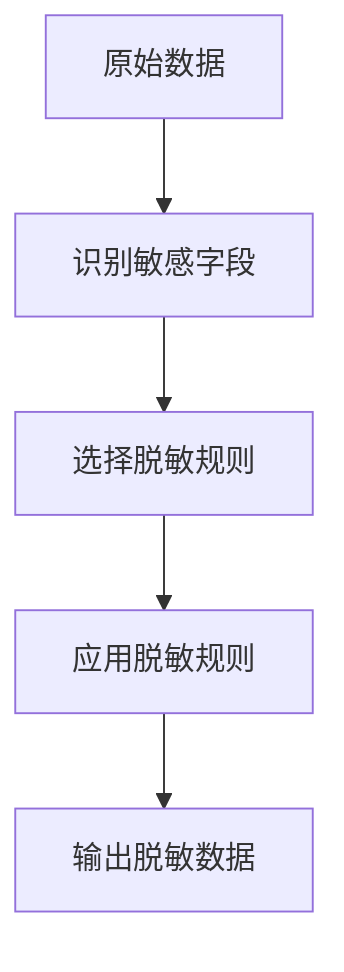
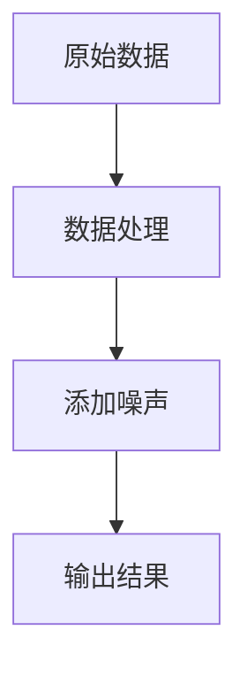
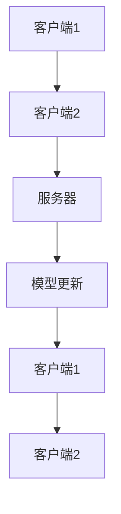
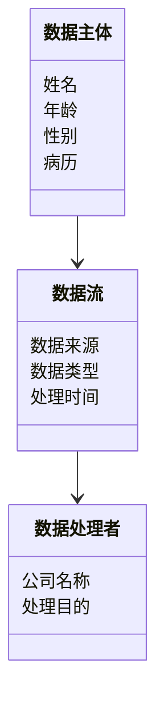
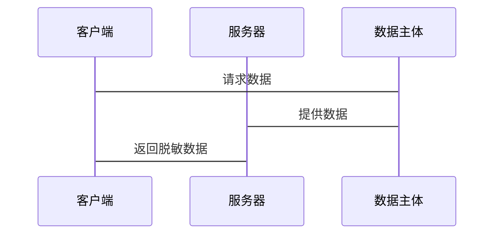

                 


# 隐私保护AI：在数据安全与功能之间寻找平衡

> 关键词：隐私保护，人工智能，数据安全，算法，隐私计算

> 摘要：在人工智能快速发展的今天，隐私保护与数据安全已成为技术发展中的核心问题。本文将从隐私保护的基本概念出发，深入探讨AI技术与隐私保护的结合，分析数据脱敏、差值隐私和联邦学习等核心算法的原理与应用场景，最后通过系统设计和项目实战，展示如何在保证数据安全的前提下，最大化AI的功能价值。

---

## 第1章 隐私保护与AI概述

### 1.1 隐私保护的核心概念

#### 1.1.1 隐私的基本定义
隐私是指个人或组织对其信息的控制权，确保信息不被未经授权的第三方访问或使用。在数据驱动的时代，隐私保护已成为社会和法律关注的焦点。

#### 1.1.2 数据生命周期中的隐私保护
数据从收集、存储、处理到销毁的整个生命周期中，隐私保护贯穿始终。特别是在数据处理阶段，需要通过技术手段确保数据不被滥用。

#### 1.1.3 隐私保护的法律框架
全球范围内，隐私保护的法律日益严格。例如，欧盟的《通用数据保护条例》（GDPR）要求企业必须采取措施保护用户数据，防止未经授权的访问和泄露。

---

### 1.2 AI技术的基本原理

#### 1.2.1 人工智能的定义与分类
人工智能（AI）是指计算机系统模拟人类智能的能力，包括学习、推理、问题解决等。AI可以分为狭义AI（专注于特定任务）和广义AI（具备人类水平的通用智能）。

#### 1.2.2 机器学习的核心算法
机器学习是AI的重要分支，通过训练数据模型来实现预测和分类。常用算法包括：
- **监督学习**：输入数据带有标签，模型通过学习标签模式进行预测。
- **无监督学习**：数据无标签，模型通过聚类等方式发现数据结构。
- **强化学习**：通过试错机制优化决策过程。

#### 1.2.3 深度学习的基本原理
深度学习是机器学习的一种，通过多层神经网络模型来提取数据特征。其核心在于神经网络的层数和非线性激活函数，使得模型能够处理复杂的模式。

---

### 1.3 隐私保护与AI的结合

#### 1.3.1 隐私保护在AI中的重要性
随着AI技术的广泛应用，数据泄露风险也在增加。隐私保护不仅是法律要求，也是用户信任的关键。

#### 1.3.2 AI技术对隐私保护的挑战
AI模型需要大量数据训练，这可能导致数据泄露或滥用。例如，通过模型推理反推出原始数据，或通过数据聚合攻击获取敏感信息。

#### 1.3.3 隐私保护与AI的平衡点
在AI模型中引入隐私保护技术，如数据脱敏、差值隐私和联邦学习，可以在保证模型性能的同时，保护数据隐私。

---

## 第2章 隐私保护AI的核心概念与联系

### 2.1 隐私保护AI的核心原理

#### 2.1.1 数据脱敏技术
数据脱敏是指对敏感数据进行处理，使其无法还原回原始数据，同时保持数据的可用性。例如，将姓名替换为化名，或对年龄进行区间处理。

#### 2.1.2 差值隐私（Differential Privacy）
差值隐私是一种数学定义的隐私保护方法，确保查询结果在添加噪声后的输出无法推断出单个样本的贡献。其核心公式为：
$$ \text{隐私保护概率} = \text{隐私预算} \times \text{数据样本量} $$

#### 2.1.3 联邦学习（Federated Learning）
联邦学习是一种分布式机器学习技术，数据分布在多个设备或服务器中，通过加密通信和协作训练，实现模型更新而不暴露原始数据。

---

### 2.2 核心概念对比表

| **技术**      | **定义**                                                                 | **优点**                                                                 | **缺点**                                                                 |
|----------------|--------------------------------------------------------------------------|--------------------------------------------------------------------------|--------------------------------------------------------------------------|
| 数据脱敏      | 对敏感数据进行变形处理，确保无法还原原始数据                              | 数据可用性高，保护隐私                                                 | 需要根据场景定制脱敏规则，可能影响数据准确性                                   |
| 差值隐私      | 在数据处理中加入噪声，确保查询结果无法推断出单个样本的贡献              | 高效，数学保证隐私                                                     | 对查询结果的准确性有一定影响                                               |
| 联邦学习      | 分布式数据源协作训练模型，不暴露原始数据                                  | 保护数据隐私，支持大规模数据训练                                     | 通信开销大，模型收敛速度慢                                                 |

---

### 2.3 ER实体关系图

```mermaid
er
    entity 数据主体 {
        key: ID
       属性: 姓名, 年龄, 性别, 电话
    }
    entity 数据处理者 {
        key: ID
       属性: 公司名称, 处理目的
    }
    entity 数据流 {
        key: 流ID
       属性: 数据来源, 数据类型, 处理时间
    }
    数据主体 --> 数据流: 提供数据
    数据流 --> 数据处理者: 加工处理
```

---

## 第3章 隐私保护AI的算法原理

### 3.1 数据脱敏算法

#### 3.1.1 数据脱敏的定义与目的
数据脱敏的目的是在保护隐私的前提下，保留数据的可用性。例如，将真实姓名替换为虚拟姓名，或将地址进行部分屏蔽。

#### 3.1.2 数据脱敏的实现流程


#### 3.1.3 数据脱敏的数学模型
数据脱敏可以通过随机替换或哈希函数实现，例如：
$$ \text{脱敏后数据} = f(\text{原始数据}) $$

---

### 3.2 差值隐私算法

#### 3.2.1 差值隐私的定义
差值隐私通过在查询结果中添加噪声，确保单个样本对结果的影响可以忽略不计。例如，在计算某个群体的平均年龄时，给结果加上随机噪声。

#### 3.2.2 差值隐私的核心算法


#### 3.2.3 差值隐私的数学公式
差值隐私的概率保证为：
$$ \text{隐私预算} = \epsilon $$

---

### 3.3 联邦学习算法

#### 3.3.1 联邦学习的定义
联邦学习是一种分布式学习方法，多个参与方在不共享原始数据的情况下，协作训练模型。

#### 3.3.2 联邦学习的核心算法


#### 3.3.3 联邦学习的数学公式
联邦学习通过加密通信和差分隐私技术，确保模型更新过程中数据不被泄露。例如，使用同态加密对梯度更新进行加密传输。

---

## 第4章 隐私保护AI的系统架构设计

### 4.1 问题场景介绍
假设我们开发一个医疗AI系统，需要处理患者的敏感数据，如病历和诊断结果。

### 4.2 系统功能设计

#### 4.2.1 领域模型设计


#### 4.2.2 系统架构设计


#### 4.2.3 系统接口设计
- API接口：提供RESTful API，用于数据上传和模型调用。
- 加密通信：使用SSL/TLS加密传输数据，确保通信安全。

#### 4.2.4 系统交互流程


---

## 第5章 项目实战

### 5.1 环境配置
- Python 3.8+
- NumPy, Pandas, Scikit-learn, TensorFlow

### 5.2 核心实现代码

#### 5.2.1 数据脱敏实现
```python
import random

def data_anonymization(data, columns):
    anonymized_data = data.copy()
    for col in columns:
        anonymized_data[col] = [str(random.randint(1000, 9999)) for _ in range(len(data))]
    return anonymized_data
```

#### 5.2.2 差值隐私实现
```python
def differential_privacy_query(data, epsilon):
    noise = random.laplace(0, 1/epsilon)
    return data + noise
```

#### 5.2.3 联邦学习实现
```python
import tensorflow as tf
from tensorflow.keras import layers

# 客户端模型
class ClientModel:
    def __init__(self):
        self.model = tf.keras.Sequential([
            layers.Dense(64, activation='relu'),
            layers.Dense(1, activation='sigmoid')
        ])
```

---

## 第6章 总结与未来展望

### 6.1 本章小结
本文详细介绍了隐私保护AI的核心概念、算法原理和系统架构，展示了如何在保证数据安全的前提下，最大化AI的功能价值。

### 6.2 未来展望
随着技术的发展，隐私保护AI将更加智能化和普及化。未来的研究方向包括更高效的隐私保护算法、更强大的联邦学习框架，以及更严格的法律法规。

---

通过本文的探讨，我们希望读者能够理解隐私保护与AI之间的平衡点，并在实际应用中合理运用相关技术，保护数据隐私的同时，推动AI技术的发展。

