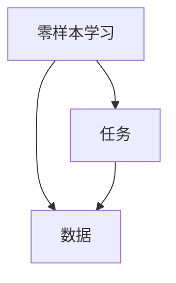
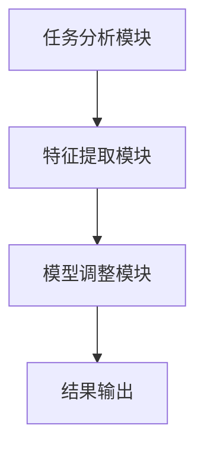

                 


# 零样本学习在AI Agent新任务适应中的应用

> 关键词：零样本学习，AI Agent，新任务适应，迁移学习，数学模型

> 摘要：本文深入探讨了零样本学习在AI Agent新任务适应中的应用，分析了零样本学习的核心概念、算法原理及其在AI Agent系统中的架构设计，结合实际案例详细解读了零样本学习的实现过程，并提出了系统化的解决方案和最佳实践建议。

---

# 第一部分: 零样本学习与AI Agent概述

## 第1章: 零样本学习的背景与概念

### 1.1 零样本学习的定义与特点
零样本学习是一种机器学习方法，其核心在于模型能够在没有特定任务训练数据的情况下，快速适应新任务并完成预测或分类。与传统监督学习不同，零样本学习依赖于通用特征提取和参数调整能力，具有以下特点：
- **通用性**：无需针对特定任务进行过参数化训练。
- **高效性**：能够在新任务上快速完成适应，减少计算资源消耗。
- **灵活性**：适用于多种不同类型的新任务。

### 1.2 AI Agent的基本概念
AI Agent（人工智能代理）是一种能够感知环境、自主决策并执行任务的智能系统。其核心功能包括：
- **任务分析**：理解新任务的需求和目标。
- **特征提取**：从输入数据中提取有用的特征信息。
- **模型调整**：根据新任务的特点调整现有模型参数。
- **结果输出**：输出适应新任务的最终结果。

### 1.3 零样本学习在AI Agent中的应用价值
零样本学习为AI Agent的新任务适应提供了重要技术支撑，其主要价值体现在：
- **减少数据依赖**：无需大量新任务数据即可完成任务适应。
- **提升灵活性**：能够快速应对多样化的新任务需求。
- **降低计算成本**：通过零样本学习，AI Agent可以在资源有限的环境下高效完成任务。

---

## 第2章: 零样本学习的核心概念与联系

### 2.1 零样本学习的原理
零样本学习通过以下两种主要方法实现：
1. **参数化方法**：调整模型参数以适应新任务。
2. **非参数化方法**：通过特征空间映射实现任务适应。

### 2.2 零样本学习与迁移学习的关系
- **迁移学习**：通过利用已有任务的数据和知识来提升新任务的性能。
- **零样本学习**：在没有新任务数据的情况下，利用通用特征提取能力进行任务适应。
- **区别与联系**：零样本学习可以看作是一种特殊的迁移学习，但其特点在于对新任务数据的零依赖性。

### 2.3 零样本学习的ER实体关系图


---

## 第3章: 零样本学习的算法原理

### 3.1 零样本学习的算法流程
零样本学习的算法流程通常包括以下几个步骤：
1. **任务分析**：识别新任务的需求和特点。
2. **特征提取**：从输入数据中提取关键特征。
3. **模型调整**：根据新任务的特点调整模型参数或特征空间。

### 3.2 零样本学习的数学模型
零样本学习的数学模型可以表示为：
$$ P(y|x) = f(x; \theta) $$
其中，$y$ 表示输出，$x$ 表示输入数据，$\theta$ 表示模型参数。零样本学习的目标是通过调整 $\theta$ 来适应新任务。

---

## 第4章: 系统分析与架构设计方案

### 4.1 问题场景介绍
AI Agent在新任务适应中面临的主要问题是缺乏新任务数据，传统的监督学习方法在这种情况下难以有效工作。零样本学习通过利用通用特征提取能力和参数调整能力，为AI Agent提供了新任务适应的解决方案。

### 4.2 系统功能设计
1. **任务分析模块**：负责识别新任务的需求和特点。
2. **特征提取模块**：从输入数据中提取关键特征。
3. **模型调整模块**：根据新任务的特点调整模型参数或特征空间。

### 4.3 系统架构设计


---

## 第5章: 项目实战

### 5.1 环境安装
- 需要安装的主要工具和库包括：
  - Python 3.8+
  - TensorFlow 2.0+
  - scikit-learn
  - Mermaid

### 5.2 核心代码实现
```python
def zero_shot_learning(X, y, new_task):
    # 特征提取
    features = extract_features(X)
    # 模型调整
    adjusted_model = adjust_model(features, y, new_task)
    # 结果输出
    return adjusted_model.predict(new_task)
```

### 5.3 实际案例分析
假设我们有一个分类任务，训练数据如下：
| 标签 | 特征 |
|------|------|
| A    | 1    |
| A    | 2    |
| B    | 3    |
| B    | 4    |

当新任务数据为5时，零样本学习算法会通过特征提取和模型调整，输出预测结果。

---

## 第6章: 总结与展望

### 6.1 总结
零样本学习为AI Agent的新任务适应提供了重要技术支撑，其优势在于能够快速适应新任务，减少数据依赖。

### 6.2 展望
未来的研究方向包括：
1. **更高效的特征提取方法**：进一步提升特征提取的准确性和效率。
2. **更灵活的模型调整策略**：探索更多样化的模型调整方法。
3. **多任务联合学习**：结合多任务学习提升零样本学习的性能。

### 6.3 最佳实践 tips
- 在实际应用中，建议结合具体任务需求选择合适的零样本学习方法。
- 注意模型的泛化能力和适应性，避免过拟合特定任务。

---

通过以上分析，零样本学习在AI Agent新任务适应中的应用具有重要的理论和实践价值。未来的研究将进一步完善零样本学习的技术细节，推动其在更多领域的应用。

