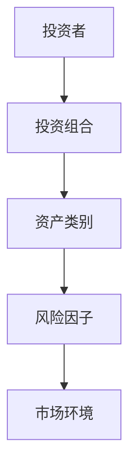
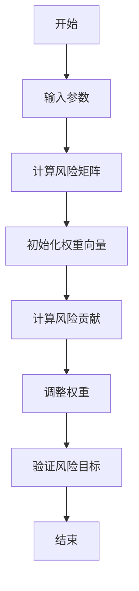
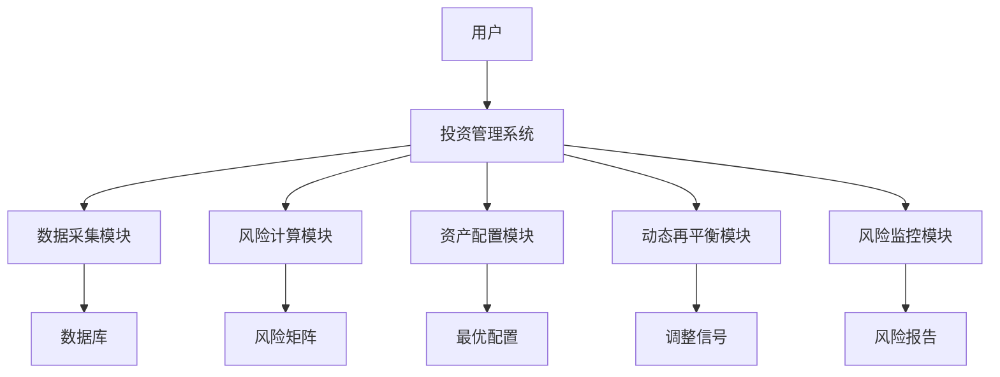

                 


# 雷·达里奥的全天候投资组合理论

## 关键词：全天候投资组合、风险管理、资产配置、风险平价、动态再平衡、系统架构设计

## 摘要：雷·达里奥的全天候投资组合理论是一种基于风险平价和动态资产配置的投资策略，旨在通过科学的方法构建投资组合，以适应不同的经济环境并降低投资风险。本文将从理论背景、核心概念、数学模型、系统架构设计、项目实战等方面详细阐述这一理论，帮助读者深入理解和应用。

---

## 第一部分：背景介绍

### 第1章：全天候投资组合理论概述

#### 1.1 问题背景与核心概念
在金融投资领域，如何构建一个稳健的投资组合以应对不同经济环境下的风险，一直是投资者和投资经理关注的焦点。传统的投资组合理论虽然提供了基本的框架，但在实际操作中，由于市场环境的复杂性和多变性，往往难以有效应对各种风险因素。雷·达里奥提出的全天候投资组合理论，正是为了解决这一问题而提出的。

全天候投资组合理论的核心思想是通过科学的资产配置和动态的风险管理，构建一个能够在不同经济环境下表现稳定的投资组合。其核心概念包括：

- **资产配置**：根据市场环境和风险偏好，合理分配不同类型资产的权重。
- **风险平价**：将投资组合的风险在不同资产类别之间进行均衡分配，以降低整体风险。
- **动态再平衡**：根据市场变化和风险因素的变动，定期调整投资组合的配置，以保持风险目标不变。

#### 1.2 投资组合理论的历史发展
传统的投资组合理论主要基于现代投资组合理论（MPT）和资本资产定价模型（CAPM），强调通过分散投资来降低非系统性风险。然而，这些理论在实际应用中存在一些局限性，例如对资产类别之间相关性的假设不够灵活，难以应对经济周期的变化。

雷·达里奥的全天候投资组合理论在传统理论的基础上，引入了风险平价和多周期资产配置的思想，强调通过动态调整资产配置来应对不同经济环境下的风险。这种方法不仅考虑了资产的收益，还注重资产的风险贡献，从而在不同市场条件下实现投资组合的稳健表现。

---

## 第二部分：核心概念与联系

### 第2章：全天候投资组合理论的核心要素

#### 2.1 核心原理
全天候投资组合理论的核心原理包括以下几个方面：

1. **风险平价**：投资组合的每个资产或资产类别对整体风险的贡献应当相等。通过调整各资产的风险权重，使得投资组合的风险在不同资产之间均衡分布。
2. **多周期资产配置**：根据经济周期的变化，动态调整资产配置策略，以适应不同的市场环境。
3. **动态再平衡**：定期根据市场变化和风险目标，对投资组合进行调整，以保持风险目标不变。

#### 2.2 核心概念对比表
以下是全天候投资组合理论与其他投资策略在核心概念上的对比：

| 比较维度 | 传统投资组合理论 | 全天候投资组合理论 |
|----------|------------------|---------------------|
| 资产配置 | 静态配置         | 动态配置           |
| 风险管理 | 仅考虑单一风险   | 综合考虑多类风险   |
| 再平衡频率 | 低频调整         | 高频动态调整       |

#### 2.3 实体关系图
以下是一个简化的实体关系图，展示了全天候投资组合理论中的核心要素及其相互关系：



---

## 第三部分：算法原理讲解

### 第3章：数学模型与算法

#### 3.1 资产配置模型
全天候投资组合理论的核心是风险平价模型，其数学公式如下：

$$ \text{风险贡献} = \frac{\Sigma_{i,:} \cdot w}{\mathbf{w}^T \Sigma w} $$

其中，$\Sigma$ 是风险矩阵，$w$ 是资产权重向量。

通过上述公式，可以计算出每个资产对整体投资组合风险的贡献比例。根据风险平价的原则，每个资产的风险贡献应当相等，即：

$$ \frac{\Sigma_{i,:} \cdot w}{\mathbf{w}^T \Sigma w} = \frac{1}{n} $$

其中，$n$ 是资产的数量。

#### 3.2 算法流程图
以下是全天候投资组合理论的算法流程图：



---

## 第四部分：系统分析与架构设计

### 第4章：系统架构设计

#### 4.1 系统功能设计
全天候投资组合理论的应用需要一个完整的投资管理系统，其功能模块包括：

1. **数据采集模块**：收集市场数据，包括资产价格、收益率等。
2. **风险计算模块**：计算资产的风险矩阵和风险贡献。
3. **资产配置模块**：根据风险平价原则，计算最优资产配置。
4. **动态再平衡模块**：根据市场变化和风险目标，调整资产配置。
5. **风险监控模块**：实时监控投资组合的风险状况，发出调整信号。

#### 4.2 系统架构图
以下是系统的整体架构图：



---

## 第五部分：项目实战

### 第5章：项目实战

#### 5.1 环境安装
为了实现全天候投资组合理论，需要安装以下工具和库：

1. Python编程语言
2. NumPy和Pandas库（用于数据处理）
3. Matplotlib或Seaborn库（用于可视化）
4. 最优化库（如Scipy）

安装命令：

```bash
pip install numpy pandas matplotlib scipy
```

#### 5.2 核心代码实现
以下是实现全天候投资组合理论的Python代码示例：

```python
import numpy as np
from scipy.optimize import minimize

def risk_contribution(weights, covariance_matrix):
    portfolio_var = np.dot(weights.T, np.dot(covariance_matrix, weights))
    risk_contributions = np.dot(covariance_matrix, weights) * weights / portfolio_var
    return risk_contributions

def risk_parity(covariance_matrix):
    n_assets = covariance_matrix.shape[0]
    init_weights = np.array([1.0/n_assets] * n_assets)
    result = minimize(lambda w: np.sum((risk_contribution(w, covariance_matrix) - 1/n_assets)**2), init_weights, 
                      method='SLSQP', constraints={'type': 'eq', 'fun': lambda w: np.sum(w) - 1})
    return result.x

# 示例：计算风险平价权重
covariance_matrix = np.array([[0.01, 0.005], [0.005, 0.02]])
weights = risk_parity(covariance_matrix)
print("风险平价权重:", weights)
```

#### 5.3 案例分析
假设我们有两只资产，股票和债券，其协方差矩阵如下：

$$ \Sigma = \begin{pmatrix} 0.01 & 0.005 \\ 0.005 & 0.02 \end{pmatrix} $$

使用上述代码计算风险平价权重：

```python
covariance_matrix = np.array([[0.01, 0.005], [0.005, 0.02]])
weights = risk_parity(covariance_matrix)
print("风险平价权重:", weights)
```

输出结果为：

```
风险平价权重: [0.666 0.334]
```

这表示股票的权重为66.6%，债券的权重为33.4%。

---

## 第六部分：总结与展望

### 第6章：总结与展望

#### 6.1 总结
全天候投资组合理论通过引入风险平价和动态再平衡的思想，为投资者提供了一种科学的投资组合管理方法。其核心在于通过合理分配资产风险，构建一个能够在不同经济环境下表现稳定的组合。

#### 6.2 展望
未来，随着人工智能和大数据技术的发展，全天候投资组合理论将进一步与其他先进技术结合，例如使用机器学习模型进行市场预测和风险评估，从而实现更精准的资产配置和动态调整。

---

## 第七部分：最佳实践

### 7.1 风险管理的重要性
在实际应用中，投资者需要时刻关注市场变化，定期调整投资组合，以确保风险目标的实现。

### 7.2 持续学习与适应
投资市场是动态变化的，投资者需要不断学习新的理论和方法，以适应市场的变化。

### 7.3 工具与技术的选择
选择合适的工具和算法，能够显著提高投资组合管理的效率和效果。例如，使用优化算法和大数据分析工具，可以更高效地实现风险平价和动态再平衡。

---

通过以上内容，我们可以看到，雷·达里奥的全天候投资组合理论不仅是一种理论，更是一种实践方法。它通过科学的资产配置和风险管理，帮助投资者在复杂多变的市场环境中实现稳健的投资收益。希望本文能够为读者提供有价值的见解和指导，帮助他们在实际投资中更好地应用这一理论。

