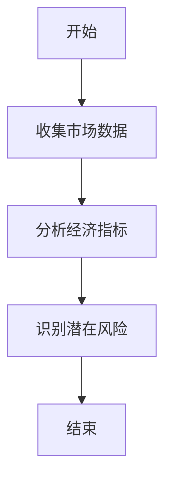
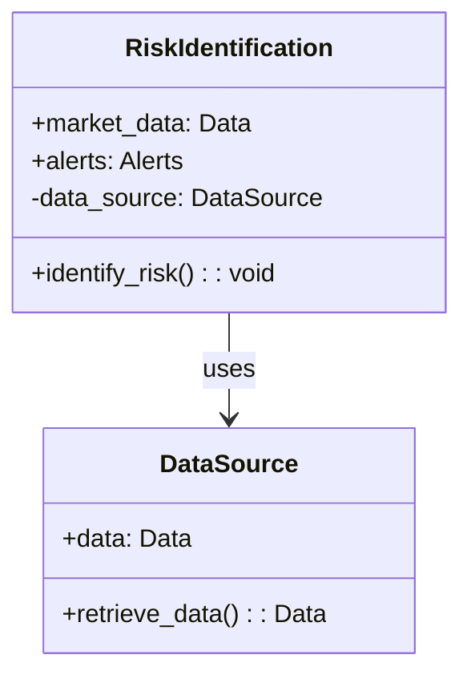
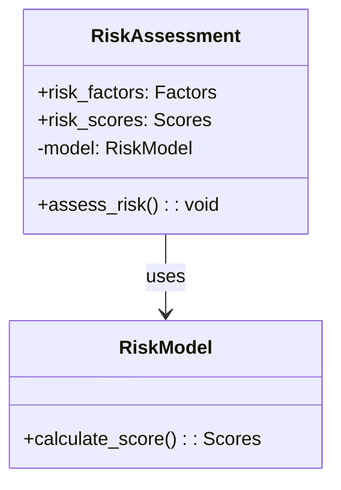
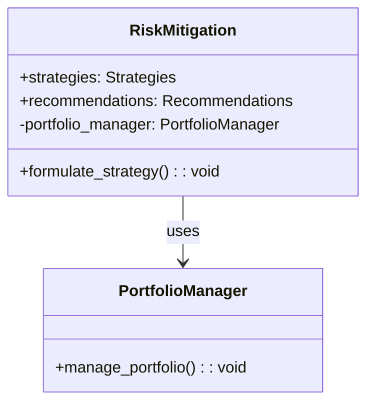
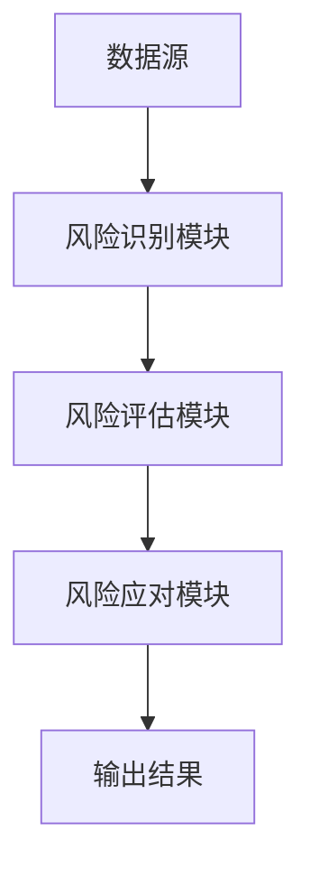

                 


# 霍华德马克斯的风险控制策略

> 关键词：霍华德马克斯，风险控制，投资策略，价值投资，风险管理

> 摘要：本文深入探讨霍华德·马克斯的风险控制策略，分析其在投资决策中的应用。通过介绍其核心理念、模型构建、算法实现和系统设计，结合实际案例，展示如何将这些策略转化为可操作的系统，并总结实践经验。

---

## 第1章：风险控制的背景与重要性

### 1.1 风险控制的定义与内涵

#### 1.1.1 风险的定义
风险是投资中不可避免的因素，指在投资过程中可能出现的损失或偏离预期收益的可能性。在投资决策中，风险控制是确保投资组合稳健的关键环节。

#### 1.1.2 风险控制的核心概念
- **风险识别**：识别可能影响投资组合的各种风险因素。
- **风险评估**：量化这些风险的影响程度。
- **风险应对**：制定策略以降低或管理这些风险。

#### 1.1.3 风险控制的重要性
在投资中，风险控制的重要性体现在保护资本、确保长期收益和实现投资目标上。没有有效的风险控制，投资决策可能会面临重大损失。

### 1.2 投资中的风险与收益平衡

#### 1.2.1 风险与收益的关系
投资中，高风险通常意味着高收益，但并非所有高风险投资都能带来高回报。平衡风险与收益是投资成功的关键。

#### 1.2.2 风险控制在投资中的作用
- **保护资本**：避免重大损失，确保投资本金安全。
- **实现长期收益**：通过控制风险，使投资组合稳定增长。
- **提升投资信心**：有效的风险控制增强投资者信心，避免情绪化决策。

#### 1.2.3 霍华德·马克斯的贡献
马克斯的价值投资理念强调深度分析和风险控制，他的策略帮助投资者在市场波动中保持稳健。

---

## 第2章：霍华德·马克斯的风险控制理论

### 2.1 马克斯的投资理念

#### 2.1.1 价值投资的核心思想
价值投资强调购买被市场低估的资产，长期持有，等待其价值回归。马克斯强调深入分析和风险控制，确保投资的安全边际。

#### 2.1.2 马克斯的“第二层思维”理论
“第二层思维”是指超越表面信息，深入分析市场参与者的心理和行为，找到市场的非理性，从而找到投资机会。

#### 2.1.3 风险控制在投资决策中的地位
马克斯认为，风险控制是投资决策中最重要的部分，是实现长期收益的关键。

### 2.2 风险控制的具体策略

#### 2.2.1 风险识别与评估
- **风险识别**：通过基本面分析和市场分析，识别可能影响投资组合的风险因素。
- **风险评估**：使用数学模型量化这些风险的影响程度。

#### 2.2.2 风险规避与对冲
- **风险规避**：通过分散投资和选择低风险资产来降低整体风险。
- **风险对冲**：使用衍生工具对冲特定风险，如使用期货对冲利率风险。

#### 2.2.3 风险承受能力的评估
评估投资者的风险承受能力，制定适合其风险偏好的投资策略。

---

## 第3章：风险控制模型的构建

### 3.1 风险评估模型

#### 3.1.1 风险因子分析
分析影响投资组合的风险因子，如市场风险、流动性风险和信用风险。

#### 3.1.2 风险评分体系
建立风险评分体系，根据多个因子对资产进行评分，量化其风险程度。

#### 3.1.3 风险矩阵的构建
使用矩阵展示不同风险因素对投资组合的影响，帮助投资者制定应对策略。

### 3.2 投资组合的风险控制流程

#### 3.2.1 风险识别流程
- 收集市场数据，分析经济指标，识别潜在风险。
- 使用Mermaid图展示风险识别流程：



#### 3.2.2 风险评估流程
- 量化各风险因素的影响程度，评估整体风险。
- 使用数学模型计算投资组合的总体风险敞口。

#### 3.2.3 风险应对策略制定
根据风险评估结果，制定相应的应对策略，如调整投资组合或使用衍生工具对冲风险。

---

## 第4章：算法与数学模型在风险控制中的应用

### 4.1 风险评估的数学模型

#### 4.1.1 风险评估的期望值模型
- 使用期望值模型评估资产的预期收益和风险。
- 公式：$$E[R] = \sum p_i R_i$$

#### 4.1.2 风险评分的数学模型
- 使用加权平均法计算风险评分：
  $$ \text{风险评分} = \sum w_i R_i $$

#### 4.1.3 投资组合风险的数学模型
- 计算投资组合的方差和标准差，衡量其风险：
  $$ \sigma = \sqrt{\sum w_i^2 \sigma_i^2 + 2 \sum w_i w_j \sigma_{i,j}} $$

### 4.2 风险控制的Python实现

#### 4.2.1 风险评估代码示例
```python
import numpy as np

def calculate_risk(weights, returns, covariance_matrix):
    variance = np.dot(weights.T, np.dot(covariance_matrix, weights))
    std_deviation = np.sqrt(variance)
    return std_deviation

# 示例数据
returns = np.array([0.1, 0.05, 0.08])
covariance_matrix = np.array([
    [0.04, 0.02, 0.01],
    [0.02, 0.03, 0.015],
    [0.01, 0.015, 0.02]
])
weights = np.array([1/3, 1/3, 1/3])

risk = calculate_risk(weights, returns, covariance_matrix)
print("标准差：", risk)
```

#### 4.2.2 风险对冲代码示例
```python
import pandas as pd
import yfinance as yf

# 下载股票数据
aapl = yf.download('AAPL', start='2020-01-01', end='2020-12-31')
tsla = yf.download('TSLA', start='2020-01-01', end='2020-12-31')

# 计算收益率
aapl_returns = aapl['Adj Close'].pct_change().dropna()
tsla_returns = tsla['Adj Close'].pct_change().dropna()

# 计算协方差矩阵
cov_matrix = pd.DataFrame([aapl_returns, tsla_returns]).T.cov()

# 风险对冲策略
def risk_neutral_portfolios(returns, cov_matrix, n=2):
    weights = np.full(n, 1/n)
    return returns.dot(weights), np.dot(weights.T, np.dot(cov_matrix, weights))**0.5

aapl_rn, aapl_risk = risk_neutral_portfolios(aapl_returns, cov_matrix)
tsla_rn, tsla_risk = risk_neutral_portfolios(tsla_returns, cov_matrix)

print("AAPL风险中性收益：", aapl_rn)
print("AAPL风险：", aapl_risk)
print("TSLA风险中性收益：", tsla_rn)
print("TSLA风险：", tsla_risk)
```

---

## 第5章：系统分析与架构设计

### 5.1 系统功能设计

#### 5.1.1 风险识别模块
- 功能：收集市场数据，识别潜在风险。
- 类图展示：



#### 5.1.2 风险评估模块
- 功能：量化各风险因素的影响。
- 类图展示：



#### 5.1.3 风险应对模块
- 功能：制定应对策略。
- 类图展示：



### 5.2 系统架构设计

#### 5.2.1 系统架构图
展示系统的整体架构，包括数据源、处理模块和输出模块。



---

## 第6章：项目实战

### 6.1 环境配置与数据收集

#### 6.1.1 环境安装
安装必要的Python库，如numpy、pandas、yfinance。

#### 6.1.2 数据收集
使用yfinance库下载股票数据，进行后续分析。

### 6.2 核心实现与分析

#### 6.2.1 风险评估实现
编写Python代码，计算投资组合的风险敞口。

#### 6.2.2 案例分析
分析具体资产的风险情况，制定应对策略。

### 6.3 项目小结

总结项目实施过程，强调风险控制的重要性。

---

## 第7章：最佳实践与注意事项

### 7.1 小结
总结霍华德·马克斯的风险控制策略，强调其在投资中的重要性。

### 7.2 注意事项
- 定期评估和调整风险控制策略。
- 结合市场变化，灵活应对风险。
- 避免过度依赖单一模型，保持策略的多样性。

### 7.3 拓展阅读
推荐相关书籍和资源，帮助读者深入学习风险控制策略。

---

## 附录：霍华德·马克斯的经典语录

- “投资的敌人是波动性和错误的价格。”
- “风险在于你不知道你知道什么。”
- “投资是关于在不确定中寻找确定性的过程。”

---

通过以上结构，文章系统地介绍了霍华德·马克斯的风险控制策略，从理论到实践，帮助读者全面理解和应用这些策略。

