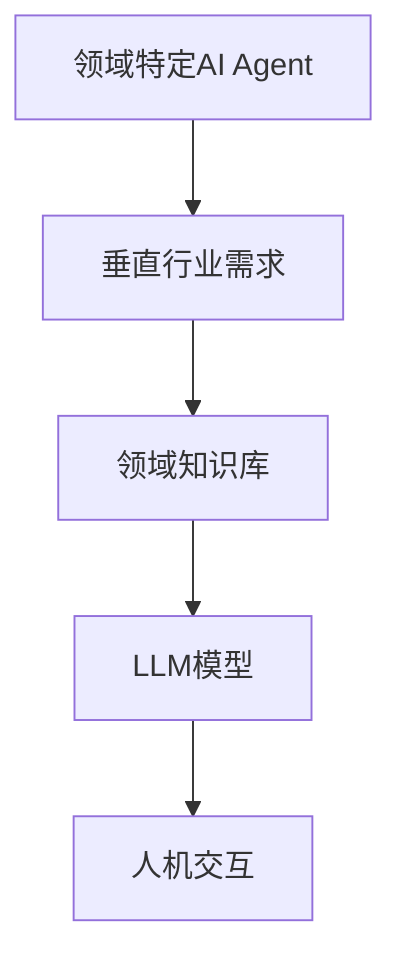
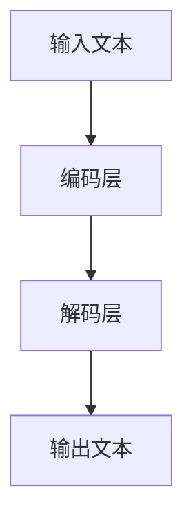
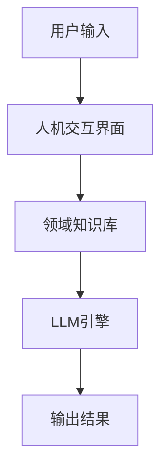
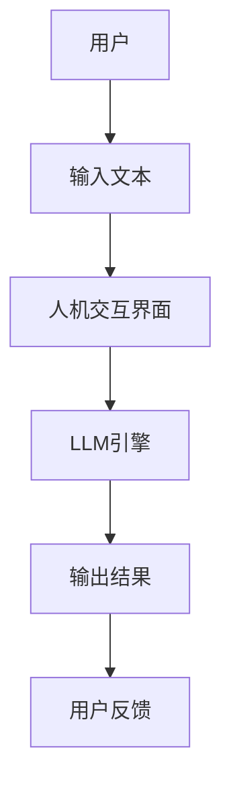

                 


# 领域特定AI Agent：LLM在垂直行业的深度应用

## 关键词：领域特定AI Agent，LLM，垂直行业，深度应用，AI系统架构，人机交互，数学模型

## 摘要：  
本文深入探讨了领域特定AI Agent在垂直行业中的深度应用。从背景介绍到核心概念，从算法原理到系统架构，从项目实战到最佳实践，全面解析了领域特定AI Agent的构建与优化方法。通过详细分析LLM在垂直行业的特点和优势，结合实际案例，揭示了领域特定AI Agent在金融、医疗、法律等行业的巨大潜力和应用场景。本文为技术开发者和行业专家提供了理论支持和实践指导，帮助他们更好地理解和应用领域特定AI Agent技术。

---

# 第一部分: 领域特定AI Agent的背景与概念

## 第1章: 领域特定AI Agent概述

### 1.1 问题背景与问题描述  
随着人工智能技术的快速发展，通用AI Agent虽然在多个领域展现了强大的能力，但在垂直行业中的应用仍然存在诸多限制。垂直行业具有高度的专业性和复杂性，通用AI Agent难以完全覆盖特定领域的独特需求。因此，领域特定AI Agent应运而生，旨在通过深度聚焦特定领域，提供更精准、更高效的解决方案。

### 1.2 领域特定AI Agent的定义与特点  
领域特定AI Agent（Domain-Specific AI Agent）是一种专注于特定领域问题的智能体，通过结合领域知识和大语言模型（LLM）的能力，实现对垂直行业需求的深度理解和高效响应。与通用AI Agent相比，领域特定AI Agent具有以下特点：
- **领域专注性**：针对特定领域的知识、规则和需求进行优化。
- **高效性**：通过领域知识的精炼，提升问题解决效率。
- **适应性**：能够根据领域特点灵活调整模型和策略。
- **可解释性**：在特定领域中提供更清晰的决策逻辑和结果解释。

### 1.3 领域特定AI Agent的核心要素  
领域特定AI Agent的核心要素包括：
1. **领域知识库**：构建特定领域的知识库，包括领域术语、规则、案例等。
2. **LLM模型**：基于大语言模型，通过微调或适配特定领域数据，提升模型在垂直行业的表现。
3. **人机交互界面**：设计符合领域特点的交互方式，优化用户体验。
4. **领域适应性优化**：通过领域数据的反馈，持续优化模型和系统。

### 1.4 领域特定AI Agent的行业外延  
领域特定AI Agent的应用范围广泛，涵盖金融、医疗、法律、教育等多个垂直行业。每个行业都有其独特的特点和需求，领域特定AI Agent通过深度适应这些特点，为行业提供智能化解决方案。

---

# 第二部分: 领域特定AI Agent的核心概念与联系

## 第2章: 领域特定AI Agent的核心原理  

### 2.1 LLM的工作原理  
大语言模型（LLM）通过海量数据的预训练，掌握了丰富的语言理解和生成能力。领域特定AI Agent通过利用这些能力，结合特定领域知识，实现对垂直行业问题的解决。

### 2.2 领域适应性与垂直行业需求  
垂直行业的需求具有高度的专业性和个性化。领域特定AI Agent通过领域知识的嵌入和模型的微调，适应特定行业的特点，满足行业需求。

### 2.3 领域特定AI Agent的系统架构  
领域特定AI Agent的系统架构包括：
1. 领域知识库：存储特定领域的知识和规则。
2. LLM引擎：基于大语言模型的推理和生成能力。
3. 人机交互界面：提供用户与AI Agent的交互渠道。
4. 领域适应性优化模块：通过反馈不断优化模型和系统。

### 2.4 核心概念对比表  
以下是领域特定AI Agent与通用AI Agent的对比：

| 对比维度         | 领域特定AI Agent                     | 通用AI Agent                       |
|------------------|--------------------------------------|------------------------------------|
| 应用范围         | 特定领域（如金融、医疗）             | 多领域通用                         |
| 知识库           | 领域特定知识库                       | 通用知识库                         |
| 模型优化         | 领域数据微调                         | 通用数据训练                       |
| 适应性           | 高                                  | 中                                  |

### 2.5 实体关系图（Mermaid）



---

# 第三部分: 领域特定AI Agent的算法原理

## 第3章: 领域特定AI Agent的算法原理  

### 3.1 LLM的训练机制  
大语言模型通过监督学习和无监督学习相结合的方式，预训练大规模文本数据。领域特定AI Agent通过领域数据的微调，优化模型在特定领域的表现。

### 3.2 领域适应性算法  
领域适应性算法包括：
1. **领域数据微调**：对特定领域的数据进行微调，提升模型在该领域的表现。
2. **领域知识嵌入**：将领域知识嵌入模型，增强模型对领域的理解能力。
3. **领域策略优化**：通过领域数据的反馈，优化模型的决策策略。

### 3.3 领域特定AI Agent的数学模型  

#### 3.3.1 转换器架构  
转换器架构是大语言模型的核心，包括编码层和解码层。编码层将输入文本转换为向量表示，解码层根据向量生成输出文本。

$$ \text{编码层} = \text{Self-Attention}(\text{输入}) $$
$$ \text{解码层} = \text{Self-Attention}(\text{编码层}) $$

#### 3.3.2 注意力机制  
注意力机制通过计算输入文本中每个词的重要性，生成更精准的文本表示。

$$ \text{注意力权重} = \text{softmax}(\frac{\text{Q} \cdot \text{K}^T}{\sqrt{d}}) $$
$$ \text{注意力输出} = \text{Q} \cdot \text{注意力权重} \cdot \text{V} $$

### 3.4 算法流程图（Mermaid）



---

# 第四部分: 领域特定AI Agent的系统分析与架构设计

## 第4章: 领域特定AI Agent的系统架构  

### 4.1 系统功能设计  
领域特定AI Agent的功能模块包括：
1. **领域知识库**：存储特定领域的知识和规则。
2. **LLM引擎**：基于大语言模型的推理和生成能力。
3. **人机交互界面**：提供用户与AI Agent的交互渠道。
4. **反馈与优化**：通过用户反馈优化模型和系统。

### 4.2 系统架构图（Mermaid）



### 4.3 接口设计  
系统接口设计包括：
1. **输入接口**：接收用户输入的文本或指令。
2. **输出接口**：输出AI Agent的响应或结果。
3. **反馈接口**：收集用户反馈，优化模型和系统。

### 4.4 交互流程图（Mermaid）



---

# 第五部分: 领域特定AI Agent的项目实战

## 第5章: 领域特定AI Agent的项目实战  

### 5.1 项目背景  
以金融行业为例，设计一个领域特定AI Agent，用于金融客户支持和服务。

### 5.2 环境安装  
安装必要的工具和库：
```bash
pip install transformers torch
```

### 5.3 核心代码实现  

#### 5.3.1 领域知识库构建  
```python
class DomainKnowledge:
    def __init__(self, knowledge_base):
        self.knowledge_base = knowledge_base
```

#### 5.3.2 LLM引擎实现  
```python
class LLMEngine:
    def __init__(self, model_name):
        self.model = AutoModelForCausalLM.from_pretrained(model_name)
    def generate_response(self, input_text):
        # 生成响应
        pass
```

#### 5.3.3 人机交互界面  
```python
class UIInterface:
    def __init__(self):
        self.domain_knowledge = DomainKnowledge()
    def get_user_input(self):
        # 获取用户输入
        pass
    def display_output(self, output):
        # 显示输出
        pass
```

### 5.4 代码解读与分析  
代码实现展示了领域特定AI Agent的核心模块，包括领域知识库、LLM引擎和人机交互界面。

### 5.5 实际案例分析  
以金融行业的客户支持为例，详细分析了领域特定AI Agent的应用场景和实现过程。

### 5.6 项目小结  
总结了项目实现的关键点和经验教训，为后续优化提供了参考。

---

# 第六部分: 领域特定AI Agent的最佳实践

## 第6章: 领域特定AI Agent的最佳实践  

### 6.1 小结  
总结了领域特定AI Agent的核心概念和实现方法。

### 6.2 注意事项  
在实际应用中，需要注意领域数据的质量、模型的优化和系统的可扩展性。

### 6.3 拓展阅读  
推荐了相关的技术文献和行业报告，供读者进一步学习和研究。

---

# 结语  
领域特定AI Agent在垂直行业中的深度应用，为行业智能化转型提供了新的思路和解决方案。通过本文的系统分析和实践案例，读者可以更好地理解和应用领域特定AI Agent技术，推动人工智能技术在垂直行业中的广泛应用。

