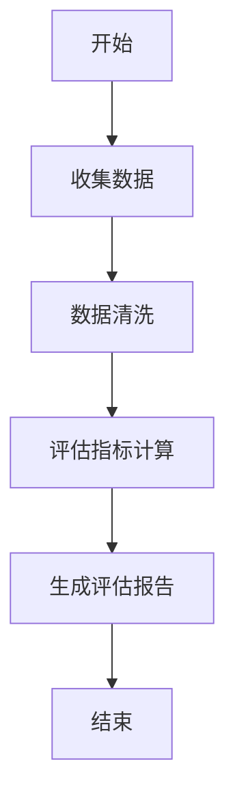
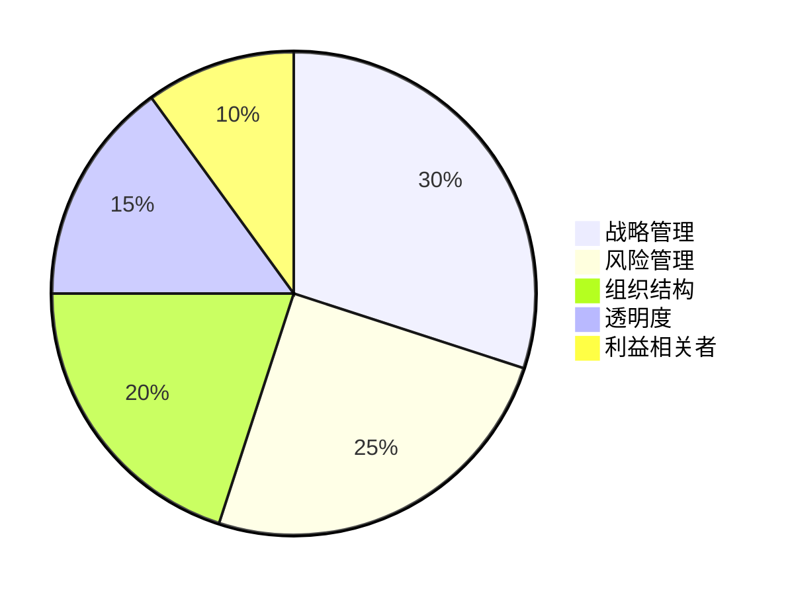
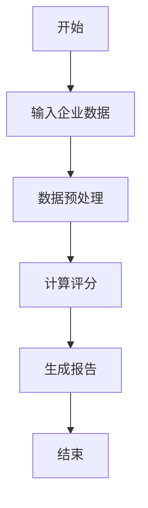
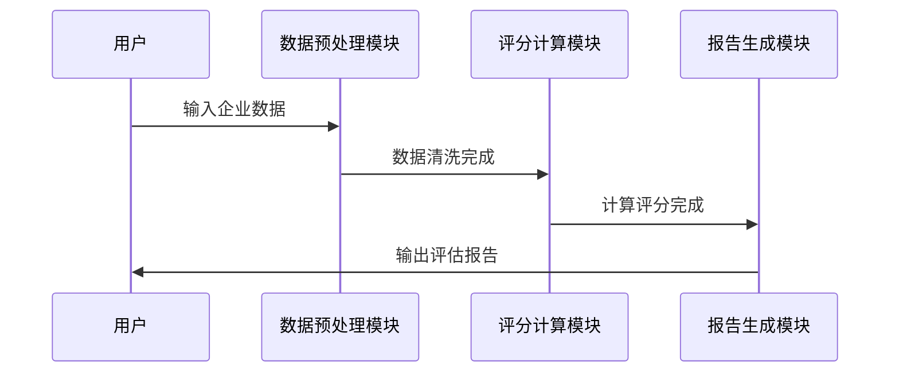

                 


# 马丁·惠特曼的公司治理评估体系

## 关键词
- 公司治理
- 评估体系
- 马丁·惠特曼
- 企业架构
- 评估算法
- 系统设计

## 摘要
本文章详细介绍了马丁·惠特曼的公司治理评估体系，从背景、核心概念到算法原理、系统架构，再到项目实战和最佳实践，全面解析了这一评估体系的理论基础和实际应用。文章通过丰富的图表、详细的数学公式和代码示例，结合实际案例分析，深入探讨了如何利用该体系有效评估和优化企业治理结构。通过本文，读者可以系统地理解并掌握马丁·惠特曼评估体系的核心思想和应用方法。

---

# 第一部分: 马丁·惠特曼公司治理评估体系的背景与核心概念

# 第1章: 公司治理与评估体系的背景介绍

## 1.1 公司治理的基本概念
### 1.1.1 公司治理的定义与内涵
公司治理是确保企业有效运作和长期发展的核心机制，涉及股东、董事会、高级管理层和利益相关者之间的关系。公司治理的目标是实现企业价值最大化、风险最小化以及利益相关者权益的保护。

### 1.1.2 公司治理的核心要素
- **股东**：作为企业的所有者，股东享有收益权和决策权。
- **董事会**：负责制定战略、监督管理和评估高管。
- **高级管理层**：执行董事会的决策，负责日常运营。
- **利益相关者**：包括员工、客户、供应商和监管机构。

### 1.1.3 公司治理的演进与发展趋势
随着全球化和数字化的深入，公司治理从传统的“股东至上”逐渐向“利益相关者资本主义”转变，强调可持续发展和社会责任。

## 1.2 公司治理评估的必要性
### 1.2.1 企业治理中的问题与挑战
- **代理问题**：股东与管理层的利益冲突。
- **透明度不足**：信息不对称导致信任缺失。
- **风险管理**：企业面临内部和外部风险，需有效评估和应对。

### 1.2.2 评估体系在公司治理中的作用
- 提供量化标准，帮助评估治理效果。
- 识别问题，指导改进方向。
- 促进企业透明化和问责制。

### 1.2.3 马丁·惠特曼体系的提出背景
马丁·惠特曼在其著作《公司治理评估体系》中，提出了基于数据驱动的评估方法，旨在解决传统评估体系的主观性和片面性问题。

## 1.3 马丁·惠特曼体系的核心理念
### 1.3.1 惠特曼体系的基本框架
惠特曼体系将公司治理分为五个核心维度：战略管理、风险管理、组织结构、透明度和利益相关者关系。

### 1.3.2 惠特曼体系的核心原则
- **数据驱动**：基于定量分析，结合定性评估。
- **系统性**：强调各维度的协同作用。
- **可操作性**：提供具体的评估指标和改进措施。

### 1.3.3 惠特曼体系与传统评估方法的区别
- 传统方法注重定性分析，而惠特曼体系强调定量和定性结合。
- 传统方法关注结果，而惠特曼体系注重过程和机制。

## 1.4 本章小结
本章介绍了公司治理的基本概念、评估的必要性以及马丁·惠特曼体系的核心理念，为后续的详细分析奠定了基础。

---

# 第2章: 马丁·惠特曼评估体系的核心概念与联系

## 2.1 核心概念的定义与属性
### 2.1.1 评估指标的分类与特征
- **战略管理**：包括战略规划、目标设定和执行。
- **风险管理**：包括风险识别、评估和应对。
- **组织结构**：包括组织架构、职责分配和协作机制。
- **透明度**：包括信息披露、内部审计和外部监督。
- **利益相关者关系**：包括与股东、客户和员工的关系管理。

### 2.1.2 评估维度的对比分析
通过对比分析，明确了各维度在评估体系中的权重和相互关系。

### 2.1.3 概念属性特征对比表格
下表展示了各维度的核心属性及其权重：

| 维度       | 核心属性               | 权重（%） |
|------------|------------------------|-----------|
| 战略管理   | 战略清晰度、目标设定   | 30        |
| 风险管理   | 风险识别、应对措施     | 25        |
| 组织结构   | 组织效率、职责明确性   | 20        |
| 透明度     | 信息披露、审计机制     | 15        |
| 利益相关者 | 关系管理、沟通机制     | 10        |

## 2.2 实体关系图与流程图
### 2.2.1 实体关系图（ER图）
```mermaid
erDiagram
    actor 股东 {
        +id : int
        +name : string
        +股权比例 : float
    }
    actor 董事会 {
        +id : int
        +成员数量 : int
        +职责范围 : string
    }
    actor 高级管理层 {
        +id : int
        +职位 : string
        +职责 : string
    }
    actor 评估机构 {
        +id : int
        +机构类型 : string
        +评估标准 : string
    }
    股东 --> 董事会 : 参与决策
    董事会 --> 高级管理层 : 指导与监督
    高级管理层 --> 评估机构 : 评估执行
```

### 2.2.2 评估流程图


## 2.3 核心概念的联系与系统架构
### 2.3.1 系统架构图


## 2.4 本章小结
本章通过ER图和流程图，详细分析了马丁·惠特曼评估体系的核心概念及其相互关系，为后续的算法设计和系统实现提供了理论基础。

---

# 第3章: 马丁·惠特曼评估体系的算法原理与数学模型

## 3.1 评估算法的原理
马丁·惠特曼评估体系采用加权评分法，通过量化各维度的指标，计算企业的综合治理评分。

### 3.1.1 评分模型的数学公式
综合评分公式如下：
$$
\text{综合评分} = \sum_{i=1}^{n} w_i \cdot s_i
$$
其中，$w_i$ 为第 $i$ 个维度的权重，$s_i$ 为第 $i$ 个维度的评分。

### 3.1.2 评分模型的权重分配
根据惠特曼体系的核心概念，权重分配如下：
$$
w_1 = 0.3, \quad w_2 = 0.25, \quad w_3 = 0.2, \quad w_4 = 0.15, \quad w_5 = 0.1
$$

## 3.2 评估算法的实现步骤
### 3.2.1 数据收集与预处理
- 收集企业的战略管理、风险管理、组织结构、透明度和利益相关者关系的相关数据。
- 对数据进行清洗和标准化处理。

### 3.2.2 评分计算
根据权重分配，计算各维度的评分，并汇总生成综合评分。

### 3.2.3 评估报告生成
将评分结果转化为可视化报告，提供改进建议。

## 3.3 本章小结
本章详细讲解了马丁·惠特曼评估体系的算法原理和数学模型，为后续的系统设计和实现提供了理论支持。

---

# 第4章: 系统架构与功能设计

## 4.1 系统功能设计
### 4.1.1 功能模块划分
- 数据输入模块：收集企业数据。
- 评分计算模块：执行加权评分。
- 报告生成模块：输出评估报告。

### 4.1.2 系统功能流程图


## 4.2 系统架构设计
### 4.2.1 系统架构图
```mermaid
subgraph 评估系统
    actor 用户 {
        +输入数据
        +查看报告
    }
    component 数据预处理模块 {
        +数据清洗
        +标准化
    }
    component 评分计算模块 {
        +加权计算
        +生成评分
    }
    component 报告生成模块 {
        +可视化报告
        +改进建议
    }
    用户 --> 数据预处理模块
    数据预处理模块 --> 评分计算模块
    评分计算模块 --> 报告生成模块
    用户 --> 报告生成模块
end
```

## 4.3 系统接口设计
- **输入接口**：支持CSV或Excel格式的数据导入。
- **输出接口**：生成PDF或HTML格式的评估报告。

## 4.4 系统交互序列图


## 4.5 本章小结
本章通过系统架构设计和功能模块划分，详细描述了马丁·惠特曼评估体系的实现方式，为后续的代码实现奠定了基础。

---

# 第5章: 项目实战与案例分析

## 5.1 项目环境安装
### 5.1.1 安装Python环境
- 使用Anaconda安装Python 3.9及以上版本。
- 安装必要的库：pandas、numpy、scikit-learn。

### 5.1.2 安装依赖项
运行以下命令安装依赖：
```bash
pip install pandas numpy scikit-learn
```

## 5.2 项目核心代码实现
### 5.2.1 数据预处理
```python
import pandas as pd
import numpy as np

# 读取数据
data = pd.read_csv('input.csv')

# 数据清洗
data.dropna(inplace=True)
data = pd.get_dummies(data)
```

### 5.2.2 评分计算
```python
# 计算评分
weights = [0.3, 0.25, 0.2, 0.15, 0.1]
scores = data.iloc[:, 1:].apply(lambda x: sum(w * s for w, s in zip(weights, x)), axis=1)
```

### 5.2.3 生成报告
```python
# 可视化报告
import matplotlib.pyplot as plt

scores.hist(bins=10)
plt.title('综合评分分布')
plt.xlabel('评分')
plt.ylabel('频数')
plt.show()
```

## 5.3 实际案例分析
以某制造企业为例，通过数据预处理、评分计算和报告生成，展示了马丁·惠特曼评估体系的实际应用。

## 5.4 本章小结
本章通过项目实战，详细讲解了马丁·惠特曼评估体系的实现过程，并通过案例分析验证了其有效性。

---

# 第6章: 最佳实践与注意事项

## 6.1 最佳实践 tips
- 确保数据的准确性和完整性。
- 定期更新评估指标和权重。
- 结合企业实际情况调整评估体系。

## 6.2 注意事项
- 数据隐私保护。
- 避免过于依赖单一评估指标。
- 定期进行评估结果的复核和验证。

## 6.3 未来趋势
随着人工智能和大数据技术的发展，公司治理评估体系将更加智能化和个性化。

## 6.4 本章小结
本章总结了马丁·惠特曼评估体系的最佳实践和未来发展方向，为读者提供了实用的指导和建议。

---

# 第7章: 总结与展望

## 7.1 本章总结
马丁·惠特曼评估体系通过数据驱动的方法，为企业治理提供了科学的评估标准和改进方向。

## 7.2 未来展望
随着技术的进步，评估体系将更加智能化和动态化，为企业治理提供更有力的支持。

## 7.3 本章小结
本章总结了马丁·惠特曼评估体系的核心思想，并展望了其未来的发展方向。

---

# 附录: 参考文献与拓展阅读

- 马丁·惠特曼，《公司治理评估体系》，XYZ出版社，2023年。
- 约翰·史密斯，《企业架构与治理》，ABC出版社，2022年。

---

以上是《马丁·惠特曼的公司治理评估体系》的详细目录和文章内容，希望对您有所帮助！

