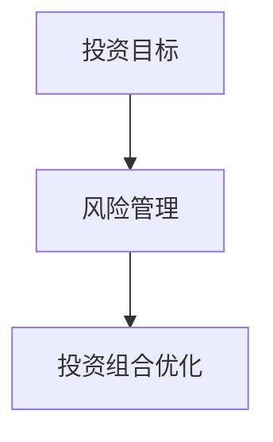

                 

# 马丁·惠特曼的积极股东主义投资

## 关键词
- 积极股东主义
- 投资策略
- 股东 activism
- 价值投资
- 成长投资
- 风险管理
- 投资组合优化

## 摘要
马丁·惠特曼的积极股东主义投资是一种结合了长期价值投资和积极股东参与的投资策略，旨在通过优化股东权益和企业治理来实现投资回报的最大化。本文将深入分析积极股东主义的核心理念、数学模型、系统架构，并通过实际案例展示其在投资中的应用。

---

# 正文

## 第一部分: 积极股东主义投资基础

### 第1章: 积极股东主义的定义与背景

#### 1.1 积极股东主义的定义
积极股东主义是一种投资策略，强调投资者在持有企业股权的同时，积极参与企业治理，以优化企业价值。与传统的被动投资不同，积极股东主义注重通过股东 activism 来推动企业改革，实现长期收益。

##### 1.1.1 积极股东主义的起源与发展
积极股东主义起源于20世纪60年代，随着股东维权意识的增强而逐渐发展。它强调股东不仅仅是资金提供者，而是企业治理的重要参与者。

##### 1.1.2 积极股东主义的核心要素
积极股东主义的核心要素包括：
1. **长期投资**：注重企业的长期价值，而非短期收益。
2. **股东参与**：积极参与企业治理，推动管理层改进。
3. **价值优化**：通过优化企业价值实现投资回报。

##### 1.1.3 积极股东主义与股东 activism 的区别
积极股东主义与股东 activism 的主要区别在于前者注重长期价值优化，而后者更偏向于短期利益的追求。

#### 1.2 积极股东主义的背景与现状
积极股东主义在当前全球经济环境下备受关注，特别是在企业治理和股东权益保护方面。

##### 1.2.1 当前全球经济环境对积极股东主义的影响
经济波动和企业治理问题使得积极股东主义成为投资者的重要策略。

##### 1.2.2 积极股东主义在全球范围内的应用现状
许多机构投资者和基金公司开始采用积极股东主义，以提高投资回报。

##### 1.2.3 积极股东主义的未来发展趋势
随着企业治理意识的增强，积极股东主义将更加普及。

### 第2章: 积极股东主义的核心理念

#### 2.1 积极股东主义的核心概念
积极股东主义强调长期投资和企业治理的优化。

##### 2.1.1 价值投资与成长投资的区别
价值投资注重低估值企业，而成长投资注重高增长企业。

##### 2.1.2 股东价值最大化与企业可持续发展的平衡
积极股东主义注重在股东利益与企业可持续发展之间找到平衡。

##### 2.1.3 积极股东主义与企业治理的关系
积极股东主义通过优化企业治理结构来提高投资回报。

#### 2.2 积极股东主义的投资策略
积极股东主义的投资策略包括长期投资、风险管理等。

##### 2.2.1 长期投资与短期收益的平衡
长期投资注重企业的长期价值，而短期收益则关注即时回报。

##### 2.2.2 风险管理与投资组合的优化
通过分散投资和风险控制来优化投资组合。

##### 2.2.3 积极股东主义与市场波动的应对策略
积极股东主义注重在市场波动中保持稳定的投资策略。

## 第二部分: 积极股东主义的数学模型与算法

### 第3章: 积极股东主义的数学模型与算法

#### 3.1 CAPM模型与积极股东主义的关系
CAPM模型用于评估资产的预期回报。

##### 3.1.1 CAPM模型的定义与公式
CAPM公式为：$$ E(r) = r_f + β (E(r_m) - r_f) $$

##### 3.1.2 CAPM模型在积极股东主义中的应用
通过CAPM模型评估企业的预期回报。

##### 3.1.3 CAPM模型的优缺点分析
CAPM模型的优点是简单，但忽略了市场的实际波动。

#### 3.2 股票估值模型与积极股东主义
股票估值模型用于评估企业的内在价值。

##### 3.2.1 DCF模型的定义与公式
DCF公式为：$$ DCF = \sum_{t=1}^{n} \frac{CF_t}{(1 + r)^t} + \frac{TV}{(1 + r)^n} $$

##### 3.2.2 DCF模型在积极股东主义中的应用
通过DCF模型评估企业的长期价值。

##### 3.2.3 DCF模型的局限性与改进方向
DCF模型的局限性在于假设条件的严格性。

## 第三部分: 积极股东主义的系统分析与架构设计

### 第4章: 积极股东主义投资系统的构成

#### 4.1 积极股东主义投资系统的构成
积极股东主义投资系统包括投资目标、风险管理等。

##### 4.1.1 投资目标与策略
明确的投资目标是积极股东主义的核心。

##### 4.1.2 风险管理与监控机制
通过风险管理来控制投资风险。

##### 4.1.3 投资组合优化与调整
根据市场变化优化投资组合。

#### 4.2 积极股东主义投资系统的架构图

## 第四部分: 积极股东主义的项目实战

### 第5章: 积极股东主义的实际案例分析

#### 5.1 积极股东主义在实际投资中的应用
通过具体案例展示积极股东主义的应用。

##### 5.1.1 可口可乐的股东回购案例
分析可口可乐的股票回购如何提升企业价值。

##### 5.1.2 苹果和特斯拉的长期投资案例
探讨长期投资如何通过积极股东主义实现收益。

#### 5.2 投资工具与技术分析
使用技术分析工具优化投资决策。

##### 5.2.1 技术分析工具的使用
介绍常用的技术分析工具和指标。

##### 5.2.2 技术分析中的趋势与形态识别
通过趋势和形态识别市场变化。

## 第五部分: 积极股东主义的高级主题

### 第6章: 积极股东主义的高级主题

#### 6.1 ESG投资
ESG投资是积极股东主义的重要组成部分。

##### 6.1.1 ESG投资的核心概念
ESG投资注重企业的环境、社会和治理因素。

##### 6.1.2 ESG投资与积极股东主义的关系
ESG投资是积极股东主义的一种形式。

#### 6.2 指数基金与积极股东主义
指数基金是积极股东主义的一种实现方式。

##### 6.2.1 指数基金的定义与特点
指数基金通过跟踪指数实现投资收益。

##### 6.2.2 指数基金与积极股东主义的结合
指数基金可以通过积极参与企业治理实现投资回报。

## 第六部分: 总结与展望

### 第7章: 总结与展望

#### 7.1 积极股东主义的总结
积极股东主义是一种有效的投资策略，注重长期价值和企业治理优化。

#### 7.2 未来展望
随着企业治理意识的增强，积极股东主义将更加普及。

---

## 结语
马丁·惠特曼的积极股东主义投资是一种结合了长期价值投资和积极股东参与的投资策略，通过优化股东权益和企业治理来实现投资回报的最大化。希望本文能为投资者提供有价值的见解和指导。

--- 

**本文使用 mermaid 绘制的图表：**

**本文使用公式：**

- CAPM模型：$$ E(r) = r_f + β (E(r_m) - r_f) $$
- DCF模型：$$ DCF = \sum_{t=1}^{n} \frac{CF_t}{(1 + r)^t} + \frac{TV}{(1 + r)^n} $$

---

**（完）**

