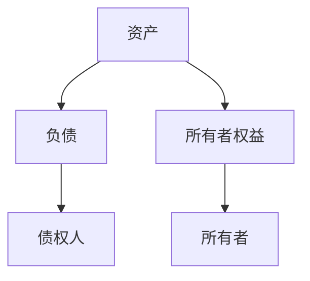
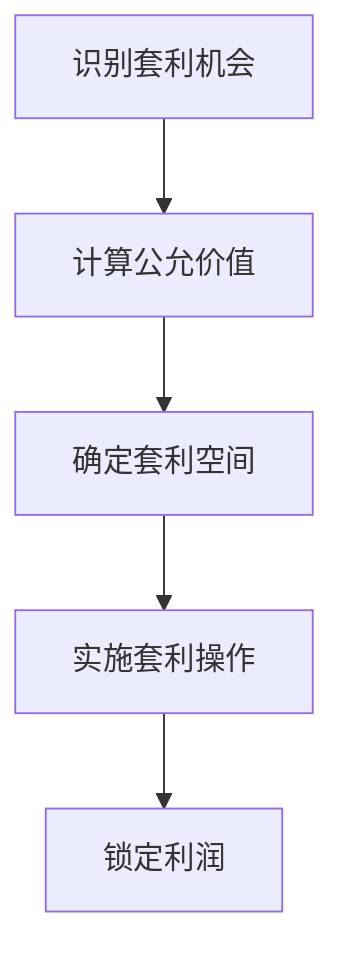
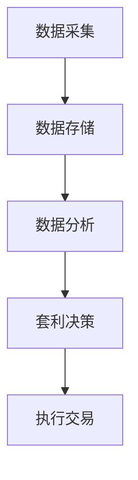
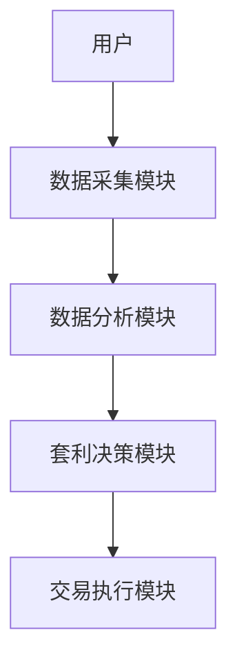

                 


# 马丁·惠特曼的资产负债表套利方法

> 关键词：资产负债表套利、马丁·惠特曼、财务套利、市场套利、资产定价、套利策略

> 摘要：本文深入探讨了马丁·惠特曼的资产负债表套利方法，分析其核心概念、算法原理、系统架构设计和项目实战。文章从套利的基本原理出发，逐步揭示套利机会的识别、数学模型的应用、系统架构的构建以及实际案例的分析。通过本文，读者将全面了解如何利用资产负债表进行套利，并掌握实际操作中的关键点和注意事项。

---

## 第一部分: 资产负债表套利方法概述

### 第1章: 资产负债表套利的核心概念

#### 1.1 资产负债表套利的定义与背景

##### 1.1.1 资产负债表套利的定义
资产负债表套利是一种利用资产与负债之间的价值差异进行投资的策略。通过分析企业的资产负债表，识别资产公允价值与账面价值之间的差异，进而寻找套利机会。

##### 1.1.2 套利的背景与动机
套利的背景源于市场中的价格差异。当市场效率不足时，某些资产或负债的市场价格可能与其公允价值不符，从而产生套利机会。套利的动机在于利用这种差异获取无风险或低风险的利润。

##### 1.1.3 资产负债表套利的目的与意义
资产负债表套利的目的是通过识别和利用资产与负债之间的价值差异，实现资产的优化配置和价值提升。其意义在于通过套利操作，促进市场效率的提高，同时为投资者创造额外收益。

#### 1.2 资产负债表套利的基本原理

##### 1.2.1 资产负债表的核心要素
资产负债表由资产、负债和所有者权益三部分组成。资产包括流动资产和非流动资产，负债包括流动负债和非流动负债，所有者权益包括股本、资本公积、盈余公积等。

##### 1.2.2 套利的基本原理与机制
套利的基本原理是利用市场中的价格差异进行买卖，以实现利润。在资产负债表套利中，通过分析资产的公允价值与账面价值之间的差异，识别套利机会，并通过相应的交易操作实现利润。

##### 1.2.3 资产负债表套利的理论基础
资产负债表套利的理论基础主要包括市场有效性和资产定价理论。市场有效性假设认为市场价格能够反映资产的公允价值，但现实中由于信息不对称等因素，市场价格可能偏离公允价值，从而产生套利机会。

#### 1.3 套利的主要类型与分类

##### 1.3.1 按套利主体分类
套利可以分为个人套利、机构套利和政府套利。个人套利是指个人投资者利用市场差异进行套利，机构套利是指机构投资者利用市场差异进行套利，政府套利是指政府利用市场差异进行套利。

##### 1.3.2 按套利标的分类
套利可以分为股票套利、债券套利、外汇套利和商品套利。股票套利是指利用股票价格差异进行套利，债券套利是指利用债券价格差异进行套利，外汇套利是指利用汇率差异进行套利，商品套利是指利用商品价格差异进行套利。

##### 1.3.3 按套利市场分类
套利可以分为场内套利和场外套利。场内套利是指在交易所内进行套利，场外套利是指在场外市场进行套利。

#### 1.4 资产负债表套利的适用场景

##### 1.4.1 市场效率与套利机会
市场效率越高，套利机会越少。在低效市场中，套利机会较多，但在高效市场中，套利机会较少。因此，资产负债表套利在低效市场中更具适用性。

##### 1.4.2 不同市场环境下的套利策略
在不同的市场环境下，套利策略有所不同。例如，在牛市中，可以利用资产价格上涨的机会进行套利；在熊市中，可以利用资产价格下跌的机会进行套利。

##### 1.4.3 套利的边界与限制
套利的边界与限制包括市场效率、交易成本、法律法规和市场深度等。在市场效率较高、交易成本较高、法律法规限制较多或市场深度不足的情况下，套利机会可能受到限制。

### 第2章: 资产负债表套利的核心概念与联系

#### 2.1 核心概念原理

##### 2.1.1 资产负债表套利的基本原理
资产负债表套利的基本原理是通过分析资产与负债的公允价值与账面价值之间的差异，识别套利机会，并通过相应的交易操作实现利润。

##### 2.1.2 套利与市场效率的关系
套利与市场效率密切相关。套利活动有助于提高市场效率，但市场效率的提高又会减少套利机会。

##### 2.1.3 资产负债表套利的数学模型
套利的数学模型可以表示为：套利利润 = 公允价值 - 账面价值 - 交易成本。

#### 2.2 概念属性特征对比表格

| 概念 | 属性 | 特征 |
|------|------|------|
| 资产 | 价值 | 可变现能力 |
| 负债 | 偿付顺序 | 债务期限 |
| 所有者权益 | 内容 | 价值来源 |

#### 2.3 ER实体关系图


### 第3章: 资产负债表套利的算法原理

#### 3.1 套利算法的基本流程



#### 3.2 数学模型与公式

##### 3.2.1 公允价值计算
$$公允价值 = 市场价 - 账面价值$$

##### 3.2.2 套利空间计算
$$套利空间 = 公允价值 - 交易成本$$

#### 3.3 通俗易懂的举例说明
例如，假设某公司资产公允价值为$100，账面价值为$80，市场价为$90，则公允价值为$10，套利空间为$10 - $2（交易成本）= $8。

### 第4章: 系统分析与架构设计方案

#### 4.1 问题场景介绍

##### 4.1.1 套利机会识别
通过分析资产负债表，识别资产与负债之间的价值差异，确定套利机会。

##### 4.1.2 套利风险控制
通过风险评估和控制措施，降低套利操作中的风险。

##### 4.1.3 套利收益最大化
通过优化套利策略，最大化套利收益。

#### 4.2 系统功能设计

##### 4.2.1 数据采集模块
负责采集市场数据，包括资产价格、负债价格等。

##### 4.2.2 数据分析模块
负责分析数据，识别套利机会，计算套利空间。

##### 4.2.3 套利决策模块
负责制定套利策略，决定是否实施套利操作。

#### 4.3 系统架构设计

##### 4.3.1 系统架构图


#### 4.4 系统接口设计

##### 4.4.1 数据接口
数据接口用于与其他系统或数据源进行数据交换。

##### 4.4.2 交易接口
交易接口用于执行套利交易。

#### 4.5 系统交互序列图

##### 4.5.1 套利操作流程


### 第5章: 项目实战

#### 5.1 环境安装

##### 5.1.1 系统环境
需要安装Python、Jupyter Notebook等开发工具。

##### 5.1.2 数据库安装
需要安装MySQL或其他数据库管理系统。

#### 5.2 系统核心实现源代码

##### 5.2.1 数据采集模块
```python
import requests

def get_market_data():
    # 示例代码，从API获取市场数据
    response = requests.get('http://api.example.com/market_data')
    return response.json()
```

##### 5.2.2 数据分析模块
```python
def calculate_gap(data):
    # 示例代码，计算资产与负债的公允价值差异
    asset_value = data['asset_value']
    liability_value = data['liability_value']
    gap = asset_value - liability_value
    return gap
```

##### 5.2.3 套利决策模块
```python
def decide_to_trade(gap):
    # 示例代码，根据差异决定是否进行套利
    if gap > 0:
        return True
    else:
        return False
```

#### 5.3 代码应用解读与分析
通过上述代码，可以实现数据采集、数据分析和套利决策。数据采集模块从API获取市场数据，数据分析模块计算资产与负债的公允价值差异，套利决策模块根据差异决定是否进行套利操作。

#### 5.4 实际案例分析
以某公司为例，假设其资产公允价值为$100，负债公允价值为$80，市场价为$90。计算套利空间为$10 - $2 = $8，决定进行套利操作。

#### 5.5 项目小结
通过项目实战，我们可以看到资产负债表套利的实际应用，以及套利策略的实现过程。

---

## 第二部分: 总结与注意事项

### 第6章: 总结

#### 6.1 套利方法的优缺点

##### 6.1.1 优点
套利可以带来额外收益，同时促进市场效率的提高。

##### 6.1.2 缺点
套利可能面临较高的交易成本和风险，且在市场效率较高的情况下，套利机会较少。

### 第7章: 注意事项

#### 7.1 风险控制
套利操作中，需要注意风险控制，避免因市场波动导致的损失。

#### 7.2 市场监控
需要实时监控市场变化，及时调整套利策略。

#### 7.3 法律法规
需要遵守相关法律法规，避免因违法操作导致的风险。

### 第8章: 最佳实践 tips

#### 8.1 选择合适的套利策略
根据市场环境和自身条件，选择合适的套利策略。

#### 8.2 控制交易成本
通过优化交易策略，降低交易成本，提高套利收益。

#### 8.3 提高市场敏感度
保持对市场变化的敏感度，及时捕捉套利机会。

### 第9章: 拓展阅读

#### 9.1 套利的经典文献
推荐阅读《套利机会的识别与利用》、《金融市场中的套利策略》等经典文献。

#### 9.2 相关技术书籍
推荐阅读《算法交易：量化投资中的数学模型与编程实现》、《量化交易：从理论到实践》等技术书籍。

---

通过本文的详细分析，读者可以全面了解马丁·惠特曼的资产负债表套利方法，掌握套利的核心概念、算法原理、系统架构设计和项目实战技巧。希望本文能够为读者在套利领域提供有价值的参考和指导。

