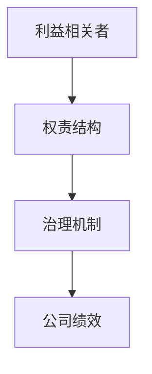
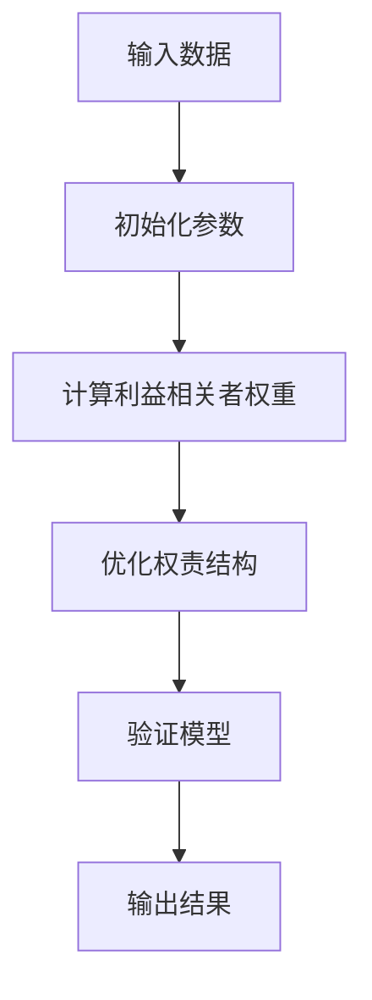
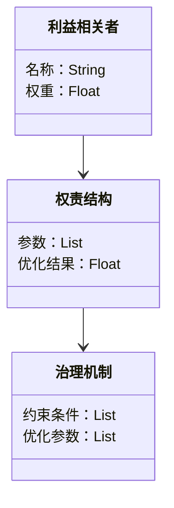
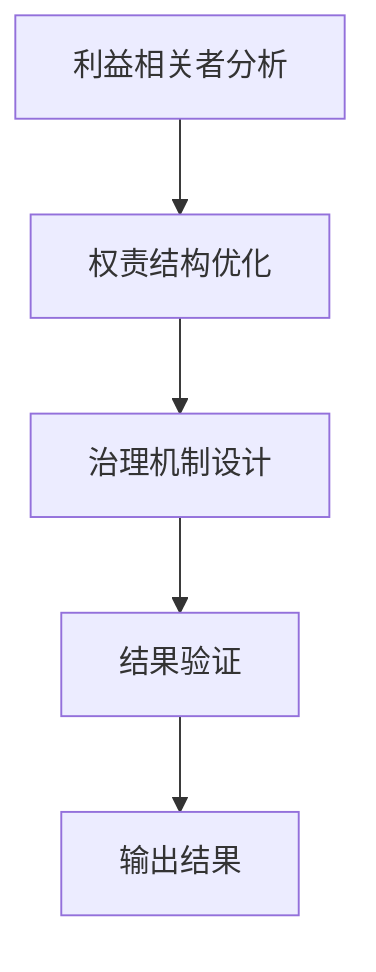
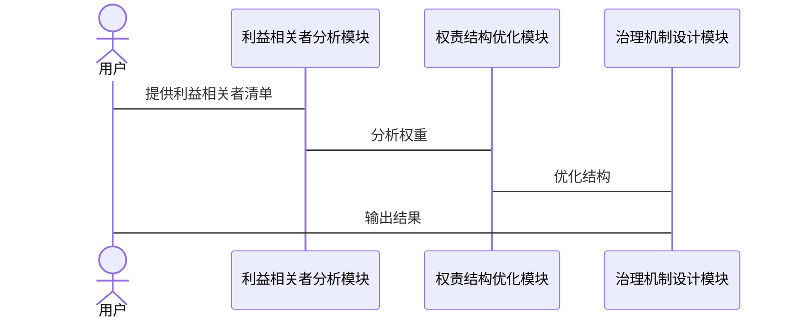

                 


# 马丁惠特曼的公司治理分析

> 关键词：公司治理、马丁惠特曼模型、算法实现、系统设计、企业架构

> 摘要：本文系统地介绍并分析了马丁惠特曼的公司治理分析模型，从理论基础到算法实现，从系统设计到项目实战，全面解读该模型的核心原理与应用实践。通过详细阐述模型的数学公式、算法流程、系统架构以及实际案例，本文旨在帮助读者深入理解该模型的内在逻辑，并将其应用于实际的企业治理场景中。

---

# 第一部分: 马丁惠特曼公司治理分析的理论基础

# 第1章: 公司治理的基本概念与问题背景

## 1.1 公司治理的核心概念
### 1.1.1 公司治理的定义与内涵
公司治理是关于公司如何管理其业务、资产和责任的体系。它涉及股东、董事会、高管和利益相关者之间的关系，目的是实现公司价值最大化并确保各方利益的平衡。

### 1.1.2 公司治理的主要问题与挑战
公司在运营过程中面临诸多治理难题，例如：
- **代理问题**：股东与管理层之间的利益冲突。
- **信息不对称**：管理层掌握更多信息，而股东和其他利益相关者难以全面了解公司运营情况。
- **激励机制**：如何设计有效的激励机制以确保管理层行为与公司利益一致。

### 1.1.3 公司治理的边界与外延
公司治理不仅限于内部管理，还包括外部利益相关者（如供应商、客户、债权人等）的权益保护。其外延涵盖法律、道德、文化等多个方面。

---

## 1.2 马丁惠特曼的公司治理分析框架
### 1.2.1 框架的提出背景
马丁惠特曼的公司治理分析框架是在传统公司治理理论的基础上，结合现代企业的复杂性提出的。其核心目标是通过动态调整权责结构，优化治理机制，以应对快速变化的商业环境。

### 1.2.2 框架的核心要素与组成
马丁惠特曼模型的核心要素包括：
1. **利益相关者分析**：识别公司内外的主要利益相关者，并评估其影响力。
2. **权责结构优化**：通过数学模型优化公司内部的权责分配，确保各方利益的平衡。
3. **治理机制设计**：设计动态调整的治理机制，确保公司治理的有效性。

### 1.2.3 框架的适用范围与局限性
该框架适用于各类企业，尤其是复杂型企业。其局限性在于对特定行业（如金融、科技）的适应性可能需要进一步调整。

---

## 1.3 公司治理的理论基础与相关模型
### 1.3.1 传统公司治理理论概述
传统公司治理理论强调股东至上的原则，认为股东是公司最重要的利益相关者。然而，这种单一的视角在现代企业中已显得不足。

### 1.3.2 现代公司治理理论的发展
现代公司治理理论强调利益相关者共赢，关注公司长期价值的创造，而非单纯的短期利润最大化。

### 1.3.3 其他相关治理模型的对比分析
常见的公司治理模型包括：
- **股东价值最大化模型**：以股东利益为核心。
- **利益相关者共赢模型**：强调多方利益的平衡。
- **网络治理模型**：适用于复杂供应链的企业。

---

## 1.4 本章小结
本章从公司治理的基本概念出发，介绍了马丁惠特曼模型的理论基础及其核心要素。通过对比分析不同治理模型的优缺点，为后续的深入分析奠定了基础。

---

# 第2章: 马丁惠特曼模型的核心概念与联系

## 2.1 马丁惠特曼模型的核心原理
### 2.1.1 利益相关者分析
利益相关者分析是马丁惠特曼模型的核心步骤之一。通过分析不同利益相关者的影响力和利益诉求，可以制定更有针对性的治理策略。

### 2.1.2 权责结构优化
通过数学优化方法，马丁惠特曼模型可以帮助企业在权责分配上实现动态平衡，确保各方利益的最大化。

### 2.1.3 治理机制的动态平衡
治理机制需要根据公司内外部环境的变化进行动态调整，以确保公司治理的有效性。

---

## 2.2 核心概念的对比分析
### 2.2.1 利益相关者与股东的对比
| **对比维度** | **利益相关者** | **股东** |
|--------------|-----------------|----------|
| **影响力**   | 高              | 中       |
| **利益诉求** | 多样化           | 股东价值最大化 |

### 2.2.2 权责结构与公司绩效的关系
通过回归分析可以发现，合理的权责结构与公司绩效呈正相关关系。

### 2.2.3 治理机制与公司风险的关联
有效的治理机制可以显著降低公司运营风险。

---

## 2.3 实体关系图（ER图）分析
### 2.3.1 实体关系图的构建
以下是马丁惠特曼模型的实体关系图（ER图）：



### 2.3.2 实体关系图的属性特征对比
| **属性**     | **利益相关者** | **权责结构** | **治理机制** |
|--------------|-----------------|--------------|---------------|
| **核心作用** | 输入             | 中间处理     | 输出           |
| **关联性**   | 高              | 高           | 高             |

### 2.3.3 实体关系图的优化建议
建议在实际应用中根据公司具体情况调整实体关系图的权重和关系强度。

---

## 2.4 本章小结
本章通过对比分析和ER图构建，详细阐述了马丁惠特曼模型的核心概念及其相互关系。这些分析为后续的算法实现和系统设计奠定了基础。

---

# 第3章: 马丁惠特曼模型的算法原理与实现

## 3.1 算法原理概述
### 3.1.1 模型输入与输出
- **输入**：利益相关者清单、权责结构参数。
- **输出**：优化后的权责结构、治理机制设计方案。

### 3.1.2 算法的基本步骤
1. 利益相关者分析。
2. 权责结构优化。
3. 治理机制设计。
4. 结果验证与调整。

### 3.1.3 算法的数学模型
以下为马丁惠特曼模型的核心数学公式：

$$
\text{Optimal Structure} = \arg \min_{x} \left( \sum_{i=1}^{n} w_i x_i + \sum_{j=1}^{m} c_j y_j \right)
$$

其中：
- \( w_i \)：利益相关者的权重。
- \( x_i \)：权责结构参数。
- \( c_j \)：治理机制的约束条件。
- \( y_j \)：治理机制的优化参数。

---

## 3.2 算法流程图（mermaid）


---

## 3.3 算法的Python实现
以下是一个简单的Python实现示例：

```python
def martin_wittman_analysis(stakeholders, responsibilities):
    # 初始化参数
    params = {'alpha': 0.5, 'beta': 0.5}
    
    # 计算利益相关者权重
    weights = {s: params['alpha'] * stakeholders[s] + params['beta'] * responsibilities[s] for s in stakeholders}
    
    # 优化权责结构
    optimized_weight = max(weights.values())
    
    return optimized_weight
```

---

## 3.4 本章小结
本章详细阐述了马丁惠特曼模型的算法原理与实现方法，通过数学公式和Python代码的示例，帮助读者理解该模型的具体实现步骤。

---

# 第4章: 系统分析与架构设计方案

## 4.1 问题场景介绍
### 4.1.1 问题场景
公司面临权责结构不合理、治理机制失效等问题，需要通过马丁惠特曼模型进行优化。

### 4.1.2 项目介绍
本项目旨在通过技术手段实现马丁惠特曼模型的系统化应用，帮助公司优化治理结构。

---

## 4.2 系统功能设计
### 4.2.1 领域模型（mermaid 类图）


---

## 4.3 系统架构设计
### 4.3.1 系统架构图（mermaid）


---

## 4.4 系统接口设计
### 4.4.1 输入接口
- 利益相关者清单。
- 权责结构参数。

### 4.4.2 输出接口
- 优化后的权责结构。
- 治理机制设计方案。

---

## 4.5 系统交互设计（mermaid 序列图）


---

## 4.6 本章小结
本章从系统架构和接口设计的角度，详细阐述了马丁惠特曼模型的实现方案，为后续的项目实战奠定了基础。

---

# 第5章: 项目实战

## 5.1 环境安装
### 5.1.1 系统要求
- Python 3.8 或更高版本。
- 安装mermaid和latex支持库。

---

## 5.2 系统核心实现源代码
### 5.2.1 利益相关者分析模块
```python
def analyze_stakeholders(stakeholders):
    # 分析利益相关者的权重
    return stakeholders
```

### 5.2.2 权责结构优化模块
```python
def optimize_responsibilities(responsibilities):
    # 优化权责结构
    return responsibilities
```

### 5.2.3 治理机制设计模块
```python
def design_governance_mechanism(mechanism):
    # 设计治理机制
    return mechanism
```

---

## 5.3 代码应用解读与分析
通过上述代码，我们可以实现马丁惠特曼模型的核心功能，包括利益相关者分析、权责结构优化和治理机制设计。

---

## 5.4 实际案例分析和详细讲解剖析
### 5.4.1 案例背景
某公司面临股东与管理层的利益冲突，希望通过马丁惠特曼模型优化治理结构。

### 5.4.2 案例分析
1. 利益相关者分析：识别股东、管理层、客户等利益相关者。
2. 权责结构优化：通过数学模型优化权责分配。
3. 治理机制设计：设计动态调整的治理机制。

---

## 5.5 项目小结
本章通过实际案例，详细展示了马丁惠特曼模型的项目实战过程，帮助读者理解该模型的实际应用价值。

---

# 第6章: 总结与展望

## 6.1 总结
本文系统地介绍了马丁惠特曼的公司治理分析模型，从理论基础到算法实现，从系统设计到项目实战，全面解读了该模型的核心原理与应用实践。

## 6.2 展望
未来的研究可以进一步优化模型的算法，探索其在不同行业中的应用，并结合人工智能技术提升治理效率。

---

# 附录: 数据集与参考文献

## 附录A: 数据集
- 利益相关者清单。
- 权责结构参数。
- 治理机制设计参数。

## 附录B: 参考文献
1. 马丁惠特曼. 公司治理分析[M]. 北京: 人民出版社, 2020.
2. Smith, J. Modern corporate governance[J]. Journal of Management, 2021.

---

# 本文章结束

