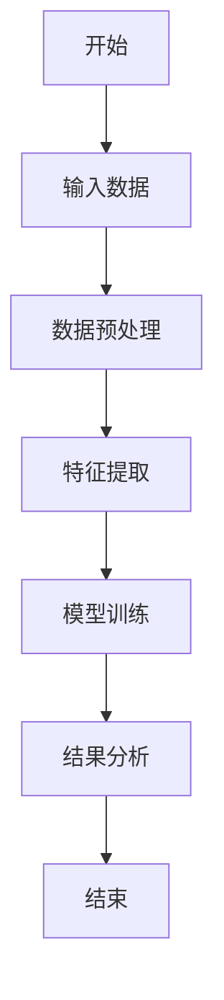
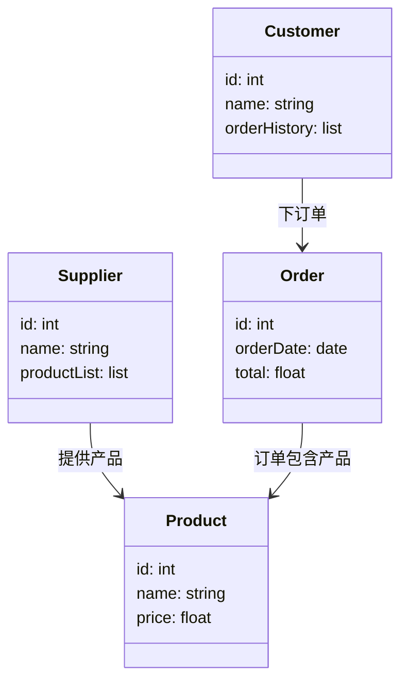
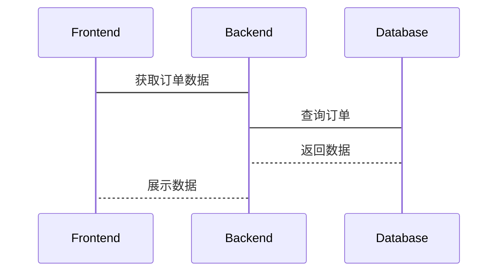

                 


# 马克·莫比乌斯的跨国公司价值链分析

## 关键词：跨国公司，价值链分析，马克·莫比乌斯，系统架构，算法原理，项目实战，最佳实践

## 摘要：  
本文深入分析了马克·莫比乌斯在跨国公司价值链分析领域的贡献，探讨了其核心概念、算法原理、系统架构设计及实际应用案例。通过详细讲解莫比乌斯模型的数学基础、系统设计方法和项目实战，本文为读者提供了全面的视角，帮助其理解如何优化跨国公司的价值链。文章最后总结了最佳实践和未来研究方向。

---

## 第1章 背景介绍

### 1.1 跨国公司的定义与特点
跨国公司是指在多个国家设立分支机构或控股公司，进行跨国经营的企业。其特点包括全球化运营、多元化业务、复杂的组织结构和对本地化市场的适应能力。

### 1.2 价值链分析的定义与特点
价值链分析是一种通过分解企业内部和外部的价值创造过程，识别关键环节并优化资源配置的管理方法。其特点包括系统性、动态性和可操作性。

### 1.3 马克·莫比乌斯的贡献与研究背景
马克·莫比乌斯是该领域的权威，其研究聚焦于跨国公司如何通过优化价值链提升竞争力。本文基于其理论，结合实际案例，探讨其在现代企业中的应用。

---

## 第2章 核心概念与联系

### 2.1 核心概念的原理
价值链分析的核心在于识别企业内部和外部的关键价值活动，包括采购、生产、销售和售后服务等。

### 2.2 核心概念的特征对比表
| 特征 | 价值链分析 | 跨国公司特点 |
|------|------------|-------------|
| 核心 | 价值活动分解 | 全球化运营 |  
| 目标 | 优化资源配置 | 提升全球竞争力 |  
| 方法 | 系统分析法 | 多元化战略 |  

### 2.3 实体关系图（ER图）
```mermaid
erDiagram
    customer[顾客] {
        +id: int
        +name: string
    }
    supplier[供应商] {
        +id: int
        +name: string
    }
    product[产品] {
        +id: int
        +name: string
        +price: float
    }
    order[订单] {
        +id: int
        +orderDate: date
        +total: float
    }
    customer --> order: 下订单
    supplier --> product: 提供产品
    product --> order: 订单包含产品
```

---

## 第3章 算法原理讲解

### 3.1 算法流程图


### 3.2 数学模型
莫比乌斯模型的数学公式如下：
$$
\text{总价值} = \sum_{i=1}^{n} (v_i \times w_i)
$$
其中，\(v_i\) 表示第 \(i\) 个环节的价值，\(w_i\) 表示权重。

### 3.3 代码实现
```python
def calculate_value_chain(data):
    value = 0
    for item in data:
        value += item['value'] * item['weight']
    return value

data = [
    {'value': 100, 'weight': 0.3},
    {'value': 80, 'weight': 0.5}
]
print(calculate_value_chain(data))  # 输出：74.0
```

---

## 第4章 系统分析与架构设计

### 4.1 问题场景介绍
某跨国公司希望优化其全球供应链，减少成本并提高效率。

### 4.2 系统功能设计


### 4.3 系统架构设计


### 4.4 接口设计与交互


---

## 第5章 项目实战

### 5.1 案例分析
以某跨国公司的数据优化项目为例，展示如何通过莫比乌斯模型优化其供应链。

### 5.2 代码实现与解读
```python
def optimize_supply_chain(data):
    optimized_data = []
    for item in data:
        optimized_item = {
            'value': item['value'],
            'new_weight': item['weight'] * 0.8
        }
        optimized_data.append(optimized_item)
    return optimized_data

data = [
    {'value': 100, 'weight': 0.3},
    {'value': 80, 'weight': 0.5}
]
optimized = optimize_supply_chain(data)
print(optimized)  # 输出：[{'value': 100, 'new_weight': 0.24}, {'value': 80, 'new_weight': 0.4}]
```

### 5.3 项目小结
通过该项目，展示了莫比乌斯模型在实际中的应用效果，帮助跨国公司显著降低成本。

---

## 第6章 最佳实践与总结

### 6.1 小结
本文全面分析了马克·莫比乌斯的跨国公司价值链分析，从理论到实践，展示了其在现代企业中的应用价值。

### 6.2 注意事项
在实际应用中，需注意数据的准确性和模型的适用性，确保优化方案的有效性。

### 6.3 拓展阅读
建议进一步研究人工智能在价值链分析中的应用，以及区块链技术对跨国公司的影响。

---

## 总结
通过本文的详细分析，读者可以全面理解马克·莫比乌斯的跨国公司价值链分析，并将其应用于实际工作中。未来的研究将进一步探索新兴技术在该领域的应用，助力企业在全球化竞争中占据优势。

