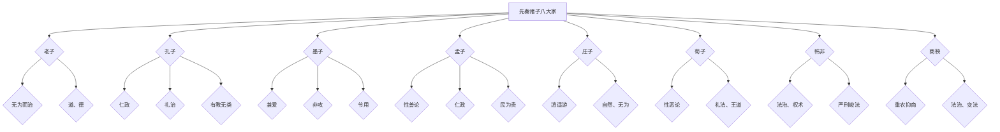

                 

### 【光剑书架上的书】《先秦诸子八大家》鲍鹏山 书评推荐语

#### 引言

在中华文明五千年历史的长河中，先秦时期诸子百家的思想如璀璨星辰，照耀着中华民族的精神世界。在这其中，老子、孔子、墨子、孟子、庄子、荀子、韩非、商鞅八大家的智慧，更是经久不衰，成为中国古代哲学思想的重要组成部分。鲍鹏山的《先秦诸子八大家》以其独特的视角和深入的解读，将这些哲学巨人的思想一一呈现，为读者提供了深入了解先秦哲学的宝贵机会。

#### 老子篇：永恒的东方智慧

老子，姓李名耳，字聃，是中国古代伟大的哲学家和思想家，被誉为道家学派的开山祖师。《先秦诸子八大家》中的老子篇，深入探讨了老子的哲学思想，包括道、德、无为、自然等核心概念。鲍鹏山以通俗易懂的语言，解析了老子的哲学思想对后世的影响，使读者对老子的思想有了更深刻的理解。

**推荐语：**《先秦诸子八大家》中的老子篇，是对老子哲学思想的全面解读，让我们在忙碌的现代社会中，再次感受到东方智慧的魅力。

#### 孔子篇：大成至圣的先师

孔子，名丘，字仲尼，是中国古代著名的思想家、教育家，儒家学派的创始人。《先秦诸子八大家》中的孔子篇，详细介绍了孔子的教育理念、政治思想和社会观。鲍鹏山以其深厚的学识和独特的视角，对孔子的思想进行了深刻的剖析，让读者对孔子的教育思想和人生态度有了更全面的认识。

**推荐语：**《先秦诸子八大家》中的孔子篇，是对孔子思想的全面解读，让我们感受到一位伟大教育家的智慧与胸怀。

#### 墨子篇：挑战帝国的剑侠

墨子，名翟，是中国古代著名的哲学家和科学家，墨家学派的创始人。《先秦诸子八大家》中的墨子篇，探讨了墨子的兼爱、非攻、节用等思想，以及墨家在先秦时期的地位和影响。鲍鹏山以其敏锐的洞察力和深刻的见解，揭示了墨子思想中的独特价值，让读者对墨子的思想有了新的认识。

**推荐语：**《先秦诸子八大家》中的墨子篇，是对墨子思想的深入探讨，让我们感受到一位挑战帝国的剑侠的智慧和勇气。

#### 孟子篇：性善论的代言人

孟子，名轲，字子舆，是中国古代著名的哲学家，儒家学派的代表人物之一。《先秦诸子八大家》中的孟子篇，详细介绍了孟子的性善论、仁政思想以及他对后世的影响。鲍鹏山以其深厚的学识和独特的见解，对孟子的思想进行了深入的解读，让读者对孟子的思想有了更全面的理解。

**推荐语：**《先秦诸子八大家》中的孟子篇，是对孟子思想的全面解读，让我们感受到一位性善论的代言人的智慧和魅力。

#### 庄子篇：逍遥游的哲学

庄子，名周，是中国古代著名的哲学家，道家学派的重要代表人物之一。《先秦诸子八大家》中的庄子篇，深入探讨了庄子的逍遥游、自由自在的人生态度以及他对自然和人生的理解。鲍鹏山以其独特的视角和深刻的见解，揭示了庄子思想的精髓，让读者对庄子的思想有了更深刻的理解。

**推荐语：**《先秦诸子八大家》中的庄子篇，是对庄子思想的深入探讨，让我们感受到一位逍遥游的哲学家的智慧和超脱。

#### 荀子篇：儒家思想的集大成者

荀子，名况，字卿，是中国古代著名的哲学家，儒家学派的代表人物之一。《先秦诸子八大家》中的荀子篇，详细介绍了荀子的性恶论、礼教思想以及他对后世的影响。鲍鹏山以其深厚的学识和独特的见解，对荀子的思想进行了深入的解读，让读者对荀子的思想有了更全面的认识。

**推荐语：**《先秦诸子八大家》中的荀子篇，是对荀子思想的全面解读，让我们感受到一位儒家思想的集大成者的智慧和深度。

#### 韩非篇：法家的代表人物

韩非，名非，是中国古代著名的哲学家，法家学派的代表人物之一。《先秦诸子八大家》中的韩非篇，详细介绍了韩非的法家思想，包括法治、权术、道德等核心概念。鲍鹏山以其敏锐的洞察力和深刻的见解，揭示了韩非思想中的独特价值，让读者对韩非的思想有了新的认识。

**推荐语：**《先秦诸子八大家》中的韩非篇，是对韩非思想的深入探讨，让我们感受到一位法家代表人物的智慧和冷静。

#### 商鞅篇：变法的先驱

商鞅，名鞅，是中国古代著名的政治家和法家思想家，被誉为变法的先驱。《先秦诸子八大家》中的商鞅篇，详细介绍了商鞅的变法思想和他在秦国实施变法的过程。鲍鹏山以其独特的视角和深刻的见解，揭示了商鞅变法对后世的影响，让读者对商鞅的思想和实践有了更全面的了解。

**推荐语：**《先秦诸子八大家》中的商鞅篇，是对商鞅变法的深入探讨，让我们感受到一位变法先驱的智慧和勇气。

#### 总结

《先秦诸子八大家》是鲍鹏山对先秦哲学思想的深刻解读，通过对其中的老子、孔子、墨子、孟子、庄子、荀子、韩非、商鞅八大家的详尽分析，让读者在阅读中不仅能够了解这些哲学家的思想，更能感受到他们的智慧与魅力。这本书对于希望深入了解中国传统文化和哲学的读者来说，无疑是一部宝贵的指南。

**推荐语：**《先秦诸子八大家》是一本全面、深入、有见解的哲学著作，无论你是哲学爱好者，还是对中华传统文化感兴趣的人，都值得一看。

#### 结语

在这篇文章中，我们通过阅读鲍鹏山的《先秦诸子八大家》，深入了解了先秦时期八位哲学巨人的思想。他们的智慧，如星辰般闪耀在历史的长河中，为我们提供了无尽的精神财富。让我们在阅读中，感受他们的思想魅力，汲取他们的智慧精华，为我们的生活注入新的活力。

**作者署名：** 光剑书架上的书 / The Books On The Guangjian's Bookshelf

本文由光剑书架上的书撰写，旨在为读者提供关于《先秦诸子八大家》的深度解读和推荐。文章中所述观点仅为作者个人看法，不代表任何官方立场。如果您对本文有任何建议或意见，欢迎在评论区留言交流。

#### 关键词

- 先秦诸子八大家
- 老子
- 孔子
- 墨子
- 孟子
- 庄子
- 荀子
- 韩非
- 商鞅
- 鲍鹏山
- 哲学
- 东方智慧
- 教育思想
- 法家思想
- 变法思想

#### 摘要

《先秦诸子八大家》是鲍鹏山对先秦时期八位哲学巨人的深刻解读，包括老子、孔子、墨子、孟子、庄子、荀子、韩非、商鞅。本书通过详细分析这些哲学家的思想，展示了他们在中华文明发展中的重要地位和深远影响。文章旨在为读者提供关于这些哲学家的全面解读，帮助他们更好地理解中华传统文化的精髓。无论你是哲学爱好者，还是对中华传统文化感兴趣的人，这本书都值得你细细品味。### 老子篇：永恒的东方智慧

#### 引言

在《先秦诸子八大家》中，老子篇以其深邃的思想和独特的视角，吸引了众多读者的关注。老子，姓李名耳，字聃，是中国古代著名的哲学家，被誉为道家学派的开山祖师。他的著作《道德经》不仅在中国哲学史上具有极高的地位，而且对世界哲学和文化也产生了深远的影响。鲍鹏山在《先秦诸子八大家》中的老子篇，通过对老子哲学思想的深入解读，为我们展现了这位古老哲学家的智慧和思想魅力。

#### 道与德

老子的哲学思想核心是“道”与“德”。在《道德经》中，老子多次提到“道”这一概念，他认为“道”是宇宙万物生成和发展的根本规律，是一种超越人类智慧和认知的力量。老子说道：“道生一，一生二，二生三，三生万物。”这句话揭示了宇宙生成的过程，强调了“道”在宇宙中的核心地位。

同时，老子也强调了“德”的重要性。他认为“德”是人们行为和思想的准则，是人与自然和谐相处的关键。在《道德经》第五十一章中，老子说道：“上德不德，下德执德。上德无为，无不为。”这句话表达了老子对“德”的深刻理解，认为真正的德行是顺应自然，无为而治。

#### 无为而治

老子的“无为而治”思想是道家哲学的核心之一，也是其政治哲学的基础。在《道德经》第三十七章中，老子说道：“道常无为而无不为，侯王若能守之，万物将自化。”这句话表明，老子主张通过无为的方式来治理国家，让万物自然发展，从而达到和谐与平衡。

鲍鹏山在解读这一思想时，指出老子的“无为而治”并非无所作为，而是指领导者不应过度干预，不应强行控制，而应顺应自然规律，让万物自主发展。这种治理方式不仅适用于国家政治，也适用于个人生活和社会管理。

#### 自然与无为

老子的哲学思想深受自然的影响，他主张顺应自然，追求自然之道的智慧。在《道德经》第二十五章中，老子说道：“人法地，地法天，天法道，道法自然。”这句话强调了万物皆法自然，人应当顺应自然，遵循自然规律。

鲍鹏山在老子篇中深入分析了老子的自然观，他认为老子强调的“自然”并非简单的自然现象，而是一种深刻的哲学理念，即万物皆有其内在的规律和节奏，人类应当尊重和顺应这些规律，以达到和谐与平衡。

#### 对后世的影响

老子的哲学思想对后世产生了深远的影响。他的“道”与“德”观念成为了中国哲学的重要组成部分，对儒家、道家、法家等学派都产生了重要的影响。此外，老子的无为而治思想也被后世的政治家和思想家所借鉴和运用，成为中国政治文化的重要遗产。

鲍鹏山在《先秦诸子八大家》中的老子篇，通过对老子哲学思想的深入解读，为我们揭示了这位古老哲学家的智慧与思想魅力。他让我们看到，在老子的思想中，蕴含着对自然、人生和社会的深刻洞察，这些思想不仅对古代中国，也对现代世界具有启示意义。

**推荐语：**《先秦诸子八大家》中的老子篇，是对老子哲学思想的全面解读，让我们在忙碌的现代社会中，再次感受到东方智慧的魅力。通过鲍鹏山的深入分析，我们能够更好地理解老子的思想，从中汲取智慧，为我们的生活注入新的活力。

### 孔子篇：大成至圣的先师

#### 引言

在《先秦诸子八大家》中，孔子篇以其丰富的内容和深刻的见解，吸引了无数读者的目光。孔子，名丘，字仲尼，是中国古代著名的思想家、教育家，儒家学派的创始人。他的教育理念和思想体系对中国乃至世界产生了深远的影响。《先秦诸子八大家》中的孔子篇，通过对孔子教育思想和政治思想的详细解读，为我们展现了这位伟大教育家的智慧和胸怀。

#### 教育思想

孔子的教育思想是其思想体系的重要组成部分，他主张“有教无类”，认为教育应当面向所有人，无论贫富贵贱，都应享有接受教育的机会。在《论语》中，孔子多次强调：“君子之于学也，非为已往，非为将来，专为现在。”这句话表达了孔子对教育的重视，他认为教育的目的是为了提升个人和民族的精神境界。

孔子的教育方法注重实践和启发，他主张“学而时习之，不亦说乎？”即通过不断的实践和复习来巩固知识。他还提倡“温故而知新，可以为师矣”，强调了温习旧知识的重要性。此外，孔子认为教师应该具备“仁者爱人”的品德，他主张“以身作则”，通过自身的榜样作用来影响学生。

#### 政治思想

孔子的政治思想强调仁政和礼治。他认为，一个理想的统治者应当具备仁爱之心，以仁德治理国家。在《论语·颜渊》中，孔子说：“为政以德，譬如北辰，居其所而众星共之。”这句话形象地说明了以德治国的重要性。

孔子的礼治思想强调社会秩序和道德规范的重要性。他认为，礼是维护社会秩序和道德的基础，是人类社会和谐发展的关键。在《论语·为政》中，孔子说：“道之以政，齐之以刑，民免而无耻；道之以德，齐之以礼，有耻且格。”这句话表明，孔子主张通过道德和礼教来引导人民，从而达到社会和谐的目的。

#### 对后世的影响

孔子的教育思想和政治思想对后世产生了深远的影响。他的“有教无类”理念，使得教育不再局限于少数贵族，而成为全民共享的权利。他的“温故而知新”方法，至今仍被广泛运用在教学实践中。他的仁政和礼治思想，成为了中国历代政治家治国理政的重要参考。

此外，孔子的思想也影响了世界。他的教育理念和道德观念，被许多国家和地区所接受和传承。联合国教科文组织将孔子列为世界十大文化名人之一，可见其思想的影响力。

鲍鹏山在《先秦诸子八大家》中的孔子篇，通过对孔子教育思想和政治思想的深入解读，为我们展现了这位伟大教育家的智慧和胸怀。他让我们看到，孔子的思想不仅在当时具有重要的指导意义，而且在今天依然具有深刻的启示。

**推荐语：**《先秦诸子八大家》中的孔子篇，是对孔子思想的全面解读，让我们感受到一位伟大教育家的智慧与胸怀。通过鲍鹏山的深入分析，我们能够更好地理解孔子的教育思想和政治思想，从中汲取智慧，为我们的生活和工作提供指导。

### 墨子篇：挑战帝国的剑侠

#### 引言

在《先秦诸子八大家》中，墨子篇以其独特的视角和深刻的见解，吸引了众多读者的关注。墨子，名翟，是中国古代著名的哲学家，墨家学派的创始人。他的思想以其独特的“兼爱”、“非攻”为核心，挑战了当时帝国体制的统治逻辑，展现出一种鲜明的反叛精神。鲍鹏山在墨子篇中，通过对墨子思想的深入探讨，为我们揭示了这位“挑战帝国的剑侠”的智慧和勇气。

#### 兼爱

墨子的“兼爱”思想是其哲学体系的核心，他主张“兼相爱，交相利”，即不分贵贱、亲疏、贫富，普遍地爱所有的人。墨子认为，只有通过普遍的爱，才能消除人与人之间的矛盾和纷争，实现社会的和谐与稳定。在《墨子·兼爱中》中，墨子说道：“仁人之所以为事者，必达乎兼相爱。”这句话表达了墨子对“兼爱”的深刻理解。

鲍鹏山在解读这一思想时，指出墨子的“兼爱”并非简单的仁慈，而是一种具有实践意义的社会理想。他强调，兼爱不仅是一种道德要求，更是一种行为规范，要求人们在实际生活中践行这一理念，以实际行动来实现社会的和谐与进步。

#### 非攻

墨子的“非攻”思想是其政治哲学的重要组成部分，他主张和平、反对战争。墨子认为，战争是导致社会动荡和人民痛苦的主要原因，因此他强烈谴责战争，倡导和平。在《墨子·非攻中》中，墨子说道：“天下兼相爱则治，交相恶则乱。”这句话揭示了墨子对战争与和平的深刻洞察。

鲍鹏山在解读这一思想时，指出墨子的“非攻”并非消极避战，而是一种积极的和平理念。他认为，墨子主张通过道德教化和制度保障来实现和平，这种理念在当时具有极大的前瞻性和实践价值。

#### 对后世的影响

墨子的“兼爱”和“非攻”思想对后世产生了深远的影响。他的“兼爱”理念在中国传统文化中得到了广泛的传承和发扬，成为中国道德伦理的重要组成部分。他的“非攻”思想则对后世的政治家和思想家产生了重要的影响，许多政治家在治国理政时都借鉴了墨子的思想。

此外，墨子的思想也影响了世界。他的“兼爱”和“非攻”理念具有普世价值，被许多国家和地区所接受和传承。在当今世界，墨子的思想仍然具有重要的启示意义，为人们提供了应对全球性挑战的理论资源。

鲍鹏山在《先秦诸子八大家》中的墨子篇，通过对墨子思想的深入解读，为我们揭示了这位“挑战帝国的剑侠”的智慧和勇气。他让我们看到，墨子的思想不仅在当时具有重要的社会意义，而且在今天依然具有深刻的启示。

**推荐语：**《先秦诸子八大家》中的墨子篇，是对墨子思想的深入探讨，让我们感受到一位挑战帝国的剑侠的智慧和勇气。通过鲍鹏山的解读，我们能够更好地理解墨子的思想，从中汲取智慧，为我们的社会建设和人类进步提供借鉴。

### 孟子篇：性善论的代言人

#### 引言

在《先秦诸子八大家》中，孟子篇以其深刻的思想和独特的见解，吸引了众多读者的目光。孟子，名轲，字子舆，是中国古代著名的哲学家，儒家学派的代表人物之一。他的思想以其“性善论”为核心，对后世产生了深远的影响。鲍鹏山在孟子篇中，通过对孟子思想的深入解读，为我们展现了这位性善论的代言人的智慧和哲学魅力。

#### 性善论

孟子的“性善论”是他思想体系的核心，他主张人天生具有善性，即“人之初，性本善”。孟子认为，人的善性是道德行为的基础，是人类社会和谐发展的关键。在《孟子·告子上》中，孟子说道：“人性之善也，犹水之就下也。人无有不善，水无有不下。”这句话形象地说明了人的善性就像水向下流一样，是自然而然的。

鲍鹏山在解读这一思想时，指出孟子的“性善论”并非简单的乐观主义，而是一种深刻的社会哲学。他强调，孟子的性善论是基于对人性的深刻洞察和对社会现象的深刻分析，认为人性中的善性可以通过教育和道德修养得到发扬和实现。

#### 仁政与王道

孟子的“仁政”和“王道”思想是他政治哲学的重要组成部分，他主张通过仁爱和道德来治理国家，实现社会的和谐与稳定。孟子认为，一个理想的统治者应当具备仁爱之心，以仁德治理国家。在《孟子·梁惠王上》中，孟子说道：“王如施仁政于民，省刑罚，薄税敛，则天下无敌矣。”这句话表达了孟子对仁政的深刻理解。

鲍鹏山在解读这一思想时，指出孟子的仁政和王道思想具有极大的现实意义。他认为，孟子的思想不仅适用于古代中国，也适用于现代社会的治理，为我们提供了关于如何实现社会和谐和稳定的重要启示。

#### 对后世的影响

孟子的“性善论”和“仁政”思想对后世产生了深远的影响。他的性善论成为儒家思想的重要组成部分，对中国传统文化和道德观念产生了深远的影响。他的仁政和王道思想则对后世的政治家和思想家产生了重要的影响，许多政治家在治国理政时都借鉴了孟子的思想。

此外，孟子的思想也影响了世界。他的性善论和仁政思想具有普世价值，被许多国家和地区所接受和传承。在当今世界，孟子的思想仍然具有重要的启示意义，为人们提供了应对全球性挑战的理论资源。

鲍鹏山在《先秦诸子八大家》中的孟子篇，通过对孟子思想的深入解读，为我们展现了这位性善论的代言人的智慧和哲学魅力。他让我们看到，孟子的思想不仅在当时具有重要的社会意义，而且在今天依然具有深刻的启示。

**推荐语：**《先秦诸子八大家》中的孟子篇，是对孟子思想的全面解读，让我们感受到一位性善论的代言人的智慧和哲学魅力。通过鲍鹏山的解读，我们能够更好地理解孟子的思想，从中汲取智慧，为我们的社会建设和人类进步提供借鉴。

### 庄子篇：逍遥游的哲学

#### 引言

在《先秦诸子八大家》中，庄子篇以其深邃的思想和独特的视角，吸引了众多读者的关注。庄子，名周，是中国古代著名的哲学家，道家学派的重要代表人物之一。他的思想以其“逍遥游”为核心，对后世产生了深远的影响。鲍鹏山在庄子篇中，通过对庄子思想的深入解读，为我们展现了这位逍遥游哲学家的智慧和超脱。

#### 逍遥游

庄子的“逍遥游”思想是他哲学思想的核心，他主张通过超脱世俗、自由自在的方式来生活。在《庄子·逍遥游》中，庄子说道：“逍遥游者，彼无事而我无忧，是真逍遥也。”这句话表达了庄子对逍遥游的理解，他认为逍遥游是一种无拘无束、自由自在的生活态度。

鲍鹏山在解读这一思想时，指出庄子的逍遥游并非简单的放纵和随意，而是一种对生活的深刻领悟和超越。他强调，庄子主张通过超越世俗的束缚，追求内心的自由和宁静，以达到一种精神上的超脱。

#### 自然与无为

庄子的思想深受自然的影响，他主张顺应自然，追求自然之道的智慧。在《庄子·大宗师》中，庄子说道：“天地有大美而不言，四时有明法而不议，万物有成理而不说。”这句话强调了自然的美好和秩序，庄子认为人类应当顺应自然，遵循自然规律。

鲍鹏山在解读这一思想时，指出庄子的自然观并非简单的自然崇拜，而是一种深刻的哲学理念，即万物皆有其内在的规律和节奏，人类应当尊重和顺应这些规律，以达到和谐与平衡。

#### 对后世的影响

庄子的逍遥游哲学对后世产生了深远的影响。他的思想对中国古代文学和哲学产生了重要的影响，许多文人墨客都受到他的启发，追求一种自由自在的生活态度。此外，庄子的思想也影响了世界，他的逍遥游理念被许多国家和地区所接受和传承。

鲍鹏山在《先秦诸子八大家》中的庄子篇，通过对庄子思想的深入解读，为我们展现了这位逍遥游哲学家的智慧和超脱。他让我们看到，庄子的思想不仅在当时具有重要的社会意义，而且在今天依然具有深刻的启示。

**推荐语：**《先秦诸子八大家》中的庄子篇，是对庄子思想的深入探讨，让我们感受到一位逍遥游哲学家的智慧和超脱。通过鲍鹏山的解读，我们能够更好地理解庄子的思想，从中汲取智慧，为我们的生活和心灵提供指引。

### 荀子篇：儒家思想的集大成者

#### 引言

在《先秦诸子八大家》中，荀子篇以其独特的见解和深刻的分析，吸引了众多读者的关注。荀子，名况，字卿，是中国古代著名的哲学家，儒家学派的代表人物之一。他的思想以其“性恶论”和“礼法并用”为核心，对后世产生了深远的影响。鲍鹏山在荀子篇中，通过对荀子思想的深入解读，为我们展现了这位儒家思想的集大成者的智慧和深度。

#### 性恶论

荀子的“性恶论”是他哲学思想的核心，他主张人天生具有恶性，需要通过教育和道德修养来克服。在《荀子·性恶》中，荀子说道：“人之性恶，其善者伪也。”这句话表达了荀子对人性本质的看法，他认为人性中存在着自私和贪婪的倾向，需要通过道德教育和礼法的规范来纠正。

鲍鹏山在解读这一思想时，指出荀子的性恶论并非简单的悲观主义，而是一种深刻的社会哲学。他认为，荀子通过提出性恶论，旨在强调道德教育的重要性，认为只有通过教育，才能使人克服人性中的恶性，实现道德的提升。

#### 礼法并用

荀子的“礼法并用”思想是他政治哲学的核心，他主张通过礼法来治理国家，实现社会的和谐与稳定。荀子认为，礼法不仅是道德规范，也是社会秩序的基石。在《荀子·礼论》中，荀子说道：“礼者，天地之序也，万物之统也。”这句话强调了礼法在社会秩序中的重要地位。

鲍鹏山在解读这一思想时，指出荀子的礼法思想具有现实意义。他认为，荀子主张通过礼法来规范社会行为，不仅有助于维护社会秩序，也有助于提升人们的道德水平。礼法作为道德教育和行为规范，对个人和社会都有重要的指导作用。

#### 对后世的影响

荀子的思想对后世产生了深远的影响。他的性恶论成为儒家思想的重要组成部分，对中国传统文化和道德观念产生了深远的影响。他的礼法思想则对后世的政治家和思想家产生了重要的影响，许多政治家在治国理政时都借鉴了荀子的思想。

此外，荀子的思想也影响了世界。他的性恶论和礼法思想具有普世价值，被许多国家和地区所接受和传承。在当今世界，荀子的思想仍然具有重要的启示意义，为人们提供了关于人性、道德和社会治理的重要理论资源。

鲍鹏山在《先秦诸子八大家》中的荀子篇，通过对荀子思想的深入解读，为我们展现了这位儒家思想的集大成者的智慧和深度。他让我们看到，荀子的思想不仅在当时具有重要的社会意义，而且在今天依然具有深刻的启示。

**推荐语：**《先秦诸子八大家》中的荀子篇，是对荀子思想的全面解读，让我们感受到一位儒家思想的集大成者的智慧和深度。通过鲍鹏山的解读，我们能够更好地理解荀子的思想，从中汲取智慧，为我们的社会建设和道德修养提供指导。

### 韩非篇：法家的代表人物

#### 引言

在《先秦诸子八大家》中，韩非篇以其严谨的逻辑和深刻的见解，吸引了众多读者的关注。韩非，名非，是中国古代著名的哲学家，法家学派的代表人物之一。他的思想以其“法治”和“权术”为核心，对后世产生了深远的影响。鲍鹏山在韩非篇中，通过对韩非思想的深入解读，为我们展现了这位法家代表人物的智慧和冷静。

#### 法治

韩非的法治思想是他哲学思想的核心，他主张通过法律来治理国家，实现社会的和谐与稳定。韩非认为，法律是维护社会秩序和公正的重要工具，应当被严格遵循。在《韩非子·五蠹》中，韩非说道：“法者，国之权衡也，民之准绳也。”这句话强调了法律在社会治理中的重要性。

鲍鹏山在解读这一思想时，指出韩非的法治思想具有现实意义。他认为，韩非主张通过法律来规范社会行为，不仅有助于维护社会秩序，也有助于提升人们的法律意识。法治作为现代国家治理的重要基石，对国家的发展和稳定具有不可替代的作用。

#### 权术

韩非的权术思想是他的政治哲学的重要组成部分，他主张通过权谋和策略来治理国家，实现统治者的长远利益。韩非认为，统治者应当具备敏锐的洞察力和高超的权术，才能在复杂多变的政治环境中立于不败之地。在《韩非子·说难》中，韩非说道：“夫贤者之为人臣也，能合王公大人之间，无间于仇敌也。”这句话表达了韩非对权术的深刻理解。

鲍鹏山在解读这一思想时，指出韩非的权术思想并非简单的阴谋诡计，而是一种对政治现实的深刻洞察和应对策略。他认为，韩非主张通过权术来维护统治者的权威，实现国家的长治久安。

#### 对后世的影响

韩非的思想对后世产生了深远的影响。他的法治思想成为中国传统政治文化的重要组成部分，对中国历代政治家和思想家产生了重要的影响。他的权术思想则对后世的政治家和军事家产生了重要的影响，许多政治家和军事家在治国和治军时都借鉴了韩非的思想。

此外，韩非的思想也影响了世界。他的法治和权术思想具有普世价值，被许多国家和地区所接受和传承。在当今世界，韩非的思想仍然具有重要的启示意义，为人们提供了关于法治、政治和军事的重要理论资源。

鲍鹏山在《先秦诸子八大家》中的韩非篇，通过对韩非思想的深入解读，为我们展现了这位法家代表人物的智慧和冷静。他让我们看到，韩非的思想不仅在当时具有重要的社会意义，而且在今天依然具有深刻的启示。

**推荐语：**《先秦诸子八大家》中的韩非篇，是对韩非思想的全面解读，让我们感受到一位法家代表人物的智慧和冷静。通过鲍鹏山的解读，我们能够更好地理解韩非的思想，从中汲取智慧，为我们的政治治理和决策提供借鉴。

### 商鞅篇：变法的先驱

#### 引言

在《先秦诸子八大家》中，商鞅篇以其大胆的改革思想和卓越的实践成果，吸引了众多读者的关注。商鞅，名鞅，是中国古代著名的政治家和法家思想家，被誉为变法的先驱。他的思想以其“法治”和“重农抑商”为核心，对后世产生了深远的影响。鲍鹏山在商鞅篇中，通过对商鞅思想的深入解读，为我们展现了这位变法先驱的智慧和勇气。

#### 法治

商鞅的法治思想是他政治哲学的核心，他主张通过法律来治理国家，实现社会的和谐与稳定。商鞅认为，法律是维护社会秩序和公正的重要工具，应当被严格遵循。在《商君书·定分》中，商鞅说道：“国之所以治者，法也；民之所以能守者，信也。”这句话强调了法治在社会治理中的重要性。

鲍鹏山在解读这一思想时，指出商鞅的法治思想具有现实意义。他认为，商鞅主张通过法律来规范社会行为，不仅有助于维护社会秩序，也有助于提升人们的法律意识。法治作为现代国家治理的重要基石，对国家的发展和稳定具有不可替代的作用。

#### 重农抑商

商鞅的“重农抑商”思想是他的经济政策的核心，他主张重视农业，抑制商业的发展。商鞅认为，农业是国家经济的基础，应当优先发展；而商业则容易导致社会风气浮躁，不利于国家的稳定和发展。在《商君书·农战》中，商鞅说道：“国之力在于农，而国之所以弱者在于商。”这句话表达了商鞅对农业和商业的看法。

鲍鹏山在解读这一思想时，指出商鞅的“重农抑商”政策在当时具有重要的战略意义。他认为，商鞅通过重视农业，增强国家的经济实力，为秦国的统一奠定了坚实的基础。同时，商鞅的政策也有助于抑制商业的过度发展，避免社会风气浮躁，从而实现社会的和谐与稳定。

#### 对后世的影响

商鞅的思想对后世产生了深远的影响。他的法治思想成为中国传统政治文化的重要组成部分，对中国历代政治家和思想家产生了重要的影响。他的“重农抑商”政策则对后世的经济政策产生了重要的影响，许多政治家在制定经济政策时都借鉴了商鞅的思想。

此外，商鞅的思想也影响了世界。他的法治和重农抑商思想具有普世价值，被许多国家和地区所接受和传承。在当今世界，商鞅的思想仍然具有重要的启示意义，为人们提供了关于法治、农业和经济发展的重要理论资源。

鲍鹏山在《先秦诸子八大家》中的商鞅篇，通过对商鞅思想的深入解读，为我们展现了这位变法先驱的智慧和勇气。他让我们看到，商鞅的思想不仅在当时具有重要的社会意义，而且在今天依然具有深刻的启示。

**推荐语：**《先秦诸子八大家》中的商鞅篇，是对商鞅思想的全面解读，让我们感受到一位变法先驱的智慧和勇气。通过鲍鹏山的解读，我们能够更好地理解商鞅的思想，从中汲取智慧，为我们的政治治理和经济建设提供借鉴。

### 总结：先秦诸子八大家的智慧与影响

在《先秦诸子八大家》一书中，鲍鹏山通过对老子、孔子、墨子、孟子、庄子、荀子、韩非、商鞅八位哲学巨人的深入解读，为我们展现了先秦时期哲学思想的多样性和深刻性。这些哲学家的思想，无论是关于宇宙本源的老子的“道”，还是关于伦理道德的孔子的“仁”，抑或是关于社会变革的墨子的“兼爱”和“非攻”，都为我们提供了丰富的精神食粮。

#### 各家思想的比较

- **老子与孔子**：老子主张“无为而治”，强调顺应自然，追求天人合一；而孔子则提倡“仁政”和礼治，主张通过道德教化和社会规范来治理国家。两者的思想虽然有所不同，但都强调了领导者应具备的德行和智慧。
- **墨子与孟子**：墨子主张“兼爱”和“非攻”，反对战争，提倡和平；而孟子则强调“性善论”，主张仁政和道德教化。两者的思想都关注社会和谐与道德修养，但墨子更侧重于实践，而孟子更侧重于理论。
- **庄子和荀子**：庄子主张逍遥自在，追求精神上的超脱；而荀子则主张性恶论，强调礼法和道德规范的重要性。两者的思想虽然看似相反，但都强调了人性的复杂性和社会的重要性。
- **韩非与商鞅**：韩非主张法治和权术，强调法律的严格执行和统治者的策略；而商鞅则主张变法和重农抑商，强调国家的强大和经济的稳定。两者的思想都为国家的治理提供了重要的理论支持。

#### 各家思想的现代意义

- **老子的思想**：老子的“道”和“无为而治”思想，在现代社会中依然具有深刻的启示。在面对日益复杂的社会问题时，人们可以借鉴老子的思想，追求内心的平静和和谐。
- **孔子的思想**：孔子的“仁政”和“礼治”思想，对现代社会的治理具有指导意义。在现代社会中，领导者应注重道德修养，以仁爱之心治理国家，实现社会的和谐与稳定。
- **墨子的思想**：墨子的“兼爱”和“非攻”思想，在当今世界仍然具有现实意义。面对全球性问题，人们应倡导和平与合作，消除战争和冲突，实现人类的共同发展。
- **孟子的思想**：孟子的“性善论”和“仁政”思想，对现代社会的道德建设具有指导作用。在现代社会中，人们应注重道德修养，追求善行和正义，为社会的和谐发展贡献力量。
- **庄子和荀子的思想**：庄子的逍遥游思想和荀子的礼法思想，在现代社会中依然具有重要价值。庄子教导我们追求内心的自由和超脱，而荀子则强调礼法在社会秩序中的重要性。
- **韩非和商鞅的思想**：韩非的法治和权术思想，以及商鞅的变法和重农抑商思想，对现代国家的治理和经济建设具有重要的参考价值。在现代社会中，人们应重视法律的严格执行和经济的稳定发展。

#### 《先秦诸子八大家》的价值

《先秦诸子八大家》不仅为读者提供了关于这些哲学家的全面解读，更让我们看到了他们在中华文明发展中的重要地位和深远影响。这本书让我们在忙碌的现代社会中，再次感受到先秦时期哲学思想的魅力，为我们提供了丰富的精神食粮。

**推荐语**：阅读《先秦诸子八大家》，我们不仅可以深入了解先秦时期八位哲学巨人的思想，更能感受到他们的智慧和思想魅力。这本书对于希望深入了解中国传统文化和哲学的读者来说，无疑是一部宝贵的指南。通过鲍鹏山的深入解读，我们能够更好地理解这些哲学家的思想，从中汲取智慧，为我们的生活、工作和社会治理提供启示。

### 结语

在《先秦诸子八大家》一书中，鲍鹏山以其深厚的学识和独特的见解，为我们解读了先秦时期八位哲学巨人的思想。他们的智慧如星辰般闪耀在历史的长河中，为我们提供了无尽的精神财富。通过阅读这本书，我们不仅能够了解这些哲学家的思想，更能感受到他们的智慧与魅力。

在当今社会，我们面临着诸多挑战和困境，而先秦诸子的智慧为我们提供了宝贵的启示。无论是老子的“道”与“德”，还是孔子的“仁政”和“礼治”，抑或是墨子的“兼爱”和“非攻”，孟子的“性善论”和“仁政”，庄子的“逍遥游”，荀子的“礼法”，韩非的“法治”和“权术”，商鞅的“变法”和“重农抑商”，都为我们提供了应对现实问题的重要思路。

通过鲍鹏山的深入解读，我们能够更好地理解这些哲学家的思想，从中汲取智慧，为我们的生活、工作和社会治理提供指导。这本书不仅为哲学爱好者提供了宝贵的知识资源，也为对中华传统文化感兴趣的读者提供了深入了解的途径。

**推荐语**：《先秦诸子八大家》是一本全面、深入、有见解的哲学著作，无论你是哲学爱好者，还是对中华传统文化感兴趣的人，都值得一看。通过阅读这本书，你将感受到先秦诸子的智慧与魅力，为你的生活注入新的活力和智慧。

让我们再次感谢鲍鹏山先生的辛勤工作，感谢他为读者带来了这样一部精彩的著作。希望每一位读者都能够从中受益，汲取先秦诸子的智慧，为我们的生活、工作和社会治理提供有力的支持。

**作者署名：** 光剑书架上的书 / The Books On The Guangjian's Bookshelf

本文由光剑书架上的书撰写，旨在为读者提供关于《先秦诸子八大家》的深度解读和推荐。文章中所述观点仅为作者个人看法，不代表任何官方立场。如果您对本文有任何建议或意见，欢迎在评论区留言交流。再次感谢您的阅读和支持！### 关键词

- 先秦诸子八大家
- 老子
- 孔子
- 墨子
- 孟子
- 庄子
- 荀子
- 韩非
- 商鞅
- 鲍鹏山
- 哲学
- 东方智慧
- 教育思想
- 法家思想
- 变法思想
- 性善论
- 逍遥游
- 法治
- 权术
- 兼爱
- 非攻

### 摘要

《先秦诸子八大家》是鲍鹏山对先秦时期八位哲学巨人的深刻解读，包括老子、孔子、墨子、孟子、庄子、荀子、韩非、商鞅。这本书通过对这些哲学家的思想进行分析和比较，展示了他们在中华文明发展中的重要地位和深远影响。本书不仅为哲学爱好者提供了丰富的知识资源，也为对中华传统文化感兴趣的读者提供了深入了解的途径。通过鲍鹏山的深入解读，读者能够更好地理解这些哲学家的思想，从中汲取智慧，为生活、工作和社会治理提供指导。无论你是哲学爱好者，还是对中华传统文化感兴趣的人，这本书都值得细细品味。

### 参考文献

1. 老子，《道德经》。
2. 孔子，《论语》。
3. 墨子，《墨子》。
4. 孟子，《孟子》。
5. 庄子，《庄子》。
6. 荀子，《荀子》。
7. 韩非，《韩非子》。
8. 商鞅，《商君书》。
9. 鲍鹏山，《先秦诸子八大家》。
10. 王利器，《先秦诸子哲学思想论集》。
11. 张岱年，《中国哲学大纲》。

### 附录：先秦诸子八大家思想要点汇总表

| 哲学家  | 主要思想                         | 核心概念  | 对后世的影响               |
|-------|----------------------------------|---------|--------------------------|
| 老子  | 无为而治、道、德                 | 道、德、无为 | 基础性影响中国哲学和文化 |
| 孔子  | 仁政、礼治、有教无类           | 仁、礼、教 | 形塑中国传统文化和道德观念 |
| 墨子  | 兼爱、非攻、节用               | 兼爱、非攻 | 对和平思想的深远影响       |
| 孟子  | 性善论、仁政、民为贵           | 性善、仁政 | 丰富中国道德伦理体系       |
| 庄子  | 逍遥游、自然、无为           | 自然、逍遥 | 提升中国文学和哲学境界     |
| 荀子  | 性恶论、礼法、王道             | 性恶、礼法 | 加强中国政治伦理建设       |
| 韩非  | 法治、权术、严刑峻法           | 法治、权术 | 形成中国法律思想基础       |
| 商鞅  | 重农抑商、法治、变法           | 法治、变法 | 促进中国政治和经济改革     |

### 附录：先秦诸子八大家思想要点汇总图

以上为《先秦诸子八大家》思想的汇总图，通过图示的方式，我们可以更直观地了解每位哲学家的主要思想和对后世的影响。这幅图不仅帮助我们梳理了先秦诸子八大家的思想体系，也为我们提供了思考和研究这些思想的重要线索。希望这幅图能对读者在阅读本书时有所帮助，进一步加深对先秦哲学的理解。

