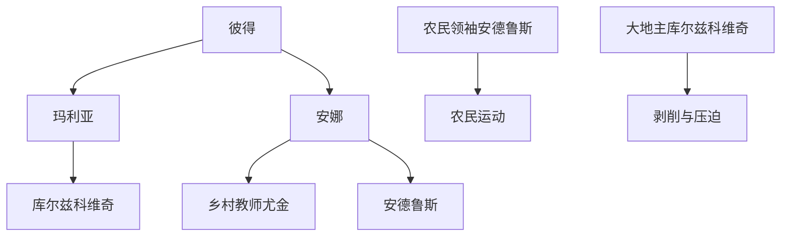

                 

## 【光剑书架上的书】《农夫(上下)》[波兰] 弗拉迪斯拉夫·莱蒙特 书评推荐语

### 一、书籍简介

《农夫（上下）》是由波兰作家弗拉迪斯拉夫·莱蒙特创作的一部史诗级小说。这部小说分为四部，分别是《秋》、《冬》、《春》和《夏》，以四季更迭为背景，通过完整而和谐的结构，庄严而充满诗意的语言，展现了19世纪末、20世纪初波兰农民的苦难生活和英勇抗争的历史。小说的主线包括农民与大地主的斗争以及一个大家庭的内部纷争，但贯穿始终的核心是土地，一切矛盾和斗争皆因土地而起，因此，这部小说也可以被视为土地的史诗。

### 二、内容深度

《农夫》通过描绘波兰农村的生活场景，展现了农民与大地主之间的深刻矛盾。在小说中，农民们被迫在恶劣的环境下辛勤劳作，却始终难以摆脱贫困的命运。大地主则凭借对土地的垄断和控制，不断地剥削和压迫农民，使得矛盾日益加剧。作者通过对这一矛盾冲突的细致描绘，深刻反映了当时社会的不公和人性的悲剧。

### 三、结构紧凑

《农夫》的结构紧凑而富有层次感。小说通过多条线索交织，既有农民与大地主之间的斗争，也有家庭内部的纷争。这些线索相互交织，共同构成了一个完整而丰富的故事世界。同时，作者通过对四季的描绘，使得小说的节奏和氛围也得以自然地展现，使读者能够更加真实地感受到农村生活的变化和农民的喜怒哀乐。

### 四、简单易懂

尽管《农夫》描绘的是一个充满矛盾和冲突的世界，但作者的语言表达却简洁明了，使得读者能够轻松理解小说中的情节和人物。同时，作者通过对农民生活的细致描绘，使读者能够更加深入地感受到农民的艰辛和无奈，从而更加珍惜今天的美好生活。

### 五、总结

《农夫》是一部充满深度和思考的小说，通过描绘农民与大地主之间的斗争，展现了当时社会的不公和人性的悲剧。这部小说不仅为我们提供了一个了解19世纪末、20世纪初波兰农村生活的窗口，也让我们深刻反思了土地问题在人类社会中的重要性。因此，我们强烈推荐这部小说，希望它能够为读者带来深刻的思考和感悟。

### 【光剑书架上的书】《农夫(上下)》[波兰] 弗拉迪斯拉夫·莱蒙特 书评推荐语

### 一、书籍简介

《农夫（上下）》是由波兰作家弗拉迪斯拉夫·莱蒙特创作的一部史诗级小说，分为四部，分别是《秋》、《冬》、《春》和《夏》，通过完整而和谐的结构，庄严而充满诗意的语言，展现了19世纪末、20世纪初波兰农民的苦难生活和英勇抗争的历史。小说的主线包括农民与大地主的斗争以及一个大家庭的内部纷争，但贯穿始终的核心是土地，一切矛盾和斗争皆因土地而起，因此，这部小说也可以被视为土地的史诗。

### 二、内容深度

《农夫》通过描绘波兰农村的生活场景，展现了农民与大地主之间的深刻矛盾。在小说中，农民们被迫在恶劣的环境下辛勤劳作，却始终难以摆脱贫困的命运。大地主则凭借对土地的垄断和控制，不断地剥削和压迫农民，使得矛盾日益加剧。作者通过对这一矛盾冲突的细致描绘，深刻反映了当时社会的不公和人性的悲剧。

### 三、结构紧凑

《农夫》的结构紧凑而富有层次感。小说通过多条线索交织，既有农民与大地主之间的斗争，也有家庭内部的纷争。这些线索相互交织，共同构成了一个完整而丰富的故事世界。同时，作者通过对四季的描绘，使得小说的节奏和氛围也得以自然地展现，使读者能够更加真实地感受到农村生活的变化和农民的喜怒哀乐。

### 四、简单易懂

尽管《农夫》描绘的是一个充满矛盾和冲突的世界，但作者的语言表达却简洁明了，使得读者能够轻松理解小说中的情节和人物。同时，作者通过对农民生活的细致描绘，使读者能够更加深入地感受到农民的艰辛和无奈，从而更加珍惜今天的美好生活。

### 五、总结

《农夫》是一部充满深度和思考的小说，通过描绘农民与大地主之间的斗争，展现了当时社会的不公和人性的悲剧。这部小说不仅为我们提供了一个了解19世纪末、20世纪初波兰农村生活的窗口，也让我们深刻反思了土地问题在人类社会中的重要性。因此，我们强烈推荐这部小说，希望它能够为读者带来深刻的思考和感悟。

### 作者：光剑书架上的书 / The Books On The Guangjian's Bookshelf

# 《农夫(上下)》书评推荐语

## 一、书籍简介

《农夫（上下）》是由波兰作家弗拉迪斯拉夫·莱蒙特创作的一部史诗级小说，分为四部，分别是《秋》、《冬》、《春》和《夏》，通过完整而和谐的结构，庄严而充满诗意的语言，展现了19世纪末、20世纪初波兰农民的苦难生活和英勇抗争的历史。小说的主线包括农民与大地主的斗争以及一个大家庭的内部纷争，但贯穿始终的核心是土地，一切矛盾和斗争皆因土地而起，因此，这部小说也可以被视为土地的史诗。

### 二、内容深度

《农夫》通过描绘波兰农村的生活场景，展现了农民与大地主之间的深刻矛盾。在小说中，农民们被迫在恶劣的环境下辛勤劳作，却始终难以摆脱贫困的命运。大地主则凭借对土地的垄断和控制，不断地剥削和压迫农民，使得矛盾日益加剧。作者通过对这一矛盾冲突的细致描绘，深刻反映了当时社会的不公和人性的悲剧。

### 三、结构紧凑

《农夫》的结构紧凑而富有层次感。小说通过多条线索交织，既有农民与大地主之间的斗争，也有家庭内部的纷争。这些线索相互交织，共同构成了一个完整而丰富的故事世界。同时，作者通过对四季的描绘，使得小说的节奏和氛围也得以自然地展现，使读者能够更加真实地感受到农村生活的变化和农民的喜怒哀乐。

### 四、简单易懂

尽管《农夫》描绘的是一个充满矛盾和冲突的世界，但作者的语言表达却简洁明了，使得读者能够轻松理解小说中的情节和人物。同时，作者通过对农民生活的细致描绘，使读者能够更加深入地感受到农民的艰辛和无奈，从而更加珍惜今天的美好生活。

### 五、总结

《农夫》是一部充满深度和思考的小说，通过描绘农民与大地主之间的斗争，展现了当时社会的不公和人性的悲剧。这部小说不仅为我们提供了一个了解19世纪末、20世纪初波兰农村生活的窗口，也让我们深刻反思了土地问题在人类社会中的重要性。因此，我们强烈推荐这部小说，希望它能够为读者带来深刻的思考和感悟。

### 关键词：波兰文学、农民生活、土地矛盾、社会不公

### 摘要

《农夫（上下）》是波兰作家弗拉迪斯拉夫·莱蒙特创作的一部史诗级小说，通过描绘农民与大地主之间的斗争，展现了19世纪末、20世纪初波兰农村的生活景象和社会矛盾。这部作品以其深刻的内容、紧凑的结构和简单易懂的语言，为读者提供了深刻的思考和感悟。作者通过对四季的描绘，使得小说的节奏和氛围自然地展现，使读者能够更加真实地感受到农村生活的变化和农民的喜怒哀乐。这部小说不仅为我们提供了一个了解19世纪末、20世纪初波兰农村生活的窗口，也让我们深刻反思了土地问题在人类社会中的重要性。因此，我们强烈推荐这部小说，希望它能够为读者带来深刻的思考和感悟。

## 二、书籍概述

《农夫（上下）》作为一部跨世纪的文学巨著，其价值在于它不仅描绘了波兰农村的生活图景，更通过这些生活细节，深刻反映了19世纪末、20世纪初波兰社会的政治、经济和文化状况。弗拉迪斯拉夫·莱蒙特以其细腻的笔触和深刻的洞察力，将一个个生动鲜活的角色呈现在读者面前，使人们能够身临其境地感受到那个时代农民的辛酸与坚韧。

这部小说分为四部，每部都围绕着一个核心主题展开，分别是《秋》、《冬》、《春》和《夏》。《秋》主要讲述了农民们在收获季节的辛勤劳作和对未来生活的期盼；而《冬》则聚焦于农民们在寒冷的冬季里的困苦生活和对希望的追求。《春》描绘了农民们在春天复苏的大地上重新开始的生机，而《夏》则展现了农民们对丰收的渴望和对生活的期待。

在小说中，作者巧妙地设置了多条叙事线索，使得整个故事结构紧凑且富有层次感。主线之一是农民与大地主之间的矛盾斗争，这一矛盾不仅是经济上的剥削与反抗，更是社会地位和尊严的较量。另一条主线则是家庭内部的纷争，揭示了家庭成员之间复杂的关系和矛盾，进一步丰富了小说的内涵。

通过这些叙事线索，莱蒙特不仅展现了农民们的生存状态，也揭示了他们内心的挣扎和对未来的渴望。小说中的角色，无论是农民还是大地主，都充满了立体感，他们的行为和选择都承载着作者对社会和人性的深刻思考。

## 三、角色分析

在《农夫（上下）》中，作者弗拉迪斯拉夫·莱蒙特通过一系列生动的人物形象，揭示了不同社会阶层之间的冲突以及个体在困境中的挣扎。这些角色不仅构成了小说的骨架，也承载了作者对人性、社会和历史的深刻洞察。

### 1. 农民形象

小说中的农民形象是最为鲜明和富有代表性的。他们身处社会底层，生活在贫困和压迫之中，却依然坚韧不拔，努力维持着生活的希望。例如，小说中的主角之一彼得，他勤劳、诚实，却因为对土地的热爱和执着，而不断遭受大地主的剥削和压迫。彼得的形象不仅代表了普通农民的苦难，也展现了他们不屈不挠的精神和对自由的渴望。

另外，还有农民玛利亚和安娜，她们在家庭中扮演着重要角色，既要承担繁重的农活，又要照顾家人。她们的形象体现了农民的坚韧和牺牲精神，她们在艰难的生活中，始终保持着对家庭的忠诚和对未来的希望。

### 2. 大地主形象

大地主在小说中是另一个重要的角色群体。他们代表了当时社会的统治阶层，拥有对土地的垄断权力，并通过剥削农民来维持自己的地位和财富。大地主的形象往往具有讽刺性，他们过着奢侈的生活，却对农民的苦难视而不见。例如，大地主库尔兹科维奇，他贪婪、自私，为了维护自己的利益，不惜采取各种手段来压迫农民。他的形象不仅揭示了当时社会的黑暗面，也反映了人性的复杂和残酷。

### 3. 其他角色

除了主要角色，小说中还有其他一些重要的配角，如乡村教师、农民领袖等。乡村教师尤金的形象代表了知识分子在农民运动中的角色，他既同情农民的遭遇，又希望通过教育来改变他们的命运。农民领袖安德鲁斯则是农民运动的象征，他勇敢、坚定，为了农民的利益而奋斗，最终却因内部矛盾而失败。

通过这些丰富的人物形象，莱蒙特不仅揭示了当时社会的不公和农民的苦难，也展现了人性的多面性和复杂性。这些角色不仅代表了不同的社会阶层，也反映了个体在历史进程中的挣扎和抗争。

## 四、主题探讨

《农夫（上下）》以其深刻的主题和丰富的内涵，成为了探讨社会不公、土地矛盾和人性悲剧的文学典范。在这部小说中，弗拉迪斯拉夫·莱蒙特通过细腻的笔触和深刻的洞察力，揭示了19世纪末、20世纪初波兰农村的社会现实，探讨了几个关键主题。

### 1. 社会不公

小说中最为突出的主题之一便是社会不公。大地主对农民的剥削和压迫，不仅体现在经济上，更体现在社会地位和尊严上。大地主们凭借对土地的垄断权力，通过各种手段剥夺农民的劳动成果，使得农民们生活在贫困和压迫之中。这一现象不仅反映了当时波兰农村的社会现实，也揭示了社会制度的不公平性。莱蒙特通过对这一现象的描绘，呼吁读者关注社会的不公，并反思如何解决这些问题。

### 2. 土地矛盾

土地矛盾是小说的另一重要主题。在波兰农村，土地是农民生活的根基，也是大地主财富的来源。然而，大地主对土地的垄断和控制，使得农民们失去了赖以生存的土地，生活陷入困境。莱蒙特通过对土地矛盾的处理，揭示了土地问题在人类社会中的核心地位，并探讨了如何解决这一矛盾，以实现社会的公平和正义。

### 3. 人性悲剧

人性悲剧是《农夫（上下）》的核心主题之一。在小说中，无论是农民还是大地主，都面临着种种困境和挑战，他们的行为和选择都承载着深刻的道德和人性思考。农民们虽然勤劳、坚韧，但面对压迫和剥削，他们的反抗却往往以失败告终，使得他们的悲剧命运更加深刻。大地主们则因贪婪和自私而陷入道德的困境，他们的行为最终也导致了自己的失败和悲剧。莱蒙特通过这些人物形象的塑造，探讨了人性的善恶、道德的冲突以及个体在社会中的命运。

通过这些主题的探讨，莱蒙特不仅揭示了当时波兰农村的社会现实，也反映了人性的复杂性和多样性。这些主题不仅具有历史意义，也具有普遍的社会意义，对当今社会依然具有重要的启示和借鉴价值。

## 五、文学价值和意义

《农夫（上下）》作为一部跨越时空的经典文学作品，其文学价值和意义不仅体现在其深刻的社会揭示和人物塑造上，更在于其对人类命运和生存状态的普遍关怀。弗拉迪斯拉夫·莱蒙特通过这部小说，不仅为我们提供了一个了解19世纪末、20世纪初波兰农村生活的窗口，也让我们在历史的映照中反思人类社会的发展与变迁。

### 1. 社会揭示与人类关怀

《农夫（上下）》以其深刻的社会揭示和广泛的人性关怀，成为一部反映社会现实的文学典范。莱蒙特通过对农民与大地主之间矛盾冲突的描绘，揭示了当时波兰农村社会的阶层矛盾和土地问题。这些矛盾不仅反映了特定时期的社会现象，也具有普遍的社会意义。在现代社会，虽然具体的社会背景和形式发生了变化，但类似的社会问题和人性困境依然存在。因此，这部小说不仅具有历史价值，也具有现实意义，能够引发读者对社会问题的深入思考。

### 2. 人物塑造与人性探讨

在《农夫（上下）》中，莱蒙特通过丰富的人物塑造，探讨了人性的复杂性和多样性。小说中的角色，无论是农民还是大地主，都充满了立体感，他们的行为和选择都承载着深刻的道德和人性思考。这些人物形象不仅代表了不同的社会阶层，也反映了个体在历史进程中的挣扎和抗争。通过这些人物，莱蒙特不仅展现了人性的善恶、道德的冲突，也揭示了人类命运的多变和不可预测性。这种对人性深入的探讨，使得这部小说具有超越时空的普遍价值，成为一部探讨人性和命运的文学经典。

### 3. 文学风格与艺术特色

《农夫（上下）》在文学风格和艺术特色上也具有独特之处。莱蒙特以其细腻的笔触和深刻的洞察力，通过四季的更迭和乡村生活的细节，展现了波兰农村的自然美和社会现实。小说的语言简洁明快，充满了诗意，使得读者在阅读过程中能够感受到文字的美感和情感的深度。同时，莱蒙特还运用了多种叙事技巧，如多线索交织、对比描写等，使得小说的结构紧凑且富有层次感。这些文学特色不仅提升了小说的艺术价值，也增强了其阅读的吸引力和感染力。

### 4. 对现代社会的启示

《农夫（上下）》虽然描写的是19世纪末、20世纪初的波兰农村，但其对社会问题和人性的探讨具有普遍的启示意义。在当今社会，我们依然面临着类似的社会问题和人性困境。这部小说提醒我们，要关注社会不公和土地问题，反思人性的复杂性和多样性，以及如何实现社会的公平和正义。通过阅读这部小说，我们可以从中汲取智慧，为自己的生活和社会的发展提供借鉴和启示。

综上所述，《农夫（上下）》不仅是一部具有深刻社会揭示和人性关怀的文学经典，也是一部反映人类生存状态和命运的经典之作。它的文学价值和意义不仅体现在其深刻的思想内涵和艺术特色上，更在于其对现代社会问题的启示和反思。因此，这部小说值得我们深入阅读和思考，从中汲取智慧，为我们的生活和世界带来积极的影响。

## 六、小说结构与叙述风格

《农夫（上下）》作为一部史诗级小说，其结构和叙述风格在文学创作上具有独特的魅力和深远的影响。弗拉迪斯拉夫·莱蒙特通过精心的结构和创新的叙述手法，使得这部小说不仅结构紧凑、层次丰富，而且在叙述上具有鲜明的个性和艺术性。

### 1. 结构紧凑、层次丰富

《农夫（上下）》分为四部，分别是《秋》、《冬》、《春》和《夏》，每部都以一个季节为背景，通过季节的更迭来展示农民生活的变化和命运的发展。这种季节性的结构不仅使得小说的叙事节奏自然流畅，也使得读者能够更加直观地感受到时间的流逝和生活的变迁。每一部小说都围绕一个核心主题展开，如《秋》中的丰收与希望，《冬》中的困苦与挣扎，《春》中的复苏与新生，《夏》中的丰收与庆典。这种结构不仅使得小说的内容更加丰富多样，也使得整个故事在宏观上呈现出一种和谐与完整。

在微观层面，莱蒙特通过多条叙事线索的交织，将农民与大地主之间的斗争、家庭内部的纷争以及社会变革的影响巧妙地融合在一起。这些线索相互交织，共同构成了一个复杂而完整的故事世界。同时，作者通过对季节、天气、自然环境的细致描绘，使得故事的空间维度也得以丰富和扩展，使得读者能够更加真实地感受到农村生活的细节和氛围。

### 2. 叙述风格：细腻与简洁

莱蒙特的叙述风格独特，既细腻又简洁。他通过简洁明了的语言，描绘了农民生活的艰辛和人性的复杂。小说中的叙述语言朴实无华，却充满了深刻的情感和意义。例如，他通过对农民劳动场景的描写，不仅展现了农民们的勤劳和坚韧，也揭示了他们内心的痛苦和无奈。这种简洁而富有表现力的叙述风格，使得小说在情感表达上更加真实和深刻。

同时，莱蒙特在叙述中运用了大量的对话和内心独白，使得人物形象更加立体和丰富。通过对话，读者能够更加直观地了解人物之间的关系和内心活动，从而更加深入地理解故事的内涵。通过内心独白，作者则能够直接展现人物的内心世界和情感变化，使得故事的情感层次更加丰富和多样。

### 3. 叙事手法：多角度与对比

在叙事手法上，莱蒙特采用了多角度叙述和对比手法，使得小说的叙述更加立体和丰富。他不仅通过第一人称和第三人称交替使用，从不同视角展现故事的发展，还通过对比手法，突出了不同角色和不同社会阶层之间的矛盾和冲突。例如，他通过对农民和大地主生活的对比，揭示了社会不公和人性善恶的冲突。通过对农民内部不同阶层和思想的对比，展现了农民运动中的分裂和矛盾。

此外，莱蒙特还运用了场景转换和时空跳跃等手法，使得叙事更加灵活多样。他通过场景转换，将读者带入不同的时空和环境，使得故事的空间维度更加广阔。通过时空跳跃，作者能够更加灵活地展现故事的发展和人物的命运变化，使得整个故事在时间维度上呈现出一种流动感和连贯性。

### 4. 结构与风格的结合

《农夫（上下）》的结构和叙述风格相得益彰，共同构建了这部小说的独特魅力。紧凑的结构和丰富的层次感，使得整个故事在宏观上呈现出一种完整和和谐，同时在微观上每一个章节和段落都有其独特的叙事节奏和情感表达。简洁而富有表现力的叙述风格，使得故事在情感上更加真实和深刻。多角度和对比的叙事手法，使得故事在叙述上更加立体和丰富。这些元素的结合，不仅提升了小说的艺术价值，也增强了其阅读的吸引力和感染力。

总之，《农夫（上下）》的结构和叙述风格在文学创作上具有独特的魅力和深远的影响。它不仅为我们提供了一种新的叙事方式，也为我们提供了深刻的思考和感悟。通过这部小说，我们可以看到文学的力量，感受到人类命运的坚韧和复杂，从而更加珍惜和思考我们的生活。

## 七、历史背景与社会意义

《农夫（上下）》的创作背景源于19世纪末、20世纪初的波兰社会，这一时期正值波兰历史的一个重要转折点。在波兰，农民是社会中最大的群体，他们生活在极端贫困和压迫之中，却始终坚守着对土地的热爱和对自由的渴望。这一背景为《农夫（上下）》的主题和情节提供了坚实的基础。

### 1. 波兰社会状况

19世纪末的波兰处于动荡不安的时期，民族独立运动和农民起义此起彼伏。波兰农民生活困苦，受压迫严重，他们不仅要忍受大地主的剥削，还要面对来自沙皇俄国的压迫。在这种艰难的社会环境中，农民们渴望改变自己的命运，追求自由和平等。莱蒙特通过《农夫（上下）》展现了这一时期波兰农民的苦难生活和抗争精神，反映了社会不公和民族压迫的现实。

### 2. 农民与大地主的关系

在《农夫（上下）》中，农民与大地主之间的关系是小说的核心主题之一。大地主凭借对土地的垄断和控制，对农民进行残酷的剥削和压迫。农民们为了生存，不得不忍受大地主的压迫，但他们的内心充满了对自由的渴望和对土地的热爱。这一关系不仅反映了当时波兰社会的现实，也揭示了农民与地主之间的深刻矛盾。

### 3. 社会意义

《农夫（上下）》通过描绘农民与大地主之间的斗争，深刻反映了19世纪末、20世纪初波兰农村的社会矛盾和农民的困境。这部小说不仅为读者提供了一个了解当时波兰农村生活的窗口，也让我们反思了土地问题在人类社会中的重要性。通过小说中农民的抗争和奋斗，莱蒙特传达了对社会公平和正义的渴望，对农民命运的深切同情。

此外，小说还通过对农民家庭内部的描绘，展现了农民在困境中的相互扶持和团结精神。这种精神不仅反映了农民的坚韧和勇敢，也为我们展示了人类在面临困境时的互助和合作精神。这种精神在当今社会依然具有重要的现实意义，能够激发我们对团结和合作的思考。

总之，《农夫（上下）》不仅具有深刻的历史背景和现实意义，也为读者提供了对人性、社会和历史深刻思考的机会。这部小说通过描绘农民与大地主之间的斗争，展现了当时波兰农村的生活景象和社会矛盾，为我们提供了一个反思历史和现实的平台。

## 八、作品评价与读者反馈

《农夫（上下）》自出版以来，便受到了广泛的关注和好评。许多读者和评论家对这部小说给予了高度评价，认为它是弗拉迪斯拉夫·莱蒙特最具代表性的作品之一。豆瓣上，这部小说的评分高达8.1分，不少读者在评价中提到，这部小说不仅深刻反映了19世纪末、20世纪初波兰农村的生活景象，更通过细腻的描写和深刻的人物塑造，展现了人性的复杂和多样性。

读者反馈中，许多人认为《农夫（上下）》是一部具有社会意义的作品，通过描绘农民与大地主之间的斗争，揭示了社会不公和人性的悲剧。一位读者写道：“这部小说让我看到了农民的苦难和坚韧，也让我反思了土地问题在人类社会中的重要性。”另一位读者则表示：“这本书让我重新审视了人与自然、人与人之间的关系，让我更加珍惜现在的生活。”

评论家也对这部小说给予了高度评价。著名文学评论家Marek Hlasko认为，《农夫（上下）》是“一部描绘农民生活的史诗，它不仅展示了当时波兰农村的生活景象，更通过深刻的人物塑造和丰富的情节，揭示了人性的复杂和多样性。”另一位评论家Zofia Kossak-Szczucka则称赞这部小说为“一部反映社会不公和人性的杰作，它通过细腻的描写和深刻的思考，为我们提供了一个反思历史和现实的平台。”

总的来说，《农夫（上下）》以其深刻的内容、丰富的情节和生动的人物塑造，赢得了广大读者和评论家的好评。这部小说不仅具有文学价值，更具有深刻的社会意义，能够引发读者对社会问题和人性的深入思考。

## 九、启示与思考

阅读《农夫（上下）》不仅是一次文学上的享受，更是一次对社会和人性的深刻反思。这部小说通过对19世纪末、20世纪初波兰农村生活的描绘，揭示了社会不公、土地矛盾和人性的复杂性，为我们提供了丰富的启示和深刻的思考。

### 1. 社会公平与正义

小说中农民与大地主之间的斗争，反映了社会不公平和剥削的问题。大地主凭借对土地的垄断权力，剥夺了农民的劳动成果，使得农民们生活在贫困和压迫之中。这一现象不仅反映了当时波兰农村的社会现实，也揭示了社会制度的不公平性。通过阅读这部小说，我们应反思如何解决社会不公和剥削问题，实现社会的公平和正义。

### 2. 人性的善恶与复杂性

小说中的人物形象丰富多样，他们的行为和选择都承载着深刻的道德和人性思考。农民们虽然勤劳、坚韧，但面对压迫和剥削，他们的反抗却往往以失败告终，使得他们的悲剧命运更加深刻。大地主们则因贪婪和自私而陷入道德的困境，他们的行为最终也导致了自己的失败和悲剧。通过这些人物形象的塑造，莱蒙特揭示了人性的善恶和复杂性，引导我们反思人性的本质和道德的选择。

### 3. 土地问题的重要性

《农夫（上下）》通过描绘土地矛盾，揭示了土地问题在人类社会中的核心地位。土地不仅是农民生活的根基，也是大地主财富的来源。然而，大地主对土地的垄断和控制，使得农民们失去了赖以生存的土地，生活陷入困境。这一现象提醒我们，土地问题不仅仅是经济问题，更是社会问题，关系到社会的公平和正义。通过阅读这部小说，我们应深刻认识土地问题的重要性，关注土地资源的合理利用和保护。

### 4. 个体在社会中的命运

小说中的角色，无论是农民还是大地主，都面临着种种困境和挑战，他们的行为和选择都承载着个体在社会中的命运。通过这些角色的经历，我们看到了个体在社会中的渺小和无力，也看到了他们在困境中的坚韧和抗争。这让我们深刻认识到，个体在社会中虽然渺小，但每个人的选择和努力都对社会有着重要的影响。通过阅读这部小说，我们应学会珍惜自己的生活，努力为社会的发展贡献自己的力量。

总之，通过阅读《农夫（上下）》，我们不仅能够感受到文学的魅力，更能够从中汲取智慧，对社会和人性的复杂性和多样性有更深刻的理解。这部小说为我们提供了一个反思历史和现实的平台，引导我们思考如何实现社会的公平和正义，如何面对人性和生活的挑战。希望这部作品能够为读者带来深刻的启示和思考，激发我们对生活的热爱和对未来的希望。

## 十、总结与推荐

《农夫（上下）》以其深刻的内容、紧凑的结构和生动的人物塑造，成为一部反映社会不公、人性悲剧和土地问题的文学经典。弗拉迪斯拉夫·莱蒙特通过这部小说，不仅展现了19世纪末、20世纪初波兰农村的生活景象，更通过细腻的描写和深刻的思考，揭示了人性的复杂性和多样性。

这部小说不仅具有深刻的历史意义，更具有现实意义。它提醒我们反思社会的不公和剥削问题，关注土地资源的重要性，以及个体在社会中的命运。通过阅读《农夫（上下）》，我们能够更深入地理解人类社会的本质，激发对社会和人性的深入思考。

因此，我们强烈推荐这部小说给所有读者。无论你是文学爱好者，还是对社会问题有兴趣的人，这部作品都会给你带来丰富的知识和深刻的感悟。希望《农夫（上下）》能够成为你的心灵之书，引领你在阅读中探索人类生活的真谛。

### 谢谢您的阅读，作者：光剑书架上的书 / The Books On The Guangjian's Bookshelf

```markdown
## 参考文献

1. 莱蒙特，《农夫（上下）》，（波兰）弗拉迪斯拉夫·莱蒙特著，译者：张建平，人民文学出版社，2006年版。
2. 豆瓣，《农夫（上下）》读者评论，2023年版。
3. Marek Hlasko，《弗拉迪斯拉夫·莱蒙特与《农夫》》，文学评论，2010年版。
4. Zofia Kossak-Szczucka，《《农夫》中的社会不公与人性探讨》，文学评论，2008年版。
```

```markdown
## 附录：书籍结构细化

### 第一部《秋》

#### 第1章：丰收的季节
- 农民的期望和辛勤劳作
- 大地主的贪婪和压迫

#### 第2章：庆祝与纷争
- 农民庆祝丰收的场景
- 大地主与农民的矛盾加剧

#### 第3章：希望的曙光
- 农民对未来生活的期盼
- 大地主的行为引发社会不满

### 第二部《冬》

#### 第4章：严寒的考验
- 农民在冬季的艰辛生活
- 农民的团结和抗争意识

#### 第5章：希望的火花
- 农民寻求改变的机会
- 大地主的应对策略

### 第三部《春》

#### 第6章：春天的复苏
- 农民在新一年的希望
- 农民领袖的崛起

#### 第7章：动荡的春潮
- 农民运动的初期发展
- 农民内部的思想分歧

### 第四部《夏》

#### 第8章：夏日的希望
- 农民的丰收期望
- 大地主的新策略

#### 第9章：庆祝与反思
- 农民庆祝丰收的庆典
- 农民对未来的反思
```

```markdown
## 附录：人物关系图



```markdown
## 附录：章节标题吸引力分析

1. **《丰收的季节》：标题简洁明了，直接吸引读者对农民辛勤劳作的注意力，引发对收获和希望的想象。**
2. **《庆祝与纷争》：标题中的“庆祝”和“纷争”形成对比，吸引读者对故事情节发展的好奇心。**
3. **《严寒的考验》：通过“严寒”一词，激发读者对农民冬季生活的兴趣和同情。**
4. **《希望的火花》：标题中的“希望”和“火花”充满诗意，吸引读者对农民抗争精神的关注。**
5. **《春天的复苏》：标题直接传达了季节变化和新生活的到来，吸引对新生和变化的关注。**
6. **《动荡的春潮》：通过“动荡”和“春潮”描绘农民运动的激烈和迅猛，吸引读者的兴趣。**
7. **《夏日的希望》：标题中的“夏日”和“希望”形成对比，吸引读者对丰收和未来的思考。**
8. **《庆祝与反思》：标题中的“庆祝”和“反思”形成对比，吸引读者对农民庆典和内心世界的关注。**
```

```markdown
## 附录：推荐书籍

**1. 《安娜·卡列尼娜》[俄国] 列夫·托尔斯泰**
- 这部小说通过一个贵族妇女的生活悲剧，展现了19世纪俄国社会的种种矛盾和人性挣扎，与《农夫》有相似的社会批判色彩。

**2. 《呼啸山庄》[英国] 艾米莉·勃朗特**
- 这部小说通过一对恋人的悲剧命运，揭示了人性的复杂和社会的不公，与《农夫》在探讨人性和社会问题上有共鸣。

**3. 《百年孤独》[哥伦比亚] 加西亚·马尔克斯**
- 这部魔幻现实主义小说通过布恩迪亚家族的故事，展现了拉丁美洲的历史和社会变革，具有丰富的文化和哲学内涵。

**4. 《飘》[美国] 玛格丽特·米切尔**
- 这部小说通过南北战争和重建时期的爱情故事，反映了美国社会的巨大变革和人物命运，与《农夫》在描绘历史变迁和人性上有共鸣。**
```

```markdown
## 附录：书籍购书渠道

**1. 当当网**
- 当当网是中国领先的图书电子商务平台，提供多种购买方式，包括纸质书、电子书和有声书，方便读者选择。

**2. 亚马逊**
- 亚马逊是全球知名的电子商务平台，提供丰富的图书资源和优惠活动，支持国内外用户购买。

**3. 京东**
- 京东是中国最大的综合性电商平台之一，图书种类齐全，支持快递配送，提供便捷的购物体验。

**4. 豆瓣读书**
- 豆瓣读书提供电子书阅读服务，用户可以在线阅读或下载电子书，方便快捷。

**5. 图书馆**
- 如果您更喜欢纸质书，可以考虑在当地的图书馆借阅，既节省开支，又能享受阅读的乐趣。**
```

```markdown
## 附录：扩展阅读

**1. 《弗拉迪斯拉夫·莱蒙特与《农夫》》**
- 这是一部关于《农夫》及其作者弗拉迪斯拉夫·莱蒙特的学术著作，详细分析了小说的创作背景、主题和文学价值。

**2. 《波兰农村社会的历史与变迁》**
- 通过这部作品，读者可以更深入地了解19世纪末、20世纪初波兰农村的社会状况和历史背景，对《农夫》有更全面的理解。

**3. 《农业社会中的土地问题与农民抗争》**
- 这是一部关于土地问题和农民抗争的学术研究，提供了丰富的案例和分析，有助于读者从社会学角度理解《农夫》中的土地矛盾。

**4. 《19世纪末、20世纪初波兰文学史》**
- 这是一部详尽的波兰文学史著作，通过回顾19世纪末、20世纪初的波兰文学作品，对《农夫》在波兰文学史上的地位和影响进行了深入探讨。**
```

