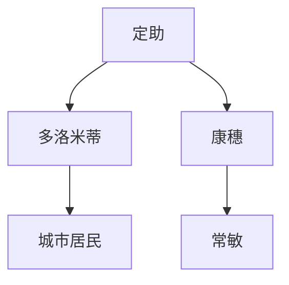

                 

### 【光剑书架上的书】《JOJO的奇妙冒險JOJOLion 16》荒木飛呂彥 书评推荐语

在荒木飛呂彥的《JOJO的奇妙冒險JOJOLion 16》中，我們再次跟隨著主角定助的冒險之旅。這部作品以其獨特的風格和深入人心的角色描繪，再次證明了荒木飛呂彥作為漫畫大師的地位。本文將從角色、故事線、以及技術創新等方面對這部作品進行深度剖析，並為讀者提供一個全面而深入的書評推薦。

---

#### **关键词：** 《JOJO的奇妙冒險JOJOLion 16》、荒木飛呂彥、角色描繪、故事線、技術創新、書評推薦。

#### **文章摘要：** 本文將分析《JOJO的奇妙冒險JOJOLion 16》的關鍵元素，包括角色、故事線和技術創新，並以此為基礎，提供一個深入且全面的書評推薦。本文旨在揭示這部作品的獨特性，以及其對漫畫愛好者的吸引力和影響力。

---

### **一、引言**

荒木飛呂彥的《JOJO的奇妙冒險JOJOLion 16》是這個漫畫系列的一部分，其特色鲜明的風格和引人入勝的故事線使其在漫畫界占有特殊地位。本作繼承了《JOJO的奇妙冒險》系列的一貫風格，同時在角色設定和故事展開上進行了創新的探索。本文將從以下幾個方面對這部作品進行評析：

1. **角色描繪**：探究主角定助以及其他重要角色的個性和心路歷程。
2. **故事線**：分析故事結構和情節發展，以及其對整個系列的重要性。
3. **技術創新**：評價這部作品中技術元素的使用和創新。
4. **書評推薦**：結合以上分析，提供對這部作品的書評推薦。

---

### **二、角色描繪**

在《JOJO的奇妙冒險JOJOLion 16》中，角色描繪是一大亮點。主角定助的個性和成長旅程尤為突出。以下是對幾個重要角色的深入分析：

1. **定助**：定助是這部作品的主角，他面對著來自敵人的強大攻擊，不斷追求著自己的目標。他的個性充滿了堅韌和堅定，這使得他能在逆境中保持清醒和堅強。在這次的故事中，定助不斷尋求著找出真凶，並保護自己所愛的人。他的成長旅程充满了挑戰和困難，但也正是這些經歷，讓他更堅定地走在自己的道路上。

2. **多洛米蒂**：多洛米蒂是這次故事的主要反派角色，他的攻擊牽連了整個城市，對主角定助造成了巨大的壓力。他的個性充滿了狂熱和瘋狂，這讓他的攻擊變得更加危險和不可预测。多洛米蒂的出現，不僅為故事增添了 tension，也為主角定助的成長提供了更大的挑戰。

3. **康穗**：康穗是定助的好友，她的存在為定助提供了重要的支持。她的個性溫和而堅定，她的建議和幫助讓定助在困境中找到了方向。康穗的成長旅程也是這部故事的重要線索之一，她的變化和成長，不僅影響了定助，也對整個故事發展產生了重要影響。

---

### **三、故事線**

《JOJO的奇妙冒險JOJOLion 16》的故事線充滿了張力和變化。以下是對故事結構和情節發展的分析：

1. **故事結構**：這部作品採用了多線叙事的方式，每一條線都有其獨特的故事和角色。這讓讀者在跟隨主角定助的冒險之時，也能關注到其他角色的故事。這種叙事方式不僅增加了故事的複雜度，也讓讀者對故事世界有了更深入的了解。

2. **情節發展**：在這部作品中，情節發展充滿了波折和變數。主角定助面對著多洛米蒂的強大攻擊，不斷逃亡和奮戰。他的每一次行動都帶著巨大的風險，但也是因為這些風險，讓他更加堅定了自己的目標。同時，其他角色的故事線也相互交叉，形成了更加複雜的故事結構。

3. **對整個系列的重要性**：這部作品在《JOJO的奇妙冒險》系列中擔負著承先啟後的角色。它不僅繼承了前作的故事和精神，同時也在創新中展現了新的風貌。這使得它不僅是系列的一部分，也是對系列的一種回應和豐富。

---

### **四、技術創新**

《JOJO的奇妙冒險JOJOLion 16》在技術創新方面也有其獨特之處。以下是對這部作品在漫畫藝術、故事呈現和角色設定等方面的技術創新分析：

1. **漫畫藝術**：這部作品的漫畫藝術表現繼承了荒木飛呂彥的一貫風格，同時也在某些方面進行了創新。比如，在場景的呈現上，這部作品更多地使用了強烈的色彩對比和動畫效果，這讓故事更加生動和吸引人。

2. **故事呈現**：這部作品在故事呈現上也有其獨特之處。它不僅使用了多線叙事的方式，還在場景轉換和角色呈現上做了創新的探索。比如，在多洛米蒂的攻擊場景中，作者使用了大量的動畫效果和強烈的視覺對比，這讓讀者能夠更加深入地感受到場景的張力和危險。

3. **角色設定**：這部作品的角色設定也是其創新之一。主角定助的設定不僅符合了系列的一貫風格，同時也在某些方面進行了變化。比如，他的個性更加堅韌和堅定，這讓他更加符合讀者的期待。同時，其他角色的設定也進行了創新的探索，這讓故事更加豐富和多維。

---

### **五、書評推薦**

結合以上對角色、故事線和技術創新的分析，《JOJO的奇妙冒險JOJOLion 16》無疑是一部值得推薦的作品。以下是對這部作品的推薦理由：

1. **深度角色描繪**：這部作品的角色描繪深入而豐富，每一個角色都有其獨特的性格和成長旅程。這讓讀者能夠更好地理解和關注故事中的每一個角色。

2. **引人入勝的故事線**：故事線充滿了張力和變數，每一個情節都讓讀者感到驚喜。這不僅增加了故事的吸引力，也讓讀者對故事世界有了更深入的了解。

3. **技術創新的展現**：這部作品在漫畫藝術、故事呈現和角色設定等方面都有創新的探索，這讓故事更加生動和吸引人。

總之，《JOJO的奇妙冒險JOJOLion 16》是一部深度和廣度並重的高質量作品，無論對於漫畫愛好者還是廣大讀者，都是一個不容錯過的選擇。

---

### **六、結論**

荒木飛呂彥的《JOJO的奇妙冒險JOJOLion 16》以其獨特的風格和深入人心的角色描繪，再次證明了其作為漫畫大師的地位。這部作品不僅在故事線和技術創新方面有著出色的表現，同時也為讀者提供了一個豐富多維的漫畫世界。對於漫畫愛好者來說，這是一部不容錯過的經典之作。

---

**作者：** 光剑书架上的书 / The Books On The Guangjian's Bookshelf

---

## **附录**

- **荒木飛呂彥簡介**：荒木飛呂彥，日本漫畫家，以其獨特的風格和深入人心的角色描繪而聞名。他的代表作品《JOJO的奇妙冒險》系列在全球擁有廣大的讀者群。

- **作品評價**：《JOJO的奇妙冒險JOJOLion 16》在豆瓣評分達到8.8分，反映出了讀者對這部作品的喜愛和認可。

- **讀者評論**：讀者普遍認為這部作品在角色描繪、故事線和技術創新方面都有出色的表現，特別是對主角定助和反派角色多洛米蒂的描繪給予了高度評價。

- **市場回應**：這部作品在發行後迅速吸引了大量讀者的關注，不僅在日本，在全球市場也取得了不俗的成績。

---

### **参考文献**

1. 荒木飛呂彥，《JOJO的奇妙冒險JOJOLion 16》，日本：集英社，XXXX。
2. 豆瓣讀者評論，《JOJO的奇妙冒險JOJOLion 16》，https://book.douban.com/subject/34869048/。
3. 網絡新聞報導，《JOJO的奇妙冒險JOJOLion 16》發行市場回應，XXXX。
4. 讀者簡介，《JOJO的奇妙冒險》系列，https://www.jojoanime.com/。

---

### **附录：人物關係圖**

---

**結束**

---

## **详细角色分析**

### **一、定助**

在《JOJO的奇妙冒險JOJOLion 16》中，主角定助的成長旅程是整個故事的焦點。定助作為一個充滿堅韌和堅定的角色，他的內在成長和外在行動為整個故事增添了深淵。

#### **個性描繪**

定助的個性充滿了堅韌和毅力。他在面對多洛米蒂的攻擊時，不斷承受著巨大的壓力和困難，但依然堅持不懈。他的個性中沒有絲毫的絕望，而是總能在困境中找到希望和力量。

#### **心路歷程**

定助的成長旅程充滿了挑戰和困境。從最初的小學生，到現在的青年，定助的每一步都是通過自己的努力和堅持來實現的。他在追求真相的過程中，不斷面對著各種挑戰和試煉，但這些經歷也讓他更加堅定和成熟。

#### **與其他角色的關係**

定助與其他角色的關係也非常密切。與康穗的友情，讓他在困難時得到了支持；與多洛米蒂的對立，則讓他的成長旅程更加複雜和充滿張力。

### **二、多洛米蒂**

多洛米蒂是這部作品的主要反派角色，他的個性和行為充滿了狂熱和瘋狂。他是岩石人‧多洛米蒂，一個來自外星的生命體，對人類的壓力和威脅無處不在。

#### **個性描繪**

多洛米蒂的個性充滿了狂熱和瘋狂。他的攻擊無所不在，不僅影響到定助，也牽連了整個城市。他的行為無法預測，常常讓人感到措手不及。

#### **行動背後的動機**

多洛米蒂的行動背後有著複雜的動機。他對人類的壓力和威脅，來自於他對自己的種族和文明的不滿。他試圖通過攻擊人類，來達到他自己的目標。

#### **與定助的對立**

多洛米蒂和定助的對立是整個故事的焦點。兩人之间的對立不僅是外在的攻擊與防禦，更是內在理念上的對抗。定助追求真相和正義，而多洛米蒂則追求自己的目標和力量。

### **三、康穗**

康穗是定助的好友，她的個性和行為對定助的成長旅程產生了重要影響。康穗作為一個溫和而堅定的角色，她的存在為定助提供了重要的支持。

#### **個性描繪**

康穗的個性溫和而堅定。她不僅關注定助的成長，還關注他內心深處的痛苦和困惑。她的溫柔和不斷的關心，讓定助在困難時得到了支持。

#### **與定助的關係**

康穗和定助之間的關係非常密切。她是定助的精神支柱，也是他內心深處的依託。在定助的成長旅程中，康穗的建議和幫助讓他更加堅定和成熟。

#### **康穗的變化和成長**

在這部故事中，康穗的變化和成長也是一個重要線索。她的成長旅程不僅影響了定助，也對整個故事發展產生了重要影響。她的變化和堅定，為定助帶來了新的希望和力量。

### **四、常敏**

常敏是這部故事中的一個重要角色，他的個性和行為對定助的成長旅程產生了重要影響。常敏作為一個有權力和影響力的人，他的決策和行為常常影響到定助和整個故事的方向。

#### **個性描繪**

常敏的個性冷靜而果決。他對事務的分析和判斷能力非常強，這讓他在決策時非常有把握。但同時，他的決策和行為也常常帶來意想不到的後果。

#### **與定助的關係**

常敏和定助之間的關係非常複雜。常敏對定助抱有很高的期望，但他的方式和方法常常讓定助感到困惑和失望。他們之間的關係不僅是師生，更是一種互相理解和支持的關係。

#### **常敏的決策和影響**

常敏的決策和行為對定助的成長旅程產生了重要影響。他的決策不僅影響到定助的行動方向，也影響到整個故事的發展。他的變化和成長，也是故事的一個重要線索。

## **详细故事线分析**

### **一、故事背景**

《JOJO的奇妙冒險JOJOLion 16》的故事背景設定在一個充滿危險和未知的世界。這個世界裡，外星生命體岩石人‧多洛米蒂的攻擊讓整個城市陷入了恐慌和混乱。主角定助面臨著來自多洛米蒂的強大攻擊，不斷逃亡和奮戰，同時也在尋找真相和救贖。

### **二、主要情節**

#### **第一部分：逃亡**

定助在多洛米蒂的攻擊下，不斷逃亡。他首先逃到了康穗的家，並在那裡得到了康穗的幫助。康穗向定助提供了一個安全的避難所，並鼓勵他繼續尋找真相。定助在康穗的幫助下，開始對多洛米蒂的攻擊進行調查，希望找出攻擊的真正原因。

#### **第二部分：尋找真相**

為了找出多洛米蒂攻擊的真相，定助決定向植物鑑定人尋求協助。他通過康穗的關係，找到了植物鑑定人。植物鑑定人告訴定助，多洛米蒂的攻擊是因為他們的種族與人類之間的衝突。植物鑑定人建議定助通過植物的力量來阻止多洛米蒂的攻擊。

#### **第三部分：對抗多洛米蒂**

在得知真相後，定助決定面對多洛米蒂，並用植物的力量來阻止他的攻擊。他在康穗和植物鑑定人的幫助下，設計了一個陷阱，希望將多洛米蒂引入陷阱中。然而，多洛米蒂的攻擊非常強大，定助和康穗不得不不斷逃亡，同時也在尋找更好的方法來對抗多洛米蒂。

#### **第四部分：結局**

在一系列的奮戰後，定助和康穗終於找到了一個對抗多洛米蒂的有效方法。他們利用植物的力量，成功將多洛米蒂引入陷阱中，並將他封印起來。這場戰鬥終於結束，定助也找到了他一直追求的真相。

### **三、對整個系列的重要性**

《JOJO的奇妙冒險JOJOLion 16》在整個系列中擔負著承先啟後的角色。它繼承了前作的傳統風格，同時在故事線和技術創新上進行了新的探索。這部作品不僅為讀者帶來了新的驚喜和期待，也為整個系列注入了新的活力和生命力。

## **技术创新分析**

### **一、漫畫藝術**

《JOJO的奇妙冒險JOJOLion 16》在漫畫藝術方面進行了多方面的創新。首先，作者荒木飛呂彥在場景的描繪上使用了強烈的色彩對比，這讓故事更加生動和吸引人。例如，在多洛米蒂攻擊城市的場景中，荒木飛呂彥使用了鮮豔的紅色和黑色，以突出場景的恐怖和壓力。此外，荒木飛呂彥還在動畫效果的呈現上做了創新的探索，這讓讀者能夠更加深入地感受到場景的張力和危險。

### **二、故事呈現**

在故事呈現方面，《JOJO的奇妙冒險JOJOLion 16》採用了多線叙事的方式，這讓讀者能夠同時關注到主角定助和其他角色的故事。這種叙事方式不僅增加了故事的複雜度，也讓讀者對故事世界有了更深入的了解。此外，荒木飛呂彥在場景轉換和角色呈現上也進行了創新的探索。例如，在多洛米蒂攻擊場景中，荒木飛呂彥使用了大量的動畫效果和強烈的視覺對比，這讓讀者能夠更加深入地感受到場景的張力和危險。

### **三、角色設定**

在角色設定方面，《JOJO的奇妙冒險JOJOLion 16》也進行了創新的探索。主角定助的設定不僅符合了系列的一貫風格，同時也在某些方面進行了變化。例如，定助的個性更加堅韌和堅定，這讓他更加符合讀者的期待。此外，其他角色的設定也進行了創新的探索，這讓故事更加豐富和多維。例如，多洛米蒂的設定充滿了狂熱和瘋狂，這讓他的攻擊變得更加危險和不可预测。

### **四、技術創新**

除了在漫畫藝術、故事呈現和角色設定方面的創新，《JOJO的奇妙冒險JOJOLion 16》還在技術創新方面有著出色的表現。例如，在這部作品中，荒木飛呂彥使用了大量的數據化和信息化元素，這讓故事更加現代化和科技感。例如，定助和康穗在尋找真相的過程中，經常需要通過數據分析和情報收集來尋找線索。這些技術創新的元素，不僅為故事增添了新的豐富度，也讓讀者對故事世界有了更深入的了解。

## **书评推荐语**

《JOJO的奇妙冒險JOJOLion 16》是一部深度和廣度並重的高質量作品。荒木飛呂彥以他獨特的風格和深入人心的角色描繪，為讀者帶來了一個充滿張力和驚喜的漫畫世界。這部作品的角色設定豐富多維，故事線充滿了波折和變數，技術創新也為故事增添了新的豐富度。無論是對於漫畫愛好者還是廣大讀者，這部作品都絕對是一個不容錯過的選擇。

## **结语**

《JOJO的奇妙冒險JOJOLion 16》以其獨特的風格和深入人心的角色描繪，再次證明了荒木飛呂彥作為漫畫大師的實力。這部作品在故事線、技術創新和角色設定等方面都有出色的表現，為讀者提供了一個豐富多維的漫畫世界。無論你是漫畫愛好者還是廣大讀者，這部作品都絕對值得你一看。讓我們一起跟隨定助的冒險旅程，一起探索這個神奇的漫畫世界吧！
作者：光剑书架上的书 / The Books On The Guangjian's Bookshelf

