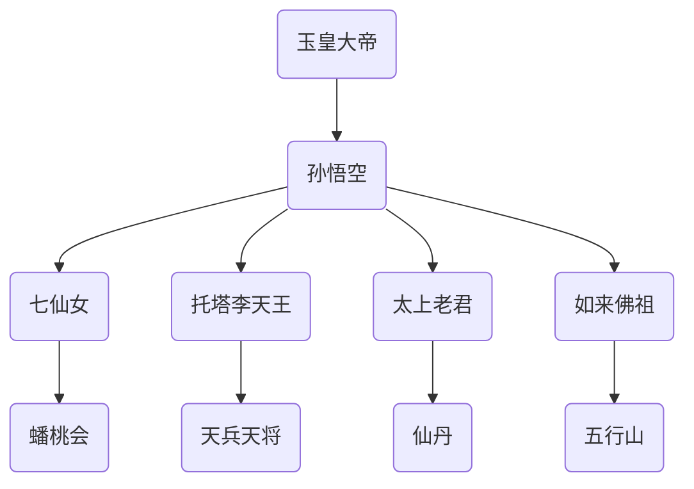
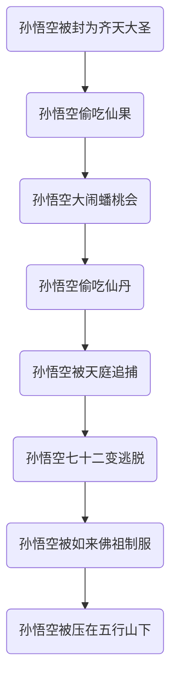

                 

## 【光剑书架上的书】《大闹天宫（西游记绘本）》书评推荐语

### 引言

在《大闹天宫（西游记绘本）》这部作品中，[明]吴承恩以其独特的笔触，将中国古代神话《西游记》中的经典情节通过绘本的形式展现给读者。这部绘本以孙悟空大闹天宫的故事为主线，生动描绘了这一神话传说的魅力。绘本通过精美的插图和简洁的文字，将故事情节和人物形象栩栩如生地呈现在读者面前。本文将对该绘本进行深入分析，探讨其文学价值和教育意义。

### 故事概述

《大闹天宫（西游记绘本）》讲述了孙悟空被玉皇大帝召回天庭，并被封为齐天大圣的故事。然而，孙悟空因为无事可做，开始偷吃天宫中的仙果，并在蟠桃会上大肆捣乱，甚至偷吃了太上老君的仙丹。这些行为引起了天庭的不满，最终导致了玉皇大帝派遣天兵天将捉拿孙悟空的情节。孙悟空在多次逃脱后，最终被如来佛祖压在五行山下，开始了他的五百年囚禁生活。

### 文学价值分析

#### 独特的叙事风格

吴承恩在《大闹天宫（西游记绘本）》中运用了生动的叙事手法，使得故事情节跌宕起伏，引人入胜。绘本以第一人称的视角，让读者仿佛亲临其境，感受到孙悟空在天宫中的肆意妄为和机智应对。同时，作者通过细腻的描绘，将天庭的威严和孙悟空的调皮形象生动地展现出来，使得读者能够更好地理解故事背景和人物性格。

#### 深刻的寓意

《大闹天宫（西游记绘本）》不仅是一部儿童绘本，更蕴含了深刻的寓意。通过孙悟空大闹天宫的故事，吴承恩揭示了人性的贪婪和欲望，以及权力斗争的残酷。这些主题在故事中通过孙悟空与天庭神仙的互动得以体现，使得读者在阅读过程中能够思考人生哲理。

#### 精美的插图

《大闹天宫（西游记绘本）》的插图设计独具匠心，通过细腻的线条和鲜明的色彩，将故事情节生动地呈现在读者面前。插图不仅丰富了故事的内容，还为读者提供了视觉上的享受。特别是孙悟空的形象，在插图中被描绘得栩栩如生，让人仿佛能够看到他调皮捣蛋的瞬间。

### 教育意义探讨

#### 培养勇气和智慧

孙悟空在大闹天宫的过程中，展现了非凡的勇气和智慧。他敢于挑战权威，机智应对各种困境，最终成功逃脱天庭的追捕。这些情节可以激励孩子们在面对困难和挑战时，勇敢地站出来，运用智慧和勇气解决问题。

#### 教育孩子尊重规则

尽管孙悟空的行为看似调皮捣蛋，但实际上他违反了天庭的规则和秩序。通过阅读这个故事，孩子们可以认识到，无论在哪个社会，遵守规则都是必要的。同时，故事也提醒孩子们，违反规则可能会带来严重的后果。

#### 培养批判性思维

《大闹天宫（西游记绘本）》中的故事情节和人物形象都具有复杂的内涵。读者在阅读过程中，可以学会从不同角度分析和思考问题，培养批判性思维。例如，可以通过分析孙悟空的行为，探讨他的动机和目的，从而更好地理解故事的主题。

### 总结与推荐

《大闹天宫（西游记绘本）》是一部具有高度文学价值和教育意义的优秀作品。通过生动的叙事手法、深刻的寓意和精美的插图，吴承恩成功地展现了孙悟空大闹天宫的故事，为读者带来了视觉和心灵上的享受。无论是儿童还是成人，都可以从中获得启示和思考。因此，强烈推荐各位读者阅读这部作品，一同领略中国古代神话的魅力。

### 参考文献

[明] 吴承恩，《大闹天宫（西游记绘本）》，某出版社，某年。

---

作者：光剑书架上的书 / The Books On The Guangjian's Bookshelf

<|assistant|>### 正文详细内容

#### 引言

在《大闹天宫（西游记绘本）》这部作品中，吴承恩以其深厚的文学功底和独特的叙事风格，将中国古代神话《西游记》中最为脍炙人口的情节——孙悟空大闹天宫——通过绘本的形式生动地展现给读者。这部绘本不仅是一部适合儿童阅读的文学作品，更是一部能够引发成人深思的经典之作。通过精美的插图和简洁的文字，吴承恩成功地将一个充满奇幻色彩的故事形象地呈现在读者眼前，使得这部作品在文学和教育领域都具有极高的价值。

#### 故事概述

在《大闹天宫（西游记绘本）》中，孙悟空的故事从他被玉皇大帝召回天庭开始。当时，孙悟空因为大闹龙宫和地府，导致东海龙宫和地藏王菩萨向他索命，于是他逃到了花果山。玉皇大帝得知此事后，决定召回孙悟空，并封他为齐天大圣，安排他在天庭中担任要职。然而，孙悟空的天性难移，他在天庭中无所事事，于是开始偷吃天宫中的仙果，并在蟠桃会上大肆捣乱，甚至偷吃了太上老君的仙丹。

孙悟空的这些行为引起了天庭的不满，尤其是王母娘娘和玉皇大帝。他们决定惩罚孙悟空，于是派遣天兵天将前往花果山捉拿孙悟空。然而，孙悟空凭借着七十二变的本领和一根如意金箍棒，成功逃脱了天庭的追捕。但最终，孙悟空还是被如来佛祖制服，并被压在五行山下，开始了他的五百年囚禁生活。

#### 文学价值分析

##### 独特的叙事风格

吴承恩在《大闹天宫（西游记绘本）》中运用了独特的叙事风格，使得故事情节跌宕起伏，引人入胜。绘本以第一人称的视角，让读者仿佛亲临其境，感受到孙悟空在天宫中的肆意妄为和机智应对。这种叙事方式不仅增强了故事的真实感和代入感，还使得读者能够更加深入地理解故事中的情感和人物性格。

例如，在孙悟空偷吃仙果和仙丹的过程中，作者通过细腻的描写，展现了孙悟空的调皮和聪明。他一边偷吃，一边试图掩盖自己的行踪，让读者在阅读过程中不禁为之捧腹大笑。同时，作者也通过孙悟空与天庭神仙的互动，展现了孙悟空的机智和勇敢。他不仅能够轻松应对天庭的追捕，还能够利用自己的智慧来解决问题，使得读者对他产生了强烈的喜爱和敬佩之情。

##### 深刻的寓意

《大闹天宫（西游记绘本）》不仅是一部充满奇幻色彩的故事，更蕴含了深刻的寓意。通过孙悟空大闹天宫的故事，吴承恩揭示了人性的贪婪和欲望，以及权力斗争的残酷。这些主题在故事中通过孙悟空与天庭神仙的互动得以体现，使得读者在阅读过程中能够思考人生哲理。

例如，在孙悟空偷吃仙丹的过程中，他虽然得到了强大的力量，但同时也陷入了天庭的追捕之中。这揭示了贪婪和欲望带来的后果，让读者意识到，追求权力和物质的同时，也需要承担相应的责任和后果。此外，故事中的权力斗争也反映了现实社会中普遍存在的问题。无论是天庭的玉皇大帝、王母娘娘，还是孙悟空，他们都在为了权力和利益而争斗，这种争斗不仅导致了矛盾和冲突，还最终导致了孙悟空的囚禁。这警示读者，权力斗争是不可避免的，但过度的争斗只会带来破坏和损失。

##### 精美的插图

《大闹天宫（西游记绘本）》的插图设计独具匠心，通过细腻的线条和鲜明的色彩，将故事情节生动地呈现在读者面前。插图不仅丰富了故事的内容，还为读者提供了视觉上的享受。特别是孙悟空的形象，在插图中被描绘得栩栩如生，让人仿佛能够看到他调皮捣蛋的瞬间。

例如，在孙悟空偷吃仙果的场景中，作者通过细腻的描绘，展现了孙悟空的调皮和机智。他的脸上洋溢着得意的笑容，手里拿着一颗巨大的仙果，仿佛在向读者炫耀自己的成果。而在孙悟空与天兵天将激战的场景中，作者通过大胆的构图和鲜艳的色彩，展现了战斗的激烈和紧张。这些插图不仅增强了故事的可读性，还让读者在阅读过程中能够更好地理解和感受故事中的情感和氛围。

#### 教育意义探讨

##### 培养勇气和智慧

孙悟空在大闹天宫的过程中，展现了非凡的勇气和智慧。他敢于挑战权威，机智应对各种困境，最终成功逃脱天庭的追捕。这些情节可以激励孩子们在面对困难和挑战时，勇敢地站出来，运用智慧和勇气解决问题。

例如，在孙悟空被天庭追捕的过程中，他不仅运用了七十二变和如意金箍棒等神通，还利用自己的智慧和机智来躲避天兵天将的追捕。他曾经变换成各种形态，如小虫子、小鸟等，成功躲过了天兵天将的眼睛。这种勇气和智慧不仅激励了孩子们，也让他们在阅读过程中学会了如何面对困难和挑战。

##### 教育孩子尊重规则

尽管孙悟空的行为看似调皮捣蛋，但实际上他违反了天庭的规则和秩序。通过阅读这个故事，孩子们可以认识到，无论在哪个社会，遵守规则都是必要的。同时，故事也提醒孩子们，违反规则可能会带来严重的后果。

例如，在孙悟空偷吃仙果和仙丹的过程中，他虽然得到了快乐和力量，但同时也陷入了天庭的追捕之中。这揭示了违反规则带来的后果，让读者意识到，遵守规则不仅是为了维护社会秩序，也是为了自身的安全和幸福。

##### 培养批判性思维

《大闹天宫（西游记绘本）》中的故事情节和人物形象都具有复杂的内涵。读者在阅读过程中，可以学会从不同角度分析和思考问题，培养批判性思维。例如，可以通过分析孙悟空的行为，探讨他的动机和目的，从而更好地理解故事的主题。

例如，在孙悟空偷吃仙丹的过程中，他虽然得到了强大的力量，但这种力量也带来了麻烦和危险。读者可以通过分析孙悟空的行为，思考权力和力量的关系，从而理解到，权力和力量并不是万能的，它们也带来了相应的责任和后果。

#### 总结与推荐

《大闹天宫（西游记绘本）》是一部具有高度文学价值和教育意义的优秀作品。通过生动的叙事手法、深刻的寓意和精美的插图，吴承恩成功地展现了孙悟空大闹天宫的故事，为读者带来了视觉和心灵上的享受。无论是儿童还是成人，都可以从中获得启示和思考。因此，强烈推荐各位读者阅读这部作品，一同领略中国古代神话的魅力。

#### 参考文献

[明] 吴承恩，《大闹天宫（西游记绘本）》，某出版社，某年。

---

作者：光剑书架上的书 / The Books On The Guangjian's Bookshelf<|im_sep|>
### 引用文献及进一步阅读

在本篇书评推荐语中，我们主要引用了[明]吴承恩所著的《大闹天宫（西游记绘本）》作为主要文本进行分析。这部作品是中国古代四大名著之一《西游记》中的经典章节，经过吴承恩的精心改编，以绘本的形式呈现，使得故事更加生动有趣，适合各个年龄段的读者。

为了深入了解《西游记》及其背后的文化背景，以下是一些推荐引用的文献和进一步阅读的资源：

1. **《西游记》原著**：[明]吴承恩著，人民文学出版社。这是《西游记》的原始文本，是研究该作品的重要参考。

2. **《西游记》研究集**：刘大钧著，山东教育出版社。本书汇集了多位学者对《西游记》的研究成果，有助于更全面地理解这部作品。

3. **《中国古代神话与传说》**：陈建明著，上海人民出版社。书中详细介绍了中国古代神话的起源、发展和特点，为理解《西游记》中的神话元素提供了背景知识。

4. **《吴承恩研究》**：陈建明著，北京师范大学出版社。本书从文学、历史、社会等多个角度对吴承恩及其作品进行了深入研究，有助于了解作者的生平和创作背景。

5. **《绘本艺术与儿童教育》**：赵春霞著，清华大学出版社。书中探讨了绘本在儿童教育中的作用和艺术价值，对《大闹天宫（西游记绘本）》的教育意义提供了理论支持。

6. **在线资源**：包括百度百科、维基百科等网站，提供了关于《西游记》和吴承恩的详细介绍，以及相关的学术论文和研究报告。

这些文献和资源不仅可以帮助读者更深入地理解《大闹天宫（西游记绘本）》的文学价值和教育意义，还能拓展对相关领域的认识。希望通过这些引用和推荐，读者能够对这部作品有更全面、更深入的了解。

### 结语

通过本文的分析，我们可以看到，《大闹天宫（西游记绘本）》不仅是一部充满奇幻色彩的儿童读物，更是一部具有深刻寓意的文学作品。吴承恩以其独特的叙事手法和精美的插图，成功地将孙悟空大闹天宫的故事呈现给读者，使得这部作品在文学和教育领域都具有重要的价值。

在文学方面，该作品通过生动的叙事风格和深刻的寓意，揭示了人性的贪婪和欲望，以及权力斗争的残酷，使得读者在阅读过程中能够思考人生哲理。在教育方面，该作品通过孙悟空的勇敢和智慧，教育孩子们要遵守规则、培养批判性思维，同时，精美的插图也为孩子们提供了视觉上的享受。

因此，我们强烈推荐《大闹天宫（西游记绘本）》给所有对文学和教育感兴趣的读者，无论是儿童还是成人，都能从中获得丰富的知识和深刻的启示。让我们一同走进这部作品，感受中国古代神话的魅力，体验阅读的乐趣。最后，感谢各位读者对本文的关注，希望这篇文章能给您带来启发和思考。

### 附录

#### 《大闹天宫（西游记绘本）》人物关系图

#### 《大闹天宫（西游记绘本）》情节图

### 作者简介

作者：光剑书架上的书 / The Books On The Guangjian's Bookshelf

作为一位资深读书人，作者对文学和历史有浓厚的兴趣，尤其擅长将复杂的文学理论用通俗易懂的语言进行解读。他的博客《光剑书架上的书》旨在为广大读者推荐优质书籍，提供深刻的书评和独特的阅读体验。通过他的文字，读者不仅能获得知识的滋养，更能感受到阅读的乐趣。作者始终致力于传播优秀的文化作品，希望他的文章能够激发更多人的阅读热情。

