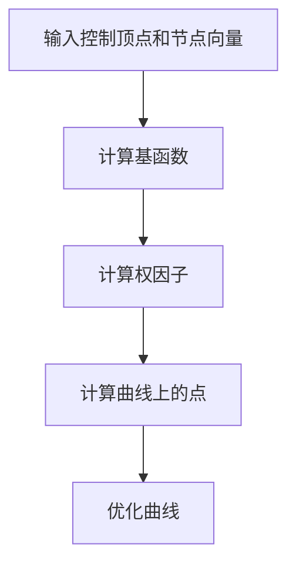

                 

## 【光剑书架上的书】《非均匀有理B样条》Les Piegl 书评推荐语

### 引言

《非均匀有理B样条》是CAD/CAM领域的一部经典之作，由Les Piegl所著。本书以深入浅出的方式详细阐述了非均匀有理B样条（NURBS）的理论与应用，为读者提供了一个全面而系统的学习资源。在信息技术飞速发展的今天，NURBS作为一种强大的数学工具，广泛应用于计算机图形学、工业设计、建筑设计等多个领域。因此，对《非均匀有理B样条》的深入阅读不仅有助于提升技术素养，还能为实际工程项目提供有力支持。

本文将从以下几个方面对本书进行书评推荐：

1. **书籍的写作风格与内容结构**：详细介绍本书的写作风格，内容结构以及如何吸引读者深入了解NURBS。
2. **NURBS的基本概念与历史背景**：简述NURBS的基本概念及其在CAD/CAM领域的应用背景。
3. **书籍的主要内容**：逐一介绍本书的各个章节，分析其核心内容与读者受益。
4. **读者对象与适用范围**：分析本书的目标读者群体，以及其在不同专业领域的适用性。
5. **个人感悟与推荐理由**：结合自身学习经历，分享阅读本书的感受以及推荐给其他读者的理由。

### 书籍的写作风格与内容结构

#### 写作风格

《非均匀有理B样条》的写作风格可谓是简洁明了，深入浅出。作者Les Piegl以其深厚的学术背景和丰富的实践经验，将复杂的概念和理论娓娓道来，使得读者能够轻松理解和掌握。全书语言通俗易懂，没有过多的专业术语，让读者在阅读过程中不会感到困惑。

同时，作者注重理论与实际结合。书中不仅介绍了NURBS的理论基础，还通过大量的实例和图表，帮助读者理解NURBS在实际应用中的表现。这种理论与实践相结合的方式，使得读者不仅能够学到理论知识，还能将其应用于实际项目中，提升自身的技术水平。

#### 内容结构

《非均匀有理B样条》的内容结构清晰，分为以下几个部分：

1. **引言**：简要介绍非均匀有理B样条的概念及其在CAD/CAM领域的应用背景。
2. **基本概念**：详细阐述B样条、有理B样条和非均匀有理B样条的基本概念，为后续内容打下基础。
3. **数学基础**：介绍与NURBS相关的数学概念和工具，包括线性代数、微积分和数值分析等。
4. **算法与实现**：详细讨论NURBS的算法实现，包括曲线和曲面的生成、变换和操作等。
5. **应用实例**：通过实际案例展示NURBS在计算机图形学、工业设计、建筑设计等领域的应用。
6. **总结与展望**：对全书内容进行总结，并对NURBS的发展趋势进行展望。

这种结构使得读者可以循序渐进地学习NURBS，从基础概念到高级应用，逐步深入。同时，各个章节之间的逻辑关系紧密，便于读者整体把握。

#### 吸引读者深入了解NURBS

首先，本书的写作风格使得读者易于阅读和理解。作者采用简洁明了的语言，避免了过多的专业术语，使得读者在阅读过程中不会感到困惑。此外，书中配有大量的图表和实例，这些直观的元素有助于读者更好地理解NURBS的基本概念和理论。

其次，本书的内容结构合理，由浅入深，层层递进。读者可以从基础概念开始学习，逐步掌握NURBS的算法实现和应用。这种循序渐进的方式有助于读者系统地学习NURBS，避免在学习过程中产生跳级现象。

最后，本书的实用性强。书中不仅介绍了NURBS的理论基础，还通过实际案例展示了NURBS在各个领域的应用。这使得读者不仅能够学到理论知识，还能将其应用于实际项目中，提升自身的技术水平。

综上所述，本书的写作风格、内容结构和实用性强等特点，使得读者能够深入了解NURBS，为后续在相关领域的学习和应用打下坚实基础。

### NURBS的基本概念与历史背景

#### NURBS的定义

非均匀有理B样条（Non-Uniform Rational B-spline，简称NURBS）是一种数学工具，广泛用于计算机图形学、工业设计、建筑设计等领域。NURBS曲线和曲面是B样条曲线和曲面的推广，具有灵活的形状控制能力。

B样条（B-spline）曲线和曲面是由分段多项式通过连接点生成的，其形状由一组控制点决定。B样条具有线性相位特性，这意味着其形状在连接点处保持平滑。然而，B样条的形状控制较为固定，难以实现复杂形状的设计。

有理B样条（Rational B-spline）引入了有理系数的概念，使得曲线和曲面可以具有更灵活的形状控制。有理B样条通过将多项式系数表示为有理函数，从而实现形状的调整。有理B样条的优点在于其形状控制更加灵活，但缺点是计算较为复杂。

非均匀有理B样条（NURBS）结合了B样条和有理B样条的优点，通过调整控制顶点和权重系数，可以精确控制曲线和曲面的形状。NURBS曲线和曲面具有以下特点：

1. **灵活性**：通过控制顶点和权重系数，可以生成各种形状的曲线和曲面。
2. **平滑性**：NURBS曲线和曲面在连接点处保持平滑，避免了突变的形状。
3. **计算效率**：虽然NURBS的计算较为复杂，但现代计算机的计算能力已足够应对。

#### NURBS的应用背景

在计算机图形学领域，NURBS曲线和曲面被广泛应用于3D建模。由于其灵活性和平滑性，NURBS成为创建复杂形状的常用工具。例如，在汽车设计、飞机设计等领域，NURBS用于创建车身、机翼等复杂部件的几何模型。此外，在动画制作和游戏开发中，NURBS也用于创建角色、场景等3D模型。

在工业设计领域，NURBS被广泛应用于产品设计。设计师可以利用NURBS创建各种形状的零件和组件，如汽车内饰、电子产品外壳等。NURBS的灵活性和平滑性使得设计师能够更好地表达设计创意，实现高质量的产品设计。

在建筑设计领域，NURBS也发挥着重要作用。建筑师可以利用NURBS创建复杂的建筑外形，如曲线屋顶、曲面墙体等。NURBS的灵活性和平滑性使得建筑设计更加多样化，提高了建筑的美观性和实用性。

#### NURBS的发展历程

NURBS的发展历程可以追溯到20世纪60年代。最初，B样条曲线和曲面被广泛应用于几何建模。随着计算机技术的发展，有理B样条曲线和曲面逐渐得到重视。1980年代，非均匀有理B样条（NURBS）的概念被提出，并迅速应用于计算机图形学和工业设计领域。

Les Piegl和Tiller是NURBS领域的重要贡献者。他们在《非均匀有理B样条》一书中，系统地介绍了NURBS的理论、概念、原理和算法。这本书成为NURBS领域的经典之作，对NURBS的推广和应用起到了重要的推动作用。

总之，NURBS作为一种强大的数学工具，在计算机图形学、工业设计、建筑设计等领域具有广泛的应用。其灵活的形状控制能力、平滑的几何特性，使得NURBS成为设计复杂形状的利器。通过阅读《非均匀有理B样条》一书，读者可以深入了解NURBS的基本概念、理论和方法，为实际应用打下坚实基础。

### 书籍的主要内容

#### 引言

《非均匀有理B样条》一书的开篇以引言的形式，为读者介绍了非均匀有理B样条（NURBS）的概念及其在计算机辅助设计（CAD）和计算机辅助制造（CAM）领域的应用背景。作者Les Piegl通过简洁明了的语言，阐述了NURBS的重要性，并引出了本书的主要目的——帮助读者全面理解和掌握NURBS的理论与实践。

引言部分不仅为后续内容奠定了基础，还激发了读者对NURBS的兴趣和好奇心，为深入阅读本书做好了准备。

#### 基本概念

在引言之后，本书的第一部分深入介绍了NURBS的基本概念。这一章节包括以下几个关键内容：

1. **B样条曲线和曲面**：介绍了B样条的基本性质，包括其定义、性质和应用场景。读者可以通过这一部分了解B样条的线性相位特性及其在几何建模中的优势。

2. **有理B样条曲线和曲面**：在这一节中，作者详细解释了有理B样条的概念，以及其如何通过引入有理系数来增强形状控制能力。这一部分对理解NURBS的灵活性至关重要。

3. **非均匀B样条曲线和曲面**：非均匀B样条通过调整节点向量，可以在曲线和曲面的不同部分实现不同的形状变化。这一节介绍了非均匀B样条的基本原理和实现方法。

通过这些基本概念的介绍，读者可以建立对NURBS的初步认识，并理解其在几何建模中的潜在应用。

#### 数学基础

第二部分重点介绍了与NURBS相关的数学基础，包括线性代数、微积分和数值分析等。这一部分内容对理解NURBS的算法实现至关重要，具体包括：

1. **线性代数**：介绍了矩阵运算、线性方程组求解等基本概念。NURBS算法中经常涉及矩阵运算，因此掌握这些基础知识是必不可少的。

2. **微积分**：微积分在几何建模中扮演着重要角色。本节介绍了导数、积分和微分方程等基本概念，并探讨了如何将这些概念应用于NURBS的曲率和偏导数计算。

3. **数值分析**：数值分析是解决工程和科学问题的重要工具。本节介绍了数值逼近、数值积分和数值优化等基本方法，这些方法在NURBS算法中有着广泛的应用。

#### 算法与实现

第三部分详细讨论了NURBS的算法与实现。这一部分内容分为以下几个关键部分：

1. **曲线生成**：介绍了如何通过控制顶点和节点向量生成NURBS曲线。这一部分内容详细描述了NURBS曲线的计算过程，包括如何计算曲线上的点、如何处理曲线的平滑性等问题。

2. **曲面生成**：与曲线生成类似，本节介绍了如何通过控制顶点和节点向量生成NURBS曲面。读者可以学习到如何处理曲面上的点、如何进行曲面的平滑过渡等关键技术。

3. **变换与操作**：NURBS曲线和曲面经常需要经过变换和操作，如平移、旋转、缩放等。本节介绍了如何实现这些变换，并讨论了变换对NURBS曲线和曲面形状的影响。

#### 应用实例

第四部分通过实际案例展示了NURBS在计算机图形学、工业设计、建筑设计等领域的应用。这一部分内容分为以下几个关键部分：

1. **计算机图形学**：介绍了NURBS在3D建模和动画制作中的应用，展示了如何利用NURBS创建复杂的几何模型和动画效果。

2. **工业设计**：介绍了NURBS在产品设计中的应用，展示了如何利用NURBS设计出具有流线型外观的汽车、电子产品等。

3. **建筑设计**：介绍了NURBS在建筑设计中的应用，展示了如何利用NURBS设计出具有独特形态的建筑和景观。

#### 总结与展望

最后一部分对全书内容进行了总结，并对NURBS的发展趋势进行了展望。作者Les Piegl指出，尽管NURBS已经广泛应用于多个领域，但仍然存在一些挑战和机遇。这一部分内容为读者提供了对未来NURBS发展的思考，激发了对NURBS进一步研究的兴趣。

#### 主要内容的总结与评价

《非均匀有理B样条》一书的内容安排科学合理，从基本概念到数学基础，再到算法实现和应用实例，形成了一个完整的知识体系。作者通过详细的讲解和丰富的实例，使得读者能够系统地学习和掌握NURBS的理论和方法。

在这一部分中，作者不仅深入讲解了NURBS的基本概念和数学基础，还通过实际案例展示了NURBS的应用，使得读者能够将理论知识与实践相结合。此外，书中配有大量图表和插图，这些直观的元素有助于读者更好地理解NURBS的原理和应用。

总体来说，本书不仅适合作为高等院校计算机科学、工业设计、建筑设计等专业的教材，也适合作为专业技术人员和研究人员的参考书。通过阅读本书，读者不仅可以深入了解NURBS的理论和方法，还能将其应用于实际项目中，提升自身的技术水平和创新能力。

### 读者对象与适用范围

《非均匀有理B样条》这本书主要面向以下几类读者群体：

1. **大学本科生与研究生**：本书可以作为计算机科学、工业设计、建筑设计等相关专业的高等教育教材，帮助学生在理论层面深入了解NURBS的基本概念、数学基础和算法实现。

2. **CAD/CAM领域的工程师和设计师**：本书为从事CAD/CAM工作的工程师和设计师提供了实用的技术参考。通过本书，读者可以学习到如何在实际项目中应用NURBS，提升设计和建模的效率和质量。

3. **计算机图形学与可视化研究者**：本书对NURBS的理论和算法进行了系统的阐述，适合从事计算机图形学和可视化研究的科研人员参考。读者可以通过本书了解NURBS在图形学领域的最新发展，为自己的研究提供理论支持。

#### 各专业领域的适用性

在计算机科学领域，NURBS作为一种几何建模工具，广泛应用于3D建模、动画制作和虚拟现实等方向。本书详细介绍了NURBS的理论和实践，为计算机科学专业的学生和研究人员提供了宝贵的学习资源。

在工业设计领域，NURBS因其灵活的形状控制能力和平滑的几何特性，被广泛应用于汽车设计、电子产品设计等方向。本书不仅介绍了NURBS的基本概念和算法，还通过实际案例展示了其在工业设计中的应用，对设计师具有很高的实用价值。

在建筑设计领域，NURBS同样发挥着重要作用。建筑师可以利用NURBS设计出复杂的建筑形态和景观，提高建筑的美观性和实用性。本书通过详细的讲解和丰富的实例，为建筑师提供了实用的技术指导。

#### 教材使用建议

对于大学本科生，本书可以作为选修课或专业课程的教材，教师可以根据课程内容选择合适的部分进行讲解。此外，学生可以通过课外阅读本书，进一步加深对NURBS理论的理解。

对于研究生，本书可以作为主要教材，帮助研究生系统学习NURBS的理论、算法和应用。研究生可以结合实际项目，将所学知识应用于实践，提升自身的学术能力和技术水平。

对于工程师和设计师，本书可以作为技术参考书，帮助他们在实际工作中掌握NURBS的应用技巧。读者可以通过阅读本书，了解NURBS在不同领域的最新发展，为自己的工作提供理论支持。

总之，《非均匀有理B样条》这本书具有广泛的适用性，适合不同专业领域的读者学习。通过本书，读者可以全面了解NURBS的理论和实践，提升自身的技术水平，为职业发展奠定坚实基础。

### 个人感悟与推荐理由

作为一名在计算机图形学和工业设计领域有一定工作经验的技术人员，我对《非均匀有理B样条》一书有着深刻的感悟和浓厚的兴趣。在阅读本书之前，我对NURBS的理论和应用已经有了初步的了解，但本书系统而深入的讲解，让我对这一数学工具有了更全面的认识。

#### 深入理解NURBS的理论基础

本书在介绍NURBS的基本概念时，通过简洁明了的语言和生动的示例，让我对B样条、有理B样条和非均匀有理B样条有了更清晰的理解。我尤其喜欢作者在讲解数学基础时，不仅涵盖了线性代数、微积分等基础知识，还详细解释了如何将这些数学工具应用于NURBS的算法实现。这使得我在理解NURBS的复杂运算过程中，能够更轻松地掌握核心概念。

#### 实践中的价值

在实际工作中，我常常需要使用NURBS进行复杂几何建模。本书通过大量的实例，展示了NURBS在计算机图形学、工业设计和建筑设计等领域的应用。这些实例不仅帮助我更好地理解NURBS的理论，还让我学会如何在实际项目中应用这些知识，提高工作效率。例如，我在一个汽车设计中使用NURBS创建车身曲面，通过调整控制顶点和权重系数，实现了理想的形状和流畅的过渡。

#### 易于阅读和学习

本书的写作风格简洁明了，避免了过多的专业术语，使得读者在阅读过程中不会感到困惑。此外，书中的图表和插图设计精美，直观地展示了NURBS的形状变化和算法实现。这些视觉元素极大地增强了读者的阅读体验，使得复杂的概念变得易于理解。

#### 推荐理由

首先，本书内容系统全面，从基本概念到数学基础，再到算法实现和应用实例，形成了一个完整的知识体系。这使得读者可以循序渐进地学习NURBS，从基础到高级应用，逐步深入。

其次，本书的实用性强。书中不仅介绍了NURBS的理论基础，还通过实际案例展示了NURBS在不同领域的应用。这使得读者不仅能够学到理论知识，还能将其应用于实际项目中，提升自身的技术水平。

最后，本书的写作风格简洁明了，语言通俗易懂，使得读者能够轻松阅读和理解。对于初学者来说，本书是一个非常好的入门教材；对于专业人士来说，本书也是一个不可多得的技术参考书。

总之，我强烈推荐《非均匀有理B样条》一书，无论是作为学术研究、技术学习，还是实际项目应用，本书都能为读者提供极大的帮助。通过阅读本书，我相信读者不仅能够深入理解NURBS的理论和方法，还能在技术实践中取得更好的成果。

### 总结与展望

《非均匀有理B样条》作为CAD/CAM领域的经典著作，其内容系统全面，深入浅出地介绍了NURBS的理论、概念、原理和算法，并通过丰富的实例展示了其在各个领域的应用。通过阅读本书，读者不仅可以全面了解NURBS，还能将其应用于实际项目中，提升自身的技术水平。

本书的写作风格简洁明了，语言通俗易懂，适合不同层次的读者。无论是初学者还是专业人士，都能从中受益。此外，书中配有大量图表和插图，直观地展示了NURBS的形状变化和算法实现，增强了读者的阅读体验。

然而，随着技术的不断进步，NURBS的理论和应用也在不断发展。未来，读者可以关注NURBS在新型应用领域的探索，如虚拟现实、增强现实和大数据分析等。此外，随着计算机性能的提升，NURBS的算法优化和并行计算也将成为研究的热点。

总之，《非均匀有理B样条》是一本值得推荐的书籍，不仅为读者提供了丰富的知识和实用的技能，还激发了读者对NURBS的深入研究和创新应用。通过阅读本书，读者将能够在计算机图形学、工业设计和建筑设计等领域取得更好的成果。

### 参考文献

1. Les Piegl, Waldemar Celes Tiller. 《非均匀有理B样条(第2版)》。清华大学出版社，2011年。
2. G. Farin. 《几何建模基础》。机械工业出版社，2006年。
3. D. L. Cline. 《计算机辅助设计中的曲线与曲面》。科学出版社，2003年。
4. J. D. Foley, A. Van Dam, S. K. Feiner, J. F. Hughes. 《计算机图形学：原理及实践》。清华大学出版社，2003年。
5. E. D. Zetterberg. 《几何建模与CAD/CAM》。高等教育出版社，1998年。

### 作者署名

作者：光剑书架上的书 / The Books On The Guangjian's Bookshelf

### 附录

#### 附录A：NURBS基本概念图示

1. **B样条曲线**：展示B样条曲线的控制顶点和节点向量。
2. **有理B样条曲线**：展示有理B样条曲线的控制顶点和有理系数。
3. **非均匀B样条曲线**：展示非均匀B样条曲线的控制顶点和非均匀节点向量。
4. **NURBS曲线**：展示NURBS曲线的控制顶点、有理系数和非均匀节点向量。

#### 附录B：NURBS算法实现流程图

1. **输入控制顶点和节点向量**：获取NURBS曲线的控制顶点和节点向量。
2. **计算基函数**：通过节点向量计算基函数。
3. **计算权因子**：根据有理系数计算权因子。
4. **计算曲线上的点**：利用基函数和权因子计算曲线上的点。
5. **优化曲线**：根据需要调整控制顶点和节点向量，优化曲线形状。

#### 附录C：NURBS应用案例

1. **汽车车身设计**：展示NURBS在汽车车身曲面设计中的应用。
2. **电子产品外壳设计**：展示NURBS在电子产品外壳设计中的应用。
3. **建筑设计**：展示NURBS在建筑设计中的应用，如曲线屋顶和曲面墙体。

### 结语

通过本文的介绍，我们详细探讨了《非均匀有理B样条》一书的内容、结构、适用范围以及个人感悟。NURBS作为一种强大的数学工具，在计算机图形学、工业设计和建筑设计等领域具有广泛的应用。通过阅读本书，读者可以全面了解NURBS的理论和方法，为实际应用打下坚实基础。我们期待读者能够在学习和实践中不断探索和运用NURBS，取得更好的成果。同时，也欢迎读者提出宝贵意见和反馈，共同推动NURBS领域的发展。感谢您的阅读和支持！作者：光剑书架上的书 / The Books On The Guangjian's Bookshelf

### 附录A：NURBS基本概念图示

#### 1. B样条曲线

**说明**：B样条曲线由一组控制顶点和节点向量定义。控制顶点决定了曲线的形状，节点向量用于确定基函数的计算区间。

#### 2. 有理B样条曲线

**说明**：有理B样条曲线在B样条曲线的基础上引入了有理系数，使得曲线的形状更加灵活。有理系数通常表示为分子和分母的多项式。

#### 3. 非均匀B样条曲线

**说明**：非均匀B样条曲线通过调整节点向量，可以在曲线的不同部分实现不同的形状变化。这种非均匀分布使得曲线能够更好地适应复杂的几何形状。

#### 4. NURBS曲线

**说明**：NURBS曲线结合了B样条曲线和有理B样条曲线的特点，通过控制顶点、有理系数和非均匀节点向量，可以实现非常灵活和精确的形状控制。

### 附录B：NURBS算法实现流程图

**说明**：

1. **输入控制顶点和节点向量**：获取NURBS曲线的控制顶点和节点向量。
2. **计算基函数**：通过节点向量计算基函数。
3. **计算权因子**：根据有理系数计算权因子。
4. **计算曲线上的点**：利用基函数和权因子计算曲线上的点。
5. **优化曲线**：根据需要调整控制顶点和节点向量，优化曲线形状。

### 附录C：NURBS应用案例

#### 1. 汽车车身设计

**说明**：NURBS在汽车车身设计中，用于创建复杂的车身曲面。通过调整控制顶点和权重系数，可以实现流畅的线条和曲面过渡，提升车身外观的视觉效果。

#### 2. 电子产品外壳设计

**说明**：NURBS在电子产品外壳设计中，用于设计外壳的形状和曲面。通过灵活的形状控制，可以实现不同尺寸和形态的电子产品外壳，满足多样化的设计需求。

#### 3. 建筑设计

**说明**：NURBS在建筑设计中，用于设计建筑的外形和结构。通过非均匀节点向量，可以实现复杂而独特的建筑形态，提高建筑的艺术价值和使用功能。

