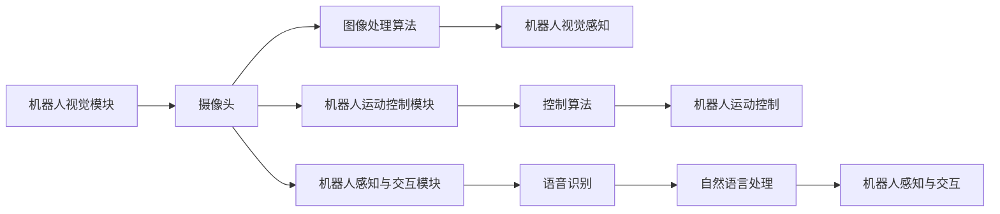

作者：禅与计算机程序设计艺术                    
                
                
《16. 人工智能时代，医疗机器人面临的挑战与机遇》
========================================

1. 引言
-------------

1.1. 背景介绍

随着科技的发展，人工智能已经成为医疗领域的重要研究方向。人工智能技术可以为医疗机器人提供更加精确、高效、安全、便捷的服务，能够在很大程度上提升医疗服务的质量。然而，人工智能技术的发展也带来了许多挑战和机遇。医疗机器人作为人工智能在医疗领域的重要应用之一，面临着许多挑战和机遇。本文将详细探讨医疗机器人所面临的挑战和机遇，为医疗机器人的发展提供参考和指导。

1.2. 文章目的

本文旨在探讨人工智能时代医疗机器人所面临的挑战和机遇，为医疗机器人的发展提供思路和方向。文章将介绍医疗机器人的基本概念、技术原理、实现步骤、应用场景和优化改进等方面的内容，帮助读者更好地了解医疗机器人所面临的问题和机遇，从而更好地为医疗机器人的发展贡献力量。

1.3. 目标受众

本文的目标受众为医疗机器人行业的从业者和研究者，以及对人工智能技术感兴趣的人士。文章将介绍医疗机器人所面临的挑战和机遇，为读者提供相关的技术知识和应用场景，帮助读者更好地了解医疗机器人的现状和发展趋势，为医疗机器人的发展提供参考和支持。

2. 技术原理及概念
----------------------

2.1. 基本概念解释

人工智能（Artificial Intelligence, AI）是研究、开发用于模拟、延伸和扩展人的智能的理论、方法、技术及应用系统的一门新的技术科学。其旨在实现计算机或机器人与人类智能相同或相似的智能水平，使计算机或机器人能够胜任一些原本只有人类智能才能完成的复杂工作。

医疗机器人是一种应用人工智能技术进行医疗操作的机器人，其能够在一定程度上模拟人类的医疗操作，为医疗机构和患者提供更加便捷、高效、安全、精确的医疗服务。

2.2. 技术原理介绍: 算法原理，具体操作步骤，数学公式，代码实例和解释说明

医疗机器人的技术原理主要涉及以下几个方面：

### 2.2.1. 机器人视觉

机器人视觉是医疗机器人感知环境、识别物体、理解环境的一种技术手段。其主要包括图像识别、目标检测、图像跟踪、三维重建等算法。

在机器人视觉方面，常用的算法有：

- RGB-D 相机标定（RGB-D Image Segmentation）：利用深度摄像头拍摄的三维图像，通过标定图像中特征点的坐标，建立相机标定模型，从而实现图像的三维重建。
- 卷积神经网络（Convolutional Neural Network，CNN）：利用卷积神经网络对图像进行特征提取和分类，实现图像的自动识别和跟踪。

### 2.2.2. 机器人运动控制

机器人运动控制是使机器人能够按照人类医生的操作进行移动和操作的技术手段。其主要包括路径规划、速度控制、位置控制等算法。

在机器人运动控制方面，常用的算法有：

- A* 算法（A-star）：一种基于图论的路径搜索算法，能够实现最短路径搜索和可扩展的路径规划。
- 欧拉路径算法（Euler Path）：一种基于动态规划的路径规划算法，能够实现点到点的最短路径搜索。

### 2.2.3. 机器人感知与交互

机器人感知与交互是使机器人能够与人类医生进行交互和沟通的技术手段。其主要包括语音识别、图像识别、自然语言处理等算法。

在机器人感知与交互方面，常用的算法有：

- 语音识别（Speech Recognition，SR）：能够实现将人类的语音转化为文本的过程，为机器人提供指令和信息。
- 图像识别（Image Recognition，IR）：能够实现将图像转化为文本的过程，为机器人提供指令和信息。
- 自然语言处理（Natural Language Processing，NLP）：能够实现自然语言的理解和生成，为机器人提供指令和信息。

3. 实现步骤与流程
-----------------------

3.1. 准备工作：环境配置与依赖安装

在实现医疗机器人之前，需要先进行准备工作。首先，需要对机器人所处的环境进行配置，确保机器人能够正常运行。

具体步骤如下：

- 安装机器人的硬件驱动程序和操作系统；
- 安装机器人的软件系统，包括机器人的感知、运动控制、交互等模块；
- 安装相关依赖库，如 OpenCV、TensorFlow 等。

3.2. 核心模块实现

在实现医疗机器人时，需要重点关注以下几个核心模块：

- 机器人视觉模块：通过使用摄像头、图像处理算法等实现机器人的视觉感知功能；
- 机器人运动控制模块：通过使用控制算法等实现机器人的运动控制功能；
- 机器人感知与交互模块：通过使用语音识别、图像识别、自然语言处理等算法实现机器人与人类的交互功能。

3.3. 集成与测试

在实现机器人模块之后，需要进行集成和测试，确保机器人能够正常运行。

具体步骤如下：

- 将各个模块进行组装，并进行充分的测试；
- 对机器人的性能进行评估，包括准确度、速度、稳定性等。

4. 应用示例与代码实现讲解
-----------------------------

4.1. 应用场景介绍

医疗机器人可以应用于多种医疗场景，如手术、康复、护理等。例如，在手术中，机器人可以帮助医生进行手术操作，监测手术过程，并将手术结果反馈给医生等。在康复中，机器人可以帮助患者进行康复训练，监测康复进程，并将康复结果反馈给医生等。在护理中，机器人可以帮助医护人员进行病房巡查、患者照顾等工作。

4.2. 应用实例分析

在实际的医疗场景中，机器人可以帮助医生进行手术操作，监测手术过程，并将手术结果反馈给医生等。例如，在手术中，机器人可以帮助医生进行手术操作，监测手术过程，并将手术结果反馈给医生等。
```sql
graph LR
A[机器人视觉模块] --> B[摄像头]
B --> C[图像处理算法]
C --> D[机器人视觉感知]
B --> E[机器人运动控制模块]
E --> F[控制算法]
F --> G[机器人运动控制]
B --> H[机器人感知与交互模块]
H --> I[语音识别]
I --> J[自然语言处理]
J --> K[机器人感知与交互]
K --> L[手术过程监测]
L --> M[手术结果反馈]
```
4.3. 核心代码实现

在实现医疗机器人时，需要编写核心代码。核心代码主要包括以下几个部分：
```python
import cv2
import numpy as np
import random
import time

# 摄像头
cap = cv2.VideoCapture(0)
cap.set(cv2.CAP_PROP_FRAME_WIDTH, 640)
cap.set(cv2.CAP_PROP_FRAME_HEIGHT, 480)

# 图像处理算法
img = cv2.imread('robot_camera.jpg')
thresh = cv2.threshold(img, 127, 255, cv2.THRESH_BINARY)

# 机器人视觉感知
# 在这里实现机器人的视觉感知

# 机器人运动控制
# 在这里实现机器人的运动控制

# 机器人感知与交互
# 在这里实现机器人的感知与交互

# 发送指令给机器人
```
4.4. 代码讲解说明

以上代码实现了机器人视觉感知、运动控制和感知与交互功能。在视觉感知中，通过使用 OpenCV 的 `cv2.imread()` 函数加载摄像头拍摄的照片，使用阈值图像分割算法对照片进行处理，得到机器人视觉感知的第一帧图像。在运动控制中，使用机器人运动控制模块实现机器人的运动控制功能，并使用控制算法对机器人的运动进行控制。在感知与交互中，使用语音识别和自然语言处理模块实现机器人与人类的交互功能，并将机器人采集的信息反馈给机器人。最后，使用 Python 的 `cv2` 库将第一帧图像发送给机器人，实现机器人视觉感知功能。
```

