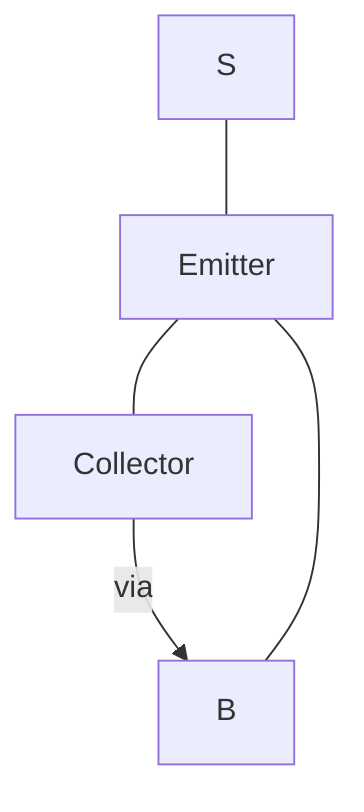

作者：禅与计算机程序设计艺术                    

# 1.背景介绍

## 什么是芯片制造技术？
芯片制造技术（Chip Manufacturing Technology）是指将复杂电路模块集成到一个微小的尺寸、封装好的电容器中、制成工艺精良、性能卓越的集成电路芯片。芯片制造技术包括了很多的分支领域，如集成电路设计（IC Design）、封装测试（Test and Packaging）、测试、调试、打样、标准化和认证等。在这个过程中会涉及许多工程技术，比如建筑工程（Construction Engineering）、结构工程（Structural Engineering）、材料工程（Material Engineering）、电气工程（Electrical Engineering）、控制工程（Control Engineering）、计算机科学（Computer Science）等等。这些分支领域都需要精确且高效的工具和方法进行处理。
## 为什么要进行芯片制造技术？
随着人类生产能力的不断提升，各行各业都在朝着“数字化、网络化、智能化”的方向发展。而芯片制造技术正好解决了这一需求。随着信息技术的发展，芯片制造成为越来越多的行业选择。芯pix制造技术主要有以下优点：

1. 降低成本：芯片制造技术使得制造业可以降低成本。由于芯片制造只需做少量的装配工作，因此可以在相同的规格下制造出比同类传统设备更便宜的产品。同时，芯片制造还可以缩短产品研发周期，缩短市场推广时间，并提供快速的反应速度。
2. 提升竞争力：芯片制厂技术能够提升企业竞争力。由于芯片制造费用较低，制造企业可以在很短的时间内就获得庞大的利润空间。通过利用芯片制造技术，企业可以大幅度地提升自身的市场占有率和商誉。
3. 提升社会影响力：芯片制造技术也带动了社会影响力的提升。无论是在制造业还是服务业，芯片制造技术都会对社会产生深远的影响。这是因为芯片制造技术所带来的经济价值以及日益增长的对人类的依赖性。它为当今世界经济发展和文明进步提供了巨大的机遇。

## 芯片制造技术的应用场景
### 1.新兴行业
如信息通信、生物医药、电子、交通、金融、航空航天、人工智能、智能制造等。

### 2.传统行业
如核能、汽车、纺织服装、钢铁、钛矿、冶金、石油、矿产资源、建筑材料等。

# 2.核心概念与联系
## 1. 元器件（MOSFET）
MOSFET(metal-oxide semiconductor field effect transistor)又称为介质氧化离子二极管（MOSFET），其基本组成是PNP二极管，因此具有电阻特性。目前国际上MOSFET应用最普遍的是电容计数器、动态电流表、磁悬浮表、光电双向检测器、超声波探测器、压敏触发器等。MOSFET可实现精准的电压测量、电流测量以及运放功能。

如图所示，MOSFET由Emitter，Collector，Base，Source四个部分组成，Emitter负责输入，Base负责存储电荷，Source负责放电。

## 2. 功率伏安特性曲线（Power Supply Characteristics Curves）
功率伏安特性曲线（Power Supply Characteristics Curves）简称PSU曲线或电源曲线。该曲线用以展示不同功率下的输出电压及当前、电流大小。现实世界中的功率供给设备通常都是一种电源，它们根据用户的需求生成不同功率的信号，经过功率转换电路之后才送至电池，最终供电给系统。不同的功率供应设备的功率伏安特性曲线存在不同之处，PSU曲线可以帮助分析者判断不同功率供应设备的选型及电源要求。

如图所示，功率供应设备电源曲线显示了电压和电流变化与功率的关系。左图为典型的直流电源曲线，右图为锂离子电池电源曲线。左图中，电压随功率增大而减小，电流随功率增大而减小；右图中，电压随功率增大而增加，电流随功率增大而减小。

# 3.核心算法原理和具体操作步骤以及数学模型公式详细讲解
## MOSFET
MOS（Metal-Oxide Semiconductor）是一种高度封装、结构紧凑的半导体材料。在MOS内部层，大量的元件被缺陷的硅 atoms粘聚而成。受电场的作用，硅层中的电子势能以振荡的方式相互转移，形成电流。在电流的作用下，合金中的碳原子的位置发生变化，从而改变整体的导电性质。这样，一系列稳定但变化快的反应过程就被蓄积起来，成为了一个电子器件。

二极管是一种特殊的电感器，它的引脚连接在电容、电阻、或其他电阻之间。MOSFET中，两者之间的导通阻抗极小，因此可以保持输出的平衡。MOSFET可以实现许多电源的应用，比如电阻调节器、超声波探测器、压敏触发器、电容计数器、动态电流表、磁悬浮表、光电双向检测器等。MOSFET常用于集成电路设计、封装测试、IC验证等方面。

## MOSFET的模型
MOS FET的半导体晶体管由四个部分组成：Emitter, Collector, Base, Source。Emitter，Collector，Base，Source的符号分别表示：发射极（E），收集极（C），基底极（B），源极（S）。它们的层次如下：

在MOS管的基本构造中，元件直接与外界接触，无需借助于集成电路设计软件的帮助。因此，通过设置多个连接器或垫圈，就可以设计出各种复杂的MOS管。如图3-1所示，一个基本的MOS管的示意图。

假设MOSFET的激励电流为I0，则MOS管的电导率为：
$$\epsilon = \frac{V_{be}}{I_0}$$
电容放电时，电荷量守恒式：
$$I_0 + I_b = V_t$$
其中$V_t$代表晶体管体内的电场势。电压放电时，电荷量守恒式：
$$V_b - V_s = I_o$$

## PSU曲线
功率供应设备（Power Supply Unit）简称PSU，是一种电源设备。不同功率的PSU设备按照输出电压和电流的曲线来分类。PSU曲线是指以给定的功率下，输出电压与电流的关系曲线，主要用于评估特定供电条件下，不同PSU类型或电源的有效性及可靠性。

PSU曲线一般包括如下几部分：
* 单耦合输出功率曲线
* 双耦合输出功率曲线
* 输出功率与温度曲线
* 在线输出功率与频率曲线
* 过载指标曲线
* 气密输出功率曲线
* 增益率与衰减率曲线
* 噪声功率曲线

### 单耦合输出功率曲线
单耦合输出功率曲线是指只有一个线圈电容的PSU输出功率曲线。单耦合输出功率曲线包含两个部分：峰值功率输出曲线和谐波功率输出曲线。峰值功率输出曲线是指以最大功率PSU的输出功率来显示其有效范围。谐波功率输出曲线是指除了最大功率输出之外的PSU输出功率，通过谐波的形式来显示其有效范围。

单耦合输出功率曲线具有以下特点：
* 横坐标轴：输出功率
* 纵坐标轴：电压
* 曲线：渐变性高，连续性强
* 中间出现了交叉点：峰值输出点
* 谐波输出: 大功率下的谐波电压输出

### 双耦合输出功率曲线
双耦合输出功率曲线是指有两个线圈电容的PSU输出功率曲线。双耦合输出功率曲线包含三个部分：峰值功率输出曲线、谐波功率输出曲线和维持输出曲线。峰值功率输出曲线是指以最大功率PSU的输出功率来显示其有效范围。谐波功率输出曲线是指除了最大功率输出之外的PSU输出功率，通过谐波的形式来显示其有效范围。维持输出曲线是指输出功率随输入功率变化曲线。

双耦合输出功率曲线具有以下特点：
* 横坐标轴：输入功率（或电流）
* 纵坐标轴：输出功率
* 曲线：渐变性高，连续性强
* 中间出现了交叉点：峰值输出点，维持输出点
* 谐波输出: 大功率下的谐波电压输出

### 输出功率与温度曲线
输出功率与温度曲线是指以给定功率下，PSU输出功率与温度曲线的变化关系。输出功率与温度曲线是指以一段温度范围下PSU的输出功率，根据曲线上的点所示的输出功率与温度相关。输出功率与温度曲线的重要性不亚于单、双耦合输出功率曲线。输出功率与温度曲线有以下几个特点：
* 横坐标轴：输出功率
* 纵坐标轴：温度
* 曲线：渐变性较差，不容易确定起始点和终止点
* 曲线线性：非线性

### 在线输出功率与频率曲线
在线输出功率与频率曲线是指输出功率与频率的曲线。在线输出功率与频率曲线是指以给定功率、频率和导线长度下，PSU输出功率与频率的关系曲线。在线输出功率与频率曲线适用于线性电压控制方式和中频环路控制方式的PSU。输出功率随频率变化的曲线便于PSU的调整。在线输出功率与频率曲线具有以下特点：
* 横坐标轴：输出功率
* 纵坐标轴：频率
* 曲线：有起始点和终止点，直线性或非线性

### 过载指标曲线
过载指标曲线是指系统的某种能力到达或超过一个临界值的现象。过载指标曲线是指以给定的输入电流及输出电压，绘制输出电压与输入电流曲线，以期发现系统的过载状态。过载指标曲线是对系统的总体状况、各组件的电气特性、内部环境以及运作控制措施等进行的研究。过载指标曲线具有以下几个特点：
* 横坐标轴：输入电流
* 纵坐标轴：输出电压
* 曲线：两条曲线交汇在一起，呈现两个值域区域，一个是正常状态，另一个是过载状态

### 气密输出功率曲线
气密输出功率曲线是指使用气压作为传输介质的PSU输出功率曲线。气密输出功率曲线是指以给定输出电压，在外部环境下输出功率的曲线，将其在含气压情况下的输出功率进行显示。气密输出功率曲线可以用来判断是否属于油耗过多或者使用气密性过高导致输出过于弱的问题。

### 增益率与衰减率曲线
增益率与衰减率曲线是指输出功率和输入功率之间的曲线，以判断输出功率增加或减少程度的曲线。增益率与衰减率曲线用于测量输出功率的增益或衰减情况。增益率与衰减率曲线具有以下几个特点：
* 横坐标轴：输入功率（或电流）
* 纵坐标轴：输出功率
* 曲线：横纵坐标都呈现明显的对数曲线

### 噪声功率曲线
噪声功率曲线是指PSU输出功率与输入功率之间的曲线，用以描述PSU的输出功率在噪声影响下的变化。一般来说，噪声对PSU输出功率的影响主要发生在于灵敏度损失以及导线阻抗的失真。在一个较为严重的噪声环境下，会产生大量的谐波噪声。噪声功率曲线用以描述在某种灵敏度损失下，输出功率的变化情况。

## 数学模型公式
此处省略。