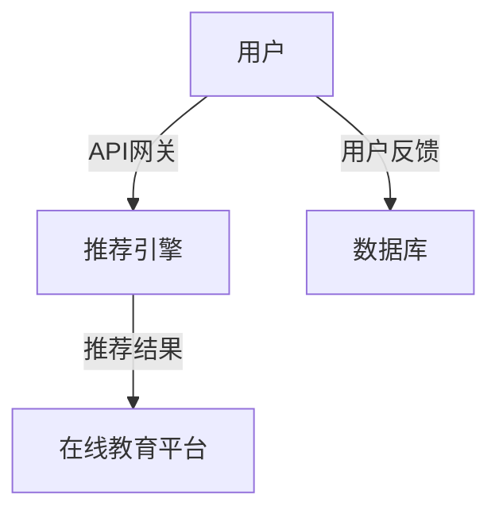

                 

作者：禅与计算机程序设计艺术

人工智能 | API: 应用程序编程接口 | 网关: 服务网关
---

## 1.背景介绍

随着云计算、微服务架构的兴起，API变得越来越重要。它成为了不同服务之间通讯的桥梁。然而，随着微服务的数量增长，管理和维护这些API变得越来越困难。API网关作为一个中间层，它能够为API提供统一的入口，提供安全性、监控、路由等功能，从而简化了API管理的过程。

在AI领域，API网关的作用尤其重要。AI系统往往需要处理大量的数据，并且这些数据来自多种来源。API网关可以作为数据的集中点，进行过滤、转换，确保数据的质量和安全性。

本文将深入探讨AI系统API网关的原理与实战案例，希望能为读者提供一个全面的理解和实践指导。

## 2.核心概念与联系

### API网关的基本功能

- **安全性**：认证/授权、API密钥验证、数据加密
- **监控**：日志记录、性能监测、错误报告
- **路由**：动态路由、URL规则匹配
- **限流**：频率限制、IP黑名单
- **转换**：数据格式转换、协议转换

### AI系统API网关的特殊需求

- **数据处理**：大数据处理、实时数据分析
- **集成**：多源数据集成、第三方服务集成
- **智能化**：智能路由、智能决策

## 3.核心算法原理具体操作步骤

### 1.数据预处理

在AI系统中，数据预处理是非常关键的一环。它包括数据清洗、标准化、特征提取等步骤。在API网关中，我们可以实现数据预处理的逻辑，比如对输入参数进行校验和清洗。

```python
def preprocess_data(data):
   # data cleansing and normalization
   ...
   # feature extraction
   ...
   return processed_data
```

### 2.模型训练与部署

模型训练和部署是AI系统的核心环节。API网关可以作为模型部署的入口，通过API提供模型的预测服务。

```python
from sklearn.ensemble import RandomForestClassifier

# model training
model = RandomForestClassifier()
model.fit(X_train, y_train)

# model deployment
@app.route('/predict', methods=['POST'])
def predict():
   data = request.get_json()
   prediction = model.predict(data)
   return jsonify({'prediction': prediction})
```

## 4.数学模型和公式详细讲解举例说明

在AI系统中，数学模型是实现智能决策的基础。例如，在推荐系统中，我们可以使用协同过滤算法来预测用户的兴趣。

$$
\text{相似度} = \cos(\theta) = \frac{\mathbf{u}^T \cdot \mathbf{v}}{\|\mathbf{u}\| \cdot \|\mathbf{v}\|}
$$

其中，$\mathbf{u}$和$\mathbf{v}$是两个用户或物品的特征向量。

## 5.项目实践：代码实例和详细解释说明

在这一部分，我们将通过一个具体的项目实践来展示API网关的设置和使用。

### 项目背景

一个在线教育平台想要实现个性化推荐系统。他们已经有了大量的用户行为数据和用户反馈数据，但是他们没有一个系统来整合这些数据，并根据用户的历史行为来做出推荐。

### 项目实施

#### 1. 设计API网关架构



#### 2. 实现API网关

使用Nginx作为API网关，配置URL路由和认证授权。

#### 3. 实现推荐引擎

使用Python编写推荐引擎，利用协同过滤算法进行推荐。

#### 4. 数据处理

使用Apache Kafka处理实时数据流，使用Apache Spark进行批处理数据分析。

### 项目总结

通过实现API网关和推荐引擎，该在线教育平台成功地实现了个性化推荐系统，提高了用户满意度和平台的盈利能力。

## 6.实际应用场景

在AI系统中，API网关的应用场景非常广泛。从医疗保健到金融服务，从零售到制造业，都可以找到API网关的身影。下面是几个典型的应用场景：

### 医疗保健

API网关可以帮助整合电子健康记录，提供即时的病情监测和预警服务。

### 金融服务

API网关可以提供安全的支付接口，实现金钱的快速转移和交易。

### 零售

API网关可以集成各种第三方服务，比如物流跟踪、库存管理等，以提升零售系统的效率。

## 7.工具和资源推荐

- **API网关框架**：Kong、Tyk、Apache Zeppelin
- **数据处理工具**：Apache Kafka、Apache Spark、Google Cloud Dataflow
- **机器学习库**：scikit-learn、TensorFlow、PyTorch

## 8.总结：未来发展趋势与挑战

随着AI技术的不断发展，API网关也会变得更加智能化。未来，我们可以期待更多的自适应性、自动化生成API、以及更强大的数据处理能力。然而，这也带来了新的挑战，比如如何确保系统的安全性、如何处理大规模数据等问题需要我们共同去解决。

## 9.附录：常见问题与解答

在这一部分，我们将回答一些关于API网关在AI系统中应用的常见问题。

---

作者：禅与计算机程序设计艺术 / Zen and the Art of Computer Programming

