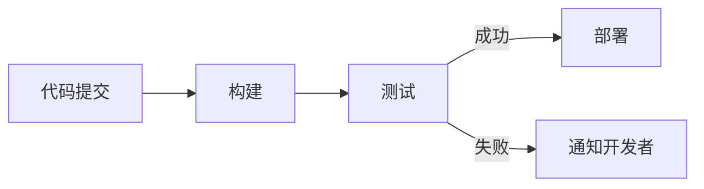

## 背景介绍

持续集成（Continuous Integration,简称CI）是现代软件开发过程中一个非常重要的概念，它可以帮助团队更快速地开发出高质量的软件。在过去的几十年里，持续集成已经成为大规模软件开发过程中不可或缺的一部分。特别是近年来，随着人工智能（AI）和机器学习（ML）技术的快速发展，持续集成在AI系统中扮演了越来越重要的角色。

本文将从以下几个方面详细探讨AI系统持续集成的原理与代码实战案例：

1. **核心概念与联系**
2. **核心算法原理具体操作步骤**
3. **数学模型和公式详细讲解举例说明**
4. **项目实践：代码实例和详细解释说明**
5. **实际应用场景**
6. **工具和资源推荐**
7. **总结：未来发展趋势与挑战**
8. **附录：常见问题与解答**

## 核心概念与联系

持续集成是一种软件开发实践，它要求团队成员频繁地将代码提交到集中式版本控制系统（如Git）中，并自动触发构建、测试和部署过程。持续集成的目标是确保代码随时都能被构建、测试并部署，避免大规模的集成问题。

在AI系统中，持续集成的原理同样适用。AI系统通常由多个模块组成，每个模块可能由多个代码文件组成。通过持续集成，可以确保这些模块随时都能被构建、测试并部署，避免大规模的集成问题。

持续集成还可以帮助AI系统实现更高效的迭代。通过频繁地将新的AI模型和算法集成到系统中，可以快速地进行模型优化和算法改进，从而提高系统的整体性能。

## 核心算法原理具体操作步骤

持续集成的核心原理是自动触发构建、测试和部署过程。以下是一个简化的持续集成流程图：



1. **代码提交**:开发者将代码提交到集中式版本控制系统。
2. **构建**:自动触发构建过程，编译代码并生成可执行文件。
3. **测试**:自动触发测试过程，运行测试用例并验证代码是否符合预期。
4. **部署**:如果测试成功，自动触发部署过程，将可执行文件发布到生产环境。
5. **通知**:如果测试失败，自动通知开发者进行修复。

持续集成的自动化过程可以通过各种CI工具实现，如Jenkins、Travis CI、CircleCI等。

## 数学模型和公式详细讲解举例说明

持续集成的数学模型通常涉及到版本控制系统的状态转换、构建过程的性能度量等。以下是一个简单的版本控制系统状态转换模型：

$$
S_{t+1} = f(S_t, C)
$$

其中$S_t$是版本控制系统在时间$t$的状态,$S_{t+1}$是版本控制系统在时间$t+1$的状态,$C$是提交的代码。

持续集成的构建过程中，性能度量通常包括构建时间、测试时间等。以下是一个构建时间的度量模型：

$$
T_{build} = \sum_{i=1}^{n} T_i
$$

其中$T_{build}$是构建时间,$T_i$是第$i$个模块的构建时间,$n$是模块数量。

## 项目实践：代码实例和详细解释说明

持续集成可以通过各种编程语言和框架实现。以下是一个使用Python和Flask框架的持续集成实例：

1. **代码提交**:将代码提交到Git仓库。
2. **构建**:使用Python的构建工具如setuptools自动构建项目。
3. **测试**:使用unittest自动运行测试用例。
4. **部署**:使用Flask自动部署应用到生产环境。

以下是一个简化的持续集成配置文件（Jenkinsfile）:

```groovy
pipeline {
    agent any
    stages {
        stage('构建') {
            steps {
                sh 'python setup.py sdist bdist_wheel'
            }
        }
        stage('测试') {
            steps {
                sh 'pytest tests'
            }
        }
        stage('部署') {
            steps {
                sh 'flask run'
            }
        }
    }
}
```

## 实际应用场景

持续集成在各种AI应用场景中都有广泛的应用，例如：

1. **机器学习模型训练**:通过持续集成，可以快速地将新的模型和算法集成到系统中，从而实现模型优化和算法改进。
2. **深度学习框架开发**:持续集成可以帮助开发者快速地进行深度学习框架的开发和优化。
3. **自然语言处理系统开发**:持续集成可以帮助开发者快速地进行自然语言处理系统的开发和优化。

## 工具和资源推荐

持续集成的工具和资源有很多，以下是一些推荐：

1. **CI工具**:Jenkins、Travis CI、CircleCI等。
2. **版本控制系统**:Git、SVN等。
3. **构建工具**:Python的setuptools、Java的Maven、JavaScript的WebPack等。
4. **测试框架**:Python的unittest、Java的JUnit、JavaScript的Mocha等。
5. **资源推荐**:持续集成的相关书籍、博客、教程等。

## 总结：未来发展趋势与挑战

持续集成在AI系统中扮演着越来越重要的角色。随着AI技术的不断发展，持续集成将在AI系统中发挥更大的作用。未来，持续集成将面临以下挑战：

1. **数据安全**:持续集成过程中，代码和数据的安全性至关重要，如何确保数据安全成为一个重要的挑战。
2. **性能优化**:持续集成过程中，如何实现更高效的构建、测试和部署成为一个重要的挑战。

## 附录：常见问题与解答

1. **持续集成与持续部署的区别？**

持续集成（CI）是指自动触发构建、测试和部署过程，而持续部署（CD）是指在部署过程中自动触发测试和发布。持续集成和持续部署通常结合使用，可以实现更高效的软件开发过程。

1. **持续集成如何确保代码的质量？**

持续集成通过自动触发构建、测试和部署过程，确保代码随时都能被构建、测试并部署，避免大规模的集成问题。通过持续集成，可以发现和修复潜在的问题，提高代码的质量。

1. **持续集成如何处理冲突？**

持续集成通过自动合并代码提交，避免大规模的冲突。通过持续集成，可以发现和修复潜在的问题，提高代码的质量。

以上就是对持续集成在AI系统中的原理与代码实战案例的详细探讨。希望本文能够对读者提供实用的价值，帮助他们更好地理解持续集成在AI系统中的应用和挑战。