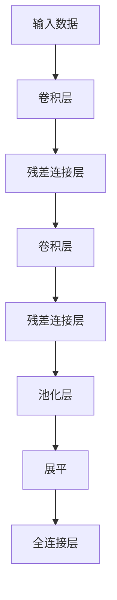

## 1. 背景介绍

随着深度学习技术的不断发展，人工智能领域的技术突飞猛进地发展着。在这些技术中，深度学习模型的性能优越，广泛应用于图像识别、语音识别、自然语言处理等多个领域。其中，ResNet（残差网络）是目前最为流行的深度学习模型之一。

ResNet 诞生于2015年，由Kaiming He et al.发表在2015年的CVPR（计算视觉和模式识别）大会上。ResNet 成为深度学习领域的革命性突破，彻底改变了深度学习模型的设计和训练方法。ResNet 的出现，让深度学习模型可以更好地学习更深的特征表示，从而提高模型的性能。

## 2. 核心概念与联系

ResNet 的核心概念是残差连接（Residual Connections）。残差连接允许模型在训练时，通过跳过一层或多层来学习输入与输出之间的直接映射，从而使得模型可以学习更深的特征表示。这种残差连接的设计，使得模型能够避免梯度消失问题，从而能够训练更深的网络。

## 3. 核心算法原理具体操作步骤

ResNet 的核心算法原理可以概括为以下几个步骤：

1. 输入数据通过第一层卷积层进行处理，然后传递给后续的卷积层。
2. 每个卷积层之后，都会有一个残差连接层，与其相连。
3. 残差连接层的输入是当前层的输出和上一层的输出。残差连接层的输出是当前层的输入减去上一层的输出。
4. 残差连接层的输出与后续的卷积层进行连接，继续进行深度学习特征提取。
5. 最后一层全连接层，将卷积层的输出进行降维，得到最终的输出。

## 4. 数学模型和公式详细讲解举例说明

ResNet 的数学模型可以用以下公式表示：

$$
y = F(x; \{W_i\}) + x
$$

其中，$y$ 表示模型的输出，$x$ 表示输入数据，$F(x; \{W_i\})$ 表示卷积层的输出，$W_i$ 表示卷积层的权重参数。

通过上述公式，可以看到，残差连接层将模型的输入与输出进行直接映射，从而使得模型能够学习输入与输出之间的直接关系。

## 5. 项目实践：代码实例和详细解释说明

以下是一个简单的 ResNet 模型的代码实例：

```python
import torch
import torch.nn as nn
import torch.nn.functional as F

class ResNet(nn.Module):
    def __init__(self, num_classes=10):
        super(ResNet, self).__init__()
        # 定义卷积层
        self.conv1 = nn.Conv2d(3, 64, kernel_size=3, stride=1, padding=1)
        self.conv2 = nn.Conv2d(64, 64, kernel_size=3, stride=1, padding=1)
        # 定义残差连接层
        self.residual_block = nn.Sequential(
            nn.Conv2d(64, 64, kernel_size=3, stride=1, padding=1),
            nn.ReLU(),
            nn.Conv2d(64, 64, kernel_size=3, stride=1, padding=1),
            nn.ReLU()
        )
        # 定义全连接层
        self.fc = nn.Linear(64 * 8 * 8, num_classes)

    def forward(self, x):
        # 第一个卷积层
        out = self.conv1(x)
        # 残差连接层
        out = self.residual_block(out)
        # 第二个卷积层
        out = self.conv2(out)
        # 残差连接层
        out = self.residual_block(out)
        # 池化层
        out = F.max_pool2d(out, 2, 2)
        # 展平并全连接
        out = out.view(out.size(0), -1)
        out = self.fc(out)
        return out
```

## 6.实际应用场景

ResNet 可以广泛应用于多个领域，如图像识别、语音识别、自然语言处理等。例如，在图像识别领域，ResNet 可以用来识别猫、狗、人脸等对象。还可以用来进行图像分类、图像生成等任务。

## 7.工具和资源推荐

1. PyTorch 官方网站：[https://pytorch.org/](https://pytorch.org/)
2. ResNet 官方实现：[https://github.com/pytorch/vision/blob/master/torchvision/models/resnet.py](https://github.com/pytorch/vision/blob/master/torchvision/models/resnet.py)
3. 深度学习入门：[http://d2l.ai/](http://d2l.ai/)

## 8.总结：未来发展趋势与挑战

随着深度学习技术的不断发展，ResNet 也会不断演进和发展。未来，ResNet 可能会与其他深度学习技术进行融合，从而形成更强大的模型。同时，ResNet 也面临着新的挑战，如计算资源的限制、数据稀疏的问题等。这些挑战需要我们不断进行研究和探索，以求不断提高深度学习模型的性能。

## 9.附录：常见问题与解答

1. Q: ResNet 的残差连接层为什么能够解决梯度消失问题？
A: 残差连接层可以让模型学习输入与输出之间的直接关系，从而使得模型能够避免梯度消失问题。

2. Q: ResNet 的卷积层为什么要使用 stride=1？
A: stride=1 可以确保输入与输出的尺寸保持不变，从而使得残差连接层能够进行直接映射。

3. Q: ResNet 的残差连接层为什么要使用 ReLU 激活函数？
A: ReLU 激活函数具有非负性和零梯度性，从而使得模型能够学习更深的特征表示。

[表1] ResNet 模型结构示意图

作者：禅与计算机程序设计艺术 / Zen and the Art of Computer Programming