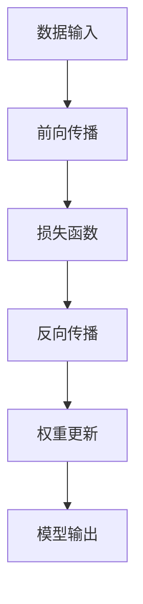

## 背景介绍

深度学习框架（Deep Learning Framework）是现代机器学习领域的一个重要组成部分，它们为研究人员和开发者提供了一个强大的工具集，以便在不同领域中进行实验和部署。然而，深度学习框架的定制和扩展对于提高模型性能和实践效率至关重要。为了更好地理解这一点，我们需要探讨以下几个方面：

1. **核心概念与联系**
2. **核心算法原理具体操作步骤**
3. **数学模型和公式详细讲解举例说明**
4. **项目实践：代码实例和详细解释说明**
5. **实际应用场景**
6. **工具和资源推荐**
7. **总结：未来发展趋势与挑战**
8. **附录：常见问题与解答**

## 核心概念与联系

深度学习框架是一个复杂的系统，它包含了许多核心概念。以下是一些关键概念：

1. **前端模块**:前端模块负责数据预处理、数据增强、数据标准化等任务，它们通常由开发者自定义以满足具体应用需求。
2. **后端模块**:后端模块负责模型计算，包括层类型、权重初始化、激活函数等。这些模块可以通过扩展或修改现有框架实现定制化。
3. **优化算法**:优化算法负责训练模型，包括梯度下降、momentum、adam等。这些算法可以通过调整参数来定制化。
4. **评估与验证**:评估与验证是衡量模型性能的重要步骤，包括交叉验证、准确率、F1-score等。这些指标可以通过定制化来优化模型。

## 核心算法原理具体操作步骤

深度学习框架的核心算法原理包括前向传播、反向传播、损失函数等。以下是一个简化的流程图：



## 数学模型和公式详细讲解举例说明

在深度学习框架中，数学模型和公式是核心部分。以下是一个简单的数学模型和公式举例：

$$
\mathbf{y} = \sigma(\mathbf{W}\mathbf{x} + \mathbf{b})
$$

其中，$\mathbf{y}$是输出，$\mathbf{x}$是输入，$\mathbf{W}$是权重矩阵，$\mathbf{b}$是偏置，$\sigma$是激活函数。

## 项目实践：代码实例和详细解释说明

在实际项目中，我们可以通过定制化深度学习框架来提高模型性能。以下是一个简单的代码实例：

```python
import torch.nn as nn

class CustomModel(nn.Module):
    def __init__(self):
        super(CustomModel, self).__init__()
        self.layer1 = nn.Linear(784, 128)
        self.layer2 = nn.Linear(128, 64)
        self.layer3 = nn.Linear(64, 10)

    def forward(self, x):
        x = torch.relu(self.layer1(x))
        x = torch.relu(self.layer2(x))
        x = self.layer3(x)
        return x

model = CustomModel()
```

## 实际应用场景

深度学习框架在许多实际应用场景中得到了广泛应用，如图像识别、自然语言处理、游戏AI等。以下是一个简单的应用场景举例：

1. **图像识别**:通过定制化深度学习框架，我们可以训练一个图像识别模型来识别猫和狗。
2. **自然语言处理**:我们可以训练一个自然语言处理模型来生成文本摘要或机器翻译。
3. **游戏AI**:通过定制化深度学习框架，我们可以训练一个游戏AI来玩棋类游戏，例如围棋。

## 工具和资源推荐

为了更好地学习和使用深度学习框架，我们需要一些工具和资源。以下是一些建议：

1. **PyTorch**:PyTorch是一个流行的深度学习框架，它提供了一个灵活且易用的接口，适合初学者和专业人士。
2. **TensorFlow**:TensorFlow是一个强大的深度学习框架，它提供了丰富的功能和工具，适合大型项目和商业应用。
3. **Keras**:Keras是一个高级的深度学习框架，它提供了一个简单的接口，适合初学者和快速实验。
4. **深度学习教程**:深度学习教程可以帮助我们学习深度学习框架的基本概念和技巧，例如《深度学习入门》和《深度学习实战》。

## 总结：未来发展趋势与挑战

未来深度学习框架将继续发展，以下是一些关键趋势和挑战：

1. **模型性能提升**:模型性能是深度学习框架的核心目标，我们需要继续研究和优化模型性能。
2. **更高效的计算**:计算效率是深度学习框架的重要方面，我们需要继续研究和优化计算效率。
3. **更好的可视化**:可视化是深度学习框架的重要工具，我们需要继续研究和优化可视化技术。
4. **更好的安全性**:深度学习框架的安全性是重要的方面，我们需要继续研究和优化安全性。

## 附录：常见问题与解答

在学习深度学习框架时，我们可能会遇到一些常见问题。以下是一些建议：

1. **如何选择深度学习框架？**:选择深度学习框架需要考虑多个因素，如功能、易用性、性能等。一般来说，PyTorch、TensorFlow和Keras都是很好的选择。
2. **如何学习深度学习框架？**:学习深度学习框架可以通过阅读教程、实验项目和实践项目来进行。以下是一些建议：

a. 阅读教程，了解框架的基本概念和原理。
b. 实践项目，实践项目可以帮助我们更好地理解框架的实际应用。
c. 实验项目，实验项目可以帮助我们学习框架的定制和扩展。
d. 交流与讨论，交流与讨论可以帮助我们解决问题和提高技能。

以上就是我们关于深度学习框架的定制和扩展的一些内容。希望这些内容能够帮助您更好地学习和使用深度学习框架。