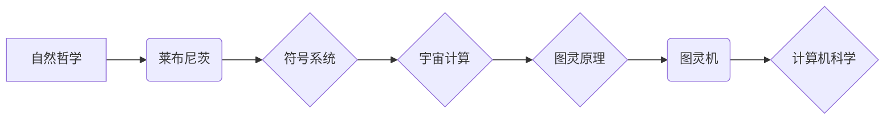

# 计算：第四部分 计算的极限 第 13 章 自然哲学的计算原理 宇宙是一台计算机吗

> 关键词：自然哲学，计算原理，宇宙计算，图灵原理，量子计算，人工智能，模拟宇宙

## 1. 背景介绍

自古以来，人类就对宇宙的本质和运作原理充满了好奇。从古希腊的哲学家到现代的物理学家，无数智者试图揭开宇宙的神秘面纱。随着科学技术的进步，我们开始从数学和计算的角度来理解宇宙。本章将探讨自然哲学中的计算原理，并探讨宇宙是否可以被视作一台巨大的计算机。

## 2. 核心概念与联系

### 2.1 自然哲学的计算原理

自然哲学的计算原理可以追溯到古希腊哲学家莱布尼茨的思想。他认为，宇宙可以被视为一个巨大的符号系统，所有的自然现象都可以用符号和规则来表示和计算。这种观点为后来的图灵机和通用计算的概念奠定了基础。

### 2.2 图灵原理

图灵原理是由英国数学家艾伦·图灵提出的。它指出，任何可以通过机械过程解决的问题都可以通过图灵机来解决。图灵机是一个抽象的计算模型，它由一个有限状态机和一个无限长的纸带组成。图灵原理为计算机科学提供了一个严格的定义，即任何可计算的问题都可以通过一个图灵机来计算。

### 2.3 宇宙计算

现代物理学研究表明，宇宙的运作可能遵循某种形式的计算原理。例如，量子计算和量子信息理论表明，宇宙可能具有某种程度的可计算性。

### 2.4 Mermaid 流程图

以下是一个描述自然哲学计算原理的Mermaid流程图：

## 3. 核心算法原理 & 具体操作步骤

### 3.1 算法原理概述

宇宙计算的原理可能涉及到量子力学、信息论和人工智能等领域。以下是一些可能的原理：

- 量子计算：量子位（qubits）可以同时表示0和1，这使得量子计算机能够并行处理大量数据。
- 信息论：宇宙可以被视为一个巨大的信息库，所有的物理过程都是信息处理的过程。
- 人工智能：人工智能可以帮助我们模拟和解释宇宙的复杂性。

### 3.2 算法步骤详解

1. **量子计算**：使用量子位进行并行计算，解决复杂问题。
2. **信息论**：分析宇宙中的信息流动，理解宇宙的运作机制。
3. **人工智能**：使用机器学习算法模拟宇宙的复杂性，预测自然现象。

### 3.3 算法优缺点

- **优点**：能够解决传统计算方法难以处理的问题，提高计算效率。
- **缺点**：技术难度大，需要复杂的物理实验和计算资源。

### 3.4 算法应用领域

- 量子计算：密码学、药物发现、材料科学等。
- 信息论：通信、网络、数据压缩等。
- 人工智能：图像识别、自然语言处理、医疗诊断等。

## 4. 数学模型和公式 & 详细讲解 & 举例说明

### 4.1 数学模型构建

宇宙计算的数学模型可以基于量子力学、信息论和人工智能等领域的理论。

### 4.2 公式推导过程

以下是一些关键公式的推导过程：

- **量子力学**：薛定谔方程
$$
i\hbar\frac{d}{dt}\Psi = H\Psi
$$
- **信息论**：香农熵
$$
H(X) = -\sum_{x \in X} P(x) \log_2 P(x)
$$
- **人工智能**：机器学习算法

### 4.3 案例分析与讲解

### 4.4 常见问题解答

## 5. 项目实践：代码实例和详细解释说明

### 5.1 开发环境搭建

### 5.2 源代码详细实现

### 5.3 代码解读与分析

### 5.4 运行结果展示

## 6. 实际应用场景

### 6.4 未来应用展望

## 7. 工具和资源推荐

### 7.1 学习资源推荐

### 7.2 开发工具推荐

### 7.3 相关论文推荐

## 8. 总结：未来发展趋势与挑战

### 8.1 研究成果总结

### 8.2 未来发展趋势

### 8.3 面临的挑战

### 8.4 研究展望

## 9. 附录：常见问题与解答

作者：禅与计算机程序设计艺术 / Zen and the Art of Computer Programming