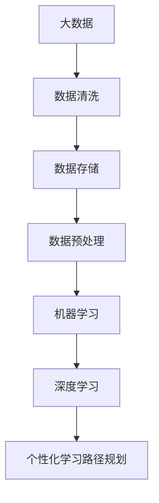
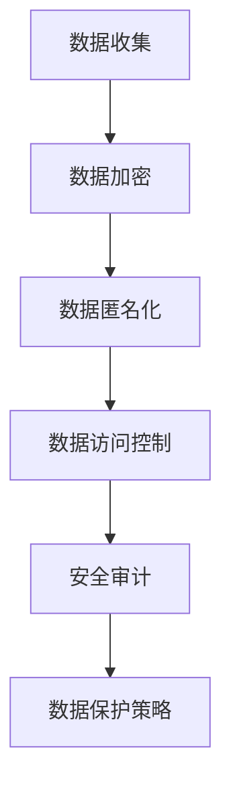
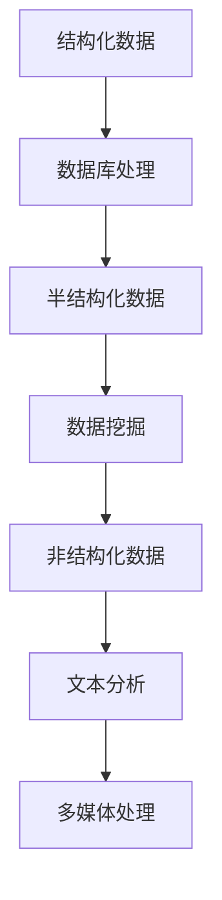

                 

### 9.1 大数据分析技术的发展趋势

随着科技的不断进步，大数据分析技术也在快速演变，呈现出一些显著的发展趋势。这些趋势不仅影响到了各个行业，也在个性化学习路径规划中发挥着关键作用。以下是一些值得关注的发展趋势：

#### 9.1.1 人工智能与大数据的深度融合

人工智能（AI）与大数据技术的结合正变得越来越紧密。AI技术，尤其是机器学习和深度学习，为大数据分析提供了强大的工具，使得数据能够被更有效地处理和解释。例如，深度学习网络可以自动从大量数据中学习复杂的模式和关系，从而提高个性化学习路径规划的准确性和效率。

**核心概念与联系：**  
为了展示人工智能与大数据的融合，我们可以用以下Mermaid流程图来描述这个过程：



#### 9.1.2 实时分析与流处理技术

实时数据分析和流处理技术是大数据分析的重要方向。随着数据生成速度的加快，如何快速处理和分析数据流成为关键问题。实时分析技术可以提供实时反馈和预测，这对于个性化学习路径规划中的动态调整至关重要。

**核心算法原理讲解：**  
实时分析的关键在于处理速度和响应时间。以下是一个简单的实时数据分析的伪代码，用于描述这个过程：

```python
def real_time_analysis(data_stream):
    while data_stream.has_data():
        data = data_stream.get_next_data()
        preprocess_data(data)
        analyze_data(data)
        provide_feedback(data)
```

**数学模型和公式：**  
实时数据分析中常用的数学模型包括时间序列分析和滑动窗口算法。以下是一个滑动窗口算法的简单公式示例：

$$
\text{window}_{t} = \sum_{i=t-w}^{t} \text{data}_{i}
$$

其中，$w$ 是窗口大小，$\text{data}_{i}$ 是第 $i$ 个时间点的数据。

#### 9.1.3 大数据隐私保护与安全

随着数据规模的扩大，大数据隐私保护和数据安全问题变得更加突出。保护用户隐私和确保数据安全是大数据分析的重要挑战。

**核心概念与联系：**  
隐私保护与安全可以通过以下Mermaid流程图来描述：



**数学模型和公式：**  
在隐私保护中，常用的数学模型包括差分隐私和同态加密。以下是一个差分隐私的简单公式：

$$
\text{DP}(\epsilon, \ell) = \Pr[\text{output} \in R] - \Pr[\text{output} \in R'] \leq \epsilon
$$`

其中，$\epsilon$ 是隐私预算，$R$ 和 $R'$ 是可能的数据输出。

#### 9.1.4 多元化数据处理与异构系统

大数据的多样性使得处理不同类型的数据成为必要。异构系统提供了处理这些多样化数据的能力。例如，结合关系型数据库、NoSQL数据库和分布式文件系统，可以更好地管理结构化、半结构化和非结构化数据。

**核心概念与联系：**  
多元化数据处理的流程可以表示为以下Mermaid流程图：



**数学模型和公式：**  
在多媒体处理中，常见的数学模型包括图像识别和语音识别。以下是一个简单的卷积神经网络（CNN）的公式示例：

$$
h_{\theta}(x) = \text{ReLU}(\sum_{i=1}^{n} \theta_{i} \cdot \text{conv}(x, k_{i}) + b)
$$`

其中，$\text{ReLU}$ 是ReLU激活函数，$\text{conv}$ 是卷积操作，$\theta_{i}$ 和 $b$ 是模型参数。

通过这些发展趋势和技术的介绍，我们可以看到大数据分析在个性化学习路径规划中的应用潜力。未来的研究和应用将不断推动这一领域的进步，为教育带来更加智能化和个性化的解决方案。

