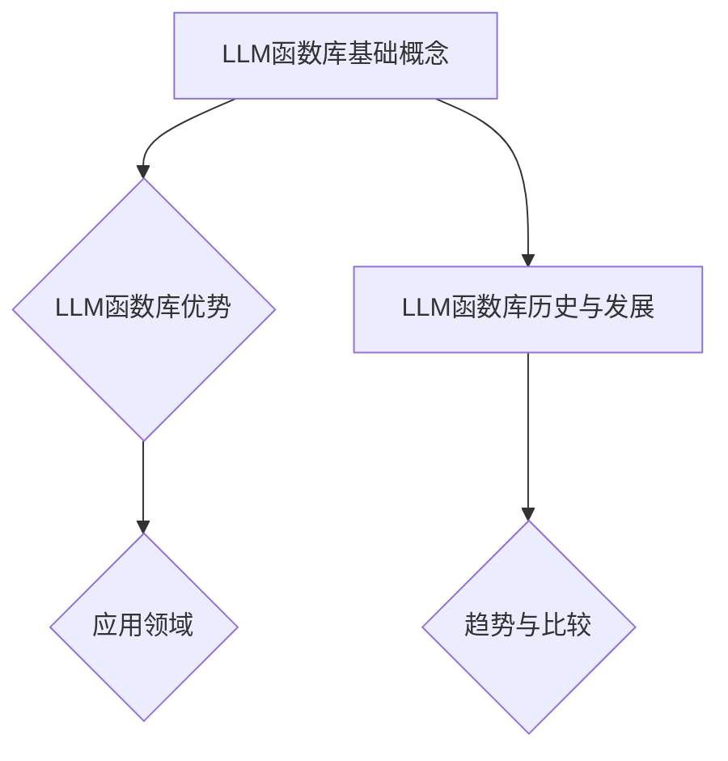

                 

# 《LLM函数库：构建AI应用的新型工具箱》

## 关键词
- LLM函数库
- AI应用
- 语言模型
- 文本处理
- 智能问答

## 摘要
本文将探讨LLM（大型语言模型）函数库在现代人工智能（AI）应用中的重要性。我们将从基础概念入手，详细解析LLM函数库的历史、优势、技术基础及其在实际项目中的应用。通过一系列项目实战，本文将展示如何使用LLM函数库构建具有实际意义的AI应用，如智能问答系统。最后，本文将展望LLM函数库的未来发展趋势，以及在行业应用中的潜力。

### 《LLM函数库：构建AI应用的新型工具箱》目录大纲

#### 第一部分：LLM函数库概述

- **第1章：LLM函数库的基础概念**
  - **1.1 LLM函数库的定义**
  - **1.2 LLM函数库的历史与发展**
  - **1.3 LLM函数库与其他AI工具的比较**

#### 第二部分：LLM函数库技术基础

- **第2章：语言模型基本原理**
  - **2.1 语言模型的定义**
  - **2.2 语言模型的基本结构**
  - **2.3 语言模型的训练与优化**

#### 第三部分：构建AI应用

- **第3章：使用LLM函数库构建文本处理应用**
  - **3.1 文本分类**
  - **3.2 文本生成**
  - **3.3 文本摘要**

#### 第四部分：项目实战

- **第4章：构建一个智能问答系统**
  - **4.1 项目背景**
  - **4.2 系统设计**
  - **4.3 实现细节**

#### 第五部分：LLM函数库在行业应用

- **第5章：LLM函数库在金融行业的应用**

#### 第六部分：深入探索

- **第6章：LLM函数库的高级特性**
  - **6.1 多语言支持**
  - **6.2 多模态处理**

#### 第七部分：总结与展望

- **第7章：LLM函数库的未来发展趋势**

### 附录

- **附录A：LLM函数库常用库与工具**

### Mermaid流程图



### 核心算法原理讲解

```python
# 伪代码：语言模型训练过程
def train_language_model(data, model, optimizer, loss_function, epochs):
    for epoch in range(epochs):
        for batch in data:
            optimizer.zero_grad()
            output = model(batch)
            loss = loss_function(output, target)
            loss.backward()
            optimizer.step()
        print(f"Epoch {epoch+1}/{epochs}, Loss: {loss.item()}")
```

### 数学模型和数学公式

$$
\begin{aligned}
  H &= -\sum_{i} P(x_i) \log P(x_i) \\
  L &= \sum_{i} -y_i \log \hat{y}_i
\end{aligned}
$$

- **H**: 信息熵
- **L**: 交叉熵损失函数

### 接下来，我们将深入探讨LLM函数库的定义、历史与发展，以及其他相关AI工具的比较。让我们一步步进行分析推理。在下一节中，我们将从LLM函数库的定义开始，了解其核心概念和优势。<!-- <emoji>🔍</emoji> 开始深入研究 -->

