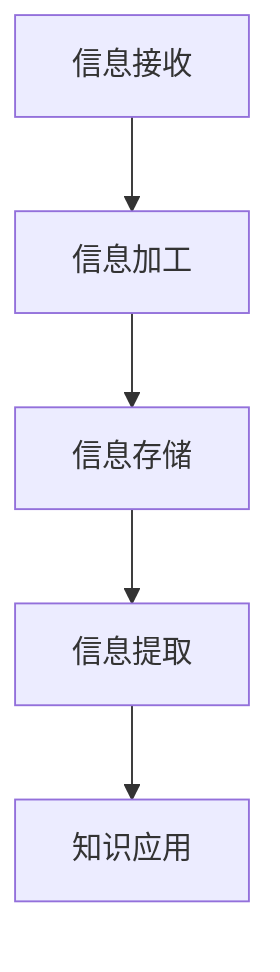
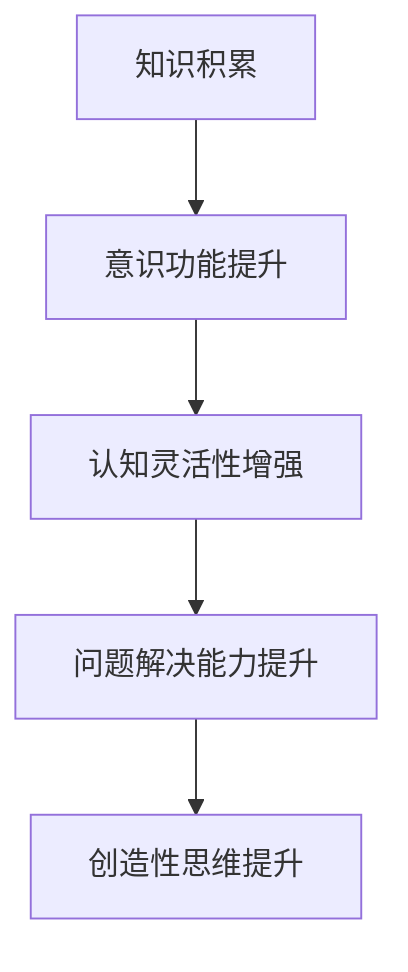

                 

# 《知识积累如何影响意识功能》

## 关键词：知识积累、意识功能、认知灵活性、问题解决能力、创造性思维、神经机制、教育应用、职业发展、人工智能

### 摘要

本文旨在探讨知识积累如何影响意识功能。通过分析知识积累与意识功能的基本概念、机制、影响、方法与策略，本文揭示了知识积累在提升认知灵活性、问题解决能力和创造性思维等方面的重要作用。同时，本文还介绍了知识积累在教育应用、职业发展以及未来趋势中的具体实践和潜在影响，为读者提供了全面的认知和思考。通过阅读本文，读者将更深入地理解知识积累对意识功能的影响，以及如何在实际生活中应用这些知识。

---

### 第一部分：知识积累与意识功能概述

#### 第1章 知识积累与意识功能的基本概念

**1.1 知识积累的定义**

知识积累是指个体通过学习、阅读、交流等方式获取新信息并将其存储在长期记忆中的过程。这个过程不仅包括信息的接收和存储，还包括信息的加工和理解。

**核心概念与联系**

以下是一个Mermaid流程图，展示了知识积累的基本概念和联系：



**1.2 意识功能的定义**

意识功能是指人类大脑对内外环境信息进行感知、理解、记忆和反应的能力。它包括知觉、思考、记忆、情感和意志等多个方面。

**1.3 知识积累与意识功能的关系**

知识积累和意识功能之间存在密切的关系。知识积累能够提高个体的意识功能，而意识功能的提升又能够促进知识积累的深化。

**核心概念与联系**

以下是一个Mermaid流程图，展示了知识积累与意识功能之间的关系：



#### 第2章 知识积累的机制

**2.1 知识存储的神经基础**

知识存储是知识积累的核心环节，它涉及到大脑的多个脑区和神经机制的协同作用。

**核心算法原理讲解**

以下是一个知识存储的伪代码：

```plaintext
function storeKnowledge(knowledge):
    if knowledge not stored:
        create neural connection
        strengthen neural connection
        store knowledge in long-term memory
    else:
        update knowledge in long-term memory
```

**2.2 知识提取与回忆**

知识提取与回忆是知识积累的重要环节，它涉及到大脑的记忆机制。

**核心算法原理讲解**

以下是一个知识提取的伪代码：

```plaintext
function extractKnowledge(knowledge):
    if knowledge stored:
        search long-term memory
        retrieve knowledge
        return knowledge
    else:
        return "Knowledge not found"
```

**2.3 知识整合与创造**

知识整合与创造是知识积累的高级阶段，它涉及到知识的深化和应用。

**核心算法原理讲解**

以下是一个知识整合的伪代码：

```plaintext
function integrateKnowledge(knowledge1, knowledge2):
    if knowledge1 and knowledge2 valid:
        combine knowledge1 and knowledge2
        create new knowledge
        return new knowledge
    else:
        return "Invalid knowledge"
```

---

以上是《知识积累如何影响意识功能》的第一部分内容，包含了知识积累与意识功能的基本概念和知识积累的机制。在接下来的部分中，我们将进一步探讨知识积累对意识功能的影响，以及知识积累的方法与策略。请继续关注接下来的内容。 <|im_end|>

