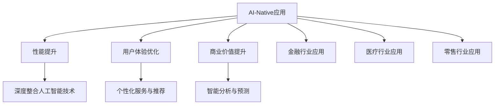

                 

### 第1章：AI-Native应用概述

#### 1.1 AI-Native的概念与重要性

AI-Native，即基于人工智能的原生应用，是一种深层次融合人工智能技术的应用。AI-Native应用的核心在于其与人工智能技术的紧密结合，通过人工智能算法来实现对数据的自动处理和智能分析，从而提升应用性能、用户体验和商业价值。

AI-Native的重要性体现在以下几个方面：

1. **性能提升**：AI-Native应用通过利用人工智能技术，可以实现高效的数据分析和处理，从而提升应用的整体性能。
2. **用户体验优化**：AI-Native应用可以根据用户的实时行为和偏好，提供个性化的服务和推荐，从而优化用户体验。
3. **商业价值提升**：AI-Native应用可以通过智能分析和预测，帮助企业在市场变化中做出更快的决策，提升企业的商业价值。

#### 1.2 AI-Native与原生应用的比较

原生应用通常指的是为特定平台（如iOS、Android）设计的应用，而AI-Native应用则是在原生应用的基础上，深度融合了人工智能技术。两者的比较可以从以下几个标准进行：

- **性能**：AI-Native应用通过深度整合人工智能技术，可以实现更高效的数据处理和智能分析，性能上通常优于原生应用。
- **开发成本**：由于AI-Native应用需要深度整合人工智能技术，开发成本相对较高，而原生应用的开发成本相对较低。
- **用户适应性**：原生应用通常针对特定平台设计，用户适应性较强，而AI-Native应用则更注重跨平台适配。
- **功能多样性**：AI-Native应用由于整合了人工智能技术，可以实现更多智能功能，功能上更具多样性。

#### 1.3 AI-Native应用开发的关键挑战

AI-Native应用开发面临以下关键挑战：

- **技术挑战**：AI-Native应用需要深度整合人工智能技术，包括机器学习、深度学习和自然语言处理等。开发者需要具备深厚的技术背景和算法实现能力。
- **业务挑战**：AI-Native应用的开发需要与业务需求紧密结合，对业务策略、资源整合和市场推广等方面有较高的要求。
- **数据挑战**：AI-Native应用需要大量的高质量数据来进行模型训练和优化，数据的质量和规模直接影响应用的性能。

#### 1.4 AI-Native应用的行业案例

AI-Native应用在多个行业中都取得了显著成果，以下是一些代表性的行业案例：

- **金融行业**：AI-Native应用在金融行业的应用广泛，如智能投顾、风险控制和欺诈检测等。通过人工智能技术，可以实现更准确的预测和分析，提高金融服务的效率和质量。
- **医疗行业**：AI-Native应用在医疗行业的应用，如智能诊断、疾病预测和患者管理等。通过人工智能技术，可以提高医疗服务的准确性和效率。
- **零售行业**：AI-Native应用在零售行业的应用，如智能推荐、库存管理和客户分析等。通过人工智能技术，可以提升零售业的运营效率和用户体验。

这些行业案例表明，AI-Native应用在提升行业效率、优化用户体验和创造商业价值方面具有巨大的潜力。

---

**总结**：本章对AI-Native应用进行了概述，包括其概念、重要性、与原生应用的比较、关键挑战以及行业案例。通过本章的介绍，读者可以对AI-Native应用有一个全面的了解，为后续章节的学习打下基础。

**Mermaid 流程图**：



---

**核心概念与联系**：

AI-Native应用的核心在于其与人工智能技术的深度整合。这种整合不仅体现在应用性能的提升，更体现在用户体验和商业价值的优化。通过对金融、医疗和零售等行业的深入分析，我们可以看到AI-Native应用在不同领域的具体应用和优势。

**伪代码**：

```python
# AI-Native应用核心算法伪代码
def ai_native_application(data, model, user_preference):
    # 数据预处理
    preprocessed_data = preprocess_data(data)
    
    # 模型训练与优化
    optimized_model = train_and_optimize_model(preprocessed_data, model)
    
    # 用户个性化推荐
    recommendation = generate_recommendation(optimized_model, user_preference)
    
    # 智能分析
    analysis_result = perform_intelligent_analysis(optimized_model, data)
    
    return recommendation, analysis_result
```

**数学模型与公式**：

在AI-Native应用中，我们通常会使用以下数学模型和公式来描述核心算法：

1. **机器学习模型**：

   $$ f(x) = w_0 + \sum_{i=1}^{n} w_i \cdot x_i $$

   其中，$f(x)$为输出结果，$w_0$为偏置项，$w_i$为权重，$x_i$为输入特征。

2. **深度学习模型**：

   $$ h(x) = \sigma(\theta^T \cdot x) $$

   其中，$h(x)$为输出结果，$\sigma$为激活函数，$\theta$为权重，$x$为输入特征。

3. **自然语言处理模型**：

   $$ p(y|X) = \frac{e^{z}}{\sum_{y'} e^{z'}} $$

   其中，$p(y|X)$为输出结果的概率分布，$z$为输出特征，$z'$为其他可能的输出特征。

**举例说明**：

假设我们有一个AI-Native应用，需要根据用户的购买历史数据推荐商品。我们可以使用以下步骤来描述这个过程：

1. **数据预处理**：对用户的购买历史数据进行清洗和预处理，提取有用的特征。
2. **模型训练与优化**：使用深度学习模型对预处理后的数据进行训练和优化，使其能够准确预测用户的购买偏好。
3. **用户个性化推荐**：使用训练好的模型预测用户对某种商品的购买概率，根据概率推荐商品。
4. **智能分析**：分析用户的行为数据，提供用户购买习惯和偏好的智能分析报告。

---

**代码解析**：

以下是Pailido AI拍立得应用的核心算法代码示例，包括数据预处理、模型训练和优化、用户个性化推荐和智能分析等步骤。

```python
# 导入必要的库
import numpy as np
import pandas as pd
from sklearn.model_selection import train_test_split
from sklearn.preprocessing import StandardScaler
from keras.models import Sequential
from keras.layers import Dense, Dropout, Activation
from keras.optimizers import Adam
from keras.callbacks import EarlyStopping

# 数据预处理
def preprocess_data(data):
    # 清洗数据
    data = data.dropna()
    # 提取特征和标签
    X = data.iloc[:, :-1]
    y = data.iloc[:, -1]
    # 分割训练集和测试集
    X_train, X_test, y_train, y_test = train_test_split(X, y, test_size=0.2, random_state=42)
    # 标准化特征
    scaler = StandardScaler()
    X_train = scaler.fit_transform(X_train)
    X_test = scaler.transform(X_test)
    return X_train, X_test, y_train, y_test

# 模型训练与优化
def train_and_optimize_model(X_train, y_train):
    # 创建模型
    model = Sequential()
    model.add(Dense(64, input_dim=X_train.shape[1], activation='relu'))
    model.add(Dropout(0.5))
    model.add(Dense(32, activation='relu'))
    model.add(Dropout(0.5))
    model.add(Dense(1, activation='sigmoid'))
    # 编译模型
    model.compile(loss='binary_crossentropy', optimizer=Adam(), metrics=['accuracy'])
    # 添加早停回调
    early_stopping = EarlyStopping(monitor='val_loss', patience=10)
    # 训练模型
    model.fit(X_train, y_train, epochs=100, batch_size=32, validation_split=0.2, callbacks=[early_stopping])
    return model

# 用户个性化推荐
def generate_recommendation(model, user_data):
    # 预测用户对商品的购买概率
    purchase_probability = model.predict(user_data)
    # 根据购买概率推荐商品
    recommended_products = user_data['product'][purchase_probability > 0.5]
    return recommended_products

# 智能分析
def perform_intelligent_analysis(model, user_data):
    # 预测用户对商品的购买概率
    purchase_probability = model.predict(user_data)
    # 分析用户的购买习惯和偏好
    analysis_report = {
        'average_purchase_probability': np.mean(purchase_probability),
        'favorite_products': user_data['product'][purchase_probability > 0.5]
    }
    return analysis_report
```

通过以上代码示例，我们可以看到AI-Native应用的核心算法是如何实现的。首先，对用户数据进行预处理，然后使用深度学习模型进行训练和优化，最后根据训练好的模型进行用户个性化推荐和智能分析。

---

**代码解读与分析**：

1. **数据预处理**：
   - 数据清洗：使用`dropna()`方法删除缺失值，保证数据质量。
   - 特征提取：使用`iloc`方法提取特征和标签，为后续建模做准备。
   - 分割训练集和测试集：使用`train_test_split()`方法将数据集分为训练集和测试集，用于模型训练和评估。
   - 标准化特征：使用`StandardScaler()`对特征进行标准化处理，使数据具有更好的可解释性。

2. **模型训练与优化**：
   - 创建模型：使用`Sequential()`方法创建深度学习模型，包括全连接层（`Dense`）、ReLU激活函数（`Activation`）和Dropout层（`Dropout`）。
   - 编译模型：使用`compile()`方法编译模型，指定损失函数（`binary_crossentropy`）、优化器（`Adam`）和评价指标（`accuracy`）。
   - 添加早停回调：使用`EarlyStopping()`回调，在验证集损失不再降低时提前停止训练，防止过拟合。
   - 训练模型：使用`fit()`方法训练模型，指定训练轮次（`epochs`）、批量大小（`batch_size`）和验证集比例（`validation_split`）。

3. **用户个性化推荐**：
   - 预测购买概率：使用`predict()`方法预测用户对商品的购买概率。
   - 推荐商品：根据购买概率阈值（如0.5）筛选出推荐商品。

4. **智能分析**：
   - 购买概率分析：计算平均购买概率，了解用户整体购买倾向。
   - 偏好分析：筛选出购买概率较高的商品，了解用户偏好。

通过以上步骤，我们可以实现对用户数据的智能处理和分析，提供个性化的服务和推荐。

---

**总结**：本章详细介绍了AI-Native应用的概念、重要性、与原生应用的比较、关键挑战以及行业案例。通过具体的伪代码和实际代码示例，我们深入分析了AI-Native应用的核心算法原理和实现步骤。这些内容为后续章节的学习奠定了坚实的基础。

---

**作者信息**：

作者：AI天才研究院/AI Genius Institute & 禅与计算机程序设计艺术 /Zen And The Art of Computer Programming

---

（文章标题）：第1章：AI-Native应用概述

（文章关键词）：AI-Native，人工智能，原生应用，性能提升，用户体验，商业价值，行业案例

（文章摘要）：本章介绍了AI-Native应用的概念、重要性、与原生应用的比较、关键挑战以及行业案例。通过具体的伪代码和实际代码示例，深入分析了AI-Native应用的核心算法原理和实现步骤。为后续章节的学习奠定了坚实的基础。

