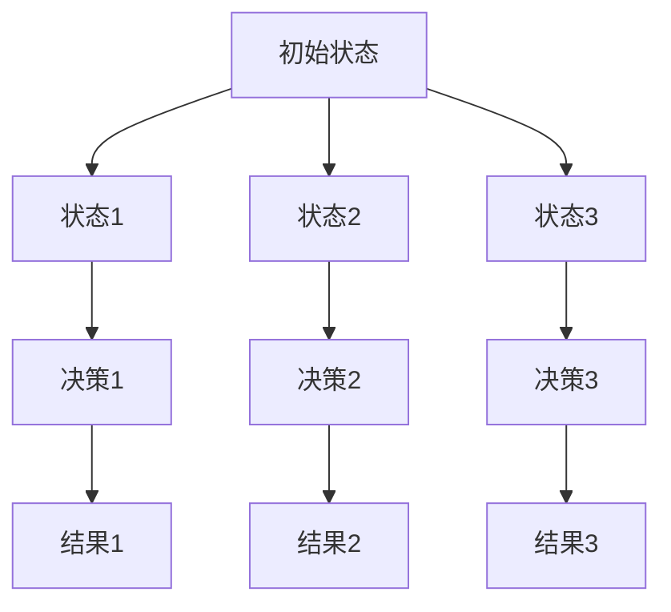
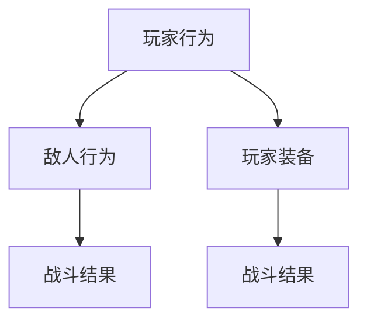
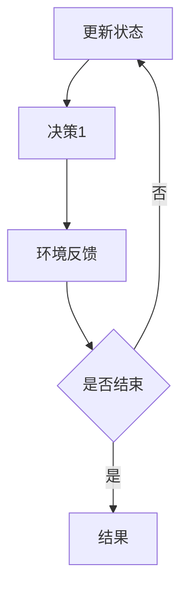
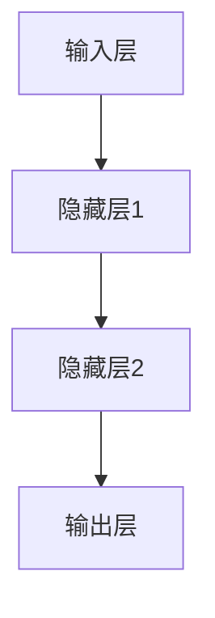
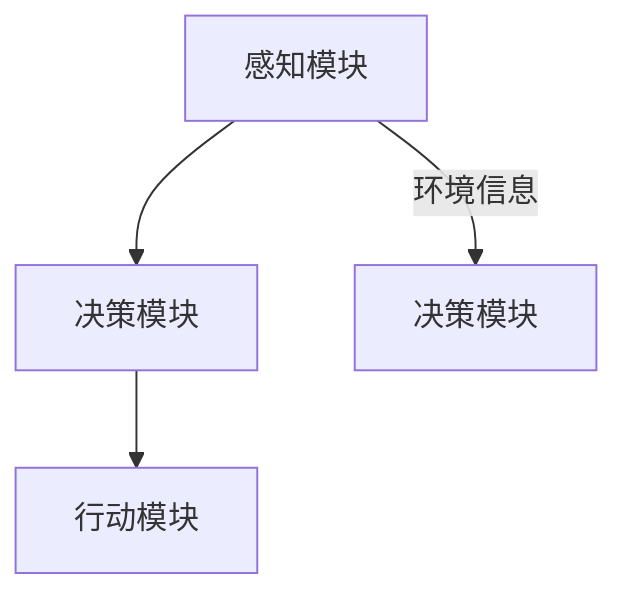

                 

### 第一部分：引言

在当今快速发展的技术时代，人工智能（AI）已经渗透到了我们生活的方方面面。从自动驾驶汽车到智能语音助手，AI正逐渐改变我们的生活方式。在这个背景下，游戏智能体（Game Agent）作为人工智能的一个分支，正发挥着越来越重要的作用。游戏智能体是指能够在游戏中自主进行决策和行动的计算机程序。它们不仅能够提升游戏的复杂度和智能水平，还能为玩家提供更加丰富和有趣的体验。

#### 1.1 书籍背景与目的

本书旨在探讨人工智能在游戏智能体领域的应用，具体包括以下几个方面的内容：

1. **背景知识介绍**：介绍人工智能和游戏智能体的基本概念，包括其定义、分类和理论基础。
2. **技术实现**：详细介绍游戏中智能体的技术基础，包括常用的算法、框架和实现方法。
3. **应用案例**：分析不同类型游戏中智能体的实际应用案例，展示其在策略游戏、动作游戏和角色扮演游戏中的具体应用。
4. **前沿技术与发展趋势**：探讨游戏智能体领域的前沿技术，如自动驾驶、虚拟现实和增强现实等，以及该领域的发展趋势。
5. **总结与展望**：总结本书的主要内容，指出当前研究中的挑战和机遇，并对未来的研究方向提出展望。

通过上述内容的系统介绍，本书希望为读者提供一个全面、深入的了解，帮助他们在游戏智能体领域进行研究和实践。

#### 1.2 本书结构安排

为了更好地组织内容，本书分为五个主要部分：

- **第一部分：引言**：介绍书籍的背景、目的和结构安排，为后续内容奠定基础。
- **第二部分：基础理论与技术**：介绍人工智能和游戏智能体的基础理论、技术基础和架构设计。
- **第三部分：应用案例分析**：分析不同类型游戏中智能体的应用案例，展示其实际应用效果。
- **第四部分：前沿技术与发展趋势**：探讨游戏智能体领域的前沿技术和发展趋势。
- **第五部分：总结与展望**：总结本书的主要内容，指出研究中的挑战和机遇，并对未来的研究方向提出展望。

#### 1.3 阅读建议与注意事项

为了更好地理解本书内容，读者可以参考以下建议：

1. **掌握基本概念**：建议读者在阅读本书之前，先掌握人工智能和游戏智能体的基本概念，以便更好地理解后续内容。
2. **实践操作**：本书中涉及了很多实际案例和代码示例，建议读者在阅读过程中进行实践操作，加深对理论知识的理解。
3. **结合现有知识**：本书内容较为深入，建议读者在阅读过程中结合自己已有的知识体系，进行深入思考和分析。
4. **持续学习**：游戏智能体领域发展迅速，建议读者持续关注该领域的前沿动态，不断提升自己的知识水平。

### 第二部分：基础理论与技术

#### 2.1 AI与游戏智能体的基础理论

##### 2.1.1 人工智能的基本概念

人工智能（Artificial Intelligence，简称AI）是计算机科学的一个分支，旨在开发能够模拟人类智能行为的计算机系统。AI系统具备感知、理解、学习、推理、规划、决策和交流等能力，以实现特定的任务和目标。人工智能的发展目标是创造智能的机器，使其能够像人类一样进行复杂的思考和决策。

###### 2.1.1.1 人工智能的定义

人工智能可以被定义为一种通过模拟人类智能行为，使计算机能够完成复杂任务的技术。它包括机器学习、深度学习、自然语言处理、计算机视觉等多个领域。

###### 2.1.1.2 人工智能的发展历程

人工智能的发展历程可以追溯到20世纪50年代，当时计算机科学家艾伦·图灵提出了“图灵测试”，旨在判断机器是否具有智能。此后，人工智能经历了多次起伏，包括20世纪60年代的发展阶段、70年代的低潮阶段、20世纪90年代的复苏阶段以及21世纪初至今的智能时代。

在智能时代，深度学习和强化学习等新算法的突破，使得人工智能在图像识别、语音识别、自然语言处理等领域取得了显著进展。特别是在深度学习的推动下，AI系统在图像分类、目标检测、语音合成等方面达到了人类专家水平。

##### 2.1.2 游戏智能体的定义与分类

游戏智能体是指在游戏中能够自主进行决策和行动的计算机程序。游戏智能体通过模拟人类的游戏策略和行为，为玩家提供挑战和对手。

###### 2.1.2.1 游戏智能体的定义

游戏智能体是指通过计算机模拟人类游戏行为和策略，能够在游戏中自主进行决策和行动的计算机程序。它们通常具备感知、理解、学习和决策能力，以实现游戏目标。

###### 2.1.2.2 游戏智能体的分类

根据智能体的功能和行为模式，游戏智能体可以分为以下几类：

1. **规则型智能体**：基于预设的规则和策略进行决策，通常不具有学习能力。
2. **学习型智能体**：通过不断学习和适应游戏环境，逐步提高决策能力。
3. **智能型智能体**：结合深度学习和强化学习等高级算法，实现自主学习和决策。

#### 2.2 游戏智能体的技术基础

##### 2.2.1 游戏引擎与AI的集成

游戏引擎是游戏开发的核心工具，提供了游戏世界的构建、渲染、物理模拟等功能。将人工智能技术集成到游戏引擎中，可以使游戏智能体更加真实、多样和智能。

###### 2.2.1.1 常见游戏引擎简介

1. **Unity**：Unity是一款跨平台的游戏开发引擎，具有强大的图形渲染能力和丰富的插件资源。
2. **Unreal Engine**：Unreal Engine是一款高级游戏开发引擎，提供了高效的渲染效果和强大的编程接口。
3. **Godot**：Godot是一款开源的游戏开发引擎，具有简单易用的界面和灵活的脚本语言。

###### 2.2.1.2 AI与游戏引擎的集成方式

1. **插件集成**：将AI算法封装成插件，直接嵌入到游戏引擎中。
2. **脚本集成**：使用游戏引擎提供的脚本语言（如C#、Python等），编写AI算法并集成到游戏逻辑中。
3. **模块集成**：将AI算法封装成模块，与游戏引擎的其他模块进行集成。

##### 2.2.2 游戏智能体的核心算法

游戏智能体的核心算法包括决策树、贝叶斯网络、强化学习和深度学习等。这些算法可以用于解决游戏中的决策问题、概率问题、规划问题等。

###### 2.2.2.1 决策树算法

决策树算法是一种常用的分类算法，通过构建决策树模型，对游戏环境中的状态进行分类和决策。

###### 2.2.2.2 贝叶斯网络算法

贝叶斯网络算法是一种概率推理算法，通过构建贝叶斯网络模型，对游戏环境中的概率关系进行推理和决策。

###### 2.2.2.3 强化学习算法

强化学习算法是一种通过试错和学习来优化决策的算法，适用于解决游戏中的策略问题。

###### 2.2.2.4 深度学习算法

深度学习算法是一种基于神经网络的学习算法，通过多层神经网络对游戏环境进行建模和预测。

##### 2.2.3 游戏智能体的实现框架

游戏智能体的实现框架主要包括感知模块、决策模块和行动模块。这三个模块共同构成了游戏智能体的基本结构。

###### 2.2.3.1 感知模块

感知模块负责获取游戏环境中的信息，包括玩家位置、敌人位置、道具分布等。

###### 2.2.3.2 决策模块

决策模块负责根据感知模块获取的信息，进行决策和规划。常用的决策算法包括决策树、贝叶斯网络、强化学习和深度学习等。

###### 2.2.3.3 行动模块

行动模块负责根据决策模块的决策结果，执行相应的行动，如移动、攻击、防御等。

##### 2.2.4 游戏智能体的架构设计

游戏智能体的架构设计是游戏开发中至关重要的一环。一个良好的智能体架构可以使得智能体的开发、维护和扩展变得更加容易。游戏智能体架构的基本原理包括以下几个方面：

###### 2.2.4.1 分层设计

分层设计是游戏智能体架构的基本原则之一。通过将智能体功能划分为多个层次，如感知层、决策层和行动层，可以使得各个层次的功能相对独立，便于模块化和维护。

###### 2.2.4.2 数据驱动

游戏智能体的行为很大程度上依赖于游戏环境中的数据。因此，数据驱动的设计原则是非常重要的。通过收集、处理和分析游戏环境数据，智能体可以更好地理解和适应游戏场景。

###### 2.2.4.3 灵活扩展

游戏智能体架构应该具备良好的扩展性，以便于在游戏开发过程中根据需求进行扩展和调整。例如，可以通过引入新的算法、模型或组件，来提高智能体的性能和智能水平。

###### 2.2.4.4 易于调试

游戏智能体的架构设计应该考虑到调试的便利性。通过提供清晰的模块划分和接口定义，可以使得调试过程更加高效和准确。

##### 2.2.5 游戏智能体架构的关键组件

游戏智能体架构通常包括以下几个关键组件：

###### 2.2.5.1 感知模块

感知模块负责收集游戏环境中的信息，包括玩家位置、敌人位置、道具分布等。这些信息通过传感器或传感器网络获取，并传输给决策模块。

###### 2.2.5.2 决策模块

决策模块负责根据感知模块提供的信息，结合预定的策略或算法，进行决策和规划。决策模块的核心任务是确定下一步的行动，以提高游戏智能体的性能。

###### 2.2.5.3 行动模块

行动模块负责执行决策模块生成的行动。行动模块通常与游戏引擎紧密集成，通过控制游戏角色的动作来实现智能体的行为。

###### 2.2.5.4 学习模块

学习模块负责对智能体的行为进行学习和优化。通过不断收集游戏数据，学习模块可以自动调整智能体的策略和参数，以提高智能体的智能水平。

###### 2.2.5.5 控制模块

控制模块负责管理智能体的

