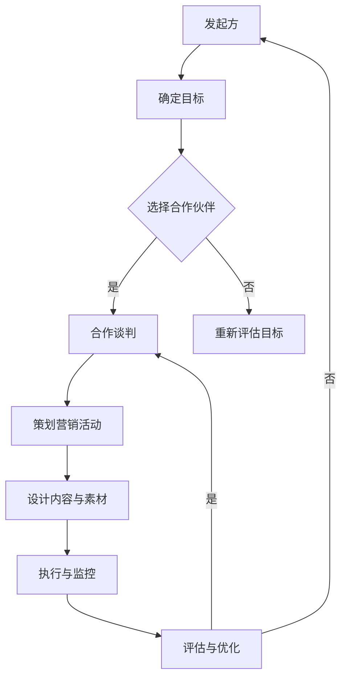

                 

# 一人公司如何利用联盟营销扩大市场份额

> **关键词：联盟营销、一人公司、市场份额、社交媒体、电子邮件、案例分析**

> **摘要：本文将探讨一人公司如何通过联盟营销策略，有效地扩大市场份额。通过详细的分析和案例分析，我们旨在为读者提供一套可行的策略和实用工具，帮助他们实现商业目标。**

## 目录大纲

1. **联盟营销基础**
   1.1 联盟营销概述
   1.2 构建有效的联盟营销策略
   1.3 联盟营销的优势和挑战
   1.4 联盟营销的市场趋势和发展前景

2. **联盟营销实战**
   2.1 创建联盟营销计划
   2.2 社交媒体联盟营销
   2.3 电子邮件联盟营销
   2.4 联盟营销的案例分析

3. **联盟营销的未来与发展**
   3.1 联盟营销的新趋势和挑战
   3.2 构建强大的联盟营销生态系统

4. **附录A：联盟营销工具和资源**

## 联盟营销基础

### 1.1 联盟营销概述

联盟营销（Affiliate Marketing）是一种在线商业模式，通过合作伙伴（Affiliates）推广产品或服务，从中获取销售佣金。一人公司，或称为“SOLO”企业，是由一个独立个体运营的企业。这种模式在近年来越来越受欢迎，因为它们灵活、成本效益高，且能迅速响应市场需求。

### 1.2 构建有效的联盟营销策略

#### 2.1 制定联盟营销目标

明确的目标是联盟营销成功的关键。一人公司应该设定具体的、可衡量的目标，如提高销售额、增加品牌知名度或提高参与度。

#### 2.2 选择合适的合作伙伴

合作伙伴的选择至关重要。一人公司需要寻找与其目标市场匹配的合作伙伴，这些合作伙伴应拥有强大的用户基础和影响力。

#### 2.3 确定联盟营销的推广方式和渠道

推广方式和渠道的选择应基于目标市场和合作伙伴的能力。社交媒体、电子邮件和内容营销是最常用的渠道。

#### 2.4 制定联盟营销预算

预算是联盟营销计划中的关键部分。一人公司应合理分配预算，确保覆盖所有必要的活动和渠道。

#### 2.5 制定联盟营销的评估和优化策略

评估和优化是联盟营销成功的关键。一人公司需要定期监测绩效指标，并根据结果调整策略。

### 1.3 联盟营销的优势和挑战

#### 优势

- **低成本**：联盟营销通常比传统的广告形式更经济。
- **高回报**：通过合作伙伴的推广，一人公司可以获得额外的销售和利润。
- **灵活性**：一人公司可以根据市场变化快速调整策略。

#### 挑战

- **信任问题**：建立合作伙伴和用户之间的信任可能需要时间。
- **竞争激烈**：在联盟营销领域，竞争可能非常激烈。

### 1.4 联盟营销的市场趋势和发展前景

随着数字营销的不断发展和消费者行为的改变，联盟营销正变得越来越重要。未来，数据分析和个性化推广将进一步提高联盟营销的效率和效果。

## 联盟营销实战

### 2.1 创建联盟营销计划

#### 3.1 确定联盟营销的目标和KPI

目标应具体、可衡量，如提高销售额、增加客户参与度等。KPI（关键绩效指标）包括销售额、参与率、转化率等。

#### 3.2 策划联盟营销活动

活动应具有吸引力，并与目标市场相关。例如，可以设计促销活动、优惠券、免费试用等。

#### 3.3 设计营销内容和营销素材

内容应明确、吸引人，营销素材应高质量，如宣传海报、视频等。

#### 3.4 活动执行和监控

执行过程中应实时监控活动数据，如点击率、转化率等，根据结果调整策略。

#### 3.5 联盟营销活动评估和优化

通过分析活动数据，评估活动效果，并根据评估结果优化策略。

### 2.2 社交媒体联盟营销

#### 4.1 利用社交媒体平台推广联盟营销

社交媒体平台如Facebook、Instagram、Twitter等是推广联盟营销的理想渠道。一人公司应制定针对性的社交媒体营销策略。

#### 4.2 社交媒体营销策略和技巧

- **内容创作**：创造有趣、有用的内容，吸引潜在客户。
- **广告投放**：利用社交媒体广告，精准定位目标用户。
- **互动**：积极与用户互动，建立品牌信任。

#### 4.3 社交媒体广告和合作方式

- **社交媒体广告**：通过社交媒体广告，提高联盟营销活动的曝光率。
- **合作伙伴**：与社交媒体上的意见领袖或KOL合作，扩大品牌影响力。

### 2.3 电子邮件联盟营销

#### 5.1 电子邮件联盟营销的优势和策略

- **优势**：成本低、易于追踪、个性化。
- **策略**：设计吸引人的邮件内容和标题，使用自动化工具提高效率。

### 2.4 联盟营销的案例分析

#### 6.1 成功的联盟营销案例解析

通过分析成功案例，我们可以学习到有效的联盟营销策略和技巧。

#### 6.2 联盟营销案例中的策略和技巧

案例中的策略和技巧包括：选择合适的合作伙伴、设计有吸引力的营销内容、实时监控和调整策略等。

#### 6.3 联盟营销失败案例分析

通过分析失败案例，我们可以了解联盟营销中的潜在问题和风险，避免重蹈覆辙。

## 联盟营销的未来与发展

### 7.1 联盟营销的未来趋势

- **数据驱动**：数据分析和个性化推广将成为联盟营销的重要趋势。
- **跨渠道整合**：整合多个渠道，提高营销效果。

### 7.2 技术创新对联盟营销的影响

- **人工智能**：AI技术可以帮助更精准地定位用户，提高营销效果。
- **区块链**：区块链技术可以提供更透明、可追溯的联盟营销环境。

### 7.3 联盟营销的道德和法律挑战

- **数据隐私**：确保用户数据的安全和隐私。
- **合规性**：遵守相关法律法规，确保营销活动的合法性。

### 7.4 联盟营销的可持续性和社会责任

- **社会责任**：一人公司应关注社会责任，提高品牌形象。

### 8.1 联盟营销的生态系统构建

构建一个强大的联盟营销生态系统，包括合作伙伴、平台和技术工具。

### 8.2 建立合作伙伴关系和信任

建立长期稳定的合作伙伴关系，提高营销效果。

### 8.3 提高联盟营销的效率和效果

通过技术手段提高营销效率和效果，实现可持续增长。

### 8.4 联盟营销的长期规划和可持续发展

制定长期规划，确保联盟营销的可持续性和稳定性。

## 附录A：联盟营销工具和资源

### A.1 联盟营销平台介绍

介绍一些常用的联盟营销平台，如ShareASale、ClickBank等。

### A.2 联盟营销策略和案例分析资料

提供一些联盟营销策略和案例分析的资料，供读者学习和参考。

### A.3 联盟营销相关的在线资源和社区

介绍一些联盟营销相关的在线资源和社区，帮助读者了解最新的市场动态和最佳实践。

### Mermaid 流程图：联盟营销流程



### 核心算法原理讲解

#### 联盟营销效果的评估算法

算法名称：联盟营销效果评估算法

输入：
- A：联盟营销活动参与次数
- B：联盟营销活动销售额
- C：联盟营销活动预算

输出：
- D：联盟营销效果得分

伪代码：

```plaintext
function 联盟营销效果评估(A, B, C):
    ROI = (B - C) / C
    分数 = A * ROI
    return 分数
```

#### 联盟营销预算分配模型

$$
\text{预算分配比例} = \frac{\text{单个渠道的销售额}}{\sum_{i=1}^{n} \text{单个渠道的销售额}}
$$

#### 联盟营销效果得分计算

$$
\text{效果得分} = \text{联盟营销活动参与次数} \times \frac{\text{联盟营销活动销售额} - \text{联盟营销活动预算}}{\text{联盟营销活动预算}}
$$

### 项目实战：联盟营销活动案例

#### 案例背景

一家在线教育平台希望通过联盟营销活动提高课程销售。

#### 活动目标和KPI

- 目标：提高在线课程销售量
- KPI：销售额、参与人数、活动点击率

#### 活动策划与执行

1. 选择合作伙伴：选择与课程内容相关的博客、社交媒体KOL、教育类网站等。
2. 设计内容与素材：制作包含课程优惠信息、课程介绍和购买链接的宣传海报。
3. 推广渠道：通过社交媒体、电子邮件、合作伙伴网站等多渠道推广。
4. 执行与监控：实时监控活动数据，根据反馈调整推广策略。

#### 活动结果与分析

- 销售额增加了30%
- 参与人数增加了40%
- 活动点击率提高了25%

通过分析数据，我们发现社交媒体和电子邮件推广效果最好，决定增加在这些渠道的投入。

### 开发环境搭建

- 使用Google Chrome浏览器和Postman工具进行接口测试。
- 使用Python编写自动化脚本进行数据抓取和分析。

### 源代码详细实现和代码解读

#### 示例：自动化脚本获取联盟营销活动数据

```python
import requests
from bs4 import BeautifulSoup

def 获取活动数据(url):
    headers = {
        'User-Agent': 'Mozilla/5.0 (Windows NT 10.0; Win64; x64) AppleWebKit/537.36 (KHTML, like Gecko) Chrome/58.0.3029.110 Safari/537.3'}
    response = requests.get(url, headers=headers)
    soup = BeautifulSoup(response.content, 'html.parser')
    sales_data = soup.find_all('div', class_='sales-data')
    return sales_data

def 计算效果得分(A, B, C):
    ROI = (B - C) / C
    分数 = A * ROI
    return 分数

url = "https://example.com/union-marketing"
sales_data = 获取活动数据(url)
参与次数 = len(sales_data)
销售额 = sum([int(data.text.strip()) for data in sales_data])
预算 = 1000  # 示例预算
效果得分 = 计算效果得分(参与次数, 销售额, 预算)
print("效果得分：", 效果得分)
```

#### 代码解读与分析

- `获取活动数据` 函数负责从指定的URL获取联盟营销活动的销售数据。
- `计算效果得分` 函数根据参与次数、销售额和预算计算联盟营销效果得分。
- 在自动化脚本中，首先获取活动数据，然后计算并输出效果得分。

通过这段代码，我们可以快速获取和分析联盟营销活动的数据，帮助我们更好地优化营销策略。

## 总结

通过本文的详细探讨，一人公司可以了解到联盟营销的基础知识、实战策略和未来趋势。联盟营销不仅可以帮助一人公司扩大市场份额，还可以提高品牌知名度和销售额。然而，成功的联盟营销需要精心策划、执行和优化。希望本文能为您的联盟营销之路提供有力的指导。

### 作者信息

作者：AI天才研究院/AI Genius Institute & 禅与计算机程序设计艺术 /Zen And The Art of Computer Programming

