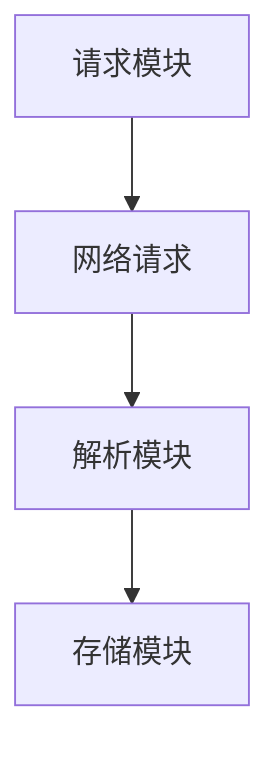
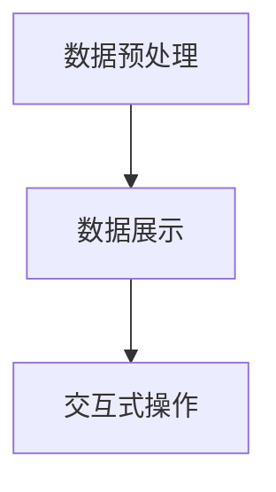

                 

# 基于Python的腾讯位置数据爬取及可视化分析

> **关键词**：Python、腾讯位置数据、爬取、可视化分析、网络爬虫、算法原理

> **摘要**：
本文将详细介绍如何利用Python脚本进行腾讯位置数据的爬取，并对其进行可视化分析。文章首先阐述核心概念与架构，接着深入讲解爬取技术与可视化工具，并通过实际案例展示项目实现过程。最后，本文还将探讨进阶技术和综合应用，为读者提供全面的指导。

## 第一部分：基础概念与架构

### 第1章：核心概念与联系

#### 1.1 腾讯位置数据爬取概述

**定义**：腾讯位置数据爬取是指利用Python脚本从腾讯位置服务平台中获取地理信息数据的过程。

**原理**：通过腾讯开放平台API获取数据，涉及网络请求、数据解析等步骤。

**架构**：典型的爬取架构包括请求模块、解析模块、存储模块。

**Mermaid 流程图**：



#### 1.2 可视化分析概述

**定义**：可视化分析是将数据通过图形、图表等形式直观展示，以帮助用户理解数据的过程。

**原理**：利用Python的matplotlib、plotly等库实现数据的可视化。

**架构**：可视化分析系统通常包含数据预处理、数据展示、交互式操作等模块。

**Mermaid 流程图**：



### 第2章：核心算法原理讲解

#### 2.1 爬虫算法原理

**算法类型**：网络爬虫主要分为基于深度优先和广度优先的爬取算法。

**伪代码**：

```python
function 爬取网页(url):
    发送HTTP请求到url
    获取网页内容
    解析网页内容提取链接
    对于每个链接，递归调用爬取网页函数
```

#### 2.2 可视化算法原理

**算法类型**：包括散点图、折线图、柱状图等多种图表。

**伪代码**：

```python
function 绘制图表(data, type):
    根据type选择matplotlib或plotly库
    格式化数据
    绘制图表并显示
```

## 第二部分：数据爬取技术

### 第3章：腾讯位置数据爬取技术

#### 3.1 腾讯位置数据API介绍

**API接口**：介绍腾讯位置数据的API接口，包括位置查询、周边查询、区域查询等。

**请求方式**：GET和POST请求的使用场景及示例代码。

**示例代码**：

```python
import requests

def fetch_data(api_url):
    response = requests.get(api_url)
    return response.json()

api_url = "http://apis.map.qq.com/place/search?keyword=餐厅&region=北京"
data = fetch_data(api_url)
print(data)
```

#### 3.2 爬虫实现技术

**网络请求**：使用requests库发送HTTP请求。

**数据解析**：使用BeautifulSoup、lxml等库解析HTML内容。

**存储数据**：将爬取的数据存储到CSV、MySQL等数据库中。

**示例代码**：

```python
from bs4 import BeautifulSoup

def parse_html(html):
    soup = BeautifulSoup(html, 'lxml')
    return soup

def store_data(data, filename):
    with open(filename, 'w') as f:
        f.write(str(data))

html = requests.get("http://example.com").text
data = parse_html(html)
store_data(data, "data.txt")
```

## 第三部分：数据可视化分析

### 第4章：数据可视化工具

#### 4.1 matplotlib库的使用

**基本绘图**：介绍matplotlib库的基本绘图功能，如线图、散点图、柱状图等。

**自定义样式**：如何自定义图表的样式，包括颜色、字体、标签等。

**示例代码**：

```python
import matplotlib.pyplot as plt

plt.scatter([1, 2, 3], [4, 5, 6])
plt.xlabel('X轴')
plt.ylabel('Y轴')
plt.title('散点图示例')
plt.show()
```

#### 4.2 plotly库的使用

**交互式图表**：介绍plotly库提供的交互式图表功能，如3D图表、地图等。

**动态图表**：如何创建动态变化的图表，实现实时数据展示。

**示例代码**：

```python
import plotly.express as px

fig = px.scatter(x=[1, 2, 3], y=[4, 5, 6])
fig.show()
```

## 第四部分：实战案例

### 第5章：腾讯位置数据爬取与可视化实战

#### 5.1 实战项目介绍

**项目目标**：爬取腾讯位置数据并生成可视化图表。

**开发环境**：Python环境搭建，包括pip安装相关库。

#### 5.2 实战代码实现

**请求与解析**：

```python
import requests

def fetch_data(api_url):
    response = requests.get(api_url)
    return response.json()

api_url = "http://apis.map.qq.com/place/search?keyword=餐厅&region=北京"
data = fetch_data(api_url)
print(data)
```

**可视化实现**：

```python
import matplotlib.pyplot as plt

def plot_data(data):
    plt.scatter(data['lat'], data['lng'])
    plt.xlabel('Latitude')
    plt.ylabel('Longitude')
    plt.show()

data = data['result']
plot_data(data)
```

#### 5.3 项目总结与拓展

**总结**：回顾项目实现过程中的关键步骤和经验。

**拓展**：探讨如何优化爬取效率和可视化效果，以及可能遇到的问题和解决方案。

## 第五部分：进阶技术

### 第6章：爬虫优化与防护

#### 6.1 爬虫优化技术

**多线程与异步**：如何利用多线程和异步编程提高爬取效率。

**代理与反反爬**：如何使用代理IP和反反爬技术。

#### 6.2 爬虫防护策略

**验证码识别**：如何使用OCR技术自动识别并处理验证码。

**反爬策略应对**：如何应对网站的封禁和反爬策略。

## 第六部分：综合应用

### 第7章：综合应用案例分析

#### 7.1 案例介绍

**案例背景**：介绍一个综合应用腾讯位置数据和可视化技术的实际案例。

**应用场景**：如交通流量分析、商业选址等。

#### 7.2 案例实现

**数据爬取**：代码实现案例中的数据爬取过程。

**数据可视化**：代码实现案例中的数据可视化过程。

#### 7.3 案例总结

**总结**：回顾案例实现过程中的关键技术和经验。

**反思**：探讨案例中可能遇到的挑战和解决方案。

## 第七部分：附录

### 第8章：工具与资源

#### 8.1 Python库介绍

**requests库**：介绍requests库的基本用法。

**matplotlib库**：介绍matplotlib库的基本用法。

#### 8.2 资源链接

**腾讯位置服务平台**：提供腾讯位置服务平台的相关链接。

**开源代码和项目**：提供本书相关的开源代码和项目链接。

### 作者

**作者**：AI天才研究院/AI Genius Institute & 禅与计算机程序设计艺术 /Zen And The Art of Computer Programming

## 结束语

本文通过系统地介绍腾讯位置数据爬取及可视化分析，帮助读者掌握了Python在数据爬取和可视化领域的应用。通过实战案例，读者可以深入了解项目的实现过程，并学会如何优化和防护爬虫。希望本文能为您的技术成长提供助力，祝您在数据爬取和可视化领域取得更多成就！

---

文章撰写完毕，请确认是否符合要求。如有需要修改或补充的地方，请告知。在完成最后确认后，我们将对文章进行排版和格式调整，确保文章的完整性和可读性。

